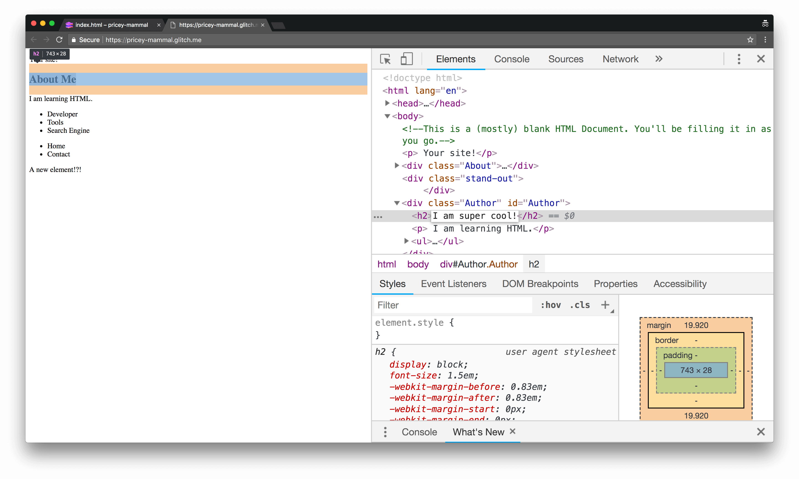

project_path: /web/tools/_project.yaml
book_path: /web/tools/_book.yaml
description: Part one of a tutorial for newer developers to become   acquainted
with Chrome DevTools.  Users will learn how to use DevTools to interact with
HTML.

{# wf_updated_on: 2018-08-03 #}
{# wf_published_on: 2018-07-30 #}
{# wf_blink_components: Platform>DevTools #}

# DevTools For Beginners {: .page-title }

## Audience {: #audience}

This tutorial is for you if any of the following apply:

- You’ve never used DevTools before, 
and are interested in seeing how it can improve your productivity.
- You’ve heard of the terms “HTML” and “CSS” before, 
but you haven’t gotten the chance to make a website yet, 
and you want to be sure you are doing it in the most efficient manner. 
(If you haven’t heard these terms before, [here’s a helpful reference](https://developer.mozilla.org/en-US/docs/Learn/HTML/Introduction_to_HTML)
.)
- You have made a website before, but you want a more polished site.

## Goal {: #goal}

This is the first of three DevTools For Beginners tutorials. 
These tutorials walk you through basic web fundamentals 
as well as how to improve your design productivity with DevTools. 
You will be constructing a personal website from scratch,
and the end product will look something like 
[this](https://dfb5.glitch.me/). 

## Setup {: #setup}

In order to start creating your site, you need to set up your code:

1. Open the source code. A code editor called Glitch shows a page called 
index.html. The HTML is mostly empty. You'll be adding your own code to 
it.
<figure> 
<figcaption>
    <b>Figure 1</b>. The initial window you will see.
  </figcaption>
</figure>
2. Click **dfb-1**. A menu pops up.
<figure> 
<figcaption>
    <b>Figure 2</b>. The Glitch menu that will appear.
  </figcaption>
</figure>

3. Click **Remix**. Glitch creates a copy of the project that you can 
edit. Note that the name of the new project will be randomly generated
and not dfb-1.
The content is the same, but the name on the top-left has changed.
4. Click Show Live. Another tab opens with view of what your site 
currently looks like.

<figure> 
<figcaption>
    <b>Figure 3</b>. The viewing and editing tabs.
  </figcaption>
</figure>

Now, you have two tabs open: the code
(which will be called the editing tab) 
and the preview of your website (which will be called the viewing tab). 

## Adding Content {: #adding-content}

Since your website is pretty empty, let’s add some content to it! 
In the editing tab, you’ll see two sections in your HTML document: 
the head (the text between `<head>` and `</head>`) and the body 
(the text between `<body>` and `</body>`). 
The head contains the metadata of your site, which is invisible 
data your web browser parses to understand the content of your site. 
This helps search engines find your pages, among other things. 
The body contains the actual content of your page, like text or images.
You won’t be adding much in the `<head>` section in this part of the 
tutorial, so for now, let’s move on to the fun part, the `<body>` 
section. Since this is a personal website, you’ll definitely want to 
have something about yourself in there. Many personal websites have an
‘About Me’ section, and yours will as well. Here’s how you’ll do it:

1. Go to line 19 and press <kbd>Enter</kbd>
2. You want a heading for this section, 
so type `<h1>About Me</h1>`. 
This formats the text as a heading. 
3. To see the changes, go to the viewing tab.
4. Go back to the editing tab.
5. You’ll want to put in text, too, so insert a `
` element, 
like `
 I am learning HTML.
` under the line where you put 
the heading. 
6. Go to the viewing tab.
7. Go back to the editing tab.
8. Add a list under the `
` element on line 21 that 
details your accomplishments, like so: 
	
  <ul>
    <li>Developer</li>
	<li>Tools</li>
	<li>Search Engine</li>
  </ul>
	
9. Again, 
go to the viewing tab to see the new content.

## Improving Workflow With DevTools {: #improving-workflow}

At this point, 
you may have noticed that the process of changing the HTML on your site
can be somewhat tedious. Wouldn’t it be great if there was an easier way 
to do this? 

Enter DevTools.

### A Note on Nodes {: #Nodes}

 When you open the Elements Panel in DevTools, 
 you’ll see a screen that looks quite similar to the HTML document
 you’ve been working on in the editing tab. 
 However, these are not HTML elements, but are actually DOM Nodes.
 DOM is an interface that represents HTML elements in your browser, 
 and while the DOM Tree you see in the Elements Panel looks quite 
 similar to your HTML document now, 
 there are ways you can edit it so that it is not. 

1. Navigate to the viewing tab of your website.
2. Open DevTools with <kbd>Command</kbd>+<kbd>Shift</kbd>+<kbd>I</kbd>.
3. Directly under the script tag, you will see a new `
` element
 that doesn't exist in your HTML document in the editing tab.
 
 Using JavaScript, you can add Nodes to the DOM Tree without HTML. 
 This will play a bigger role when you learn about the Console 
 panel and JavaScript, but for now, you’ll be editing a few DOM Nodes 
 yourself.
 
### Edit DOM Nodes as HTML {: #edit-as-html}
 The DevTools ‘Inspect Element’ and ‘Edit as HTML’ functions allow you 
 to view changes you make to the DOM in real time.
 You can try it out by seeing what it 
 would look like to add some more content to your page! 
 
 1. Open devtools using 
 <kbd>Command</kbd>+<kbd>Shift</kbd>+<kbd>I</kbd>. You should see 
 something like this: 

 <figure> 
<figcaption>
    <b>Figure 4</b>. The elements panel.
  </figcaption>
 </figure>

2. Right click on the `<About>` div, then click `Edit as HTML`. 
The following screen will appear:

<figure> 
<figcaption>
    <b>Figure 5</b>. Editing an object as HTML.
  </figcaption>
</figure>

Now you have a live view of your changes! 

Try adding information to the About `<div.`:

1. Add a paragraph element like: 
`
 My website is all about sharing my  achievements! 
`. 
You can do this by clicking under `
` 
and typing in your code.
2. Add a header element like `<h4>Here’s my resume.</h4>` 
under the paragraph element.
3. Add a button under the header element with 
`<button>Download it!</button>`
4. Copy your code and paste it under line 13 inside the “About” `
`.

Note: If you refresh the page or close the tab, 
your edits will be gone forever. After all, 
imagine what would happen if you could permanently change 
the HTML and text of any website! So,
make sure to copy any changes you make to your site in DevTools.

If you know what you want to edit, then there’s an even simpler workflow:

1. Open the viewing tab.
2. Highlight a section of your website (like an image or line of text).
3. Right click and choose **Inspect**. 
4. Double click on either the content or tag of the element to edit it.

<figure> 
<figcaption>
    <b>Figure 6</b>. Clicking Inspect Element.
  </figcaption>
</figure>

You can inspect any element using this method on any web page, 
but note that like before, 
your changes are not automatically saved when you edit through DevTools.

## Reordering the DOM Tree {: #dom-tree}

Another workflow for editing the arrangement 
of your site is to rearrange the 
DOM Tree of your document. For example, on your site, 
you'll see that the navigation menu is on the bottom of the site. 
To move it to the top:

1. If you aren't already in the Elements Panel in DevTools,
navigate to it.
2. Scroll down the DOM Tree until you reach the `<nav>` `
`.
3. Click and hold down on the `<nav>` `
`, 
then drag it to the area you want it to be in. 

**You’ve successfully learned how to add and edit content 
on your site with DevTools!** If you want more information on these 
workflows, take a look at [Inspect Styles](src/content/en/tools/chrome-devtools/inspect-styles/edit-styles.md)
.

## Next Steps {: #next-steps}
<figure> 
<figcaption>
    <b>Figure 7</b>. An example of what the finished HTML of your site might look like.
  </figcaption>
</figure>

Now that you have a grasp on how DevTools interacts with HTML, you’ll be
looking at using DevTools with CSS to style and customize your website 
to make it look a bit nicer. 
Edit your site until it has all of the HTML content you want. 
An example of what that would look like is shown above.

If you still have lingering questions on HTML, 
[take a look at this reference guide](https://developer.mozilla.org/en-US/docs/Learn/HTML/Introduction_to_HTML)
. Otherwise, you can move on to the next tutorial.

