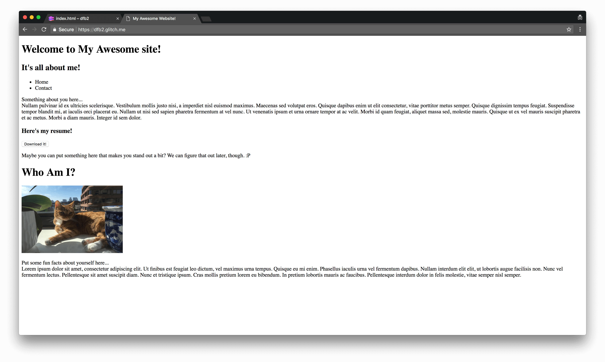

project_path: /web/tools/_project.yaml
book_path: /web/tools/_book.yaml
description: A tutorial for newer developers to become acquainted with Chrome DevTools.

{# wf_updated_on: 2018-07-31 #}
{# wf_published_on: 2018-07-30 #}
{# wf_blink_components: Platform>DevTools #}

# DevTools For Beginners {: .page-title }
## Audience

This tutorial is for you if any of the following apply:

- You’ve never used DevTools before, and are interested in seeing how it can improve your productivity.
- You’ve heard of the terms “HTML” and “CSS” before, but you haven’t gotten the chance to make a website yet, and you want to be sure you are doing it in the most efficient manner. (If you haven’t heard these terms before, here’s a helpful reference.)
- You have made a website before, but you want a more polished site.

## Goal
This is the first of three DevTools For Beginners tutorials. These tutorials 
walk you through basic web fundamentals as well as how to improve your design 
productivity with DevTools. You will be constructing a personal website from 
scratch, and the end product will look like this. 

## Setup
There’s a bit of setup involved for this tutorial:

1. Open the source code. A code editor called Glitch shows a page called index.html. The HTML is mostly empty. You'll be adding your own code to it.
2. Click dfb-1. A menu pops up.
3. Click Remix. Glitch creates a copy of the project that you can edit. The content is the same, but the name in the top left has changed.
4. Click Show Live. Another tab opens  with a preview of what your site currently looks like.

Now, you have two tabs open: the code (which will be called the editing tab) and the preview of your website (which will be called the viewing tab). 

## Adding Content

Since your website is pretty empty, let’s add some content to it!  In the 
editing tab, you’ll see two sections in your HTML document: the head (the text 
between `<head>` and `</head>`) and the body (the text between `<body>` and 
`</body>`). The head contains the metadata of your site, which is invisible 
data your web browser parses to understand the content of your site. This 
helps search engines find your pages, among other things. The body contains 
the actual content of your page, like text or images.

You won’t be adding much in the `<head>` section in this part of the tutorial, 
but for now, add yourself as an author to your site:
	
1. Go to line _ in the editing tab. Press enter.
2. You’ll want the author of the site to be visible to search engines so that if someone searches “your name”, your website will come up, so you need to use metadata. The tag for all metadata is `<meta>`, so put that into your document.
3. The name of the type of metadata you are inputting is the author of your webpage, so add [name = ”author”] to the `<meta>` tag you put down in line _.
4. The content of the author metadata you are inputting is your name, so add [content = “Your Name”] to the `<meta>` tag you put down in line _.

Now let’s move on to the more fun part, the `<body>` section. Since this is a personal website, you’ll definitely want to have something about yourself in there. Many personal websites have an ‘About Me’ section, and yours will as well. Here’s how you’ll do it:

1. Go to line 19 and press enter/return. 
2. You want a title or heading for this section, so type something like `<h1>About Me</h1>`. This formats the text as a heading. 
3. To see the changes, go to the viewing tab.
4. Go back to the editing tab.
5. You’ll want to put in text, too, so insert a `
` element, like `
 I am learning HTML.
` under the line where you put the heading. Note that although the `
` element is called a paragraph element, you can put as much (or as little) text as you need in it.
6. You’ll want to make sure the text is properly formatted, so go to the viewing tab and refresh the page.
7. Go back to the editing tab.
8. Add a list under the `
` element on line 21 that details your accomplishments, like so: 
	
	<ul>
		<li>Developer</li>
		<li>Tools</li>
		<li>Search Engine</li>
	</ul>
	
9. Again, go to the viewing tab and refresh the page to see the new content.n

## Improving Workflow With DevTools

At this point, you may have noticed that the process of changing the HTML on 
your site can be somewhat tedious. Wouldn’t it be great if there was an easier 
way to do this? 

Enter DevTools.

### A Note on Nodes

 When you open the Elements Panel in DevTools, you’ll see a screen that looks 
 quite similar to the HTML document you’ve been working on in the editing tab. 
 However, these are not HTML elements, but are actually DOM nodes. DOM is an 
 interface that represents HTML elements in your browser, and while the DOM 
 Tree you see in the Elements Panel looks quite similar to your HTML document 
 now, there are ways you can edit it so that it is not. In fact, if you look at 
 your website in the viewing tab, you’ll see a `
` element that doesn’t 
 exist in the editing tab. Using JavaScript, you can add nodes to the DOM Tree 
 without HTML. This will pay a bigger role when you learn about the Console 
 panel and JavaScript, but for now, you’ll be editing a few DOM nodes yourself.
 
### Edit DOM Nodes as HTML
 The DevTools ‘Inspect Element’ and ‘Edit as HTML’ functions allow you to view 
 changes you make to the DOM in real time. You can try it out by seeing what it 
 would look like to add another picture to your page! Open devtools using 
 Command-Shift-I. You should see something like this: 
 
Let’s try adding some content to the website. This time, you’ll be talking 
about your website. Right click on the `<About>` node, then click `Edit as HTML`
The following screen will appear:

Now you have a live view of your changes! Try adding information to the About node:

1. Add a paragraph element like: `
 My website is all about sharing my achievements! 
`. You can do this by clicking under `
` and typing in your code.
2. Add a header element like `<h4>Here’s my resume.</h4>` under the paragraph element.
3. Add a button under the header element with `<button>Download it!</button>`
4. Copy your code and paste it under line _ inside the “About” `
`.

Note: If you refresh the page or close the tab, your edits will be gone 
forever. After all, imagine what would happen if you could permanently change 
the HTML and text of any website! So, make sure to copy any changes you make to 
your site in DevTools.

If you know what you want to edit, then there’s an even simpler workflow:

1. Open the viewing tab.
2. Highlight a section of your website (like an image or line of text).
3. Right click and choose Inspect. 
4. Double click on either the content or tag of the element to edit it.

You can inspect any element using this method on any web page, but note that 
like before, your changes are not automatically saved when you edit through 
DevTools.

## Reordering the DOM Tree

You can also rearrange the DOM Tree of your document by dragging the nodes of 
the tree around. For example, on the demo site, the `
` containing what 
will become the navigation tabs is currently on the bottom of the page. You can 
easily reposition it by dragging the `<nav>` node to the proper position. 

*You’ve successfully learned how to add and edit content on your site with 
DevTools!* If you want more information on these workflows, take a look at 
.

## Next Steps

Now that you have a grasp on how DevTools interacts with HTML, you’ll be
looking at using DevTools with CSS to style and customize your website to make 
it look a bit nicer. Edit your site until it has all of the HTML content you want. If you still have lingering questions on HTML, take a look 
at this reference guide. Otherwise, you can move on to the next tutorial.
