project_path: /web/tools/_project.yaml
book_path: /web/tools/_book.yaml

{# wf_updated_on: 2018-08-13 #}
{# wf_published_on: 2018-08-13 #}
{# wf_blink_components: Platform>DevTools #}

# DevTools for Beginners: Get Started with HTML and the DOM {: .page-title }



This is the first in a series of tutorials that teach you the basics of web
development. You are going to learn web development by actually building your own
website.

In this particular tutorial, you learn about HTML and the DOM. HTML is one of the core
technologies of web development. It is the language that controls the structure and content
of webpages. The DOM is also related to the structure and content of webpages, but you'll
learn more about that later.

By the time you complete all of the tutorials in the *DevTools for Beginners* series,
your finished site will look like **Figure X**.

<figure>
  
  <figcaption>
    <b>Figure X</b>. The finished site
  </figcaption>
</figure>

## Goals {: #goals }

By the end of this tutorial, you will understand:

* How HTML and the DOM create the content that you see on webpages.
* How Chrome DevTools can help you when you're working with HTML and the DOM.
* The difference between HTML and the DOM.

You'll also have a real website!

## Prerequisites {: #prerequisites }

Before attempting this tutorial, complete the following prerequisites:

* If you're unfamiliar with HTML, read [Getting Started with
  HTML][MDN]{: .external }.
* Download the [Google Chrome][chrome]{: .external } web browser. This tutorial uses a set
  of web development tools, called Chrome DevTools, that are built into Google Chrome.

[MDN]: https://developer.mozilla.org/en-US/docs/Learn/HTML/Introduction_to_HTML/Getting_started
[chrome]: https://www.google.com/chrome/

## Set up your code {: #setup}

You're going to build your site in an online code editor called Glitch.

1. Open the <a class="external gc-analytics-event" target="_blank" rel="noopener"
   data-category="CTA" data-label="/web/tools/chrome-devtools/beginners/html"
   href="https://glitch.com/edit/#!/dfb1?path=index.html">source code</a>.
   This tab will be called the **editor tab** throughout this tutorial.

     <figure>
       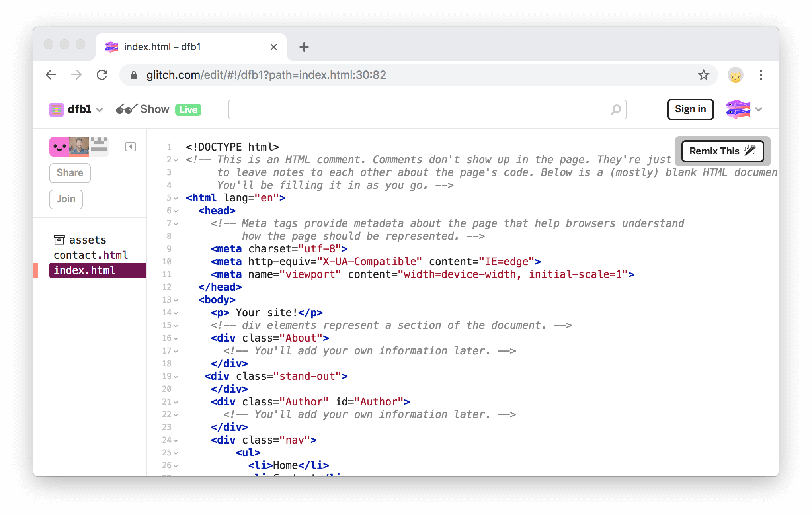
       <figcaption>
         <b>Figure 1</b>. The editor tab
       </figcaption>
     </figure>

2. Click **dfb1**. The Project Options menu opens in the top-left corner.

     <figure>
       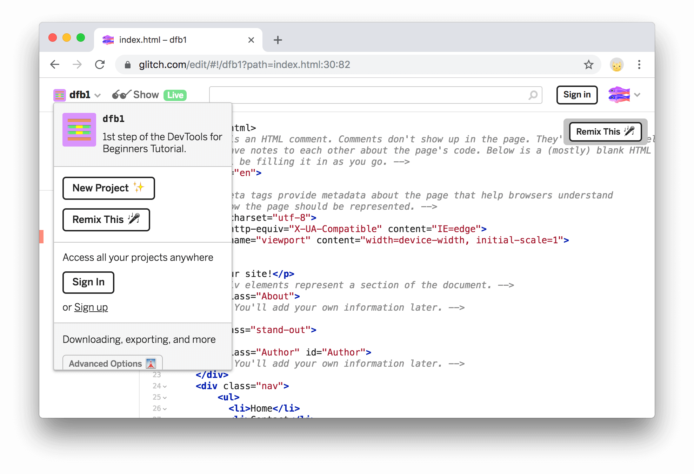
       <figcaption>
         <b>Figure 2</b>. The Project Options menu
       </figcaption>
     </figure>

3. Click **Remix This**. Glitch creates a copy of the project that you can 
   edit and randomly generates a new name for the project. The content is
   the same as before.

     TODO add screenshot

4. Click **Show Live**. A new tab opens, showing you the live page.
   Whenever you make edits in the editor tab, the live page automatically
   updates. No need to manually reload the page. This tab will be called the
   **live tab** throughout this tutorial.

     <figure>
       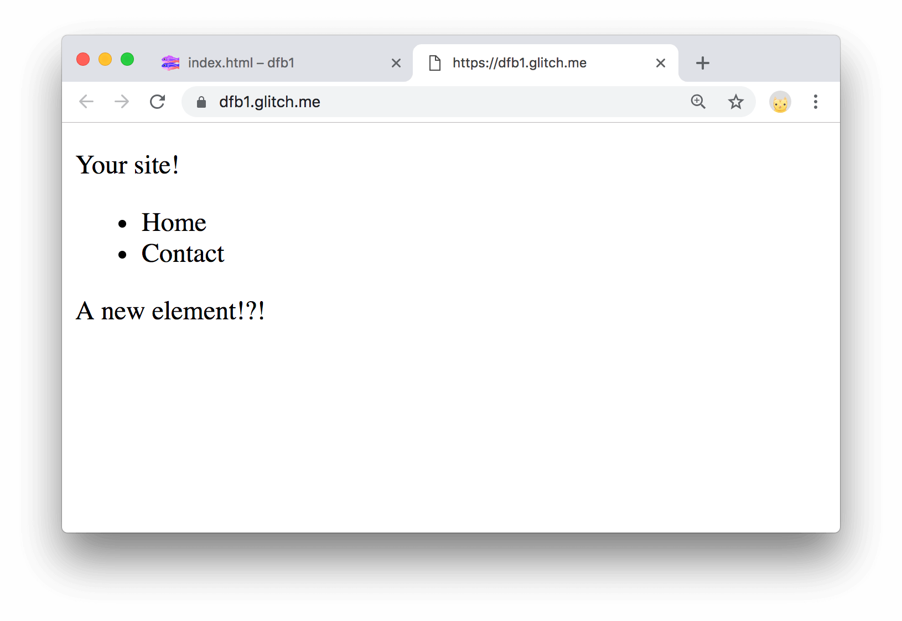
       <figcaption>
         <b>Figure 3</b>. The live tab
       </figcaption>
     </figure>

## Add content {: #add }

Your site is pretty empty. Follow the steps below to add some
content to it!

1. In the **editor tab**, replace `<!-- You're "About Me" will go here. -->`
   with `<h1>About Me</h1>`.

    <pre class="prettyprint lang-html">...
      
<strong>
        <h1>About Me</h1>
      </strong>

    ...</pre>

     <figure>
       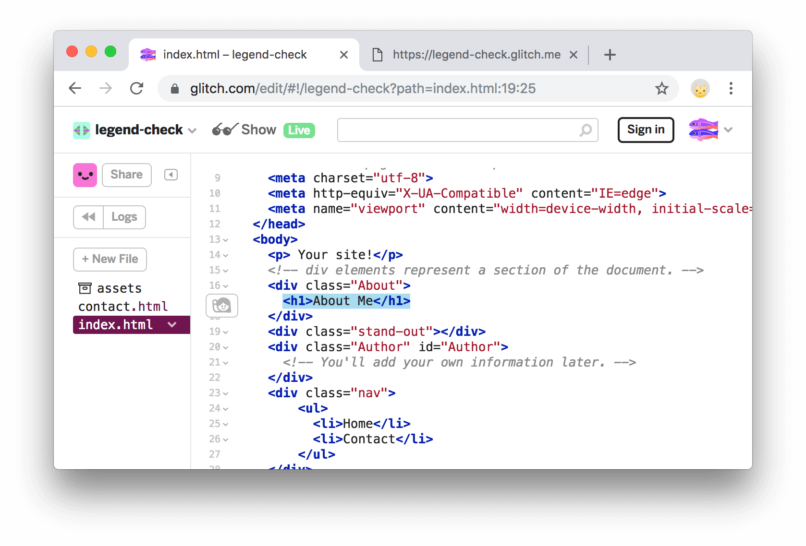
       <figcaption>
         <b>Figure X</b>. The new code is highlighted in the editor tab
       </figcaption>
     </figure>

1. View your changes in the **live tab**. The text `About Me` is visible on the page.
   It's larger than the rest of the text, because the `<h1>` element represents
   a section heading. Your web browser automatically styles headings in larger
   font sizes.

     <figure>
       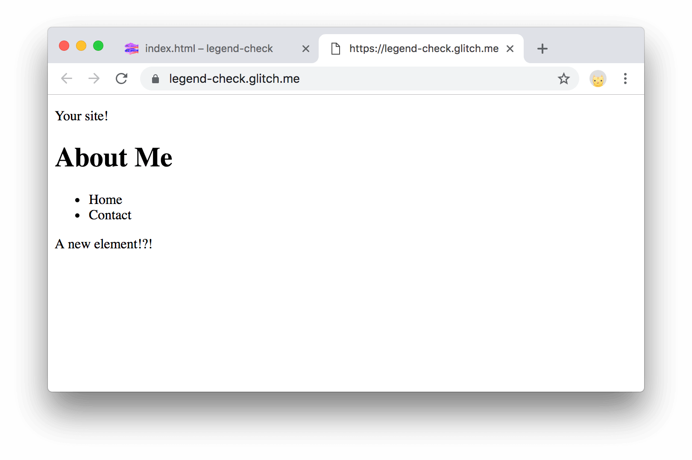
       <figcaption>
         <b>Figure X</b>. The new heading is visible in the live tab
       </figcaption>
     </figure>

1. Back in the **editor tab**, add `
I am learning HTML.
` on the line below
   where you just put `<h1>About Me</h1>`.

    <pre class="prettyprint lang-html">...
      

        <h1>About Me</h1><strong>
        
I am learning web development. Here are some of my recent accomplishments:

      </strong>

    ...</pre>

     <figure>
       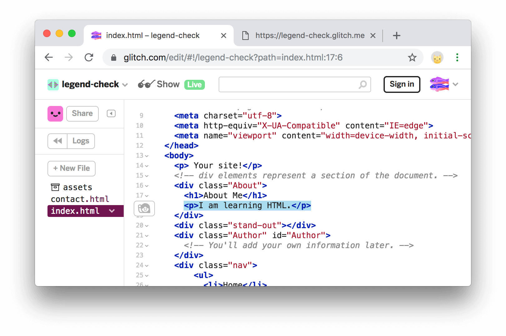
       <figcaption>
         <b>Figure X</b>. The new code is highlighted in the editor tab
       </figcaption>
     </figure>

1. View your change in the **live tab**.
1. Back in the **editor tab**, add a list of your accomplishments:

    <pre class="prettyprint lang-html">...
      
I am learning web development. Recent accomplishments:
<strong>
      <ul>
        <li>Learned how to set up my code in Glitch.</li>
        <li>Added content to my HTML.</li>
        <li>TODO: Learn how to use Chrome DevTools to experiment with content changes.</li>
        <li>TODO: Learn the difference between HTML and the DOM.</li>
      </ul></strong>
    ...</pre>

     <figure>
       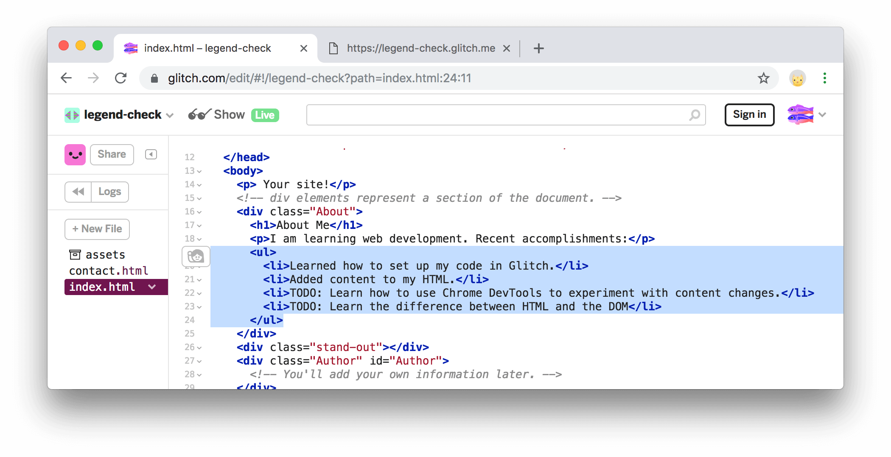
       <figcaption>
         <b>Figure 4</b>. The new code is highlighted in the editor tab
       </figcaption>
     </figure>

1. Again, go back to the **live tab** to make sure that the new content is displaying correctly.

     <figure>
       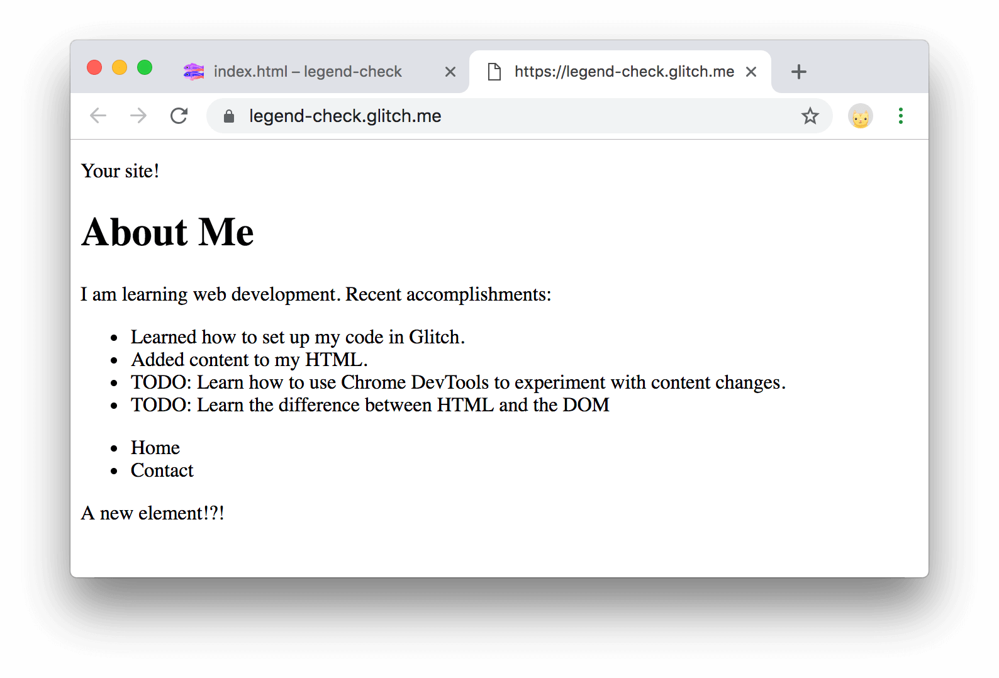
       <figcaption>
         <b>Figure 4</b>. The new list is visible in the live tab
       </figcaption>
     </figure>

## Experiment with content changes in Chrome DevTools {: #experiment }

You may have found the back-and-forth between the editor tab and the live tab to be
somewhat tedious. This is actually a common workflow for many web developers. In this section
you learn how to use **Chrome DevTools** to experiment with content changes, without ever leaving
the live tab.

### A note on nodes {: #Nodes}

 When you open the Elements Panel in DevTools, 
 you’ll see a screen that looks quite similar to the HTML document
 you’ve been working on in the editing tab. 
 However, these are not HTML elements, but are actually DOM Nodes.
 DOM is an interface that represents HTML elements in your browser, 
 and while the DOM Tree you see in the Elements Panel looks quite 
 similar to your HTML document now, 
 there are ways you can edit it so that it is not. 

1. Navigate to the live tab of your website.
2. Open DevTools with <kbd>Command</kbd>+<kbd>Shift</kbd>+<kbd>I</kbd>.
3. Directly under the script tag, you will see a new `
` element
 that doesn't exist in your HTML document in the editing tab.

TODO note Chrome version and how DevTools changes.

 
 Using JavaScript, you can add Nodes to the DOM Tree without HTML. 
 This will play a bigger role when you learn about the Console 
 panel and JavaScript, but for now, you’ll be editing a few DOM Nodes 
 yourself.
 
### Edit DOM Nodes as HTML {: #edit-as-html}
 The DevTools ‘Inspect Element’ and ‘Edit as HTML’ functions allow you 
 to view changes you make to the DOM in real time.
 You can try it out by seeing what it 
 would look like to add some more content to your page! 
 
 1. Open devtools using 
 <kbd>Command</kbd>+<kbd>Shift</kbd>+<kbd>I</kbd>. You should see 
 something like this: 

 <figure> 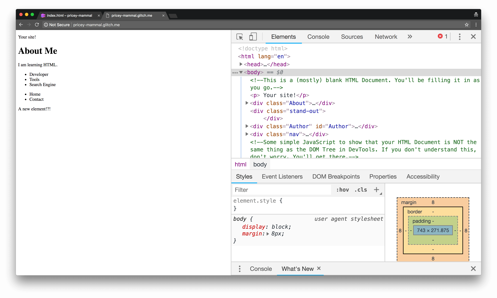
<figcaption>
    <b>Figure 5</b>. The elements panel.
  </figcaption>
 </figure>

2. Right click on the `<About>` div, then click `Edit as HTML`. 
The following screen will appear:

<figure> 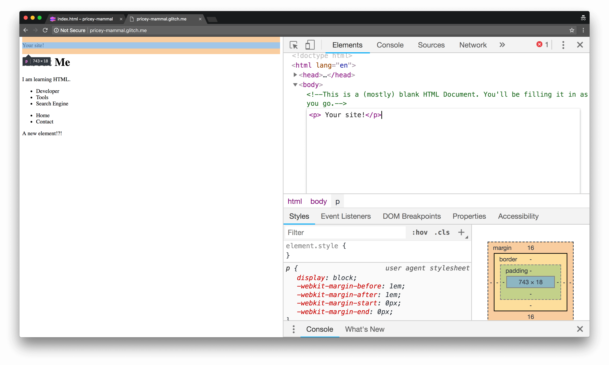
<figcaption>
    <b>Figure 6</b>. Editing an object as HTML.
  </figcaption>
</figure>

Now you have a live view of your changes! 

Try adding information to the About `<div.`:

1. Add a paragraph element like: 
`
 My website is all about sharing my  achievements! 
`. 
You can do this by clicking under `
` 
and typing in your code.
2. Add a header element like `<h4>Here’s my resume.</h4>` 
under the paragraph element.
3. Add a button under the header element with 
`<button>Download it!</button>`
4. Copy your code and paste it under line 13 inside the “About” `
`.

Note: If you refresh the page or close the tab, 
your edits will be gone forever. After all, 
imagine what would happen if you could permanently change 
the HTML and text of any website! So,
make sure to copy any changes you make to your site in DevTools.

If you know what you want to edit, then there’s an even simpler workflow, *Inspect Element*. For example, to change your website's heading: 

1. Open the live tab.
2. Highlight the heading of your website (the text "About Me").
3. Right click and choose **Inspect**. 
4. Double click on "About Me" and replace it with "I'm Super Cool!".
5. Double click on `<h1>` and replace it with `<h2>`

You've now changed your website heading!

<figure> 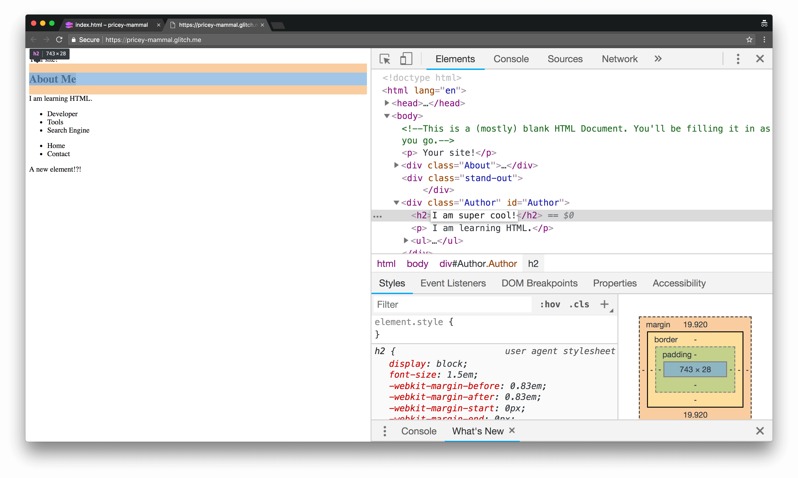
<figcaption>
    <b>Figure 7</b>. What You Should See After Clicking Inspect Element.
  </figcaption>
</figure>

You can inspect any element using this method on any web page, 
but note that like before, 
your changes are not automatically saved when you edit through DevTools.

## Reordering the DOM Tree {: #dom-tree}

Another workflow for editing the arrangement 
of your site is to rearrange the 
DOM Tree of your document. For example, on your site, 
you'll see that the navigation menu is on the bottom of the site. 
To move it to the top:

1. If you aren't already in the Elements Panel in DevTools,
navigate to it.
2. Scroll down the DOM Tree until you reach the `<nav>` `
`.
3. Click and hold down on the `<nav>` `
`, 
then drag it to the area you want it to be in. 

**You’ve successfully learned how to add and edit content 
on your site with DevTools!** If you want more information on these 
workflows, take a look at [Inspect Styles](/web/tools/chrome-devtools/inspect-styles/edit-dom)
.

<figure> 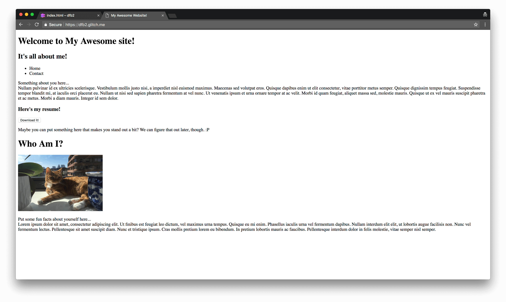
<figcaption>
    <b>Figure 8</b>. An example of what the finished HTML of your site might look like.
  </figcaption>
</figure>

## Next steps {: #next-steps}
Edit your site until it has all of the HTML content you want. 
An example of what that would look like is shown above.

If you still have lingering questions on HTML, 
[take a look at this reference guide](https://developer.mozilla.org/en-US/docs/Learn/HTML/Introduction_to_HTML)
. Soon, there will be a tutorial looking at using DevTools with CSS to 
style and customize your website to make it look a bit nicer. 

## Feedback {: #feedback }


