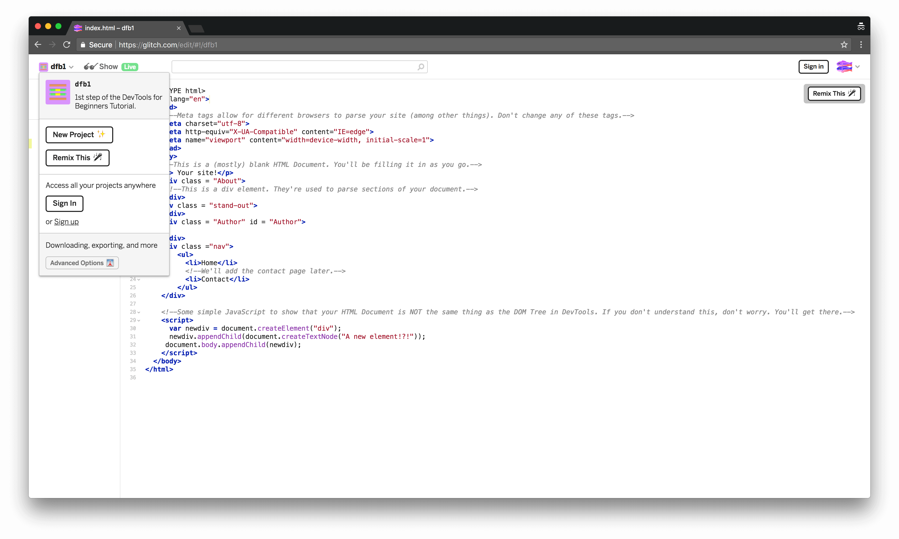

project_path: /web/tools/_project.yaml
book_path: /web/tools/_book.yaml

{# wf_updated_on: 2018-08-15 #}
{# wf_published_on: 2018-08-13 #}
{# wf_blink_components: Platform>DevTools #}

# DevTools for Beginners: Get Started with HTML and the DOM {: .page-title }



This is the first in a series of tutorials that teach you the basics of web
development. You are going to learn web development by actually building your own
website.

In this particular tutorial, you learn about HTML and the DOM. HTML is one of the core
technologies of web development. It is the language that controls the structure and content
of webpages. The DOM is also related to the structure and content of webpages, but you'll
learn more about that later.

By the time you complete all of the tutorials in the *DevTools for Beginners* series,
your finished site will look like **Figure X**.

<figure>
  
  <figcaption>
    <b>Figure X</b>. The finished site
  </figcaption>
</figure>

## Goals {: #goals }

By the end of this tutorial, you will understand:

* How HTML and the DOM create the content that you see on webpages.
* How Chrome DevTools can help you when you're working with HTML and the DOM.
* The difference between HTML and the DOM.

You'll also have a real website!

## Prerequisites {: #prerequisites }

Before attempting this tutorial, complete the following prerequisites:

* If you're unfamiliar with HTML, read [Getting Started with
  HTML][MDN]{: .external }.
* Download the [Google Chrome][chrome]{: .external } web browser. This tutorial uses a set
  of web development tools, called Chrome DevTools, that are built into Google Chrome.

[MDN]: https://developer.mozilla.org/en-US/docs/Learn/HTML/Introduction_to_HTML/Getting_started
[chrome]: https://www.google.com/chrome/

## Set up your code {: #setup}

You're going to build your site in an online code editor called Glitch.

1. Open the <a class="external gc-analytics-event" target="_blank" rel="noopener"
   data-category="CTA" data-label="/web/tools/chrome-devtools/beginners/html"
   href="https://glitch.com/edit/#!/dfb1?path=index.html">source code</a>.
   This tab will be called the **editor tab** throughout this tutorial.

     <figure>
       
       <figcaption>
         <b>Figure 1</b>. The editor tab
       </figcaption>
     </figure>

2. Click **dfb1**. The Project Options menu opens in the top-left corner.

     <figure>
       
       <figcaption>
         <b>Figure 2</b>. The Project Options menu
       </figcaption>
     </figure>

3. Click **Remix This**. Glitch creates a copy of the project that you can 
   edit and randomly generates a new name for the project. The content is
   the same as before.

     TODO add screenshot

4. Click **Show Live**. A new tab opens, showing you the live page.
   Whenever you make edits in the editor tab, the live page automatically
   updates. No need to manually reload the page. This tab will be called the
   **live tab** throughout this tutorial.

     <figure>
       
       <figcaption>
         <b>Figure 3</b>. The live tab
       </figcaption>
     </figure>

## Add content {: #add }

Your site is pretty empty. Follow the steps below to add some
content to it!

1. In the **editor tab**, replace `<!-- You're "About Me" will go here. -->`
   with `<h1>About Me</h1>`.

    <pre class="prettyprint lang-html">...
      
<strong>
        <h1>About Me</h1>
      </strong>

    ...</pre>

     <figure>
       
       <figcaption>
         <b>Figure X</b>. The new code is highlighted in the editor tab
       </figcaption>
     </figure>

1. View your changes in the **live tab**. The text `About Me` is visible on the page.
   It's larger than the rest of the text, because the `<h1>` element represents
   a section heading. Your web browser automatically styles headings in larger
   font sizes.

     <figure>
       
       <figcaption>
         <b>Figure X</b>. The new heading is visible in the live tab
       </figcaption>
     </figure>

1. Back in the **editor tab**, add `
I am learning HTML.
` on the line below
   where you just put `<h1>About Me</h1>`.

    <pre class="prettyprint lang-html">...
      

        <h1>About Me</h1><strong>
        
I am learning web development. Here are some of my recent accomplishments:

      </strong>

    ...</pre>

     <figure>
       
       <figcaption>
         <b>Figure X</b>. The new code is highlighted in the editor tab
       </figcaption>
     </figure>

1. View your change in the **live tab**.
1. Back in the **editor tab**, add a list of your accomplishments:

    <pre class="prettyprint lang-html">...
      
I am learning web development. Recent accomplishments:
<strong>
      <ul>
        <li>Learned how to set up my code in Glitch.</li>
        <li>Added content to my HTML.</li>
        <li>TODO: Learn how to use Chrome DevTools to experiment with content changes.</li>
        <li>TODO: Learn the difference between HTML and the DOM.</li>
      </ul></strong>
    ...</pre>

     <figure>
       
       <figcaption>
         <b>Figure 4</b>. The new code is highlighted in the editor tab
       </figcaption>
     </figure>

1. Again, go back to the **live tab** to make sure that the new content is displaying correctly.

     <figure>
       
       <figcaption>
         <b>Figure 4</b>. The new list is visible in the live tab
       </figcaption>
     </figure>

## Experiment with content changes in Chrome DevTools {: #experiment }

You may have found going back-and-forth between the editor tab and the live tab to be
somewhat tedious. Chrome DevTools can help you experiment with content changes without
ever leaving the live tab.

### Learn the difference between HTML and the DOM {: #DOM }

Before you start editing your content from Chrome DevTools, it's helpful to understand
the difference between HTML and the DOM. The best way to learn is by example:

1. Go to the **live tab**. At the bottom of your page you see the text `A new element!?!`.

     <figure>
       
       <figcaption>
         <b>Figure X</b>. The mystery text
       </figcaption>
     </figure>

1. Go back to the **editor tab** and try to find this text in `index.html`. It's not there!

     <figure>
       
       <figcaption>
         <b>Figure X</b>. The mystery text is nowhere to be found in the HTML
       </figcaption>
     </figure>

1. Go back to the **live tab**, right-click `A new element!?!`, and select **Inspect**.

     <figure>
       
       <figcaption>
         <b>Figure X</b>. Inspecting some text
       </figcaption>
     </figure>

    DevTools opens up alongside your page. `
A new element!?!
` is highlighted blue.
    Although this structure in DevTools looks like your HTML, it is actually the **DOM Tree**.

     <figure>
       
       <figcaption>
         <b>Figure X</b>. DevTools is open alongside the page
       </figcaption>
     </figure>

When your page loads, the browser takes your HTML to create the *initial* content of the page. The
DOM represents the *current* content of the page, which can change over time.
This is what you're seeing in the DOM Tree of DevTools. The mysterious `
A new element!?!</div`
content is added to your page because of the `` tag at the bottom
of your HTML. This tag causes some JavaScript code to run. The JavaScript code adds
`
A new element!?!
` to your page. That is why this mystery text is visible on your live page,
but not in your HTML.

### Edit the DOM {: #edit }

If you want to quickly experiment with content changes without ever leaving the live tab,
try DevTools.

1. In DevTools, right-click `Your site!` and select **Edit as HTML**.

     <figure>
       
       <figcaption>
         <b>Figure X</b>. Editing the node as HTML
       </figcaption>
     </figure>

1. Replace `
Your site!
` with the code below.

    <pre class="prettyprint lang-html">
    
<b>Welcome to my site!</b>

    <button>Download my resume</button>
    </pre>

     <figure>
       
       <figcaption>
         <b>Figure X</b>. Editing the node as HTML
       </figcaption>
     </figure>

1. Press <kbd>Command</kbd>+<kbd>Enter</kbd> (Mac) or <kbd>Control</kbd>+<kbd>Enter</kbd>
   (Windows, Linux, Chrome OS) to save your changes. Your changes automatically show up
   in the live view of your page. The text `Your site!` has been replaced with the new content.

     <figure>
       
       <figcaption>
         <b>Figure X</b>. Editing the node as HTML
       </figcaption>
     </figure>

This workflow is only good for experimenting with content changes. If you reload the page or close the
tab, your changes will be gone forever. If you're using this workflow and you want to save your changes,
you need to manually copy those changes over to your HTML.

The next couple of sections show you some more ways that you can change content from the DOM Tree.

## Reorder nodes {: #reorder }

You can also change the order of DOM nodes. For example, on your webpage the navigation menu is near the
bottom. To move it to the top:

1. Find the `<nav>` node in the **DOM Tree** of DevTools.

     <figure>
       
       <figcaption>
         <b>Figure X</b>. The nav node is highlighted blue in DevTools
       </figcaption>
     </figure>

1. Drag the `<nav>` node to the top, so that it's the first child of the `<body>` node.

     <figure>
       
       <figcaption>
         <b>Figure X</b>. Dragging the nav node to the top
       </figcaption>
     </figure>

    The `<nav>` node is now displaying at the top of your page.

     <figure>
       
       <figcaption>
         <b>Figure X</b>. The nav node is at the top of the page
       </figcaption>
     </figure>

### Delete a node {: #delete }

You can also remove nodes from the DOM Tree.

1. In the **DOM Tree**, click `
A new element!?!
`. DevTools highlights the node blue.

     <figure>
       
       <figcaption>
         <b>Figure X</b>. Selecting the node to be deleted
       </figcaption>
     </figure>

1. Press the <kbd>Delete</kbd> key.

     <figure>
       
       <figcaption>
         <b>Figure X</b>. The node has been deleted
       </figcaption>
     </figure>

## Wrap up {: #wrapup }

You're almost done. You've made a few changes to your page in DevTools, but they're not yet saved to your
code.

1. Copy the code below.

     <pre class="prettyprint lang-html">
       
       <!DOCTYPE html>
       <!-- This is an HTML comment. Comments don't show up in the page. They're just for developers
            to leave notes to each other about the page's code. Below is a (mostly) blank HTML document.
            You'll be filling it in as you go. -->
       <html lang="en">
         <head>
           <!-- Meta tags provide metadata about the page that help browsers understand
                how the page should be represented. -->
           <meta charset="utf-8">
           <meta http-equiv="X-UA-Compatible" content="IE=edge">
           <meta name="viewport" content="width=device-width, initial-scale=1">
         </head>
         <body>
           <nav>
             <ul>
               <li>Home</li>
               <li>Contact</li>
             </ul>
           </nav>
           <!-- div elements represent a section of the document. -->
           

             <h1>About Me</h1>
             
I am learning web development. Recent accomplishments:

             <ul>
               <li>Learned how to set up my code in Glitch.</li>
               <li>Added content to my HTML.</li>
               <li>Learned how to use Chrome DevTools to experiment with content changes.</li>
               <li>Learned the difference between HTML and the DOM.</li>
             </ul>
           

           

           

             <!-- You'll add your own information later. -->
           

           <nav>
             <ul>
               <li>Home</li>
               <li>Contact</li>
             </ul>
           </nav>
         </body>
       </html>
       
     </pre>

## Next steps {: #next-steps}

* Read [Introduction to the DOM][DOM]{: .external } to strengthen your conceptual understanding of the
  DOM.
* Stay tuned for the next tutorial in this series! In the next tutorial you will learn how to style your
  page using CSS, and how to change styles on the fly through DevTools.

[DOM]: https://developer.mozilla.org/en-US/docs/Web/API/Document_Object_Model/Introduction

## Feedback {: #feedback }



