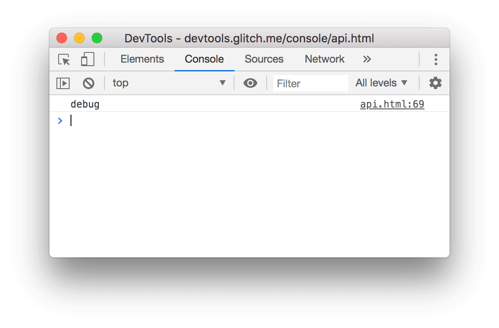
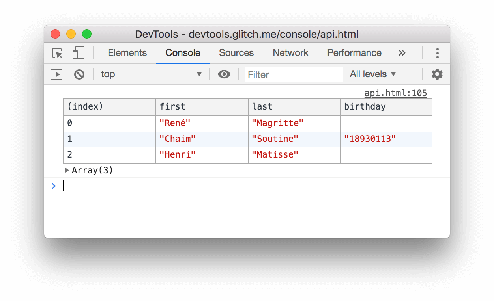
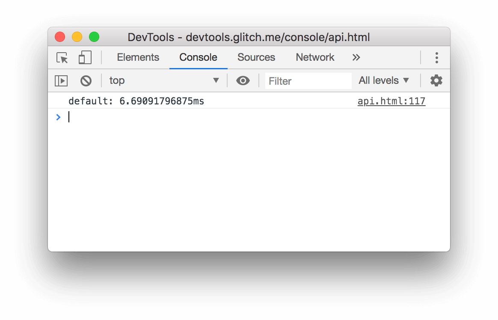
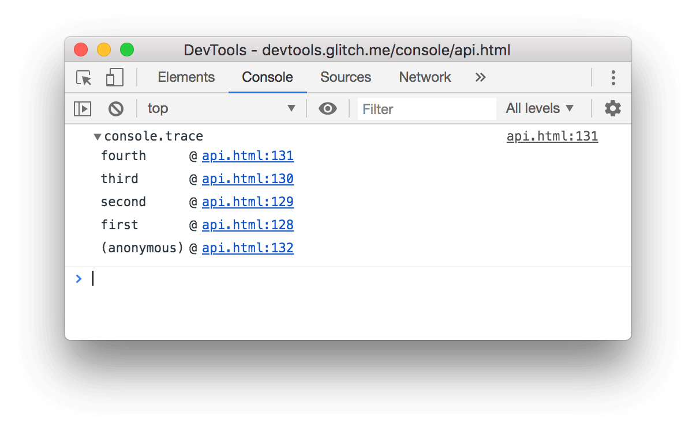
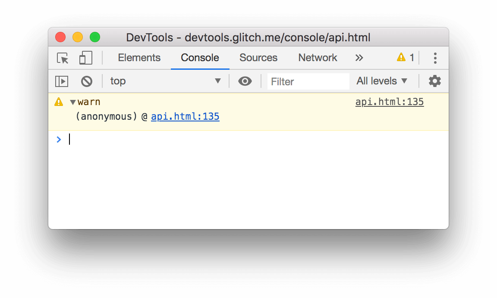

project_path: /web/tools/_project.yaml
book_path: /web/tools/_book.yaml
description: Use the Console API to write messages to the Console.

{# wf_updated_on: 2019-04-18 #}
{# wf_published_on: 2016-03-21 #}
{# wf_blink_components: Platform>DevTools #}

[level]: /web/tools/chrome-devtools/console/reference#level

# Console API Reference {: .page-title }



Use the Console API to write messages to the Console from your JavaScript. See
[Get Started With Logging Messages To The Console](log) for an interactive introduction
to the topic. See [Console Utilities API Reference](utilities) if you're looking for the
convenience methods like `debug(function)` or `monitorEvents(node)` which are only available from
the Console.

## console.assert(expression, object) {: #assert }

[Log level][level]: `Error`

Writes an [error](#error) to the console when `expression` evaluates to `false`.

    const x = 5;
    const y = 3;
    const reason = 'x is expected to be less than y';
    console.assert(x < y, {x, y, reason});
    
<figure>
  
  <figcaption>
    <b>Figure 1</b>. The result of the <code>console.assert()</code> example above.
  </figcaption>
</figure>

## console.clear() {: #clear }

Clears the console.

    console.clear();
    
If [**Preserve Log**](/web/tools/chrome-devtools/console/reference#persist) is enabled,
`console.clear()` is disabled.

See also: [Clear the Console](/web/tools/chrome-devtools/console/reference#clear)

## console.count([label]) {: #count }

[Log level][level]: `Info`

Writes the number of times that `count()` has been invoked at the same 
line and with the same `label`. Call [`console.countReset([label])`](#countreset)
to reset the count.

    console.count();
    console.count('coffee');
    console.count();
    console.count();

<figure>
  
  <figcaption>
    <b>Figure 2</b>. The result of the <code>console.count()</code> example above.
  </figcaption>
</figure>

## console.countReset([label]) {: #countreset }

Resets a count.

    console.countReset();
    console.countReset('coffee');

## console.debug(object [, object, ...]) {: #debug }

[Log level][level]: `Info`

Identical to [`console.log(object [, object, ...])`](#log).

    console.debug('debug');

<figure>
  
  <figcaption>
    <b>Figure 3</b>. The result of the <code>console.debug()</code> example above.
  </figcaption>
</figure>

## console.dir(object) {: #dir }

[Log level][level]: `Info`

Prints a JSON representation of the specified object.

    console.dir(document.head);
    
<figure>
  
  <figcaption>
    <b>Figure 4</b>. The result of the <code>console.dir()</code> example above.
  </figcaption>
</figure>

## console.dirxml(node) {: #dirxml }

[Log level][level]: `Info`

Prints an XML representation of the descendants of `node`.

    console.dirxml(document);
    
<figure>
  
  <figcaption>
    <b>Figure 5</b>. The result of the <code>console.dirxml()</code> example above.
  </figcaption>
</figure>

## console.error(object [, object, ...]) {: #error }

[Log level][level]: `Error`

Prints `object` to the Console, formats it as an error, and includes a stack trace.

    console.error("I'm sorry, Dave. I'm afraid I can't do that.");
    
<figure>
  
  <figcaption>
    <b>Figure 6</b>. The result of the <code>console.error()</code> example above.
  </figcaption>
</figure>

## console.group(label) {: #group }

Visually groups messages together until `console.groupEnd(label)` is called. Use
`console.groupCollapsed(label)` to collapse the group when it's
initially logged to the Console.

    const label = 'Adolescent Irradiated Espionage Tortoises';
    console.group(label);
    console.info('Leo');
    console.info('Mike');
    console.info('Don');
    console.info('Raph');
    console.groupEnd(label);

<figure>
  
  <figcaption>
    <b>Figure 7</b>. The result of the <code>console.group()</code> example above.
  </figcaption>
</figure>

## console.groupCollapsed(label) {: #groupcollapsed }

Same as [`console.group(label)`](#group), except the group is initially collapsed when it's logged to the Console.

## console.groupEnd(label) {: #groupend }

Stops visually grouping messages. See [`console.group`](#group).

## console.info(object [, object, ...]) {: #info }

[Log level][level]: `Info`

Identical to [`console.log(object [, object, ...])`](#log).

    console.info('info');

<figure>
  
  <figcaption>
    <b>Figure 8</b>. The result of the <code>console.info()</code> example above.
  </figcaption>
</figure>

## console.log(object [, object, ...]) {: #log }

[Log level][level]: `Info`

Prints a message to the Console.

    console.log('log');

<figure>
  
  <figcaption>
    <b>Figure 9</b>. The result of the <code>console.log()</code> example above.
  </figcaption>
</figure>

## console.table(array) {: #table }

[Log level][level]: `Info`

Logs an array of objects as a table.

    console.table([
      {
        first: 'René',
        last: 'Magritte',
      },
      {
        first: 'Chaim',
        last: 'Soutine',
        birthday: '18930113',
      },
      {
        first: 'Henri',
        last: 'Matisse',
      }
    ]);

<figure>
  
  <figcaption>
    <b>Figure 10</b>. The result of the <code>console.table()</code> example above.
  </figcaption>
</figure>

## console.time([label]) {: #time }

Starts a new timer. Call `console.timeEnd([label])` to stop the timer and
print the elapsed time to the Console.

    console.time();
    for (var i = 0; i < 100000; i++) {
      let square = i ** 2;
    }
    console.timeEnd();

<figure>
  
  <figcaption>
    <b>Figure 11</b>. The result of the <code>console.time()</code> example above.
  </figcaption>
</figure>

## console.timeEnd([label]) {: #timeend }

[Log level][level]: `Info`

Stops a timer. See [`console.time()`](#time).

## console.trace() {: #trace }

[Log level][level]: `Info`

Prints a stack trace to the Console.

    const first = () => { second(); };
    const second = () => { third(); };
    const third = () => { fourth(); };
    const fourth = () => { console.trace(); };
    first();

<figure>
  
  <figcaption>
    <b>Figure 12</b>. The result of the <code>console.trace()</code> example above.
  </figcaption>
</figure>

## console.warn(object [, object, ...]) {: #warn }

[Log level][level]: `Warning`

Prints a warning to the Console.

    console.warn('warn');

<figure>
  
  <figcaption>
    <b>Figure 13</b>. The result of the <code>console.warn()</code> example above.
  </figcaption>
</figure>

## Feedback {: #feedback }


