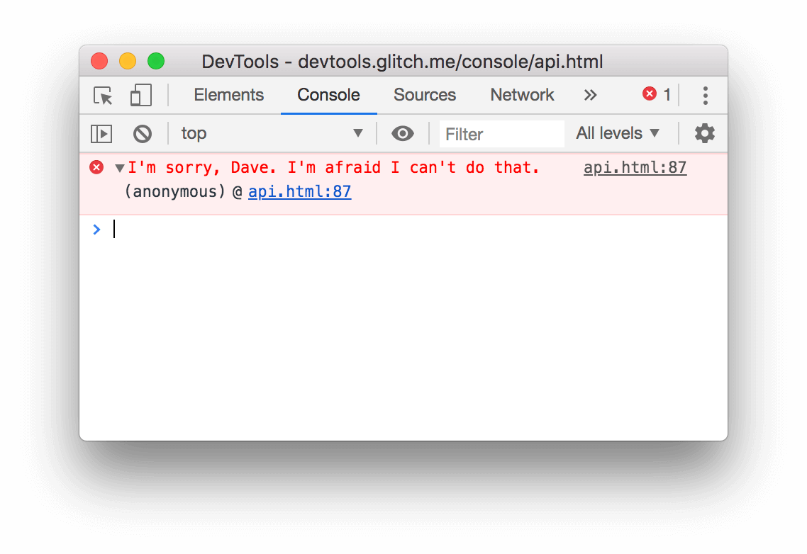

project_path: /web/tools/_project.yaml
book_path: /web/tools/_book.yaml
description: Use the Console API to write information to the console,  create JavaScript profiles, and start a debugging session.

{# wf_updated_on: 2016-03-21 #}
{# wf_published_on: 2016-03-21 #}

# Console API Reference {: .page-title }





Use the Console API to write information to the console, 
create JavaScript profiles, and start a debugging session.

## console.assert(expression, object) {:#assert}

Writes an [error](#error) to the console when the evaluated expression is 
`false`. 

    function greaterThan(a,b) {
      console.assert(a > b, {"message":"a is not greater than b","a":a,"b":b});
    }
    greaterThan(5,6);
    

## console.clear() {:#clear}

Clears the console.

    console.clear();
    

If the [**Preserve log**](index#preserve-log) checkbox is enabled, 
`console.clear()` is disabled. However, pressing the **clear console** button 
({:.inline})
or typing the shortcut <kbd>Ctrl</kbd>+<kbd>L</kbd> while the Console is in
focus still works. 

See [Clearing the console](index#clearing) for more information.

## console.count(label) {:#count}

Writes the number of times that `count()` has been invoked at the same 
line and with the same label.

    function login(name) {
      console.count(name + ' logged in');
    }
    

See [Counting Statement Executions][cse] for more examples.

[cse]: track-executions#counting-statement-executions

## console.debug(object [, object, ...])

Identical to [`console.log()`](#log).

## console.dir(object) {:#dir}

Prints a JavaScript representation of the specified object. If the object 
being logged is an HTML element, then the properties of its DOM representation 
are printed, as shown below:

    console.dir(document.body);
    

Learn about the functionally equivalent object formatter (`%O`) and more 
in [String substitution and formatting][of].

[of]: console-write#string-substitution-and-formatting

## console.dirxml(object)

Prints an XML representation of the descendant elements of `object` if 
possible, or the JavaScript representation if not. Calling `console.dirxml()`
on HTML and XML elements is equivalent to calling [`console.log()`](#log).

    console.dirxml(document);
    

## console.error(object [, object, ...]) {: #error }

Prints a message similar to [`console.log()`](#log), styles the 
message like an error, and includes a stack trace from where the method was 
called.

    console.error('error: name is undefined');
    

## console.group(object[, object, ...]) {: #group }

Starts a new logging group with an optional title. All console output that
occurs after `console.group()` and before `console.groupEnd()` is visually
grouped together. 

    function name(obj) {
      console.group('name');
      console.log('first: ', obj.first);
      console.log('middle: ', obj.middle);
      console.log('last: ', obj.last);
      console.groupEnd();
    }
    
    name({"first":"Wile","middle":"E","last":"Coyote"});
    

You can also nest groups:

    function name(obj) {
      console.group('name');
      console.log('first: ', obj.first);
      console.log('middle: ', obj.middle);
      console.log('last: ', obj.last);
      console.groupEnd();
    }
    
    function doStuff() {
      console.group('doStuff()');
      name({"first":"Wile","middle":"E","last":"coyote"});
      console.groupEnd();
    }
    
    doStuff();
    

{# include shared/related_guides.liquid inline=true list=page.related-guides.organizing #}

## console.groupCollapsed(object[, object, ...])

Creates a new logging group that is initially collapsed instead of open. 

    console.groupCollapsed('status');
    console.log("peekaboo, you can't see me");
    console.groupEnd();
    

## console.groupEnd() {: #groupend }

Closes a logging group. See [`console.group`](#group) for an example.

## console.info(object [, object, ...])

Prints a message like [`console.log()`](#log) but also shows an icon (blue
circle with white "i") next to the output. 

## console.log(object [, object, ...]) {:#log}

Displays a message in the console. Pass one or more objects to this method.
Each object is evaluated and concatenated into a space-delimited string.

    console.log('Hello, Logs!');
    

### Format specifiers {:#format-specifiers}

The first object you pass can contain one or more **format specifiers**. A
format specifier is composed of the percent sign (`%`) followed by a letter
that indicates the formatting to apply. 

Related Guides:

* [Organizing Console Output](console-write)

## console.profile([label]) {:#profile}

Starts a JavaScript CPU profile with an optional label. To complete the 
profile, call `console.profileEnd()`. Each profile is added to the **Profiles**
panel.

    function processPixels() {
      console.profile("processPixels()");
      // later, after processing pixels
      console.profileEnd();
    }
    

## console.profileEnd() {:#profileend}

Stops the current JavaScript CPU profiling session if one is in progress and 
prints the report to the **Profiles** panel.

See [`console.profile()`](#profile) for an example.

## console.time([label]) {: #time }

Starts a new timer. Call [`console.timeEnd()`](#timeend) to stop the timer and
print the elapsed time to the Console.

    console.time();
    var arr = new Array(10000);
    for (var i = 0; i < arr.length; i++) {
      arr[i] = new Object();
    }
    console.timeEnd();
    // default: 3.696044921875ms

Pass an optional label to change the output text that precedes the elapsed
time. Call `console.timeEnd()` with the same label to stop the timer.

    console.time('total');
    var arr = new Array(10000);
    for (var i = 0; i < arr.length; i++) {
      arr[i] = new Object();
    }
    console.timeEnd('total');
    // total: 3.696044921875ms

Use labels to run multiple timers at the same time.

    console.time('total');
    console.time('init arr');
    var arr = new Array(10000);
    console.timeEnd('init arr');
    for (var i = 0; i < arr.length; i++) {
      arr[i] = new Object();
    }
    console.timeEnd('total');
    // init arr: 0.0546875ms
    // total: 2.5419921875ms

## console.timeEnd([label]) {: #timeend }

Stops a timer. See [`console.time()`](#time) for examples.

## console.timeStamp([label]) {:#timestamp}

Adds an event to the **Timeline** during a recording session. 

    console.timeStamp('check out this custom timestamp thanks to console.timeStamp()!');
    

Related Guides:

* [Using the Timeline
  Tool](/web/tools/chrome-devtools/evaluate-performance/timeline-tool)

## console.trace(object) {:#trace}

Prints a stack trace from the point where the method was called. 

    console.trace();

## console.warn(object [, object, ...]) {: #warn }

Prints a message like [`console.log()`](#log), but also displays a yellow 
warning icon next to the logged message.

    console.warn('user limit reached!');

