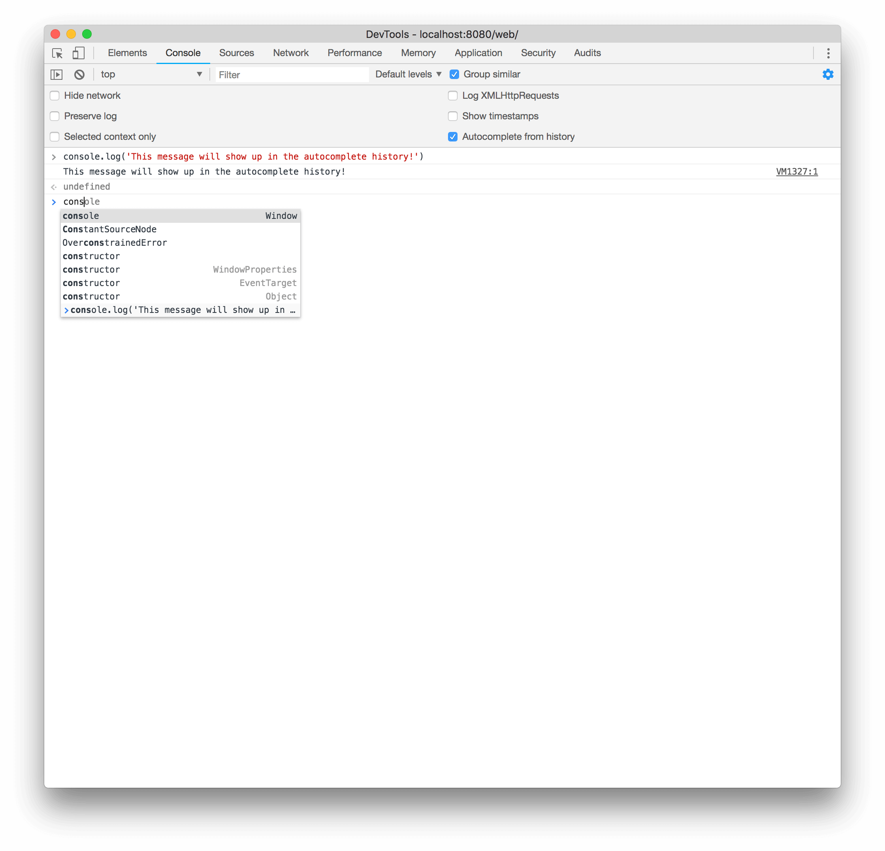
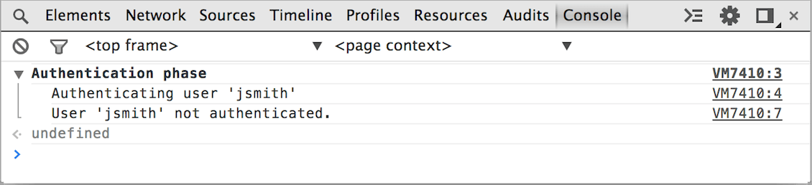

project_path: /web/tools/_project.yaml
book_path: /web/tools/_book.yaml
description: Console logging is a powerful way to inspect what your page or application does. Let's start with console.log() and explore other advanced usage.

{# wf_updated_on: 2017-07-24 #}
{# wf_published_on: 2015-04-13 #}

# Diagnose and Log to Console {: .page-title }




Console logging is a powerful way to inspect what your page or application does. Let's start with console.log() and explore other advanced usage.

### TL;DR {: .hide-from-toc }
- Use <a href="/web/tools/chrome-devtools/console/console-reference#log">console.log()</a> for basic logging
- Use <a href="/web/tools/chrome-devtools/debug/console/console-reference#error">console.error()</a> and <a href="/web/tools/chrome-devtools/debug/console/console-reference#warn">console.warn()</a> for eye-catching stuff
- Use <a href="/web/tools/chrome-devtools/debug/console/console-reference#group">console.group()</a> and <a href="/web/tools/chrome-devtools/debug/console/console-reference#groupend">console.groupEnd()</a> to group related messages and avoid clutter
- Use <a href="/web/tools/chrome-devtools/debug/console/console-reference#assert">console.assert()</a> to show conditional error messages

## Writing to the console

Use the <a href="/web/tools/chrome-devtools/debug/console/console-reference#consolelogobject--object-">console.log()</a> method for any basic logging to the console. It takes one or more expressions as parameters and writes their current values to the console, concatenating multiple parameters into a space-delimited line.

Executing this line of code in your JavaScript:

    console.log("Node count:", a.childNodes.length, "and the current time is:", Date.now());
    

Will output this in the Console:

## Autocompleting commands {:#autocomplete}

When you type in the Console, the Console automatically displays an 
autocomplete dropdown menu of relevant methods that match the text that 
you have already typed. This includes previous commands that you executed.

## Organizing Console output {:#organizing}

### Group messages together

You can group related output together with the group commands. The [`console.group()`](./console-reference#consolegroupobject-object-) command takes a single string parameter to set the name of the group. After calling it in your JavaScript, the console will begin to group all subsequent output together.

To end the grouping you only need to call [`console.groupEnd()`](./console-reference#consolegroupend) when you're done.

Example input:

    var user = "jsmith", authenticated = false;
    console.group("Authentication phase");
    console.log("Authenticating user '%s'", user);
    // authentication code here...
    if (!authenticated) {
        console.log("User '%s' not authenticated.", user)
    }
    console.groupEnd();
    

Example output:

#### Nested groups

Log groups may also nest within each other. This is useful to see a large group in smaller pieces at a time.

This example shows a log group for the authentication phase of a login process:

    var user = "jsmith", authenticated = true, authorized = true;
    // Top-level group
    console.group("Authenticating user '%s'", user);
    if (authenticated) {
        console.log("User '%s' was authenticated", user);
        // Start nested group
        console.group("Authorizing user '%s'", user);
        if (authorized) {
            console.log("User '%s' was authorized.", user);
        }
        // End nested group
        console.groupEnd();
    }
    // End top-level group
    console.groupEnd();
    console.log("A group-less log trace.");
    

And here's the nested groups output in the console:

#### Auto-collapsing groups

When using groups heavily, it can be very useful to not see everything as it happens. For these times you can automatically collapse groups by calling [`console.groupCollapsed()`](./console-reference#consolegroupcollapsedobject-object-) instead of `console.group()`:

    console.groupCollapsed("Authenticating user '%s'", user);
    if (authenticated) {
        ...
    }
    console.groupEnd();
    

groupCollapsed() output:

## Errors and warnings

Errors and warnings act the same way as normal logging. The only difference is `error()` and `warn()` have styles to bring attention to them.

### console.error()

The [`console.error()`](./console-reference#consoleerrorobject--object-) method displays a red icon along with red message text:

    function connectToServer() {
        console.error("Error: %s (%i)", "Server is  not responding",500);
    }
    connectToServer();
    

turns into

### console.warn()

The [`console.warn()`](./console-reference#consolewarnobject--object-) method displays a yellow warning icon with the message text:

    if(a.childNodes.length < 3 ) {
        console.warn('Warning! Too few nodes (%d)', a.childNodes.length);
    }
    

turns into

## Assertions

The [`console.assert()`](./console-reference#consoleassertexpression-object) method conditionally displays an error string (its second parameter) only if its first parameter evaluates to `false`.

### A simple assertion and how it displays

The following code will cause an error message in the console only if the number of child nodes belonging to the `list` element is greater than 500.

    console.assert(list.childNodes.length <= 500, "Node count is > 500");
    

How an assertion failure displays in the console:

## String substitution and formatting

The first parameter passed to any of the logging methods may contain one or more format specifiers. A format specifier consists of a `%` symbol followed by a letter that indicates the formatting that applies to the value. The parameters following the string apply to the placeholders in order.

The following example uses the string and digit formatters to insert values into the output string. You will see "Sam has 100 points" in the console.

    console.log("%s has %d points", "Sam", 100);

The full list of format specifiers is:

| Specifier | Output                                                                            |
|-----------|:----------------------------------------------------------------------------------|
| %s        | Formats the value as a string                                                     |
| %i or %d  | Formats the value as an integer                                                   |
| %f        | Formats the value as a floating point value                                       |
| %o        | Formats the value as an expandable DOM element. As seen in the Elements panel     |
| %O        | Formats the value as an expandable JavaScript object                              |
| %c        | Applies CSS style rules to the output string as specified by the second parameter |

This example uses the digit specifier to format the value of `document.childNodes.length`. It also uses the floating point specifier to format the value of `Date.now()`.

The code:

    console.log("Node count: %d, and the time is %f.", document.childNodes.length, Date.now());
    

The output of the previous code sample:

### Styling console output with CSS

The CSS format specifier allows you to customize the display in the console.
Start the string with the specifier and give the style you wish to apply as the second parameter.

Try this code:

    console.log("%cThis will be formatted with large, blue text", "color: blue; font-size: x-large");
    

..to make your log output large and blue:

### Formatting DOM elements as JavaScript objects

By default, DOM elements are logged into the console as representation of their HTML, but sometimes you want to access the DOM element as JavaScript object and inspect its properties. You can use the `%o` string specifier to do that (see above), or use `console.dir` to achieve the same: 

