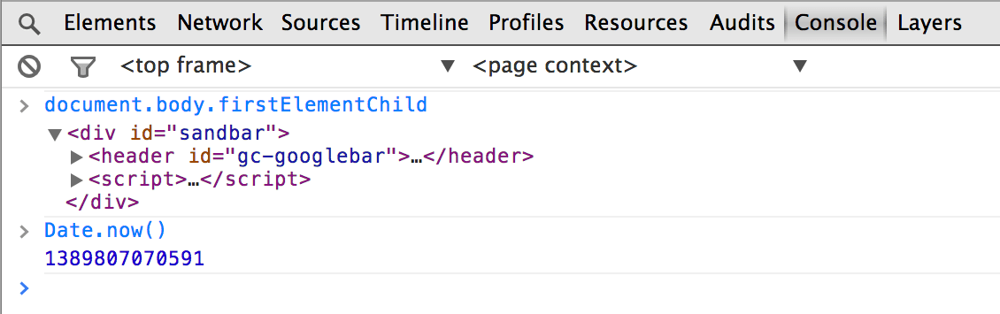

project_path: /web/tools/_project.yaml
book_path: /web/tools/_book.yaml
description: Explore the state of any item on your page from the DevTools console.

{# wf_updated_on: 2017-07-24 #}
{# wf_published_on: 2015-04-13 #}

# Evaluate Expressions {: .page-title }



Explore the state of any item on your page from the DevTools console using one of its evaluation capabilities.

The DevTools console allows you to learn the state of items
in your page in an ad-hoc manner.
Evaluate any expression you can type using a combination
of your knowledge of JavaScript and several features that support it.

### TL;DR {: .hide-from-toc }
- Evaluate an expression just by typing it.
- Select elements using one of the shortcuts.
- Inspect DOM elements and JavaScript heap objects using <code>inspect()</code>.
- Access recently selected elements and objects using $0 - 4.

## Navigate expressions

The console evaluates any JavaScript expression you provide
when pressing <kbd class="kbd">Enter</kbd>.
As you type an expression,
property name suggestions appear;
the console also provides auto-completion and tab-completion.

If there are multiple matches,
<kbd class="kbd">↑</kbd> and <kbd class="kbd">↓</kbd> cycles through them. Pressing <kbd class="kbd">→</kbd> selects the current suggestion.
If there's a single suggestion,
<kbd class="kbd">Tab</kbd> selects it.

## Select elements

Use the following shortcuts to select elements:

<table class="responsive">
  <thead>
    <tr>
      <th colspan="2">Shortcut &amp; Description</th>
    </tr>
  </thead>
  <tbody>
    <tr>
      <td data-th="Shortcut">$()</td>
      <td data-th="Description">Returns the first element that matches the specified CSS selector. Shortcut for <code>document.querySelector()</code>.</td>
    </tr>
    <tr>
      <td data-th="Shortcut">$$()</td>
      <td data-th="Description">Returns an array of all the elements that match the specified CSS selector. Alias for <code>document.querySelectorAll()</code>.</td>
    </tr>
    <tr>
      <td data-th="Shortcut">$x()</td>
      <td data-th="Description">Returns an array of elements that match the specified XPath.</td>
    </tr>
  </tbody>
</table>

Examples of target selection:

    $('code') // Returns the first code element in the document.
    $$('figure') // Returns an array of all figure elements in the document.
    $x('html/body/p') // Returns an array of all paragraphs in the document body.

## Inspect DOM elements and JavaScript heap objects

The `inspect()` function takes a DOM element or JavaScript reference
as a parameter.
If you provide a DOM element,
the DevTools goes to the Elements panel and displays that element.
If you provide a JavaScript reference,
then it goes to the Profile panel.

When this code executes in your console on this page,
it grabs this figure and displays it on the Elements panel.
This takes advantage of the `$_` property
to get the output of the last evaluated expression.

    $('[data-target="inspecting-dom-elements-example"]')
    inspect($_)

## Access recently selected elements and objects

The console stores the last five used elements and objects
in variables for easy access.
Use $0 - 4,
to access these elements from within the console.
Remember computers begin counting from 0;
this means the latest item is $0 and the oldest item is $4.
