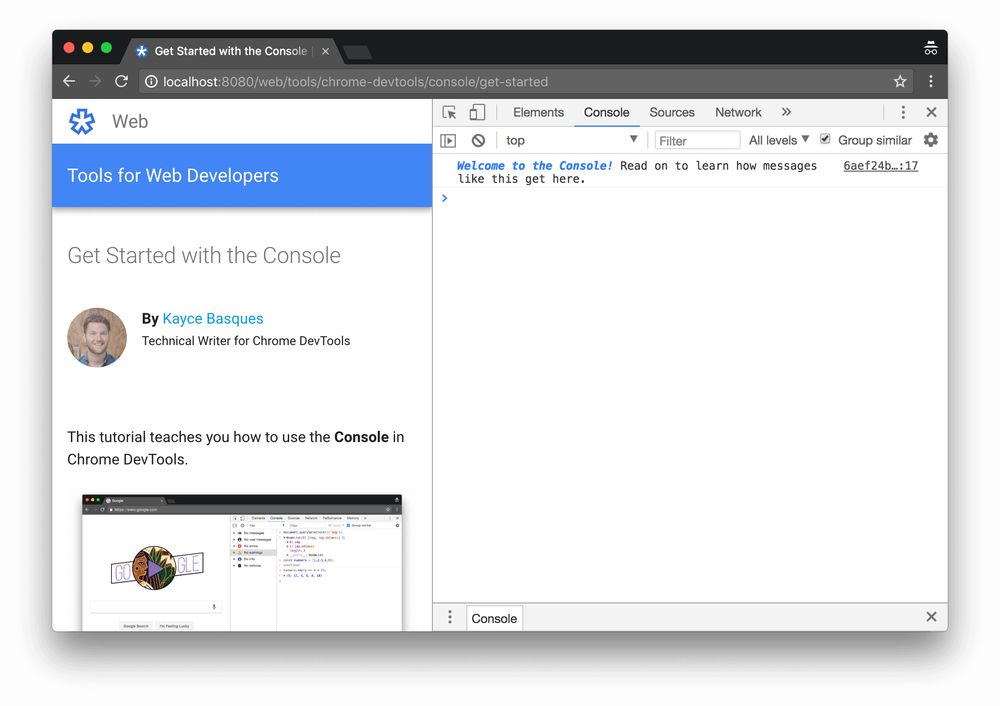
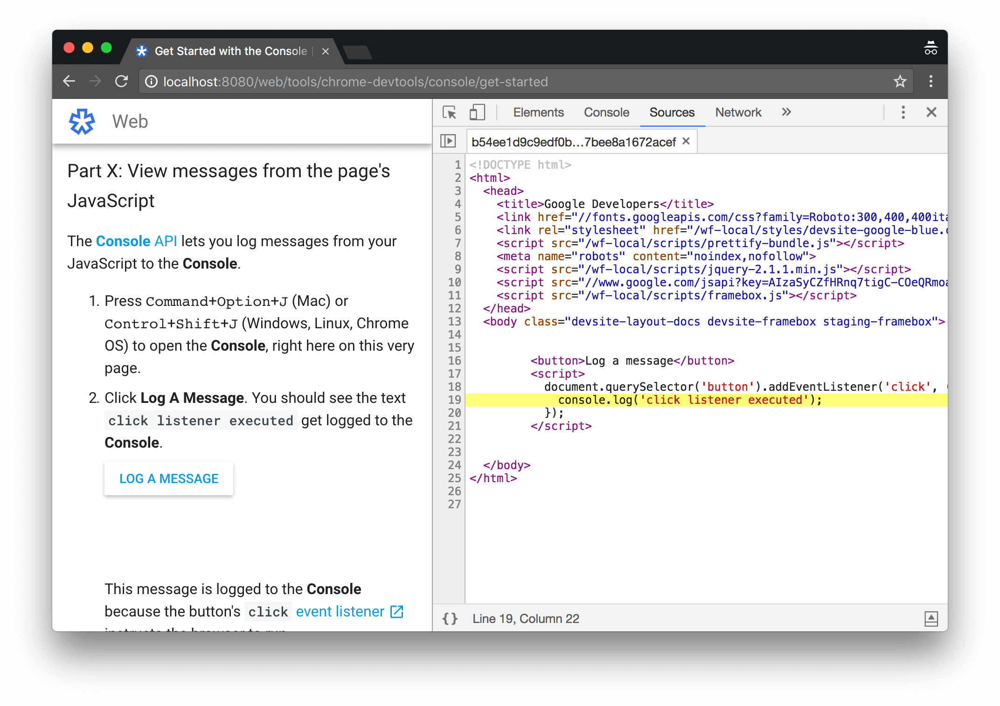
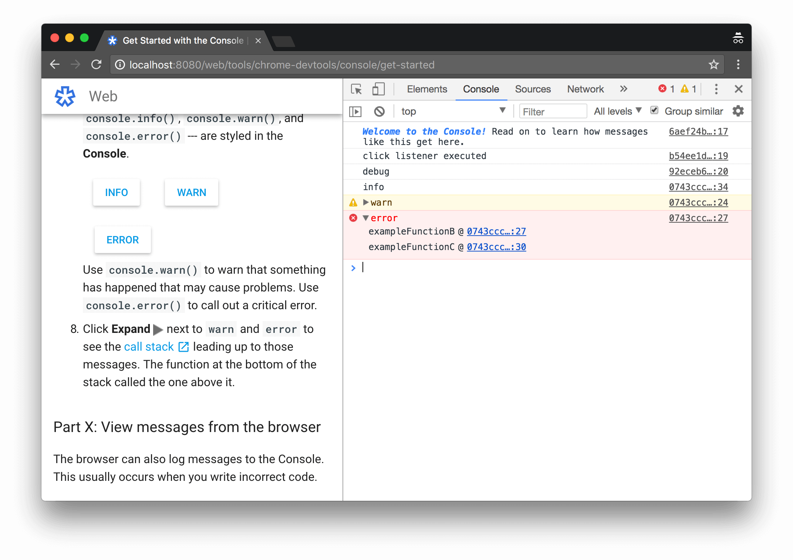
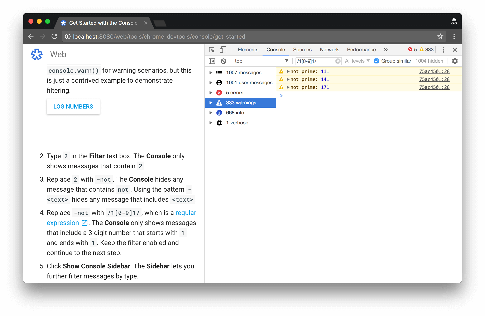
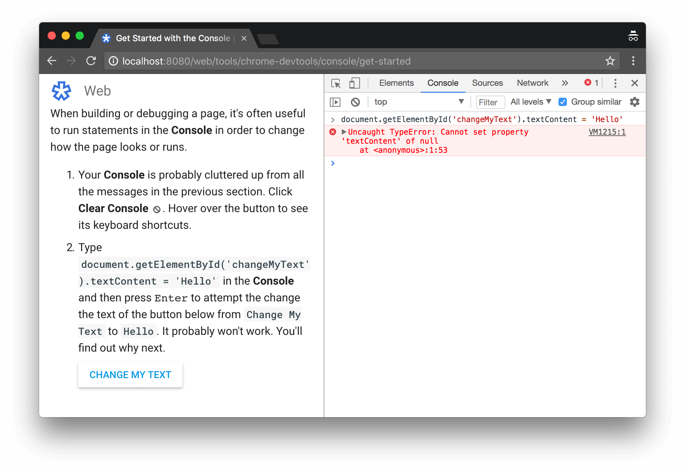
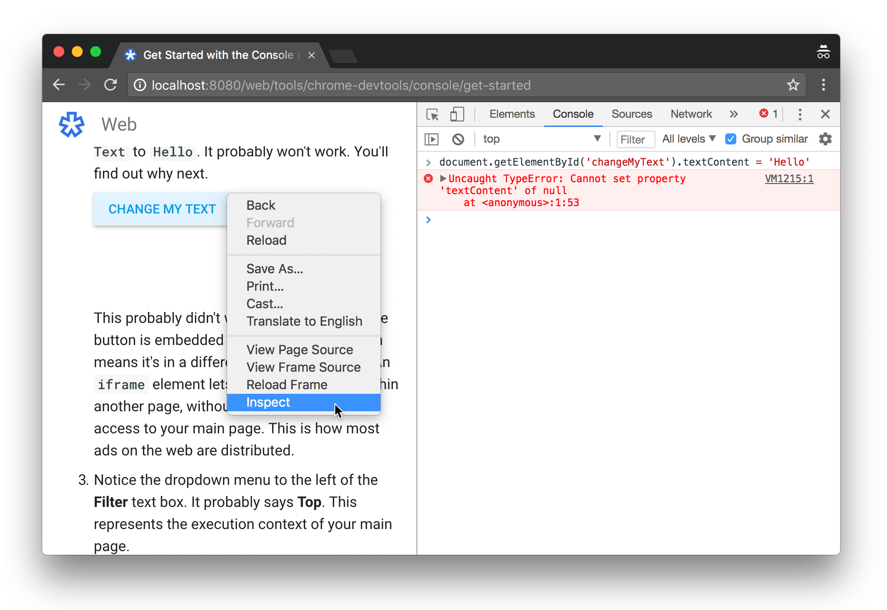
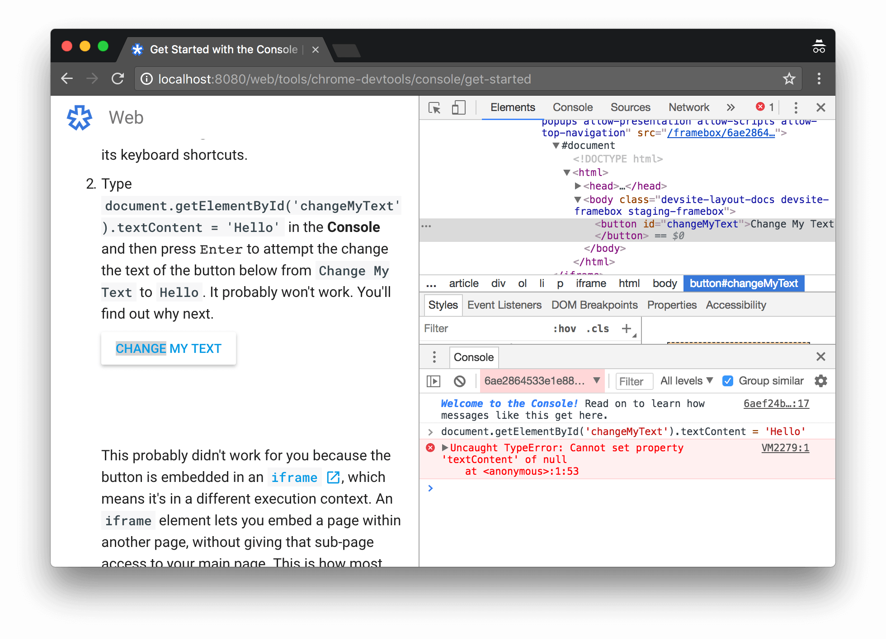

project_path: /web/tools/_project.yaml
book_path: /web/tools/_book.yaml
description: Learn how to view messages and run JavaScript in the Console.

{# wf_updated_on: 2018-03-13 #}
{# wf_published_on: 2018-03-08 #}
{# wf_blink_components: Platform>DevTools #}



# Get Started With The Console {: .page-title }



This tutorial teaches you how to use the **Console** in Chrome DevTools.

<figure>
  <b>Figure 1</b>. The <b>Console</b></figcaption>
</figure>

The **Console** has two main functions:

* Viewing diagnostic information about the page. This information can come from the web
  developers that built the page, or from the browser.
* Running JavaScript. You can view and change the page's [DOM][DOM]{:.external} by typing
  JavaScript statements in the **Console**. Or, if you just want to experiment, you can
  use the **Console** as your code playground to run code that is not related to the page at all.

[DOM]: https://developer.mozilla.org/en-US/docs/Web/API/Document_Object_Model/Introduction

This tutorial is interactive. You're going to open up DevTools on
this very page in order to get hands-on experience with the **Console**.

## Step 1: View messages {: #view }

Messages in the **Console** come from either the page's JavaScript, or from the browser.

### Part A: View messages from the page's JavaScript {: #page }

The [**Console** API][API] lets you log messages from your JavaScript to the **Console**.

[API]: /web/tools/chrome-devtools/console/console-reference

1. Press <kbd>Command</kbd>+<kbd>Option</kbd>+<kbd>J</kbd> (Mac) or
   <kbd>Control</kbd>+<kbd>Shift</kbd>+<kbd>J</kbd> (Windows, Linux, Chrome OS) to open the
   **Console**, right here on this very page.

     <figure>
       
         <b>Figure 2</b>. The <b>Console</b>, opened alongside this very page
       </figcaption>
     </figure>

1. Click **Log A Message**. You should see the text `click listener executed` get logged to the
   **Console**. 

       
         <button class="gc-analytics-event" data-category="DevTools"
                 data-label="Console / Get Started / 1.A.1 (Log)">Log a message</button>
         
       

     This message is logged to the **Console** because the button's `click` [event
     listener][events]{:.external} instructs the browser to run `console.log('click listener
     executed')` when the button is clicked.

1. To the right of the message there is a link. Click that link now. DevTools opens the
   **Sources** panel and shows you the line of code that caused the message to get logged.

     <figure>
       
         <b>Figure 3</b>. Highlighted in yellow is the line of code that caused the message to
         get logged
       </figcaption>
     </figure>

1. Click the **Console** tab to go back to the **Console**.

1. The `console` object has other methods for printing messages. Click **Debug** to see how
   the **Console** prints `console.debug()` messages. If your **Console** is set to its
   default settings, you won't see any thing.

     
       <button class="gc-analytics-event" data-category="DevTools"
               data-label="Console / Get Started / 1.A.2 (Debug)">debug</button>
       
     

1. If you didn't see anything, click the dropdown menu that says **Default Levels** or **Custom
   Levels** and enable **Verbose**. You should now see the text `debug` in your **Console**.
   `console.debug()` messages are styled the same as `console.log()` ones.

     The **Console** displays messages in chronological order. The newest message is at the
     bottom.

1. Click the buttons below to see how the remaining message types --- `console.info()`,
   `console.warn()`, and `console.error()` --- are styled in the **Console**.

       
         
         <button class="gc-analytics-event" data-category="DevTools"
                 data-label="Console / Get Started / 1.A.3 (Info)">info</button>
         <button class="gc-analytics-event" data-category="DevTools"
                 data-label="Console / Get Started / 1.A.4 (Warn)">warn</button>
         <button class="gc-analytics-event" data-category="DevTools"
                 data-label="Console / Get Started / 1.A.5 (Error)">error</button>
         
       

     Use `console.warn()` to warn that something has happened in your code that may cause
     problems. Use `console.error()` to call out a critical error.

1. Click **Expand** ![The Expand icon][expand]{:.cdt-inl} next to `warn` and `error` to see
   the [call stack][callstack]{:.external} leading up to those messages. The function at the
   bottom of the stack called the one above it.

     <figure>
       
         <b>Figure 4</b>. The call stack leading up to <code>console.error()</code>
       </figcaption>
     </figure>

[events]: https://developer.mozilla.org/en-US/docs/Learn/JavaScript/Building_blocks/Events
[expand]: /web/tools/chrome-devtools/images/shared/expand.png
[callstack]: https://developer.mozilla.org/en-US/docs/Glossary/Call_stack

### Part B: View messages from the browser {: #browser }

The browser can also log messages to the Console. This usually occurs when you write incorrect
code.

1. Click **Throw Error**. The browser logs a `TypeError`. 

       
         <button class="gc-analytics-event" data-category="DevTools"
                 data-label="Console / Get Started / 1.B.1 (TypeError)">Throw Error</button>
         
       

     The browser throws this error when some JavaScript tries to access a DOM node that
     doesn't exist.

1. Click **Throw 404**. The browser logs a `404 (Not Found)` error, as well as others.

       
         <button class="gc-analytics-event" data-category="DevTools"
                 data-label="Console / Get Started / 1.B.2 (404)">Throw 404</button>
         
       

     The browser throws these errors when a page tries to request a file that doesn't exist.

### Part C: Filter messages {: #filter }

On big sites, you'll sometimes see the **Console** get flooded with messages. You can
filter the **Console** to only show messages that you care about.

1. Click **Log Numbers**. The **Console** prints out whether each number from 1 to 1000 is prime.
   Every third message is printed with `console.warn()`. In real life you should only use
   `console.warn()` for warning scenarios, but this is just a contrived example to demonstrate
   filtering.

       
         <button class="gc-analytics-event" data-category="DevTools"
                 data-label="Console / Get Started / 1.C.1 (Numbers)">Log Numbers</button>
         
       

1. Type `123` in the **Filter** text box. The **Console** only shows messages that contain
   `123` in either the content of the message, or the filename that caused the message.
1. Replace `123` with `-not`. The **Console** hides any message that contains `not`.
   Using the pattern `-<text>` hides any message that includes `<text>`.
1. Replace `-not` with `/1[0-9]1/`, which is a [regular expression][regex]{:.external}.
   The **Console** only shows messages that include a 3-digit number that starts with `1` and
   ends with `1`. Keep the filter enabled and continue to the next step.
1. Click **Show Console Sidebar**. The **Sidebar** lets you further filter messages by type.
1. Click **333 Warnings**. DevTools now only shows messages that were logged with
   `console.warn()`. Remember that the `/1[0-9]1/` filter is still active, so you actually
   are filtering along 2 dimensions right now.

     <figure>
       
         <b>Figure 5</b>. Filtering with the <b>Sidebar</b> and a regular expression,
         simultaneously
       </figcaption>
     </figure>

1. Close the **Sidebar** and delete `/1[0-9]1/` from the **Filter** text box.

[regex]: https://developer.mozilla.org/en-US/docs/Web/JavaScript/Guide/Regular_Expressions

## Step 2: Run JavaScript {: #javascript }

The **Console** is also a [REPL][REPL]{:.external}, which stands for Read, Evaluate, Print, and
Loop. In other words, you can run JavaScript statements in the **Console**, and the **Console**
prints out the results.

[REPL]: https://en.wikipedia.org/wiki/Read%E2%80%93eval%E2%80%93print_loop

### Part A: View and change the page's JavaScript or DOM {: #page }

When building or debugging a page, it's often useful to run statements in the **Console**
in order to change how the page looks or runs.

1. Your **Console** is probably cluttered up from all the messages in the previous section.
   Click **Clear Console** ![Clear Console][clear]{.cdt-inl}. Hover over the button to see
   its keyboard shortcuts.

[clear]: images/clear-console-button.png

1. Type `document.getElementById('changeMyText').textContent = 'Hello'` in the **Console**
   and then press <kbd>Enter</kbd> to attempt to change the text of the button below from
   `Change My Text` to `Hello`. It probably won't work. You'll find out why next.

       
         <button id="changeMyText">Change My Text</button>
         



{# Runs on page load. Down here because it takes up space, even though it's not supposed to. #}


  

