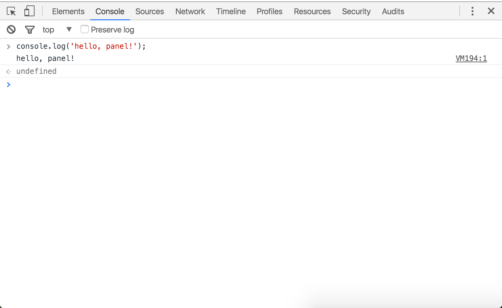

project_path: /web/tools/_project.yaml
book_path: /web/tools/_book.yaml
description: Learn how to navigate the Chrome DevTools JavaScript Console.

{# wf_updated_on: 2016-02-01 #}
{# wf_published_on: 2015-05-10 #}

# Using the Console {: .page-title }






Learn how to: open the DevTools Console, stack redundant 
messages or display them on their own lines, clear or persist 
output or save it to a file, filter output, and access additional
Console settings.

### TL;DR {: .hide-from-toc }
- Open the Console as a dedicated panel or as a drawer next to any other panel.
- Stack redundant messages, or display them on their own lines.
- Clear or persist output between pages, or save it to a file.
- Filter output by severity level, by hiding network messages, or by regular expression patterns.

## Opening the Console

Access the Console as a full-screen, dedicated panel:

Or as a drawer that opens next to any other panel:

### Open as panel

To open the dedicated **Console** panel, either:

* Press <kbd>Ctrl</kbd>+<kbd>Shift</kbd>+<kbd>J</kbd> (Windows / Linux) or
  <kbd>Cmd</kbd>+<kbd>Opt</kbd>+<kbd class="kbd">J</kbd> (Mac).
* If DevTools is already open, press the **Console** button.

When you open the Console panel, the Console drawer collapses automatically.

### Open as drawer

To open the Console as a drawer next to any other panel, either:

* Press <kbd>Esc</kbd> while DevTools is in focus.
* Press the **Customize and control DevTools** button and then press 
  **Show console**.

## Message stacking

If a message is consecutively repeated, rather than printing out each
instance of the message on a new line, the Console "stacks" the messages
and shows a number in the left margin instead. The number indicates how many
times the message has repeated.

If you prefer a unique line entry for every log, enable **Show timestamps**
from the DevTools settings.

Since the timestamp of each message is different, each message is displayed
on its own line.

## Working with the Console history

### Clearing the history {: #clearing}

You can clear the console history by doing any of the following:

* Right-click in the Console and press **Clear console**.
* Type `clear()` in the Console.
* Call `console.clear()` from within your JavaScript code.
* Type <kbd class="kbd">Ctrl</kbd>+<kbd class="kbd">L</kbd> 
  (Mac, Windows, Linux).

### Persisting the history {: #preserve-log}

Enable the **Preserve log** checkbox at the top of the console to persist
the console history between page refreshes or changes. Messages will be stored
until you clear the Console or close the tab.

### Saving the history

Right-click in the Console and select **Save as** to save the output
of the console to a log file.

## Selecting execution context {: #execution-context }

The dropdown menu highlighted in blue in the screenshot below is called the
**Execution Context Selector**.

You'll usually see the context set to `top` (the top frame of the page).

Other frames and extensions operate in their own context. To work with these
other contexts you need to select them from the dropdown menu. For example,
if you wanted to see the logging output of an `<iframe>` element and modify
a variable that exists within that context, you'd need to select it from
the Execution Context Selector dropdown menu.

The Console defaults to the `top` context, unless you access DevTools by
inspecting an element within another context. For example, if you inspect
a `
` element within an `<iframe>`, then DevTools sets the Execution Context
Selector to the context of that `<iframe>`.

When you're working in a context other than `top`, DevTools highlights the
Execution Context Selector red, as in the screenshot below. This is because
developers rarely need to work in any context other than `top`. It can
be pretty confusing to type in a variable, expecting a value, only to see that
it's `undefined` (because it's defined in a different context).

## Filtering the Console output

Click the **Filter** button 
({:.inline})
to filter console output. You can filter by severity level, by a regular 
expression, or by hiding network messages.

Filtering by severity level is equivalent to the following:

<table class="responsive">
  <thead>
     <tr>
      <th colspan="2">Option &amp; Shows</th>
    </tr>   
  </thead>
  <tbody>
  <tr>
    <td>All</td>
    <td>Shows all console output</td>
  </tr>
  <tr>
    <td>Errors</td>
    <td>Only show output from <a href="/web/tools/chrome-devtools/debug/console/console-reference#consoleerrorobject--object-">console.error()</a>.</td>
  </tr>
  <tr>
    <td>Warnings</td>
    <td>Only show output from <a href="/web/tools/chrome-devtools/debug/console/console-reference#consolewarnobject--object-">console.warn()</a>.</td>
  </tr>
  <tr>
    <td>Info</td>
    <td>Only show output from <a href="/web/tools/chrome-devtools/debug/console/console-reference#consoleinfoobject--object-">console.info()</a>.</td>
  </tr>
  <tr>
    <td>Logs</td>
    <td>Only show output from <a href="/web/tools/chrome-devtools/debug/console/console-reference#consolelogobject--object-">console.log()</a>.</td>
  </tr>
  <tr>
    <td>Debug</td>
    <td>Only show output from <a href="/web/tools/chrome-devtools/debug/console/console-reference#consoletimeendlabel">console.timeEnd()</a> and <a href="/web/tools/chrome-devtools/debug/console/console-reference#consoledebugobject--object-">console.debug()</a>.</td>
  </tr>
  </tbody>
</table>

## Additional settings

Open the DevTools settings, go to the **General** tab, and scroll down to
the **Console** section for further Console settings.

<table class="responsive">
  <thead>
     <tr>
      <th colspan="2">Setting &amp; Description</th>
    </tr>   
  </thead>
  <tbody>
  <tr>
    <td>Hide network messages</td>
    <td>By default, the console reports network issues. Turning this on instructs the console to not show logs for these errors. For example, 404 and 500 series errors will not be logged.</td>
  </tr>
  <tr>
    <td>Log XMLHttpRequests</td>
    <td>Determines if the console logs each XMLHttpRequest.</td>
  </tr>
  <tr>
    <td>Preserve log upon navigation</td>
    <td>Persists the console history during page refreshes or navigation.</td>
  </tr>
  <tr>
    <td>Show timestamps</td>
    <td>Prepends a timestamp to each console message showing when the call was made. Useful for debugging when a certain event occurred. This will disable message stacking.</td>
  </tr>
  <tr>
    <td>Enable custom formatters</td>
    <td>Control the <a href="https://docs.google.com/document/d/1FTascZXT9cxfetuPRT2eXPQKXui4nWFivUnS_335T3U/preview">formatting</a> of JavaScript objects.</td>
  </tr>
  </tbody>
</table>
