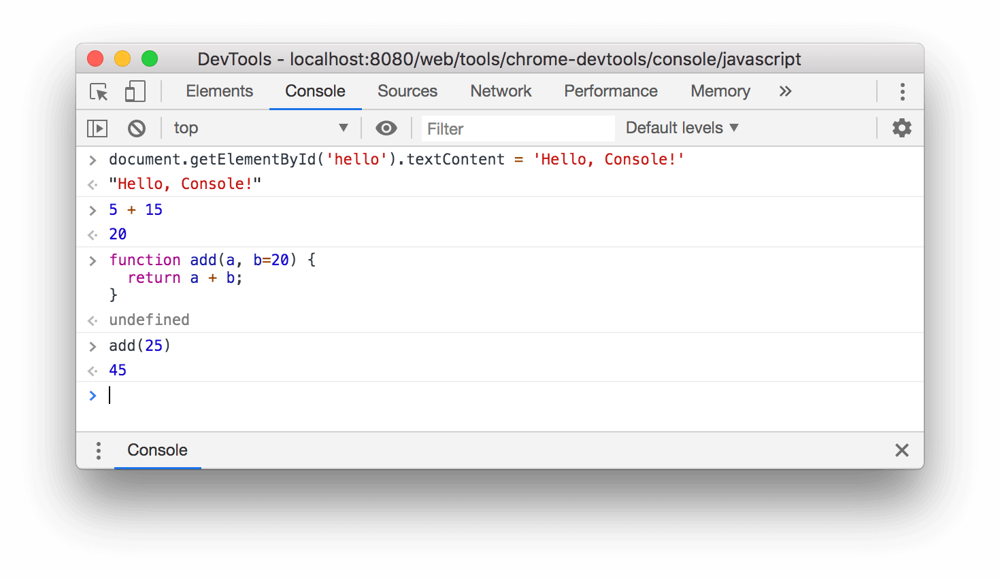
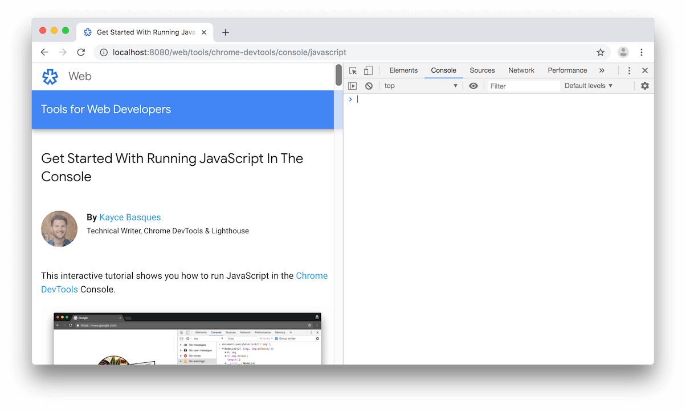
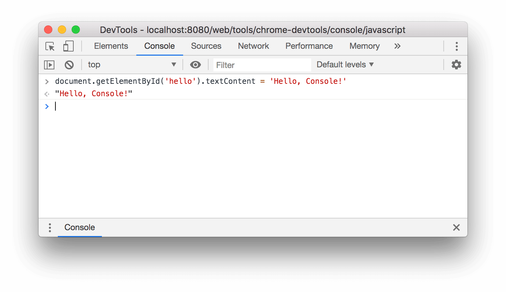

project_path: /web/tools/_project.yaml
book_path: /web/tools/_book.yaml
description: Learn how to run JavaScript in the Console.

{# wf_updated_on: 2019-04-18 #}
{# wf_published_on: 2018-04-18 #}
{# wf_blink_components: Platform>DevTools #}



# Get Started With Running JavaScript In The Console {: .page-title }



[log]: /web/tools/chrome-devtools/console/log

This interactive tutorial shows you how to run JavaScript in the
[Chrome DevTools](/web/tools/chrome-devtools/) Console. See [Get Started
With Logging Messages][log] to learn how to log messages to the Console.
See [Get Started With Debugging JavaScript](/web/tools/chrome-devtools/javascript/) to
learn how to pause JavaScript code and step through it one line at a time.

<figure>
  
  <figcaption>
    <b>Figure 1</b>. The <b>Console</b>.
  </figcaption>
</figure>

## Overview {: #overview }

[REPL]: https://en.wikipedia.org/wiki/Read%E2%80%93eval%E2%80%93print_loop
[expression]: http://2ality.com/2012/09/expressions-vs-statements.html

The **Console** is a [REPL][REPL]{:.external}, which stands for Read, Evaluate, Print, and
Loop. It reads the JavaScript that you type into it, evaluates your code, prints out the
result of your [expression][expression]{: .external }, and then loops back to the first step.

## Set up DevTools {: #setup }

This tutorial is designed so that you can open up the demo and try all the workflows yourself.
When you physically follow along, you're more likely to remember the workflows later.

1. Press <kbd>Command</kbd>+<kbd>Option</kbd>+<kbd>J</kbd> (Mac) or
   <kbd>Control</kbd>+<kbd>Shift</kbd>+<kbd>J</kbd> (Windows, Linux, Chrome OS) to open the
   **Console**, right here on this very page.

     <figure>
       
       <figcaption>
         <b>Figure 2</b>. This tutorial on the left, and DevTools on the right.
       </figcaption>
     </figure>

## View and change the page's JavaScript or DOM {: #page }

When building or debugging a page, it's often useful to run statements in the **Console**
in order to change how the page looks or runs.

1. Notice the text in the button below.

     <button id="hello">Hello, World!</button>

1. Type `document.getElementById('hello').textContent = 'Hello, Console!'` in the **Console** and then press
   <kbd>Enter</kbd> to evaluate the expression. Notice how the text inside the button changes.

     <figure>
       
       <figcaption>
         <b>Figure 3</b>. How the Console looks after evaluating the expression above.
       </figcaption>
     </figure>

     Below the code that you evaluated you see `"Hello, Console!"`. Recall the 4 steps
     of REPL: read, evaluate, print, loop. After evaluating your code, a REPL prints the
     result of the expression. So `"Hello, Console!"` must be the result of evaluating
     `document.getElementById('hello').textContent = 'Hello, Console!'`.

## Run arbitrary JavaScript that's not related to the page {: #playground }

Sometimes, you just want a code playground where you can test some code, or try out new
JavaScript features you're not familiar with. The Console is a perfect place for these kinds
of experiments.

1. Type `5 + 15` in the Console and press <kbd>Enter</kbd> to evaluate the expression.
   The Console prints out the result of the expression below your code. **Figure 4** below shows
   how your Console should look after evaluating this expression.

1. Type the following code into the **Console**. Try typing it out, character-by-character,
   rather than copy-pasting it.

        function add(a, b=20) {
          return a + b;
        }

     See [define default values for function arguments](http://es6-features.org/#DefaultParameterValues){:.external}
     if you're unfamiliar with the `b=20` syntax.

1. Now, call the function that you just defined.

        add(25);

     <figure>
       
       <figcaption>
         <b>Figure 4</b>. How the Console looks after evaluating the expressions above.
       </figcaption>
     </figure>

     `add(25)` evaluates to `45` because when the `add` function is called without a second argument,
     `b` defaults to `20`.

## Next steps {: #next }

See [Run JavaScript](/web/tools/chrome-devtools/console/reference#js) to explore more features related
to running JavaScript in the Console.

[Debugging]: /web/tools/chrome-devtools/javascript/

DevTools lets you pause a script in the middle of its execution. While you're paused, you
can use the **Console** to view and change the page's `window` or `DOM` at that moment in time.
This makes for a powerful debugging workflow. See [Get Started With Debugging JavaScript][Debugging] for
an interactive tutorial.

The **Console** also has a set of convenience functions that make it easier to interact
with a page. For example:

* Rather than typing `document.querySelector()` to select an element, you can type `$()`. This
  syntax is inspired by jQuery, but it's not actually jQuery. It's just an alias for
  `document.querySelector()`.
* `debug(function)` effectively sets a breakpoint on the first line of that function.
* `keys(object)` returns an array containing the keys of the specified object.

[utils]: /web/tools/chrome-devtools/console/utilities

See [Console Utilities API Reference][utils] to explore all the convenience functions.

## Feedback {: #feedback }


