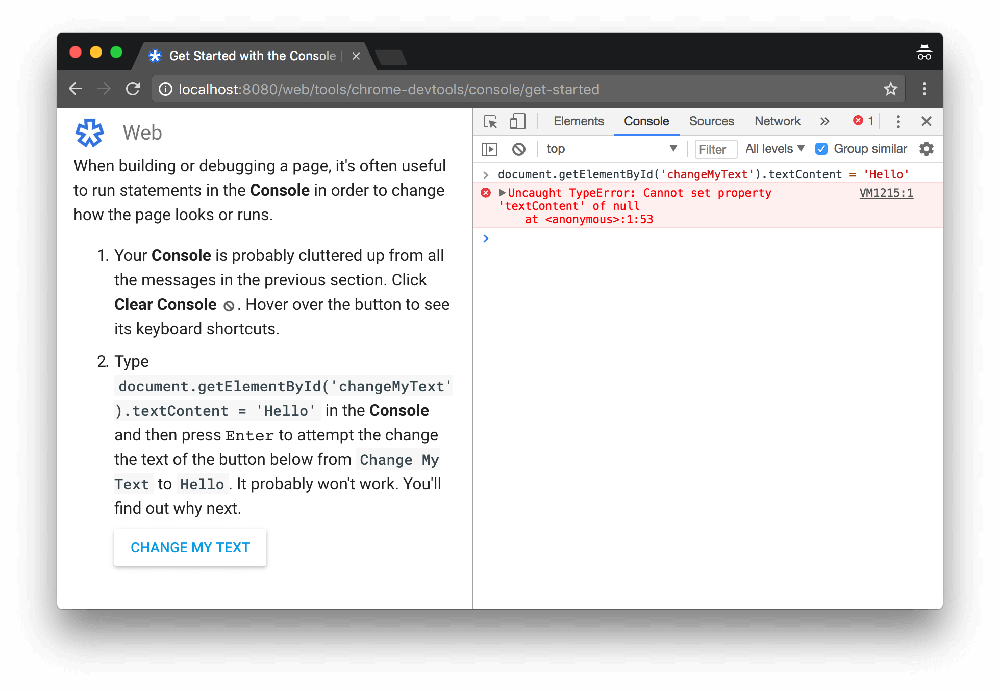
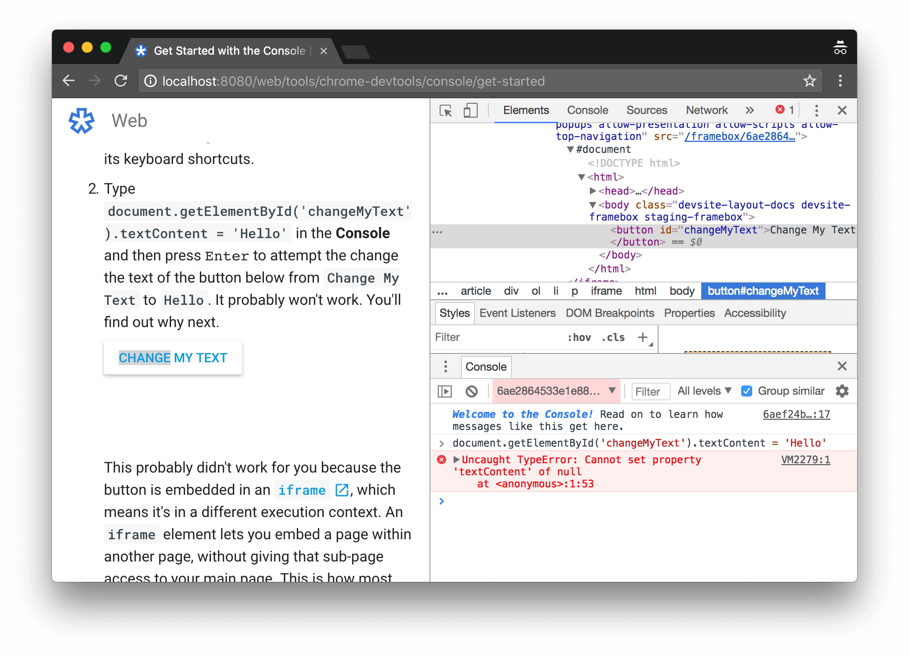

project_path: /web/tools/_project.yaml
book_path: /web/tools/_book.yaml
description: Learn how to run JavaScript in the Console.

{# wf_updated_on: 2019-04-16 #}
{# wf_published_on: 2018-04-16 #}
{# wf_blink_components: Platform>DevTools #}



# Get Started With Running JavaScript In The Console {: .page-title }



[DOM]: https://developer.mozilla.org/en-US/docs/Web/API/Document_Object_Model/Introduction

You can view and change the page's [DOM][DOM]{:.external} by typing
JavaScript statements in the **Console**. Or, if you just want to experiment, you can
use the **Console** as your code playground to run code that is not related to the page at all.

<figure>
  
  <figcaption><b>Figure 1</b>. The <b>Console</b></figcaption>
</figure>

## Set up DevTools {: #setup }

This tutorial is interactive. You're going to open up DevTools on
this very page in order to get hands-on experience with the **Console**.

1. Press <kbd>Command</kbd>+<kbd>Option</kbd>+<kbd>J</kbd> (Mac) or
   <kbd>Control</kbd>+<kbd>Shift</kbd>+<kbd>J</kbd> (Windows, Linux, Chrome OS) to open the
   **Console**, right here on this very page.

## Run JavaScript that interacts with the page {: #page }

The **Console** is also a [REPL][REPL]{:.external}, which stands for Read, Evaluate, Print, and
Loop. In other words, you can run JavaScript statements in the **Console**, and the **Console**
prints out the results.

[REPL]: https://en.wikipedia.org/wiki/Read%E2%80%93eval%E2%80%93print_loop

### Part A: View and change the page's JavaScript or DOM {: #page }

When building or debugging a page, it's often useful to run statements in the **Console**
in order to change how the page looks or runs.

1. Your **Console** is probably cluttered up from all the messages in the previous section.
   Click **Clear Console** ![Clear Console][clear]{.cdt-inl}. Hover over the button to see
   its keyboard shortcuts.

[clear]: images/clear-console-button.png

1. Type `document.getElementById('changeMyText').textContent = 'Hello'` in the **Console**
   and then press <kbd>Enter</kbd> to attempt to change the text of the button below from
   `Change My Text` to `Hello`. It probably won't work. You'll find out why next.

       
         <button id="changeMyText">Change My Text</button>
         
       

     This probably didn't work for you because the button is embedded in an
     [`iframe`][iframe]{:.external}, which means it's in a different execution context. An
     `iframe` element lets you embed a page within another page, without giving that sub-page
     access to your main page. This is how most ads on the web are distributed.

     <figure>
       
       <figcaption>
         <b>Figure 6</b>. Unsuccessfully attempting to change the button's text
       </figcaption>
     </figure>

1. Notice the dropdown menu to the left of the **Filter** text box. It probably says **Top**.
   **Top** represents the execution context of your main page.
1. Right-click **Change My Text** and select **Inspect**. DevTools jumps to the **Elements**
   panel and highlights the element in the **DOM Tree**.

     <figure>
       
       <figcaption>
         <b>Figure 7</b>. Inspecting the button
       </figcaption>
     </figure>

1. Press <kbd>Escape</kbd>. The **Console** opens up at the bottom of the **Elements** panel.
   Note how the dropdown that used to say **Top** now says something else, and it's background
   is colored red. This means that the **Console** is now in a different execution context.
   You're in a different execution context because the **Change My Text** button is selected
   in the **DOM Tree**, and that button is embedded in an `iframe`.

     <figure>
       
       <figcaption>
         <b>Figure 8</b>. The <b>Console</b> opened at the bottom of the <b>Elements</b> panel,
         and in a different execution context
       </figcaption>
     </figure>

1. Try running `document.getElementById('changeMyText').textContent = 'Hello'` again. You don't
   have to type it out or copy-paste it. Just focus the **Console** and press the <kbd>Up
   Arrow</kbd> key. DevTools remembers your history. After running the statement, look at the
   button's text again. This time, it should have successfully changed.

[iframe]: https://developer.mozilla.org/en-US/docs/Web/HTML/Element/iframe

Hopefully you get the idea that this workflow is completely open-ended. You can run any
JavaScript here. This is a flexible way to debug pages and explore how they're built.

## Run arbitrary JavaScript that's not related to the page {: #playground }

Sometimes, you just want a code playground where you can test out JavaScript features that
you're not familiar with. The **Console** is the perfect place to do this. For example,
ES6 introduced a nice feature where you can [define default values for function
arguments][default]{:.external}. Try it now:

[default]: http://es6-features.org/#DefaultParameterValues

1. Type the following code into the **Console**. Try typing it, rather than copy-pasting it,
   in order to to see how DevTools intelligently decides whether to continue to let you enter
   input, or to evaluate the code.

        function add(a, b=20) {
          return a + b;
        }

1. Type the following code in the **Console** to call the function that you just defined.

        add(25);

## Next steps {: #next }

DevTools lets you pause a script in the middle of its execution. While you're paused, you
can use the **Console** to view and change the page at that moment in time. This makes for a
powerful debugging workflow. See [Get Started With Debugging JavaScript][Debugging] for
an interactive tutorial.

[Debugging]: /web/tools/chrome-devtools/javascript/

The **Console** also has a set of convenience functions that make it easier to interact
with a page. For example:

* Rather than typing `document.querySelector()` to select an element, you can type `$()`. This
  syntax is inspired by jQuery, but it's not actually jQuery. It's just an alias for
  `document.querySelector()`.
* `debug(function)` effectively sets a breakpoint on the first line of that function.
* `keys(object)` returns an array containing the keys of the specified object.

See [Command Line API Reference][CLAPI] for the full reference.

[CLAPI]: /web/tools/chrome-devtools/console/command-line-reference

## Feedback {: #feedback }


