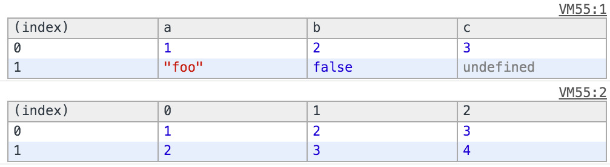
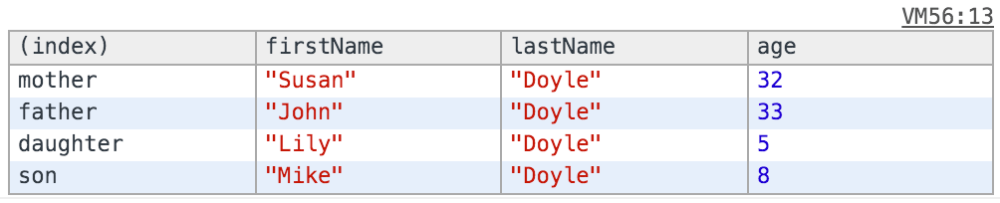

project_path: /web/tools/_project.yaml
book_path: /web/tools/_book.yaml
description: Compare similar data objects using the table() method.

{# wf_updated_on: 2015-05-11 #}
{# wf_published_on: 2015-04-13 #}

# Compare Similar Data Objects {: .page-title }



View structured data and compare data objects using the table() method.

The `table()` method provides an easy way to view objects and arrays that include similar data. When called, it will take the properties of an object and create a header. The row data then comes from each index's properties value.

## Basic example: Logging an array of objects

In it's most basic form, all you need is an array with a bunch of objects that have the same properties, and the `table()` command will do the rest:

    console.table([{a:1, b:2, c:3}, {a:"foo", b:false, c:undefined}]);
    console.table([[1,2,3], [2,3,4]]);
    
  
This will output:

## Advanced example: Logging specific properties

The second parameter to `table()` can be used to log more advanced objects. Define an array containing the property strings you wish to display, like so:

    function Person(firstName, lastName, age) {
      this.firstName = firstName;
      this.lastName = lastName;
      this.age = age;
    }
    
    var family = {};
    family.mother = new Person("Susan", "Doyle", 32);
    family.father = new Person("John", "Doyle", 33);
    family.daughter = new Person("Lily", "Doyle", 5);
    family.son = new Person("Mike", "Doyle", 8);
    
    console.table(family, ["firstName", "lastName", "age"]);
    

This will output the following:

