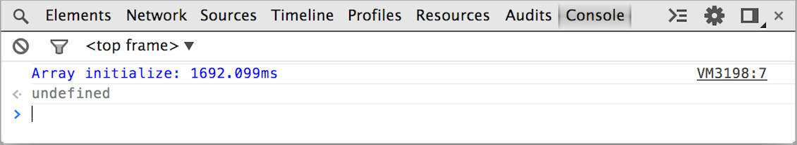

project_path: /web/tools/_project.yaml
book_path: /web/tools/_book.yaml
description: Take advantage of the Console API to measure execution times and count statement executions.

{# wf_updated_on: 2015-05-11 #}
{# wf_published_on: 2015-04-13 #}

# Measure and count executions {: .page-title }





Take advantage of the Console API to measure execution times and count statement executions.

### TL;DR {: .hide-from-toc }
- Use <code>console.time()</code> and <code>console.timeEnd()</code> to track time elapsed between code execution points.
- Use <code>console.count()</code> to count how many times the same string is passed to a function.

## Measure execution times

The [`time()`](./console-reference#consoletimelabel) method starts a new timer and is very useful to measure how long something took. Pass a string to the method to give the marker a name.

When you want to stop the timer, call [`timeEnd()`](./console-reference#consoletimeendlabel) and pass it the same string passed to the initializer.

The console then logs the label and time elapsed when the `timeEnd()` method fires.

### Basic example

Here, we measure the initialization of a million new Arrays:

    console.time("Array initialize");
    var array= new Array(1000000);
    for (var i = array.length - 1; i >= 0; i--) {
        array[i] = new Object();
    };
    console.timeEnd("Array initialize");
    

Which outputs the following in the Console:

### Timers on the Timeline

When a [Timeline](/web/tools/chrome-devtools/profile/evaluate-performance/timeline-tool) recording is taking place during a `time()` operation, it annotates the timeline as well. Use it when you want to trace what your application does and where it comes from.

How an annotation on the timeline looks from `time()`:

### Marking the Timeline

*Note: The `timeStamp()` method only functions while a Timeline recording is in progress.*

The [Timeline panel](/web/tools/chrome-devtools/profile/evaluate-performance/timeline-tool) provides a complete overview of where the engine spends time.
You can add a mark to the timeline from the console with the [`timeStamp()`](./console-reference#consoletimestamplabel). This is a simple way to correlate events in your application with other events.

The `timeStamp()` annotates the Timeline in the following places:

- A yellow vertical line in the Timeline's summary and details view.
- It adds a record to the list of events.

The following example code:

    function AddResult(name, result) {
        console.timeStamp("Adding result");
        var text = name + ': ' + result;
        var results = document.getElementById("results");
        results.innerHTML += (text + " ");
    }
    

Results in the following Timeline timestamps:

## Counting statement executions

Use the `count()` method to log a provided string along with the number of times the same string has been provided. When the exact statement is given to `count()` on the same line, the number is incremented.

Example code of using `count()` with some dynamic content:

    function login(user) {
        console.count("Login called for user " + user);
    }
    
    users = [ // by last name since we have too many Pauls.
        'Irish',
        'Bakaus',
        'Kinlan'
    ];
    
    users.forEach(function(element, index, array) {
        login(element);
    });
    
    login(users[0]);
    

Output of the code sample:

