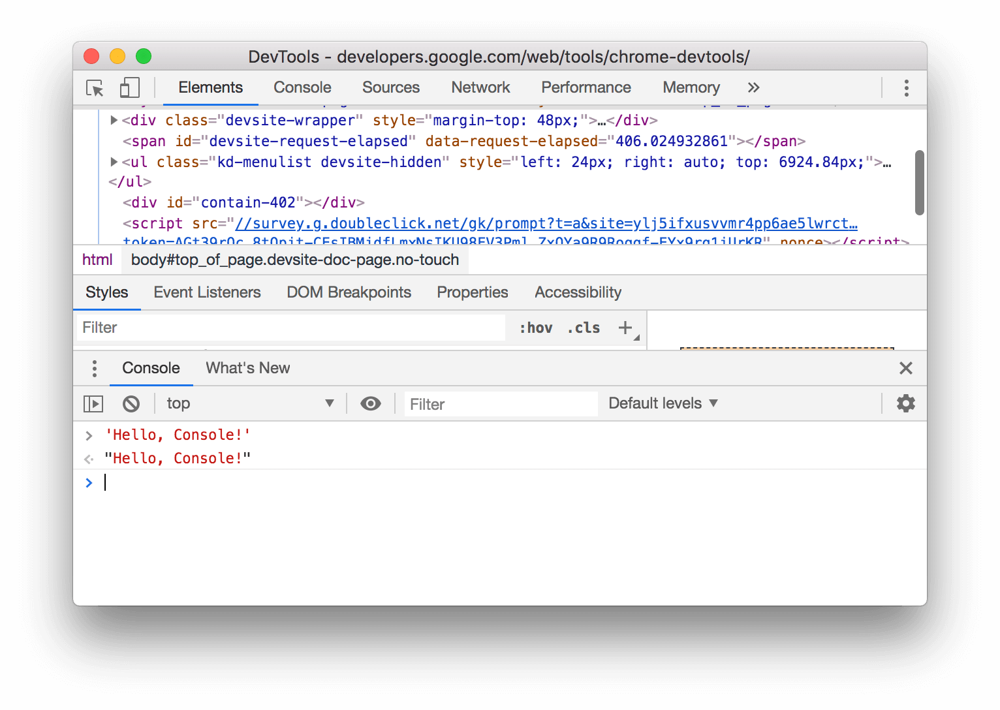

project_path: /web/tools/_project.yaml
book_path: /web/tools/_book.yaml
description: TODO

{# wf_blink_components: Platform>DevTools #}
{# wf_updated_on: 2018-08-06 #}
{# wf_published_on: 2018-08-02 #}

# Console UI Reference {: .page-title }



{# TODO rename Console API Reference to Logging API Reference, and Command Line Reference to Console API Reference #}

This reference comprehensively lists every way that you can interact with the Chrome DevTools Console UI.

To learn the basics of logging messages to and running JavaScript from the Console, see
[Get Started with the Console](get-started).

## Console basics {: #basics }

The Console is helpful for 2 general tasks:

* Running JavaScript expressions.
* Reading logs.

### Open the Console panel {: #panel }

If you don't already have DevTools open, press <kbd>Command</kbd>+<kbd>Option</kbd>+<kbd>J</kbd> (Mac)
or <kbd>Control</kbd>+<kbd>Shift</kbd>+<kbd>J</kbd> (Windows, Linux, Chrome OS) to open the Console.

<figure>
  
  <figcaption>
    <b>Figure X</b>. TODO
  </figcaption>
</figure>

See [Keyboard Shortcuts Reference][shortcuts] for more DevTools keyboard shortcuts.

[shortcuts]: /web/tools/chrome-devtools/shortcuts

If you do already have DevTools open, click the **Console** tab to open the Console.

<figure>
  
  <figcaption>
    <b>Figure X</b>. TODO
  </figcaption>
</figure>

### Open the Console drawer {: #drawer }

Sometimes, you want to access the Console while working in another DevTools panel. To open
the Console as a drawer alongside any other panel, press <kbd>Escape</kbd>. The Console Drawer
opens at the bottom of your DevTools window.

<figure>
  
  <figcaption>
    <b>Figure X</b>. TODO
  </figcaption>
</figure>

### Clear the Console {: #clear }

### Select context {: #context }

### Open Console Settings {: #settings }

To open **Console Settings** click **Console Settings** ![Console Settings][settings]{: .inline-icon }.

[settings]: images/console-settings-button.png

<figure>
  
  <figcaption>
    <b>Figure X</b>. TODO
  </figcaption>
</figure>

You can also access these options from [Console Preferences](#preferences).

### Open Console Preferences {: #preferences }

To open Console Preferences:

1. Open [Settings](/web/tools/chrome-devtools/ui#settings).
1. Click the **Preferences** tab.
1. Scroll down to the **Console** section.

<figure>
  
  <figcaption>
    <b>Figure X</b>. TODO
  </figcaption>
</figure>

You can also access **some** of these options from [Console Settings](#settings).

## REPL-related features {: #repl }

Might change title to "Execute JavaScript". We never use the term REPL. You can
mention it here, though.

A [REPL][REPL]{: .external } is an interactive programming environment that takes user
input, evaluates that input, and then prints the result of the evaluation to the user.
When you type JavaScript expressions in the Console, you're using the Console as a REPL.

[REPL]: https://en.wikipedia.org/wiki/Read%E2%80%93eval%E2%80%93print_loop

### REPL basics 

### Argument hints {: #hints }

/web/updates/2018/05/devtools#hints

### Autocomplete commands {: #autocomplete }

As you type out text, the Console suggests a list of autocomplete options.

<figure>
  
  <figcaption>
    <b>Figure X</b>. TODO
  </figcaption>
</figure>

To interact with the autocomplete options:

* Press <kbd>Up</kbd> or <kbd>Down</kbd> to select a different option.
* Press <kbd>Tab</kbd>, <kbd>Enter</kbd>, or <kbd>Right</kbd> to accept a suggestion.
* Press <kbd>Escape</kbd> to close the autocomplete suggestion box and reject its suggestion.

There is no way to completely disable the autocomplete box. You can, however, [disable
autocomplete suggestions from history](#history).

#### Autocomplete after function execution

/web/updates/2018/05/devtools#autocomplete

### Preview the results of expressions with Eager Evaluation {: #eager-evaluation }

Note: This feature was introduced in Chrome 68.

Use Eager Evaluation to preview the results of expressions that you type in the Console REPL.
DevTools does not preview an expression result if the expression causes
[side effects][effects]{: .external }.

[effects]: https://stackoverflow.com/a/8129277/1669860

<figure>
  
  <figcaption>
    <b>Figure X</b>. TODO
  </figcaption>
</figure>

To enable Eager Evaluation:

1. [Open **Console Settings**](#settings).
1. Enable the **Eager Evaluation** checkbox.

### Disable autocomplete suggestions from history {: #history }

After you type out multiple expressions in the Console, you'll start to see those expressions
show up in the autocomplete suggestions.

To disable autocomplete suggestions from history:

1. [Open **Console Settings**](#settings).
1. Disable the **Autocomplete from history** checkbox.

<figure>
  
  <figcaption>
    <b>Figure X</b>. TODO
  </figcaption>
</figure>

### Force a new line {: #force }

As you type out an expression in the Console REPL, press <kbd>Shift</kbd>+<kbd>Enter</kbd>
to force the Console to insert a new line.

<figure>
  
  <figcaption>
    <b>Figure X</b>. The <code>a</code>, <code>b</code>, <code>c</code>, and <code>d</code>
    comments span multiple lines
  </figcaption>
</figure>

## Logging-related features

### Logging basics 

### Filter messages

#### Filter by message type

#### Filter by text

### Collapse or expand a group of messages

### Preserve messages across page loads

### Show messages from the current context only

### Log network requests 

### Hide network messages 

### View the stack trace of an error

### View the line of code that caused the message

### Group similar messages {: #group }

## Feedback {: #feedback }


