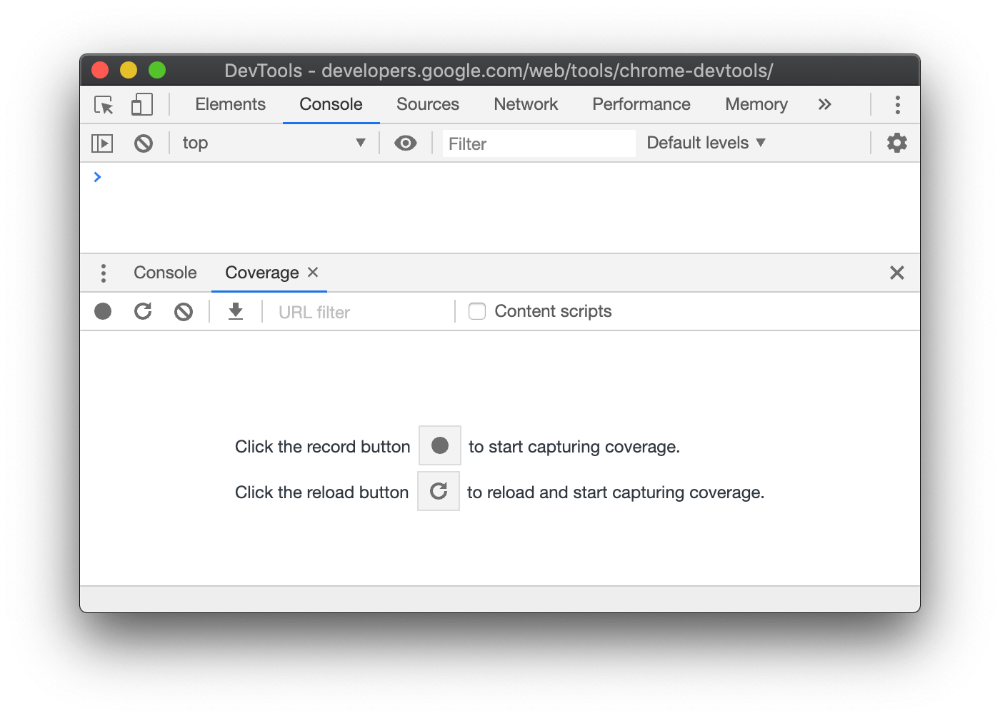

project_path: /web/tools/_project.yaml
book_path: /web/tools/_book.yaml
description: How to find and analyze unused JavaScript and CSS code in Chrome DevTools.

{# wf_updated_on: 2019-07-09 #}
{# wf_published_on: 2019-07-09 #}
{# wf_blink_components: Platform>DevTools #}

# Find Unused JavaScript And CSS Code With The Coverage Tab In Chrome DevTools {: .page-title }



The Coverage tab in Chrome DevTools can help you find unused JavaScript and CSS code. Removing
unused code can speed up your page load and save your mobile users cellular data.

<figure>
  
  <figcaption>
    <b>Figure 1</b>. Analyzing code coverage.
  </figcaption>
</figure>

<aside class="caution">
  A word of warning. Finding unused code is relatively easy. But refactoring a codebase so that
  each page only ships the JavaScript and CSS that it needs can be difficult. This guide doesn't
  cover how to refactor a codebase to avoid unused code because these refactors depend highly on 
  your technology stack.
</aside>

## Overview {: #overview }

[button]: https://getbootstrap.com/docs/4.3/components/buttons/

Shipping unused JavaScript or CSS is a common problem in web development. For example, suppose 
that you want to use [Bootstrap's button component][button] on your page. To use the button 
component you need to add a link to Bootstrap's stylesheet in your HTML, like this:

    ...
    <head>
      ...
      <link rel="stylesheet" 
            href="https://stackpath.bootstrapcdn.com/bootstrap/4.3.1/css/bootstrap.min.css" 
            integrity="sha384-ggOyR0iXCbMQv3Xipma34MD+dH/1fQ784/j6cY/iJTQUOhcWr7x9JvoRxT2MZw1T" 
            crossorigin="anonymous">
      ...
    </head>
    ...

This stylesheet doesn't just include the code for the button component. It contains the CSS for 
*all* of Bootstrap's components. But you're not using any of the other Bootstrap components. 
So your page is downloading a bunch of CSS that it doesn't need. This extra CSS is a problem
for the following reasons:

[render]: /web/fundamentals/performance/critical-rendering-path/render-blocking-css

* The extra code slows down your page load. See [Render-Blocking CSS][render].
* If a user accesses the page on a mobile device, the extra code uses up their cellular data.

## Open the Coverage tab {: #open }

1. [Open the Command Menu](/web/tools/chrome-devtools/command-menu).
1. Start typing `coverage`, select the **Show Coverage** command, and then press
   <kbd>Enter</kbd> to run the command. The **Coverage** tab opens in the **Drawer**.

<figure>
  
  <figcaption>
    <b>Figure 2</b>. The <b>Coverage</b> tab.
  </figcaption>
</figure>

## Record code coverage {: #record }

[load]: /web/tools/chrome-devtools/images/shared/reload.png
[record]: /web/tools/chrome-devtools/images/shared/record.png
[stop]: /web/tools/chrome-devtools/images/shared/stop.png

1. Click one of the following buttons in the **Coverage** tab:
     * Click **Start Instrumenting Coverage And Reload Page** 
       ![Start Instrumenting Coverage And Reload Page][load]{: .inline-icon }
       if you want to see what code is needed to load the page.
     * Click **Instrument Coverage** ![Instrument Coverage][record]{: .inline-icon }
       if you want to see what code is used after interacting with the page.
1. Click **Stop Instrumenting Coverage And Show Results** 
   ![Stop Instrumenting Coverage And Show Results][stop]{: .inline-icon } when you want to 
   stop recording code coverage.

## Analyze code coverage {: #analyze }

The table in the **Coverage** tab shows you what resources were analyzed, and how much code is
used within each resource. Click a row to open that resource in the **Sources** panel and
see a line-by-line breakdown of used code and unused code.

<figure>
  
  <figcaption>
    <b>Figure 3</b>. A code coverage report.
  </figcaption>
</figure>

* The **URL** column is the URL of the resource that was analyzed.
* The **Type** column says whether the resource contains CSS, JavaScript, or both.
* The **Total Bytes** column is the total size of the resource in bytes.
* The **Unused Bytes** column is the number of bytes that weren't used.
* The last, unnamed column is a visualization of the **Total Bytes** and **Unused Bytes** columns.
  The red section of the bar is unused bytes. The green section is used bytes.

## Feedback {: #feedback .hide-from-toc }


