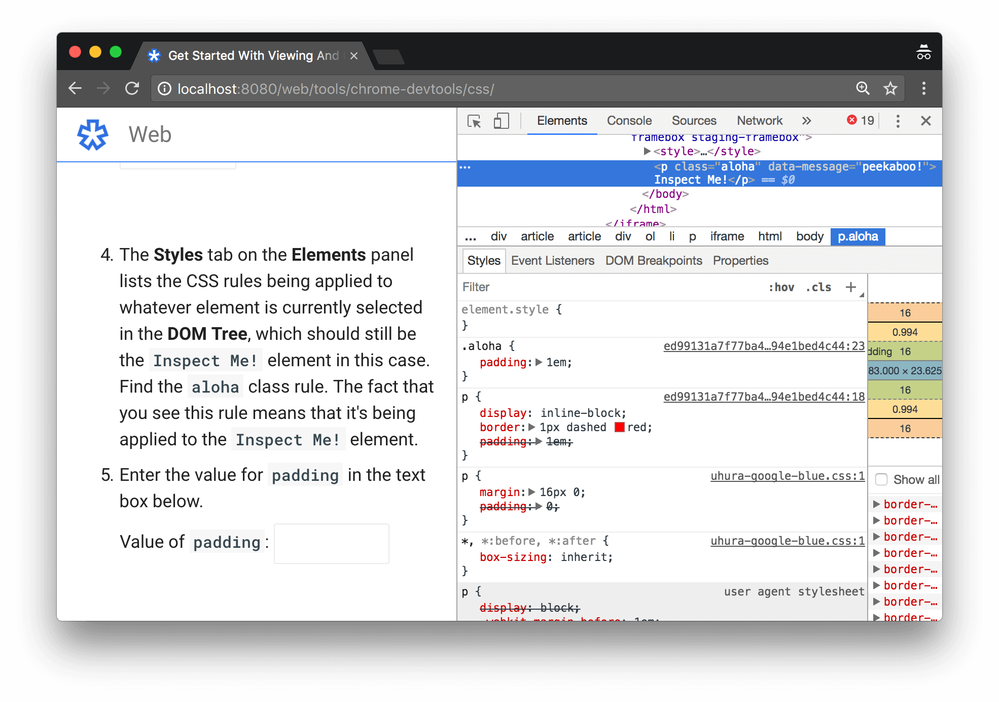
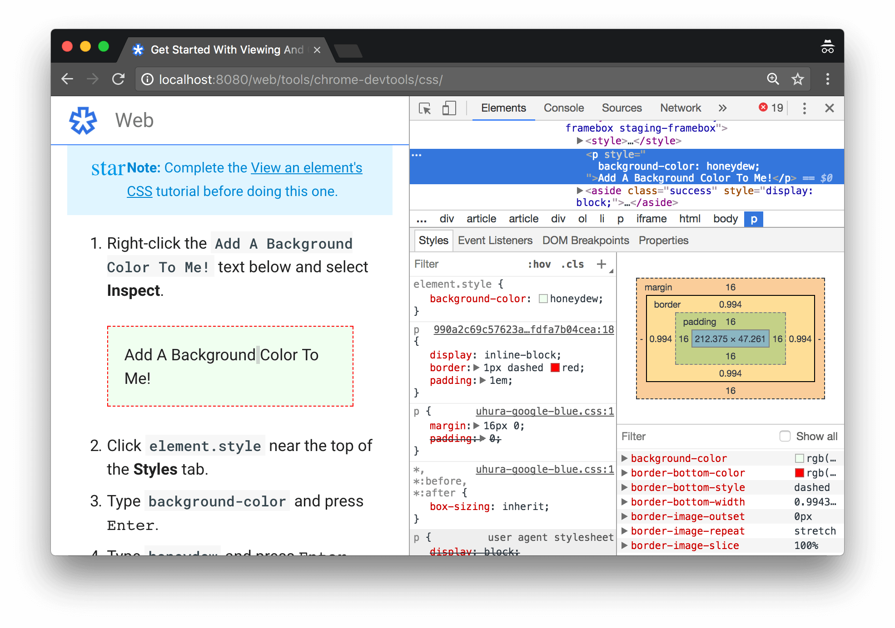
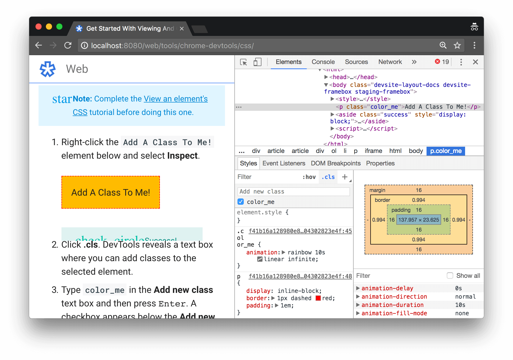

project_path: /web/tools/_project.yaml
book_path: /web/tools/_book.yaml
description: Learn how to use Chrome DevTools to view and change a page's CSS.

{# wf_updated_on: 2017-06-08 #}
{# wf_published_on: 2017-06-08 #}

# Get Started With Viewing And Changing CSS {: .page-title }



Complete these interactive tutorials to learn the basics of viewing and
changing a page's CSS using Chrome DevTools.






## View an element's CSS {: #view }

1. Right-click the `Inspect Me!` text below and select **Inspect**.
   The **Elements** panel of DevTools opens. The `Inspect Me!` element
   is highlighted in the **DOM Tree**.

     
     
     
Inspect Me!

     

1. In the **DOM Tree**, find the value of the `data-message` attribute for
   the `Inspect Me!` element.

1. Enter the value in the text box below.

     

1. The **Styles** tab on the **Elements** panel lists the CSS rules being
   applied to whatever element is currently selected in the **DOM Tree**,
   which should still be the `Inspect Me!` element in this case. Find the
   `aloha` class rule. The fact that you see this rule means that it's
   being applied to the `Inspect Me!` element.

1. The `aloha` class is declaring a value for `padding`. Enter that value
   in the text box below.

     

<figure>
  
  <figcaption>
    <b>Figure 1</b>. The inspected element is highlighted blue in the
    <b>DOM Tree</b>
  </figcaption>
</figure>

<figure>
  
  <figcaption>
    <b>Figure 2</b>. CSS classes being applied to the selected element,
    such as <code>aloha</code>, are displayed in the <b>Styles</b> tab
  </figcaption>
</figure>

## Add a CSS declaration to an element {: #declarations }

Use the **Styles** tab when you want to change or add CSS declarations
to an element.

Note: Complete the [View an element's CSS](#view) tutorial
before doing this one.

1. Right-click the `Add A Background Color To Me!` text below and select
   **Inspect**.

     

1. Click `element.style` near the top of the **Styles** tab.
1. Type `background-color` and press <kbd>Enter</kbd>.
1. Type `honeydew` and press <kbd>Enter</kbd>. In the **DOM Tree** you can
   see that an inline style declaration was applied to the element.

<figure>
  
  <figcaption>
    <b>Figure 3</b>. The <code>background-color:honeydew</code> declaration
    has been applied to the element via the <code>element.style</code> section
    of the <b>Styles</b> tab
  </figcaption>
</figure>

## Add a CSS class to an element {: #classes }

Use the **Styles** tab to see how an element looks when a CSS class is applied
to or removed from an element.

Note: Complete the [View an element's CSS](#view) tutorial
before doing this one.

1. Right-click the `Add A Class To Me!` element below and select **Inspect**.

     

1. Click **.cls**. DevTools reveals a text box where you can add classes
   to the selected element.

1. Type `color_me` in the **Add new class** text box and then press
   <kbd>Enter</kbd>. A checkbox appears below the **Add new class** text
   box, where you can toggle the class on and off. If the `Add A Class To Me!`
   element had any other classes applied to it, you'd also be able to
   toggle them from here.

<figure>
  
  <figcaption>
    <b>Figure 4</b>. The <code>color_me</code> class has been applied to the
    element via the <b>.cls</b> section of the <b>Styles</b> tab
  </figcaption>
</figure>

## Add a pseudostate to a class {: #pseudostates }

Use the **Styles** tab to permanently apply a CSS pseudostate to an
element. DevTools supports `:active`, `:focus`, `:hover`, and `:visited`.

Note: Complete the [View an element's CSS](#view) tutorial
before doing this one.

1. Hover over the `Hover Over Me!` text below. The background color changes.

     
     
     
Hover Over Me!

     

1. Right-click the `Hover Over Me!` text and select **Inspect**.
1. In the **Styles** tab, click **:hov**.
1. Check the **:hover** checkbox. The background color changes like before,
   even though you're not actually hovering over the element.

<figure>
  
  <figcaption>
    <b>Figure 5</b>. Toggling the <code>:hover</code> pseudostate on an element
  </figcaption>
</figure>

## Change the dimensions of an element {: #box-model }

Use the **Box Model** interactive diagram in the **Styles** tab to change
the width, height, padding, margin, or border length of an element.

Note: Complete the [View an element's CSS](#view) tutorial
before doing this one.

1. Right-click the `Change My Margin!` element below and select **Inspect**.

     

1. In the **Box Model** diagram in the **Styles** tab, hover over
   **padding**. The element's margin is highlighted in the viewport.

     <aside class="note"><b>Note</b>: Depending on the size of your DevTools
     window, you may need to scroll to the bottom of the <b>Styles</b> tab to
     see the <b>Box Model</b>.</aside>

1. Double-click the left margin in the **Box Model**, which currently has
   a value of `-` meaning that the element doesn't have a left-margin.

1. Type `100` and press <kbd>Enter</kbd>. The **Box Model** defaults to
   pixels, but it also accepts other values, such as `25%`, or `10vw`.

<figure>
  
  <figcaption>
    <b>Figure 6</b>. Hovering over the element's padding
  </figcaption>
</figure>

<figure>
  
  <figcaption>
    <b>Figure 7</b>. Changing the element's left-margin
  </figcaption>
</figure>
