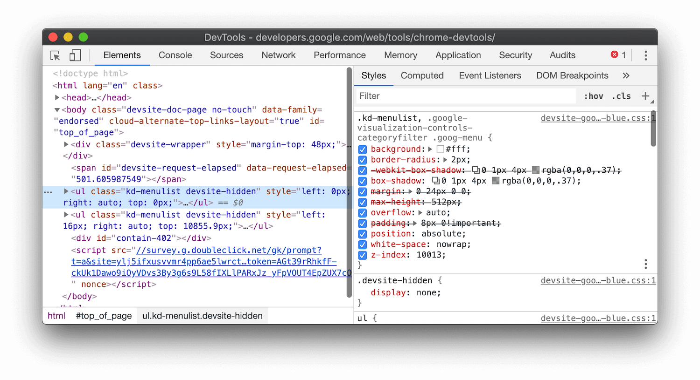
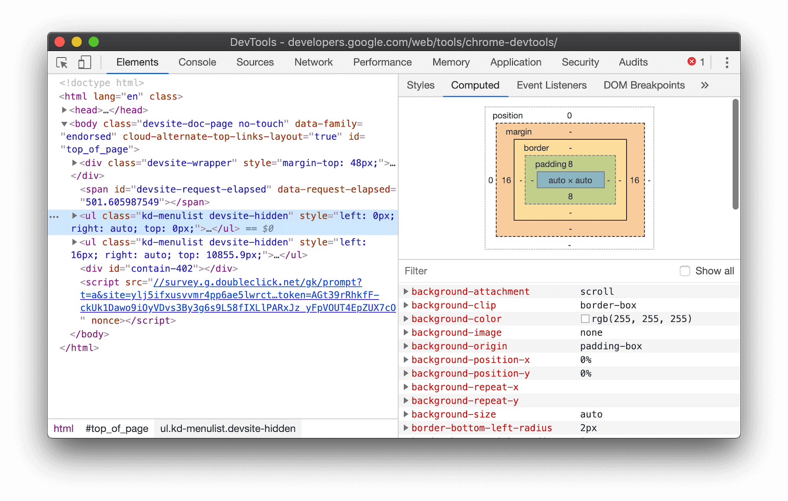
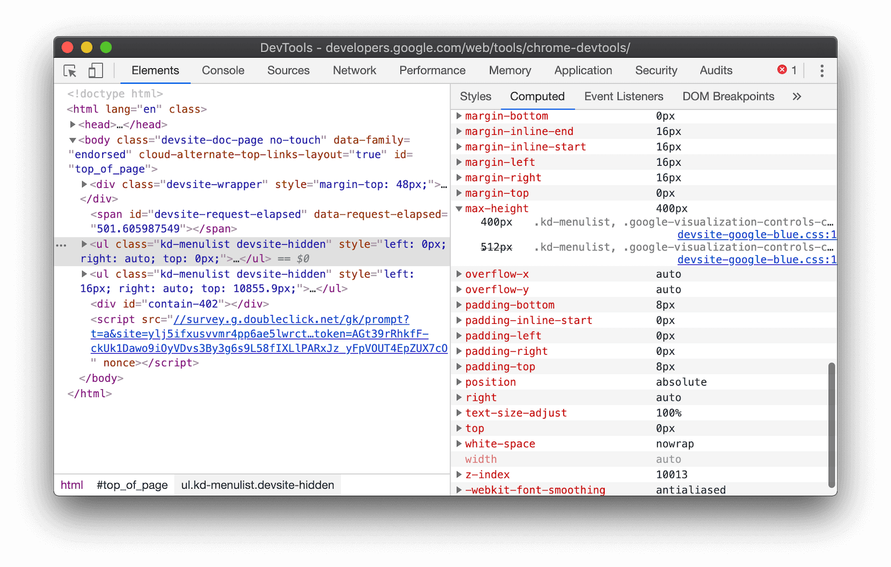
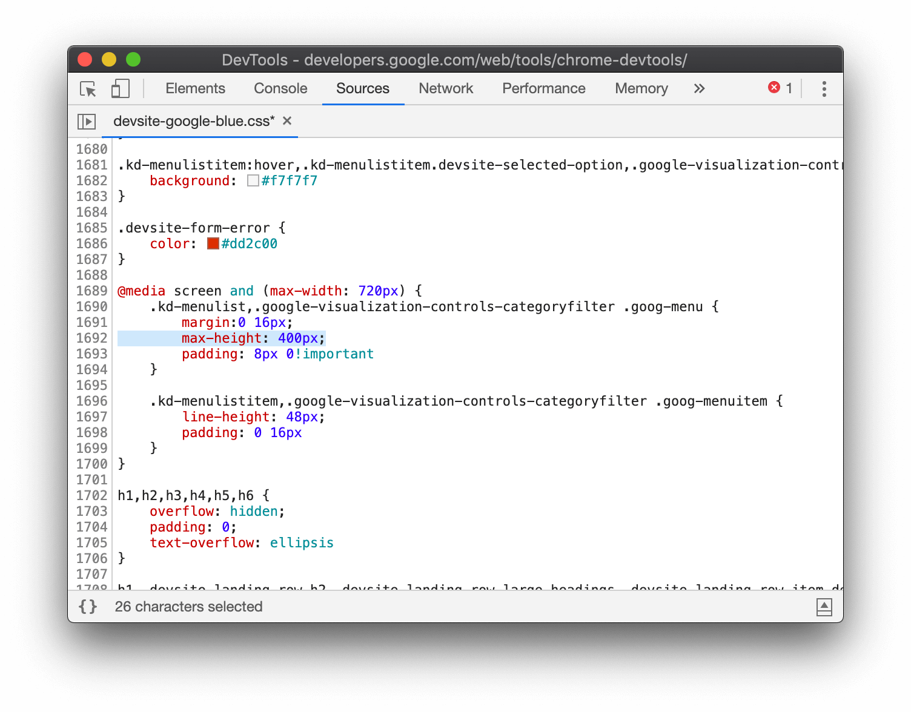
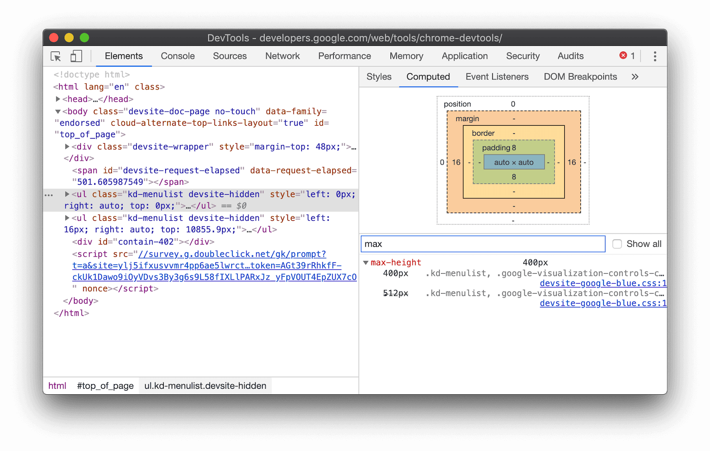

project_path: /web/tools/_project.yaml
book_path: /web/tools/_book.yaml
description: How to figure out what old CSS is causing your new CSS to not be applied properly.

{# wf_updated_on: 2019-07-11 #}
{# wf_published_on: 2019-07-11 #}
{# wf_blink_components: Platform>DevTools #}

# Find Overriding CSS Declarations In Chrome DevTools {: .page-title }



This guide assumes that you're familiar with inspecting CSS in Chrome DevTools. See
[Get Started With Viewing And Changing CSS](/web/tools/chrome-devtools/css/) to learn the
basics.

## Overview

[inspect]: /web/tools/chrome-devtools/css/reference#select
[specificity]: https://developer.mozilla.org/en-US/docs/Web/CSS/Specificity

Suppose that you just added some CSS to your nav and want to make sure the new styles are
being applied properly. When you refresh the page the nav looks the same as before. Something
is wrong. The first thing to do is [inspect the element][inspect] and make sure that your new
CSS is actually being applied to the nav. If you can see your new CSS in the Styles pane, but
your new CSS is crossed out, it means that there's some other CSS that is overriding your
new CSS. In CSS terminology this concept is called [Specificity][specificity].
Chrome DevTools can help you find the old CSS that is causing your new CSS to not be applied.

<figure>
  
  <figcaption>
    <b>Figure 1</b>. The <code>max-height: 512px</code> declaration is crossed out.
  </figcaption>
</figure>

## Find overrides in the Computed pane {: #computed }

1. From the **Elements** panel, open the **Computed** pane.

     <figure>
       
       <figcaption>
         <b>Figure 2</b>. The Computed pane.
       </figcaption>
     </figure>

1. Scroll through the list of properties and expand the one that you want to investigate further.

     <figure>
       
       <figcaption>
         <b>Figure 3</b>. Investigating the <code>max-height</code> property in the Computed pane.
       </figcaption>
     </figure>

[format]: /web/tools/chrome-devtools/javascript/reference#format

1. Click the blue link next to a declaration to jump to open the **Sources** panel and jump to
   that declaration's source code. See [Make a minified file readable][format] if the code
   is minified.

     <figure>
       
       <figcaption>
         <b>Figure 4</b>. Viewing the <code>max-height</code> declaration's source code in
         the Sources panel.
       </figcaption>
     </figure>

## Filter properties {: #filter }

If you want to focus on a specific property, type that property name in the **Filter** textbox.

<figure>
  
  <figcaption>
    <b>Figure 5</b>. Filtering out properties that do not contain <code>max</code> in the
    Computed pane.
  </figcaption>
</figure>

## Show all properties {: #all }

[ua]: https://developer.mozilla.org/en-US/docs/Web/CSS/Cascade#User-agent_stylesheets

If you want to see all properties that are being applied to the element, including 
[user-agent stylesheets][ua], enable the **Show All** checkbox.

<figure>
  
  <figcaption>
    <b>Figure 6</b>. Showing all properties in the Computed pane.
  </figcaption>
</figure>

## Feedback {: #feedback .hide-from-toc }


