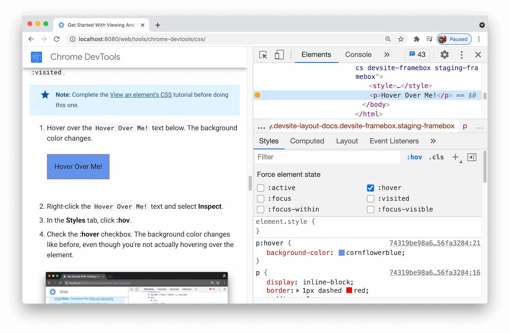

project_path: /web/tools/_project.yaml
book_path: /web/tools/_book.yaml
description: Discover new workflows for viewing and changing CSS in Chrome DevTools.

{# wf_updated_on: 2017-08-01 #}
{# wf_published_on: 2017-06-09 #}



# CSS Reference {: .page-title }



Discover new workflows in this comprehensive reference of Chrome DevTools
features related to viewing and changing CSS.

See [Get Started with Viewing and Changing CSS][GS] to learn the basics.

[GS]: /web/tools/chrome-devtools/css/

## Select an element {: #select }

The **Elements** panel of DevTools lets you view or change the CSS of one
element at a time. The selected element is highlighted blue in the
**DOM Tree**. The element's styles are shown in the **Styles** pane. See
[View an element's CSS][Tutorial] for a tutorial.

[Tutorial]: /web/tools/chrome-devtools/css/#view

<figure>
  
  <figcaption>
    <b>Figure 1</b>. The <code>h1</code> element that's highlighted blue in
    the <b>DOM Tree</b> is the selected element. To the right, the
    element's styles are shown in the <b>Styles</b> pane. To the left,
    the element is highlighted in the viewport, but only because the mouse
    is currently hovering over it in the <b>DOM Tree</b>
  </figcaption>
</figure>

There are many ways to select an element:

* In your viewport, right-click the element and select **Inspect**.
* In DevTools, click **Select an element** ![Select an
  element][select]{:.cdt-inl} or press
  <kbd>Command</kbd>+<kbd>Shift</kbd>+<kbd>C</kbd> (Mac) or
  <kbd>Control</kbd>+<kbd>Shift</kbd>+<kbd>C</kbd> (Windows, Linux), and then
  click the element in the viewport.
* In DevTools, click the element in the **DOM Tree**.
* In DevTools, run a query like `document.querySelector('p')` in the
  **Console**, right-click the result, and then select **Reveal in Elements
  panel**.

[select]: imgs/select-an-element.png

## View CSS {: #view }

### View the external stylesheet where a rule is defined {: #view-external }

In the **Styles** pane, click the link next to a CSS rule to open the
external stylesheet that defines the rule.

If the stylesheet is minified, see [Make a minified file readable][format].

[format]: /web/tools/chrome-devtools/javascript/reference#format

<figure>
  
  <figcaption>
    <b>Figure 2</b>. Clicking <code>devsite-google-blue.css:487</code>
    takes you to line 487 of <code>devsite-google-blue.css</code>,
    where the <code>.devsite-article h1:first-of-type</code> CSS rule is
    defined.
  </figcaption>
</figure>

### View only the CSS that's actually applied to an element {: #computed }

The **Styles** tab shows you all of the rules that apply to an element,
including declarations that have been overridden. When you're not
interested in overridden declarations, use the **Computed** tab to view only
the CSS that's actually being applied to an element.

1. [Select an element](#select).
1. Go to the **Computed** tab in the **Elements** panel.

Note: On a wide DevTools window, the **Computed** tab does not exist. The
contents of the **Computed** tab are shown on the **Styles** tab.

Inherited properties are opaque. Check the **Show All** checkbox to see all
inherited values.

<figure>
  
  <figcaption>
    <b>Figure 3</b>. The <b>Computed</b> tab shows the CSS properties being
    applied to the currently-selected <code>h1</code> element
  </figcaption>
</figure>

### View CSS properties in alphabetical order {: #alphabetical }

Use the **Computed** tab. See [View only the CSS that's actually applied to
an element](#computed).

### View inherited CSS properties {: #inherited }

Check the **Show All** checkbox in the **Computed** tab. See [View only the
CSS that's actually applied to an element](#computed).

### View an element's box model {: #box-model }

To view [the box model][box] of an element, go to the **Styles** tab.
If your DevTools window is narrow, the **Box Model** diagram is at the bottom
of the tab.

[box]: https://developer.mozilla.org/en-US/docs/Learn/CSS/Introduction_to_CSS/Box_model

To change a value, double-click on it.

<figure>
  
  <figcaption>
    <b>Figure 4</b>. The <b>Box Model</b> diagram in the <b>Styles</b> tab
    shows the box model for the currently selected <code>h1</code> element
  </figcaption>
</figure>

### Search and filter an element's CSS {: #filter }

Use the **Filter** text box on the **Styles** and **Computed** tabs to search
for specific CSS properties or values.

To also search inherited properties in the **Computed** tab, check the **Show
All** checkbox.

<figure>
  
  <figcaption>
    <b>Figure 5</b>. Filtering the <b>Styles</b> tab to only show
    rules that include the search query <code>color</code>
  </figcaption>
</figure>

<figure>
  
  <figcaption>
    <b>Figure 6</b>. Filtering the <b>Computed</b> tab to only show
    declarations that include the search query <code>100%</code>
  </figcaption>
</figure>

### Toggle a pseudo-class {: #pseudo-class }

To toggle a pseudo-class like `:active`, `:focus`, `:hover`, or `:visited`:

1. [Select an element](#select).
1. On the **Elements** panel, go to the **Styles** tab.
1. Click **:hov**.
1. Check the pseudo-class that you want to enable.

<figure>
  
  <figcaption>
    <b>Figure 7</b>. Toggling the <code>:hover</code> pseudo-class. In the
    viewport you can see that the
    <code>background-color: cornflowerblue</code> declaration is being
    applied to the element, even though the element is not actually being
    hovered over
  </figcaption>
</figure>

See [Add a pseudostate to a class][pseudo-tutorial] for an interactive
tutorial.

[pseudo-tutorial]: /web/tools/chrome-devtools/css/#pseudostates

### View a page in print mode {: #print-mode }

To view a page in print mode:

1. Open the [Command Menu](/web/tools/chrome-devtools/ui#command-menu).
1. Start typing `Rendering` and select `Show Rendering`.
1. For the **Emulate CSS Media** dropdown, select **print**.

## Change CSS {: #change }

<!-- todo s/CSS declaration/declaration/ -->

### Add a CSS declaration to an element {: #add-declaration }

Since the order of declarations affects how an element is styled, you can
add declarations in different ways:

* [Add a inline declaration](#add-declaration-inline). Equivalent to adding
  a `style` attribute to the element's HTML.
* [Add a declaration to a style rule](#add-declaration-to-rule).

**What workflow should you use?** For most scenarios, you probably
want to use the inline declaration workflow. Inline declarations have
higher specificity than external ones, so the inline workflow ensures that
the changes take effect in the element as you'd expect. See [Selector
Types][ST] for more on specificity.

[ST]: https://developer.mozilla.org/en-US/docs/Web/CSS/Specificity#Selector_Types

If you're debugging an element's styles and you need to specifically test
what happens when a declaration is defined in different places, use the
other workflow.

#### Add an inline declaration {: #add-declaration-inline }

To add an inline declaration:

1. [Select an element](#select).
1. In the **Styles** pane, click between the brackets of the **element.style**
   section. The cursor focuses, allowing you to enter text.
1. Enter a property name and press <kbd>Enter</kbd>.
1. Enter a valid value for that property and press <kbd>Enter</kbd>. In the
   **DOM Tree**, you can see that a `style` attribute has been added to
   the element.

<figure>
  
  <figcaption>
    <b>Figure 8</b>. The <code>margin-top</code> and
    <code>background-color</code> properties have been applied to the
    selected element. In the <b>DOM Tree</b> you can see the declarations
    reflected in the element's <code>style</code> attribute
  </figcaption>
</figure>

#### Add a declaration to a style rule {: #add-declaration-to-rule }

To add a declaration to an existing style rule:

1. [Select an element](#select).
1. In the **Styles** pane, click between the brackets of the style rule
   to which you want to add the declaration. The cursor focuses, allowing
   you to enter text.
1. Enter a property name and press <kbd>Enter</kbd>.
1. Enter a valid value for that property and press <kbd>Enter</kbd>.

<figure>
  
  <figcaption>
    <b>Figure 9</b>. Adding the <code>border-bottom-style:groove</code>
    declaration to a style rule
  </figcaption>
</figure>

### Change a declaration name or value {: #change-declaration }

Double-click a declaration's name or value to change it. See
[Change declaration values with keyboard shortcuts](#values-shortcuts)
for shortcuts for quickly incrementing or decrementing a value by 0.1,
1, 10, or 100 units.

<figure>
  
  <figcaption>
    <b>Figure 10</b>. Changing the value of the <code>border-bottom-style</code>
    declaration
  </figcaption>
</figure>

### Change declaration values with keyboard shortcuts {: #values-shortcuts }

While editing the value of a declaration, you can use the following keyboard
shortcuts to increment the value by a fixed amount:

* <kbd>Option</kbd>+<kbd>Up</kbd> (Mac) or <kbd>Alt</kbd>+<kbd>Up</kbd>
  (Windows, Linux) to increment by 0.1.
* <kbd>Up</kbd> to change the value by 1, or by 0.1 if the current value is
  between -1 and 1.
* <kbd>Shift</kbd>+<kbd>Up</kbd> to increment by 10.
* <kbd>Shift</kbd>+<kbd>Command</kbd>+<kbd>Up</kbd> (Mac) or
  <kbd>Shift</kbd>+<kbd>Page Up</kbd> (Windows, Linux) to increment the 
  value by 100.

Decrementing also works. Just replace each instance of <kbd>Up</kbd> mentioned
above with <kbd>Down</kbd>.

### Add a class to an element {: #add-class }

To add a class to an element:

1. [Select the element](#select) in the **DOM Tree**.
1. Click **.cls**.
1. Enter the name of the class in the **Add New Class** text box.
1. Press <kbd>Enter</kbd>.

<figure>
  
  <figcaption>
    <b>Figure 11</b>. The <b>Element Classes</b> pane
  </figcaption>
</figure>

### Toggle a class {: #toggle-class }

To enable or disable a class on an element:

1. [Select the element](#select) in the **DOM Tree**.
1. Open the **Element Classes** pane. See [Add a class to an
   element](#add-class). Below the **Add New Class** text box
   are all of the classes that are being applied to this element.
1. Toggle the checkbox next to the class that you want to enable or disable.

### Add a style rule {: #style-rule }

To add a new style rule:

1. [Select an element](#select).
1. Click **New Style Rule** ![New Style Rule][NSR]{:.cdt-inl}. DevTools
   inserts a new rule beneath the **element.style** rule.

[NSR]: imgs/new-style-rule.png

<figure>
  
  <figcaption>
    <b>Figure 12</b>. DevTools adds the <code>h1.devsite-page-title</code>
    style rule after clicking <b>New Style Rule</b>
  </figcaption>
</figure>

#### Choose which stylesheet to add a rule to {: #style-rule-stylesheet }

When [adding a new style rule](#style-rule), click and hold **New Style
Rule** ![New Style Rule][NSR]{:.cdt-inl} to choose which stylesheet to
add the style rule to.

<figure>
  
  <figcaption>
    <b>Figure 13</b>. Choosing a stylesheet
  </figcaption>
</figure>

#### Add a style rule to a specific location {: #style-rule-location }

To add a style rule to a specific location in the **Styles** tab:

1. Hover over the style rule that is directly above where you want to
   add your new style rule.
1. [Reveal the **More Actions** toolbar](#reveal-more-actions).
1. Click **Insert Style Rule Below** ![Insert Style Rule
   Below][ISRB]{:.cdt-inl}.

[ISRB]: imgs/new-style-rule.png

<figure>
  
  <figcaption>
    <b>Figure 14</b>. <b>Insert Style Rule Below</b>
  </figcaption>
</figure>

### Reveal the More Actions toolbar {: #reveal-more-actions }

The **More Actions** toolbar lets you: 

* Insert a style rule directly below the one you're focused on.
* Add a `background-color`, `color`, `box-shadow`, or `text-shadow`
  declaration to the style rule you're focused on.

To reveal the **More Actions** toolbar:

1. In the **Styles** tab, hover over a style rule. **More Actions**
   {:.cdt-inl} is revealed in the bottom-right of the
   style rule's section.

     <figure>
       
       <figcaption>
         <b>Figure 15</b>. After hovering over the <code>.devsite-article
         h1:first-of-type</code> style rule, <b>More Actions</b> is revealed
         in the bottom-right of the style rule's section
       </figcaption>
     </figure>

1. Hover over **More Actions** {:.cdt-inl} to reveal
   the actions mentioned above.

     <figure>
       
       <figcaption>
         <b>Figure 16</b>. The <b>Insert Style Rule Below</b> action is
         revealed after hovering over <b>More Actions</b>
       </figcaption>
     </figure>

### Toggle a declaration {: #toggle-declaration }

To toggle a single declaration on or off:

1. [Select an element](#select).
1. In the **Styles** pane, hover over the rule that defines the
   declaration. Checkboxes appear next to each declaration.
1. Check or uncheck the checkbox next to the declaration. When you
   uncheck a declaration, DevTools crosses it out to indicate that it's
   no longer active.

<figure>
  
  <figcaption>
    <b>Figure 17</b>. The <code>color</code> property for the
    currently-selected element has been toggled off
  </figcaption>
</figure>

### Add a background-color declaration {: #background-color }

To add a `background-color` declaration to an element:

1. Hover over the style rule that you want to add the `background-color`
   declaration to.
1. [Reveal the **More Actions** toolbar](#reveal-more-actions).
1. Click **Add Background Color** ![Add Background Color][ABC]{:.cdt-inl}.

[ABC]: imgs/add-background-color-icon.png

<figure>
  
  <figcaption>
    <b>Figure 18</b>. <b>Add Background Color</b>
  </figcaption>
</figure>

### Add a color declaration {: #color }

To add a `color` declaration to an element:

1. Hover over the style rule that you want to add the `color`
   declaration to.
1. [Reveal the **More Actions** toolbar](#reveal-more-actions).
1. Click **Add Color** ![Add Color][AC]{:.cdt-inl}.

[AC]: imgs/add-color-icon.png

<figure>
  
  <figcaption>
    <b>Figure 19</b>. <b>Add Color</b>
  </figcaption>
</figure>

### Add a box-shadow declaration {: #box-shadow }

To add a `box-shadow` declaration to an element:

1. Hover over the style rule that you want to add the `box-shadow`
   declaration to.
1. [Reveal the **More Actions** toolbar](#reveal-more-actions).
1. Click **Add Box Shadow** ![Add Box Shadow][ABS]{:.cdt-inl}.

[ABS]: imgs/add-box-shadow-icon.png

<figure>
  
  <figcaption>
    <b>Figure 20</b>. <b>Add Box Shadow</b>
  </figcaption>
</figure>

### Add a text-shadow declaration {: #text-shadow }

To add a `text-shadow` declaration to an element:

1. Hover over the style rule that you want to add the `text-shadow`
   declaration to.
1. [Reveal the **More Actions** toolbar](#reveal-more-actions).
1. Click **Add Text Shadow** ![Add Text Shadow][ATS]{:.cdt-inl}.

[ATS]: imgs/add-text-shadow-icon.png

<figure>
  
  <figcaption>
    <b>Figure 21</b>. <b>Add Text Shadow</b>
  </figcaption>
</figure>

### Change colors with the Color Picker {: #color-picker }

The **Color Picker** provides a GUI for changing `color` and
`background-color` declarations.

To open the **Color Picker**:

1. [Select an element](#select).
1. In the **Styles** tab, find the `color` or `background-color` declaration
   that you want to change. To the left of the `color` or `background-color`
   value, there is a small square which is a preview of the color.

     <figure>
       
       <figcaption>
         <b>Figure 22</b>. The small blue square to the left of
         <code>rgb(123, 170, 247)</code> is a preview of that color
       </figcaption>
     </figure>

1. Click the preview to open the **Color Picker**.

     <figure>
       
       <figcaption>
         <b>Figure 23</b>. The <b>Color Picker</b>
       </figcaption>
     </figure>

Here's a description of each of the UI elements of the **Color Picker**:

<figure>
  
  <figcaption>
    <b>Figure 24</b>. The <b>Color Picker</b>, annotated
  </figcaption>
</figure>

1. **Shades**.
1. **Eyedropper**. See [Sample a color off the page with the
   Eyedropper](#eyedropper).
1. **Copy To Clipboard**. Copy the **Display Value** to your clipboard.
1. **Display Value**. The RGBA, HSLA, or Hex representation of the color.
1. **Color Palette**. Click one of these squares to change the color to
   that square.
1. **Hue**.
1. **Opacity**.
1. **Display Value Switcher**. Toggle between the RGBA, HSLA, and Hex
   representations of the current color.
1. **Color Palette Switcher**. Toggle between the [Material Design
   palette][MD], a custom palette, or a page colors palette. DevTools
   generates the page color palette based on the colors that it finds in your
   stylesheets.

[MD]: https://material.io/guidelines/style/color.html#color-color-palette

#### Sample a color off the page with the Eyedropper {: #eyedropper }

When you open the **Color Picker**, the **Eyedropper**
![Eyedropper][Eyedropper]{:.cdt-inl} is on by default. To
change the selected color to some other color on the page:

[Eyedropper]: imgs/eyedropper-icon.png

1. Hover over the target color in the viewport.
1. Click to confirm.

     <figure>
       
       <figcaption>
         <b>Figure 25</b>. The <b>Color Picker</b> shows a current color
         value of <code>#212121</code>, which is close to black. This
         color would change to the blue that's currently highlighted in
         the viewport once the blue was clicked
       </figcaption>
     </figure>
