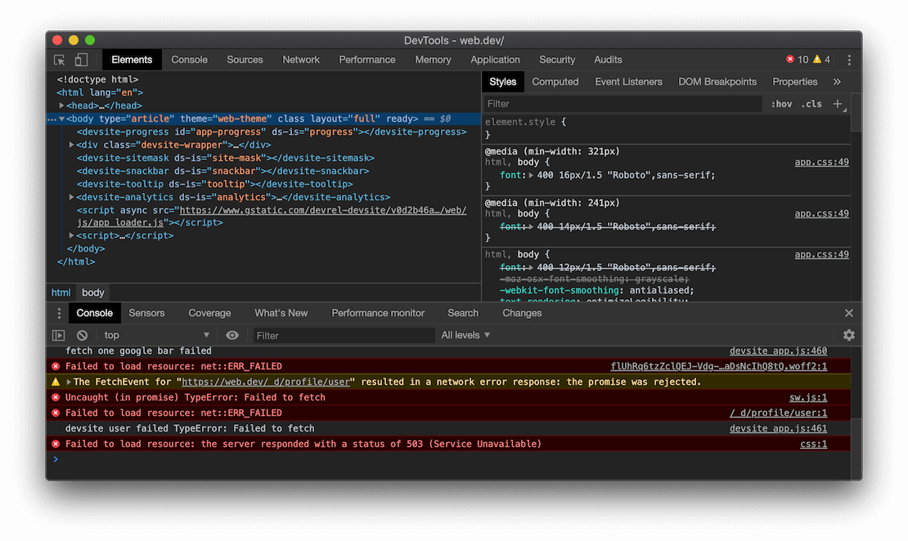
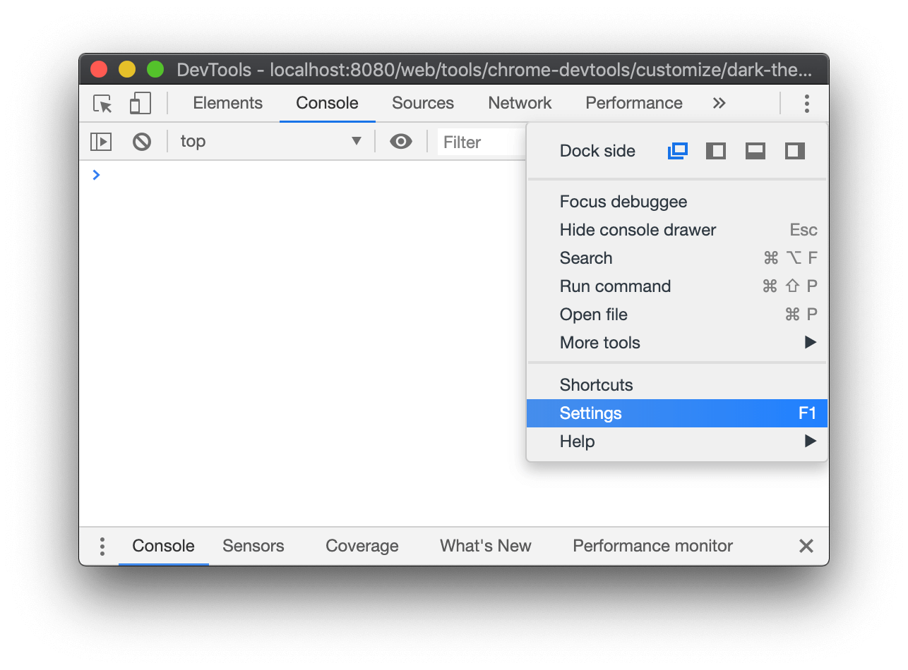
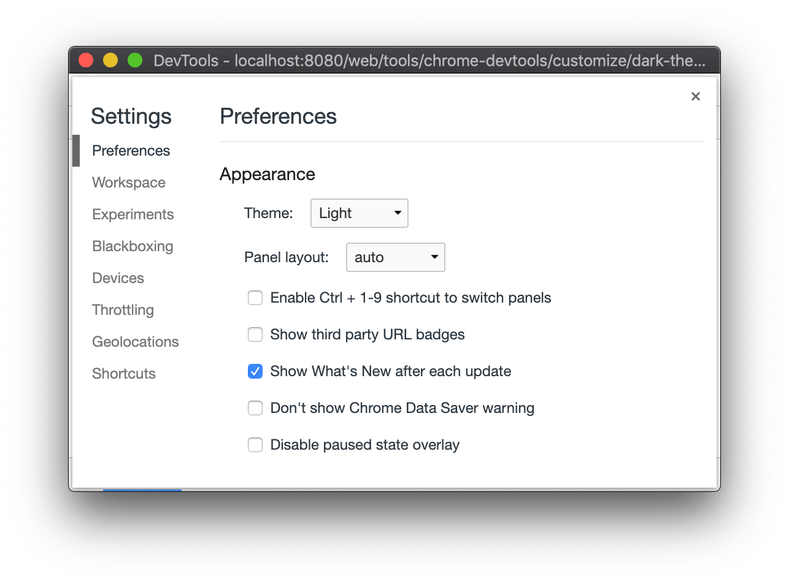
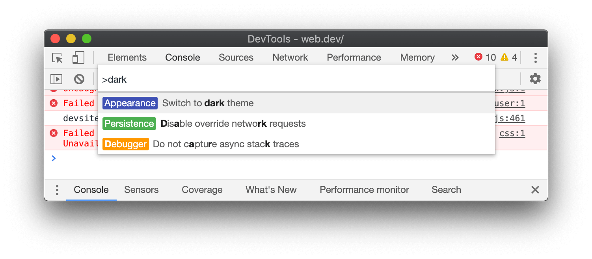

project_path: /web/tools/_project.yaml
book_path: /web/tools/_book.yaml
description: How to turn on the dark theme in Chrome DevTools.

{# wf_updated_on: 2019-05-03 #}
{# wf_published_on: 2019-05-03 #}
{# wf_blink_components: Platform>DevTools #}

# Enable Dark Theme In Chrome DevTools {: .page-title }



You can enable dark theme in [Settings](#settings) or the [Command Menu](#commandmenu).

<figure>
  
  <figcaption>
    <b>Figure 1</b>. The dark theme.
  </figcaption>
</figure>

## Set up dark theme from Settings {: #settings }

[icon]: /web/tools/chrome-devtools/images/shared/main-menu.png

1. Click **Customize And Control DevTools** ![Customize And Control
   DevTools][icon]{: .inline-icon } and then select **Settings**. You can also open
   **Settings** by pressing <kbd>F1</kbd>.

     <figure>
       
       <figcaption>
         <b>Figure 2</b>. Opening Settings.
       </figcaption>
     </figure>

1. Under **Preferences** > **Appearance** > **Theme** select **Dark**.

     <figure>
        Preferences."/>
       <figcaption>
         <b>Figure 3</b>. <b>Settings</b> > <b>Preferences</b>.
       </figcaption>
     </figure>

## Set up dark theme from the Command Menu {: #commandmenu }

1. [Open the Command Menu](/web/tools/chrome-devtools/command-menu/).
1. Start typing `dark`, select the **Switch To Dark Theme** command, and then press
   <kbd>Enter</kbd> to run the command.

<figure>
  
  <figcaption>
    <b>Figure 4</b>. The dark theme command.
  </figcaption>
</figure>

## Feedback {: #feedback }


