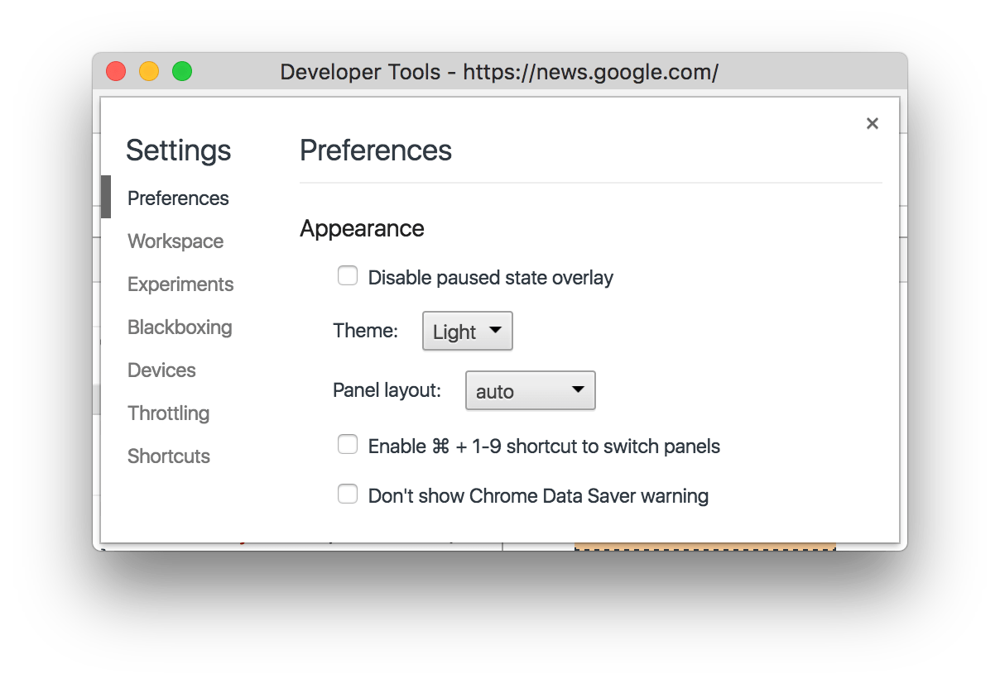
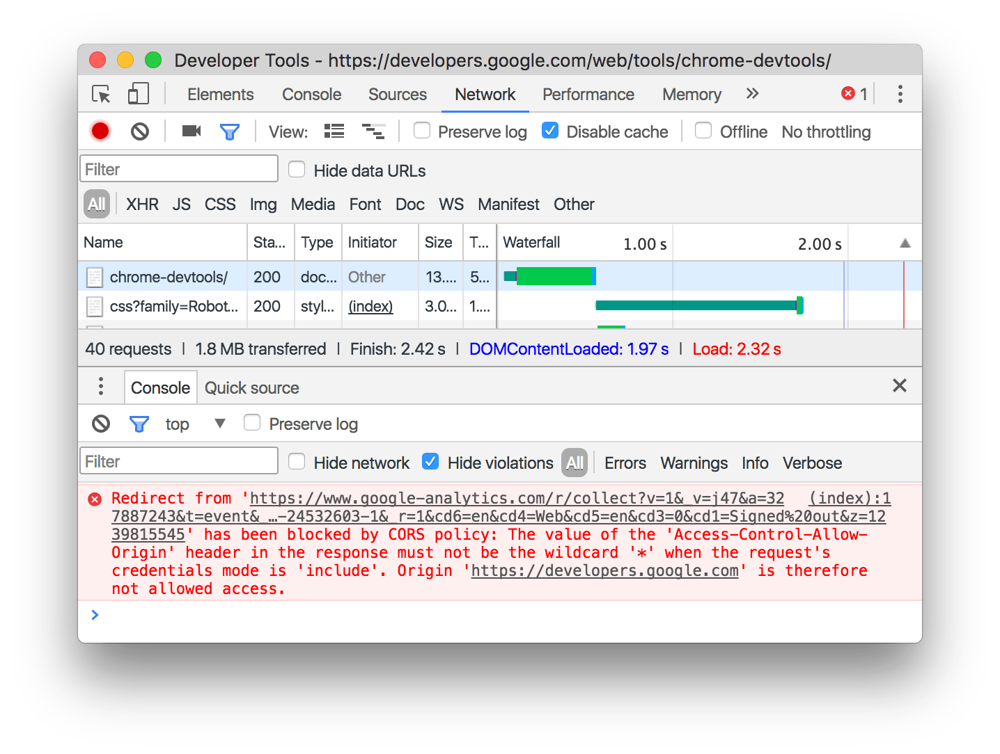
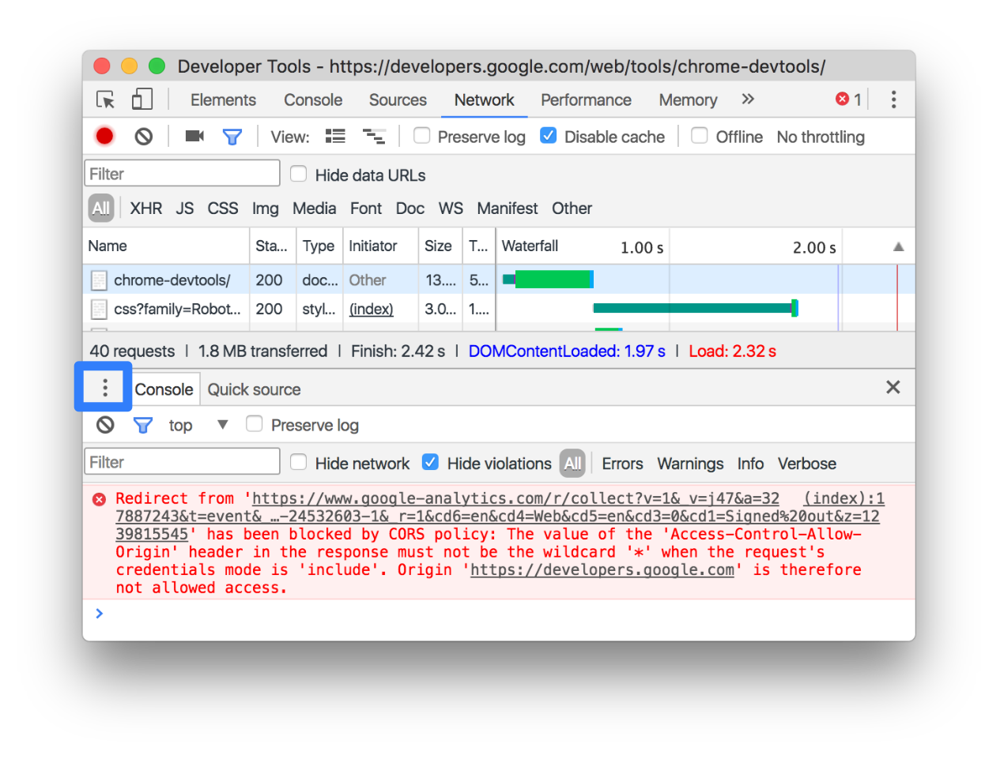
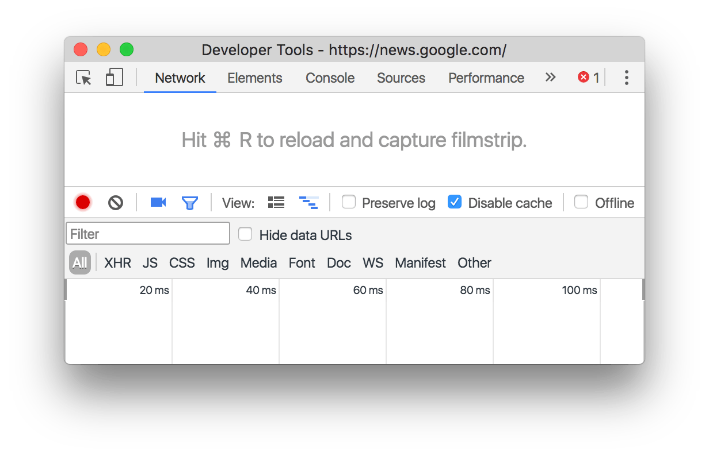

project_path: /web/tools/_project.yaml
book_path: /web/tools/_book.yaml
description: A list of ways you can customize Chrome DevTools.

{# wf_updated_on: 2019-05-14 #}
{# wf_published_on: 2019-05-02 #}
{# wf_blink_components: Platform>DevTools #}

# Customize Chrome DevTools {: .page-title }



This page lists the ways you can customize Chrome DevTools.

## Settings {: #settings }

**Settings** > **Preferences** contains many options for customizing DevTools.

To open Settings, do one of the following:

* Press <kbd>F1</kbd> while DevTools is in focus.
* Open the [Main Menu](#main-menu) and then select **Settings**.

<figure>
  
  <figcaption>
    <b>Figure 1</b>. Settings.
  </figcaption>
</figure>

## Drawer {: #drawer }

The **Drawer** contains many hidden features.

Press <kbd>Escape</kbd> to open or close the Drawer.

<figure>
  
  <figcaption>
    <b>Figure 2</b>. The Drawer.
  </figcaption>
</figure>

Click **More** {: .inline-icon } to open other
Drawer tabs.

<figure>
  
  <figcaption>
    <b>Figure 3</b>: The button for opening Drawer tabs, outlined in blue.
  </figcaption>
</figure>

## Reorder panels {: #reorder }

Click and drag a panel tab to change its ordering. Your custom tab order
persists across DevTools sessions.

<figure>
  
  <figcaption>
    <b>Figure 4</b>: A DevTools window with a custom tab ordering. By default,
    the Network panel tab is usually the fourth from the left. In the
    screenshot, it's the first from the left.
  </figcaption>
</figure>

## Change DevTools placement {: #placement }

See [Chrome DevTools Placement](placement).

<figure>
  
  <figcaption>
    <b>Figure 5</b>. Undocked DevTools.
  </figcaption>
</figure>

## Dark theme {: #dark-theme }

See [Enable Dark Theme](dark-theme).

<figure>
  
  <figcaption>
    <b>Figure 6</b>. The dark theme.
  </figcaption>
</figure>

## Experiments {: #experiments }

To enable DevTools experiments:

1. Go to `chrome://flags/#enable-devtools-experiments`.
1. Click **Enable**.
1. Click **Relaunch Now**, at the bottom of the page.

The next time you open DevTools, there's a new page called **Experiments**
in [Settings](#settings).

## Feedback {: #feedback }


