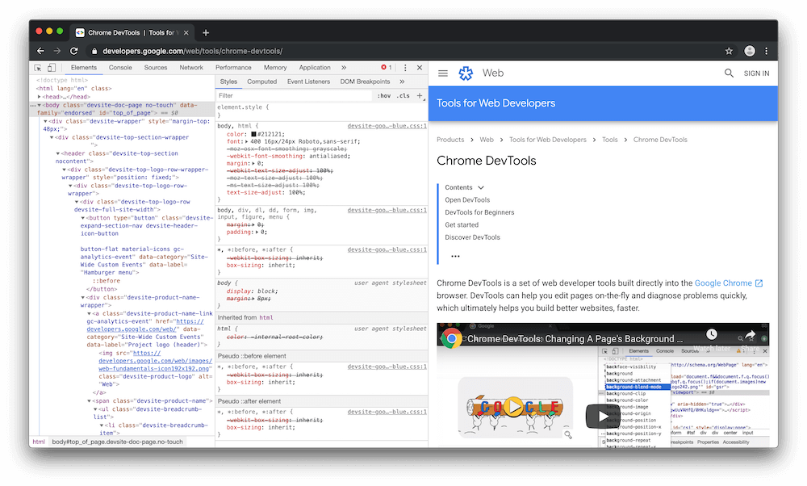

project_path: /web/tools/_project.yaml
book_path: /web/tools/_book.yaml
description: How to move Chrome DevTools to the bottom or left of your viewport, or to a separate window.

{# wf_updated_on: 2019-05-14 #}
{# wf_published_on: 2019-05-14 #}
{# wf_blink_components: Platform>DevTools #}

# Change Chrome DevTools Placement (Undock, Dock To Bottom, Dock To Left) {: .page-title }



By default DevTools is docked to the right of your viewport. You can also dock
to bottom, dock to left, or undock to a DevTools to a separate bottom.

<figure>
  
  <figcaption>
    <b>Figure 1</b>. Dock To Left.
  </figcaption>
</figure>

<figure>
  
  <figcaption>
    <b>Figure 2</b>. Dock To Bottom.
  </figcaption>
</figure>

<figure>
  
  <figcaption>
    <b>Figure 3</b>. Undocked.
  </figcaption>
</figure>

## Change placement from the main menu {: #menu }

[mainmenu]: /web/tools/chrome-devtools/images/shared/main-menu.png
[undock]: images/undockicon.png
[bottom]: images/bottomicon.png
[left]: images/lefticon.png

1. Click **Customize And Control DevTools** ![Customize And Control
   DevTools][mainmenu]{: .inline-icon } and select **Undock Into Separate
   Window** ![Undock][undock]{: .inline-icon }, **Dock To Bottom**
   ![Dock To Bottom][bottom]{: .inline-icon }, or **Dock To Left**
   ![Dock To Left][left]{: .inline-icon }.

     <figure>
       
       <figcaption>
         <b>Figure 4</b>. Selecting <b>Undock Into Separate Window</b>.
       </figcaption>
     </figure>

## Change placement from the Command Menu {: #commandmenu }

1. [Open the Command Menu](/web/tools/chrome-devtools/command-menu/).
1. Run one of the following commands: `Dock To Bottom`, `Undock Into Separate Window`.
   Currently there is no command for docking to left, but you can access it from the
   [main menu](#menu).

     <figure>
       
       <figcaption>
         <b>Figure 5</b>. The undock command.
       </figcaption>
     </figure>

## Feedback {: #feedback }


