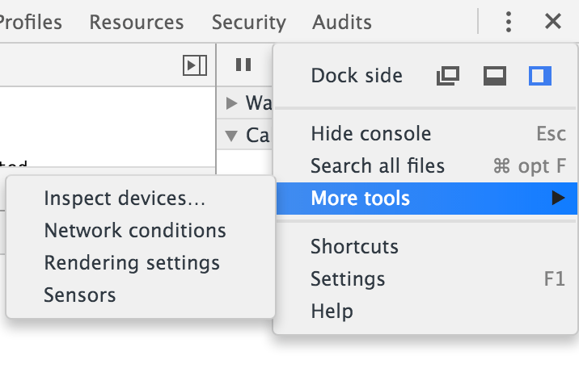
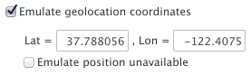
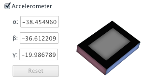

project_path: /web/tools/_project.yaml
book_path: /web/tools/_book.yaml
description: Touch screens, GPS chips, and accelerometers can be difficult to test since most desktops don't have them. The Chrome DevTools sensor emulators reduce the overhead of testing by emulating common mobile device sensors.

{# wf_updated_on: 2016-03-07 #}
{# wf_published_on: 2015-04-13 #}

# Emulate Sensors: Geolocation and Accelerometer {: .page-title }




GPS chips and accelerometers can be difficult to test since most desktops don't have them. The Chrome DevTools Sensors emulation pane reduces the overhead of testing by emulating common mobile device sensors.

### TL;DR {: .hide-from-toc }
- Emulate geolocation coordinates to test geolocation overrides.
- Simulate device orientation to test accelerometer data.

## Access sensor controls

  

    
To access the Chrome DevTools sensor controls:

    <ol>
      <li>Open the DevTools main menu, then</li>
      <li>Under <strong>More Tools</strong>, click on <strong>Sensors</strong></li>
    </ol>
  

  

    
  

Note: If your app detects sensors onload using JavaScript (such as Modernizr), make sure that you reload the page after enabling sensor emulators.

## Override geolocation data

Unlike desktops, mobile devices commonly use GPS hardware to detect location. In the Sensors pane, you can simulate geolocation coordinates to use with the <a href='http://www.w3.org/TR/geolocation-API/'>Geolocation API</a>.

  

    
Enable the geolocation emulation by selecting the <strong>Emulate geolocation coordinates</strong> checkbox in the sensors pane of the emulation drawer.

  

  

    
  

You can use this emulator to override position values for `navigator.geolocation`, as well as to simulate cases when geolocation data is unavailable.

## Emulate Accelerometer (Device Orientation)

  

    
To test accelerometer data coming from the <a href='http://www.w3.org/TR/screen-orientation/'>Orientation API</a>, enable the accelerometer emulator by selecting the <strong>Accelerometer</strong> checkbox in the Sensors pane.

  

  

    
  

You can manipulate the following orientation parameters:

<dl>
<dt><abbr title="alpha">α</abbr></dt>
<dd>Rotation around the z-axis.</dd>
<dt><abbr title="beta">β</abbr></dt>
<dd>Left-to-right tilt.</dd>
<dt><abbr title="gamma">γ</abbr></dt>
<dd>Front-to-back tilt.</dd>
</dl>

You can also click and drag the model accelerometer to the desired orientation.

Try out the accelerometer emulator using this [device orientation demo](http://googlesamples.github.io/web-fundamentals/fundamentals/native-hardware/device-orientation/dev-orientation.html).

