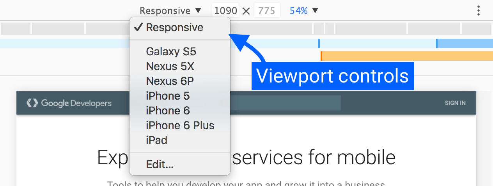
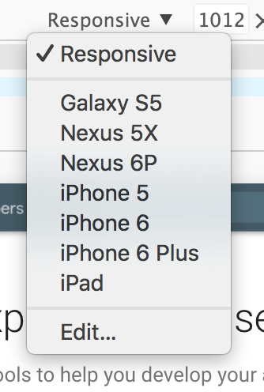
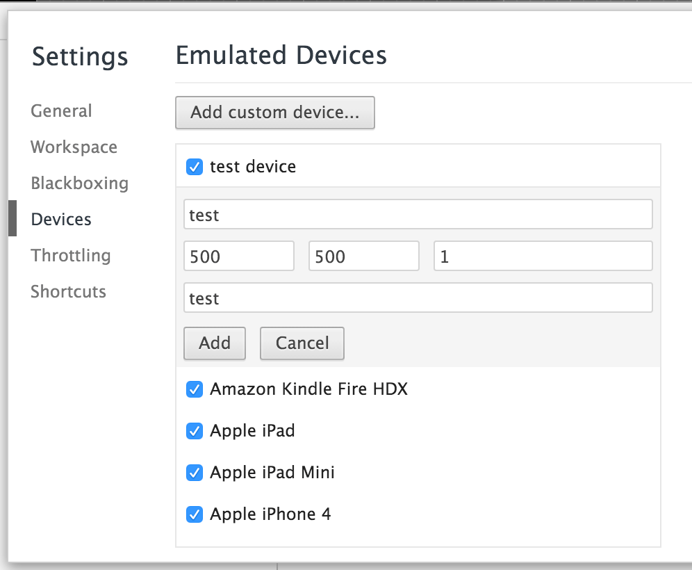
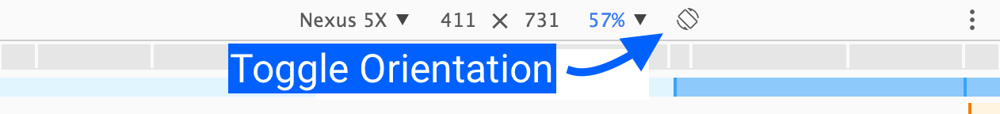
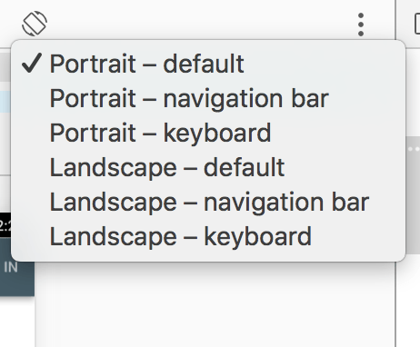
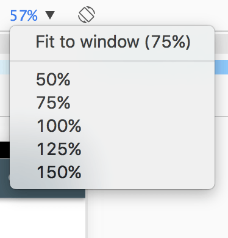
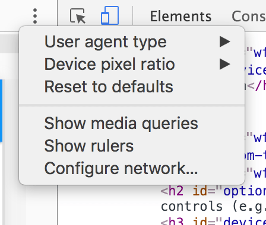
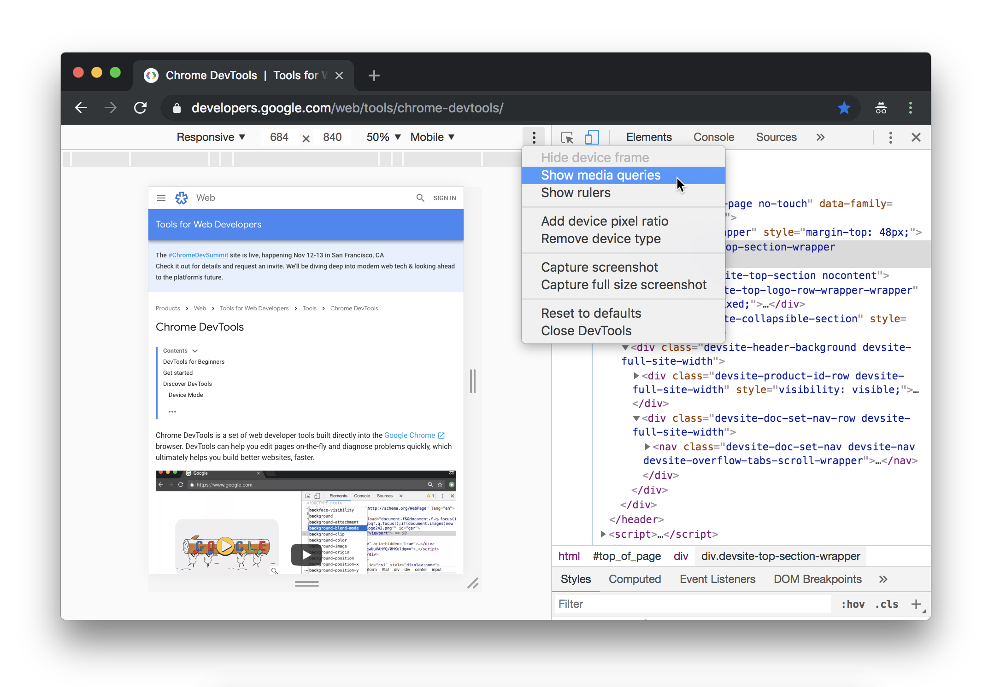
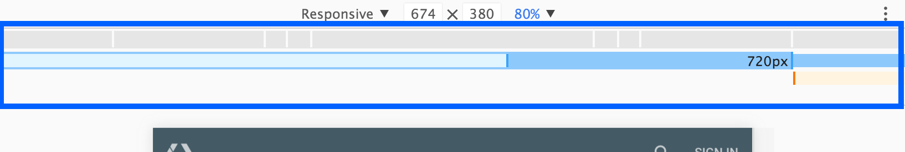
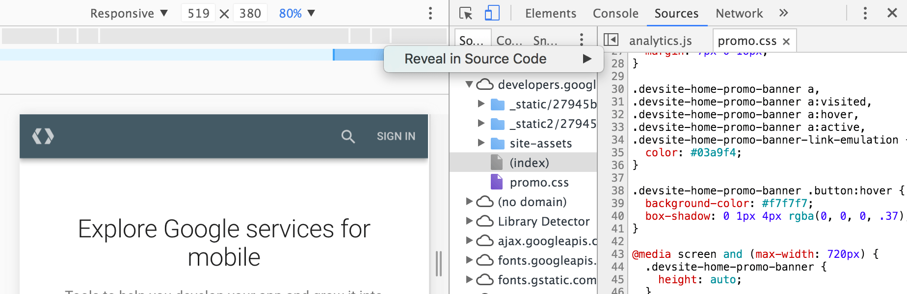

project_path: /web/tools/_project.yaml
book_path: /web/tools/_book.yaml
description: Chrome DevTools' Device Mode lets you mimic how your development  site will look in production on a range of devices.

{# wf_updated_on: 2016-03-07 #}
{# wf_published_on: 2015-04-13 #}
{# wf_blink_components: Platform>DevTools #}

# Test Responsive and Device-specific Viewports {: .page-title }





The updated Device Mode (since Chrome 49) is an integral part of the now-mobile-first DevTools and 
extends the main DevTools bar. Learn how to use its controls to simulate a wide range of devices or 
go fully responsive.

### TL;DR {: .hide-from-toc }
- Test your site's responsiveness using the Device Mode's screen emulator.
- Save custom presets so you can easily access them later.
- Device mode isn't a replacement for real device testing. Be aware of  its limitations.

## Using the viewport controls {: #viewport-controls }

The Viewport Controls allow you to test your site against a variety of devices, as well as fully 
responsively. It comes in two modes:

  1. **Responsive**. Makes the Viewport freely resizable via big handles on either side. 
  2. **Specific Device**. Locks the Viewport to the exact viewport size of a specific device and emulates certain device characteristics.

## Responsive mode

We recommend using the **Responsive Mode** as your default work mode. Use it during active 
development of your site and app and resize the viewport often to create a freely responsive design 
that adapts to even unknown and future device types.

To get the most out of the Responsive Mode, turn on the [Media Queries Bar](#media-queries).

### Customize the viewport size

Either drag the big resize handles on the viewport or click into the values in the menu bar for 
finer grained control.

## Device-specific mode

Use the **Device-specific Mode** when you're nearing the end of active development and want to 
perfect how your site looks like on specific mobiles (e.g. a certain iPhone or Nexus).

### Built-in device presets

  

  
We've included the currently most popular devices in the device dropdown. After selecting 
    a device, each preset automatically configures emulation of certain device characteristics:

  <ul>
    <li>Sets the correct "User Agent" (UA) string.</li>
    <li>Sets the device resolution and DPI (device pixel ratio).</li>
    <li>Emulates touch events (if applicable).</li>
    <li>Emulates mobile scrollbar overlays and meta viewport.</li>
    <li>Autosizes (boosts) text for pages without a defined viewport.</li>
  </ul>
  

  

    
  

### Adding custom device presets

Device Mode offers a wide array of devices for emulation. You can add a 
custom device if you find an edge-case or niche device that isn't covered. 

  

  
To add a custom device:

  <ol>
    <li>Go to DevTools Settings.</li>
    <li>Click the <strong>Devices</strong> tab.</li>
    <li>Click <strong>Add custom device</strong>.</li>
    <li>Enter a device name, width, height, device pixel ratio, and 
     user agent string.</li>
     <li>Click <strong>Add</strong>.</li>
  </ol>
  
Your custom device is now available in the <strong>Device</strong> dropdown menu.

  

  

    
  

### Device states and orientation

When emulating a specific device, the Device Mode toolbar shows an additional control that primarily
 serves as a way to toggle the orientation between landscape and portrait.

  

    
On selected devices, the control does more than just orientation toggling. For supported 
      devices like the Nexus 5X, you'll get a dropdown that allows you to emulate certain device 
      states, like:

    <ul>
      <li>Default browser UI</li>
      <li>With Chrome navigation bar</li>
      <li>With opened keyboard</li>
    </ul>
  

  

    
  

### Zoom to fit  

  

  
Sometimes you'll want to test a device that has a resolution larger than the actual available 
    space in your browser window. In these cases, the <strong>Zoom to Fit</strong> option comes in 
    handy:

  <ol>
    <li>
      <strong>Fit to Window</strong> will automatically set the zoom level to the maximum available 
      space.
    </li>
    <li>
      <strong>Explicit percentages</strong> are useful if you want to test DPI on images, 
      for instance.
    </li>
  </ol>
  

  

    
  

## Optional controls (e.g. touch, media queries, DPR)

  

  
Optional controls can be changed or enabled by clicking on the three little dots on the right 
    side of the device toolbar. Current options include

  <ul>
    <li>User agent type (Emulates UA and touch events)</li>
    <li>Device pixel ratio</li>
    <li>Media Queries</li>
    <li>Rulers</li>
    <li>Configure Network (UA, Network Throttling)</li>
  </ul>
  

  

    
  

Read on to learn more about the specific options.

### User agent type

The **User Agent Type**, or Device Type, setting let's you change the type of
the device. Possible values are:

  1. Mobile
  2. Desktop
  3. Desktop with touch

Changing this setting will influence mobile viewport and touch event emulation
and change the UA string. So if you'd like to create a responsive site for
Desktop and want to test hover effects, switch to "Desktop" in Responsive Mode.

**Tip**: You can also set the user agent in the [**Network conditions**][nc] 
drawer.

### Device pixel ratio (DPR)

If you want to emulate a Retina device from a non-Retina machine or vice 
versa, adjust the **Device pixel ratio**. The **device pixel 
ratio** (DPR) is the ratio between logical pixels and physical pixels. 
Devices with Retina displays, such as the Nexus 6P, have higher pixel density 
than standard devices, which can affect the sharpness and size of visual 
content.

Some examples of "Device Pixel Ratio" (DPR) sensitivity on the web are:

* CSS media queries such as:

      @media (-webkit-min-device-pixel-ratio: 2), 
             (min-resolution: 192dpi) { ... }

* CSS [image-set](http://dev.w3.org/csswg/css-images/#image-set-notation) 
  rules.

* The [srcset](/web/fundamentals/design-and-ux/responsive/images#images-in-markup) 
  attribute on images.

* The `window.devicePixelRatio` property.

If you have a native Retina display, you'll notice that low "Dots Per Inch" 
(DPI) assets look pixelated while higher-DPI assets are sharp. To simulate 
this effect on a standard display, set the DPR to 2 and scale the viewport 
by zooming. A 2x asset will continue to look sharp, while a 1x one will look 
pixelated.

### Media queries {: #media-queries }

[Media queries](/web/fundamentals/design-and-ux/responsive/#use-media-queries)
are an essential part of responsive web design.To view the media query inspector,
click **Show Media queries** in the three dot menu. The DevTools detect media
queries in your stylesheets and display them as colored bars in the top ruler.

Media queries are color-coded as follows:

<table id="colortable">
  <tbody>
    <tr>
      <td class="max-width"></td>
      <td>Queries targeting a maximum width.</td>
    </tr>
    <tr>
      <td class="max-and-min"></td>
      <td>Queries targeting widths within a range.</td>
    </tr>
    <tr>
      <td class="min-width"></td>
      <td>Queries targeting a minimum width.</td>
    </tr>
  </tbody>
</table>

#### Quickly preview a media query

Click a media query bar to adjust the viewport size and preview styles for the
targeted screen sizes.

#### View associated CSS

Right-click a bar to view where the media query is defined in CSS and jump to
the definition in source code.

### Rulers

Toggle this option to show pixel-based rulers next to the viewport.

### Configure network (UA, network throttling) {: #network }

Selecting this option opens the [Network Conditions drawer][nc], where you can
change the following network behaviors:

  1. **Disk Cache**: Disable Disk Cache stops pages and their assets from being
     cached by the browser while the DevTools are open.
  2. **Network Throttling**: Simulate slow network connections.
  3. **User Agent**: Allows you to set a specific UA (User Agent) string
     override.

[nc]: /web/tools/chrome-devtools/network-performance/reference#network-conditions

## Limitations

Device Mode has some limitations.

* **Device hardware**
    * GPU and CPU behavior are not emulated.
* **Browser UI**
    * System displays, such as the address bar, are not emulated.
    * Native displays, such as `<select>` elements, are not emulated as a modal list.
    * Some enhancements, such as number inputs opening a keypad, might vary from actual device 
    behavior.
* **Browser functionality**
    * WebGL operates in the emulator, but is not supported on iOS 7 devices.
    * MathML is not supported in Chrome, but is supported on iOS 7 devices.
    * The [iOS 5 orientation zoom bug](https://github.com/scottjehl/device-bugs/issues/2) is not emulated.
    * The line-height CSS property operates in the emulator, but is not supported in Opera Mini.
    * CSS rule limits, such as those in [Internet Explorer](http://blogs.msdn.com/b/ieinternals/archive/2011/05/14/10164546.aspx), are not emulated.
* **AppCache**
    * The emulator does not override the <abbr title="User Agent">UA</abbr> for AppCache [manifest files](https://code.google.com/p/chromium/issues/detail?id=334120) or [view source requests](https://code.google.com/p/chromium/issues/detail?id=119767).

Despite these limitations, the Device Mode is robust enough for most tasks. 
When you need to test on a real device, you can use 
[Remote Debugging](/web/tools/chrome-devtools/debug/remote-debugging) 
for additional insight.

