project_path: /web/tools/chrome-devtools/_project.yaml
book_path: /web/tools/chrome-devtools/_book.yaml
description: Use virtual devices in Chrome's Device Mode to build mobile-first websites.

{# wf_updated_on: 2020-07-10 #}
{# wf_published_on: 2015-04-13 #}
{# wf_blink_components: Platform>DevTools #}

[capture]: /web/tools/chrome-devtools/images/shared/capture-settings.png
[customize]: /web/tools/chrome-devtools/images/shared/customize-and-control-devtools.png

# Simulate Mobile Devices with Device Mode in Chrome DevTools {: .page-title }



Use Device Mode to approximate how your page looks and performs on a mobile device.

Device Mode is the name for the loose collection of features in Chrome DevTools that
help you simulate mobile devices. These features include:

* [Simulating a mobile viewport](#viewport)
* [Throttling the network](#network)
* [Throttling the CPU](#cpu)
* [Simulating geolocation](#geolocation)
* [Setting orientation](#orientation)

## Limitations {: #limitations }

Think of Device Mode as a [first-order approximation][approximation]{:.external} of how your
page looks and feels on a mobile device. With Device Mode you don't actually run your code
on a mobile device. You simulate the mobile user experience from your laptop or desktop.

[approximation]: https://en.wikipedia.org/wiki/Order_of_approximation#First-order

There are some aspects of mobile devices that DevTools will never be able to simulate. For
example, the architecture of mobile CPUs is very different than the architecture of laptop
or desktop CPUs. When in doubt, your best bet is to actually run your page on a mobile device. 
Use [Remote Debugging](/web/tools/chrome-devtools/remote-debugging/) to view, change, debug,
and profile a page's code from your laptop or desktop while it actually runs on a mobile device.

## Simulate a mobile viewport {: #viewport }

Click **Toggle Device Toolbar** ![Toggle Device Toolbar][TDB]{: .inline-icon } to open the UI that
enables you to simulate a mobile viewport.

[TDB]: /web/tools/chrome-devtools/images/shared/toggle-device-toolbar.png

<figure>
  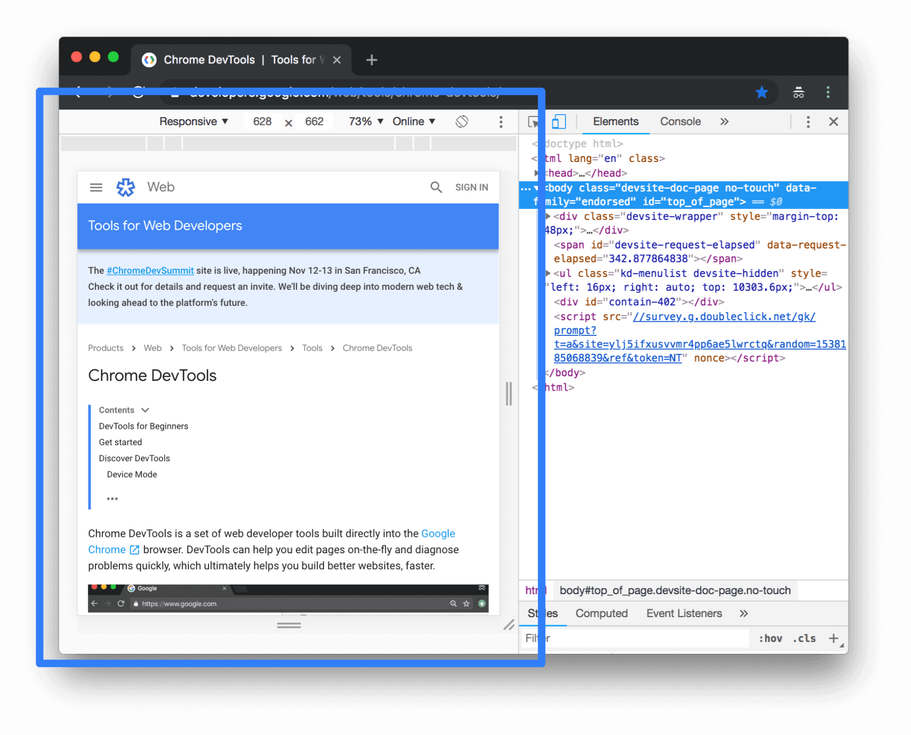
  <figcaption>
    <b>Figure 1</b>. The Device Toolbar
  </figcaption>
</figure>

By default the Device Toolbar opens in Responsive Viewport Mode. 

### Responsive Viewport Mode {: #responsive }

Drag the handles to resize the viewport to whatever dimensions you need. Or, enter specific values
in the width and height boxes. In **Figure 2**, the width is set to `628` and the height is set to
`662`.

<figure>
  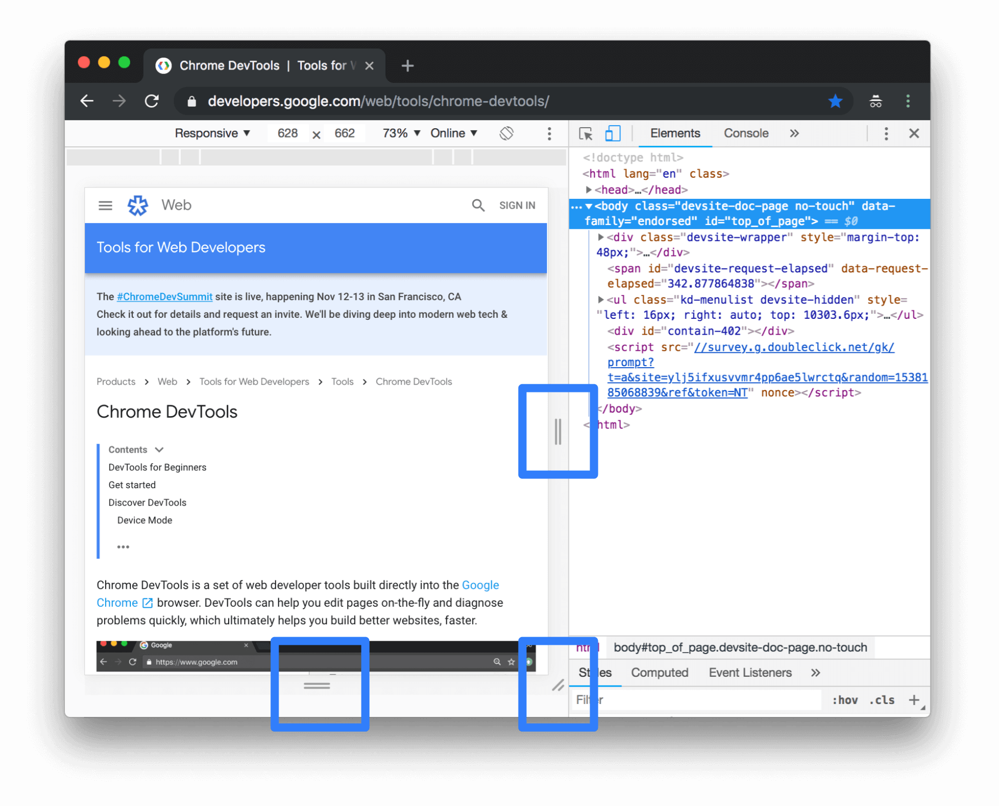
  <figcaption>
    <b>Figure 2</b>. The handles for changing the viewport's dimensions when in Responsive Viewport Mode
  </figcaption>
</figure>

#### Show media queries {: #queries }

To show media query breakpoints above your viewport, click **More options** and then select **Show media
queries**.

<figure>
  
  <figcaption>
    <b>Figure 3</b>. Show media queries
  </figcaption>
</figure>

Click a breakpoint to change the viewport's width so that the breakpoint gets triggered.

<figure>
  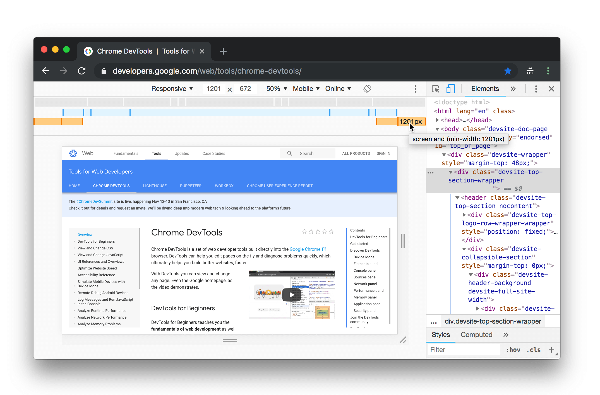
  <figcaption>
    <b>Figure 4</b>. Click a breakpoint to change the viewport's width
  </figcaption>
</figure>

#### Set the device type {: #type }

Use the **Device Type** list to simulate a mobile device or desktop device.

<figure>
  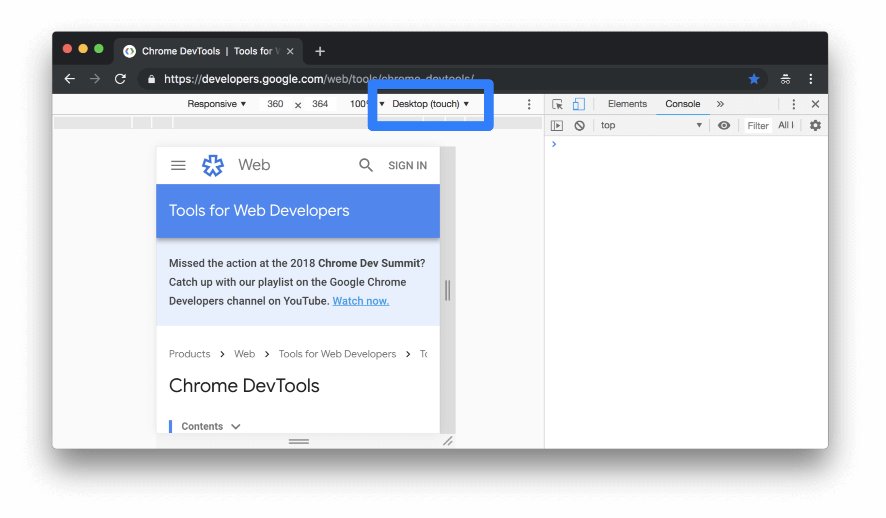
  <figcaption>
    <b>Figure 5</b>. The <b>Device Type</b> list
  </figcaption>
</figure>

The table below describes the differences between the options. **Rendering method**
refers to whether Chrome renders the page as a mobile or desktop viewport. **Cursor icon**
refers to what type of cursor you see when you hover over the page. **Events fired** refers
to whether the page fires `touch` or `click` events when you interact with the page.

<table>
  <tr>
    <th>Option</th>
    <th>Rendering method</th>
    <th>Cursor icon</th>
    <th>Events fired</th>
  </tr>
  <tr>
    <td>Mobile</td>
    <td>Mobile</td>
    <td>Circle</td>
    <td>touch</td>
  </tr>
  <tr>
    <td>Mobile (no touch)</td>
    <td>Mobile</td>
    <td>Normal</td>
    <td>click</td>
  </tr>
  <tr>
    <td>Desktop</td>
    <td>Desktop</td>
    <td>Normal</td>
    <td>click</td>
  </tr>
  <tr>
    <td>Desktop (touch)</td>
    <td>Desktop</td>
    <td>Circle</td>
    <td>touch</td>
  </tr>
</table>

### Mobile Device Viewport Mode {: #device }

To simulate the dimensions of a specific mobile device, select the device from the **Device** list.

<figure>
  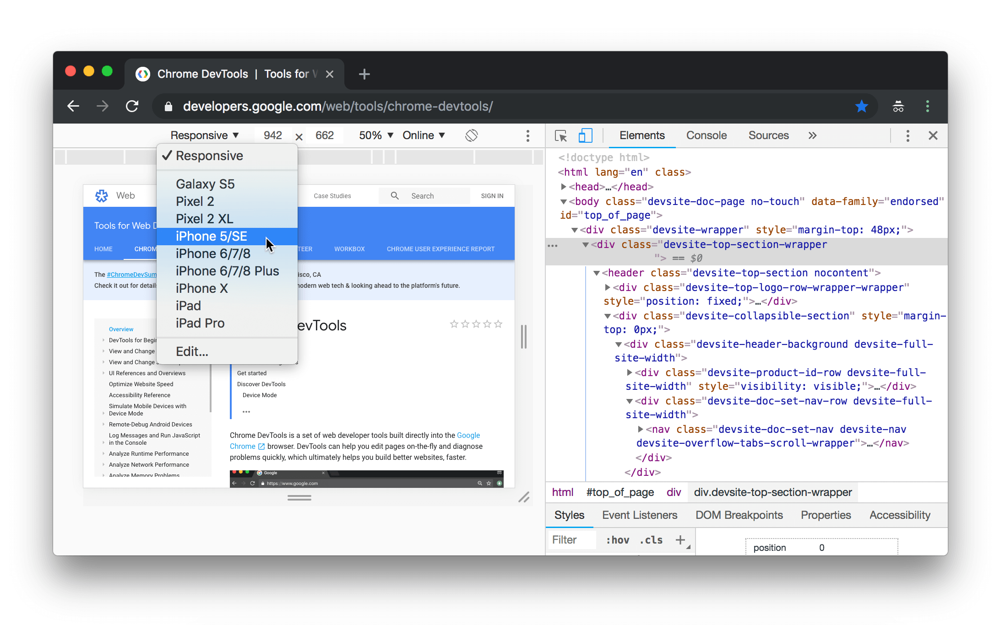
  <figcaption>
    <b>Figure 6</b>. The Device list
  </figcaption>
</figure>

#### Rotate the viewport to landscape orientation {: #landscape }

Click **Rotate** {: .inline-icon } to rotate the viewport to landscape orientation.

<figure>
  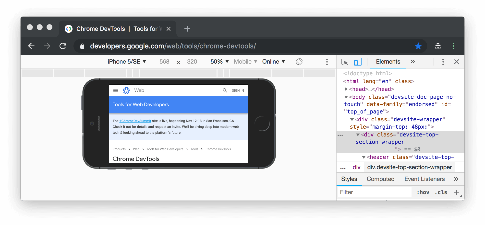
  <figcaption>
    <b>Figure 7</b>. Landscape orientation
  </figcaption>
</figure>

Note that the **Rotate** button disappears if your **Device Toolbar** is narrow.

<figure>
  
  <figcaption>
    <b>Figure 8</b>. The Device Toolbar
  </figcaption>
</figure>

See also [Set orientation](#orientation).

#### Show device frame {: #frame }

When simulating the dimensions of a specific mobile device like an iPhone 6, open **More options**
and then select **Show device frame** to show the physical device frame around the viewport.

Note: If you don't see a device frame for a particular device, it probably means that DevTools
just doesn't have art for that specific option.

<figure>
  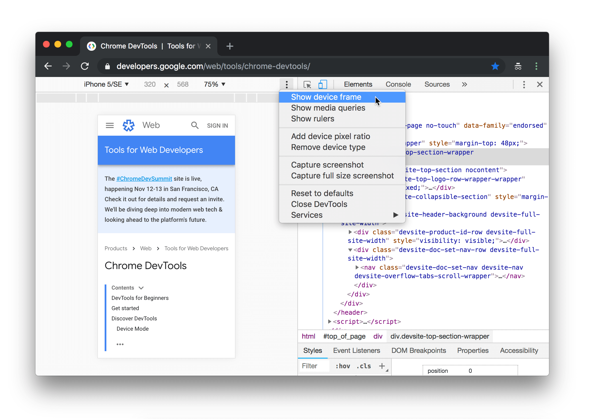
  <figcaption>
    <b>Figure 9</b>. Show device frame
  </figcaption>
</figure>

<figure>
  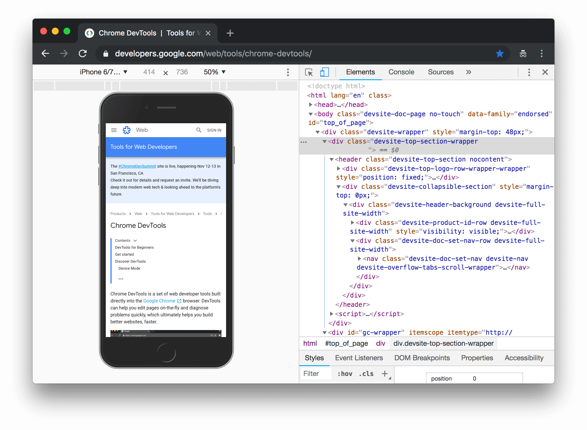
  <figcaption>
    <b>Figure 10</b>. The device frame for the iPhone 6
  </figcaption>
</figure>

#### Add a custom mobile device {: #custom }

To add a custom device:

1. Click the **Device** list and then select **Edit**.

     <figure>
       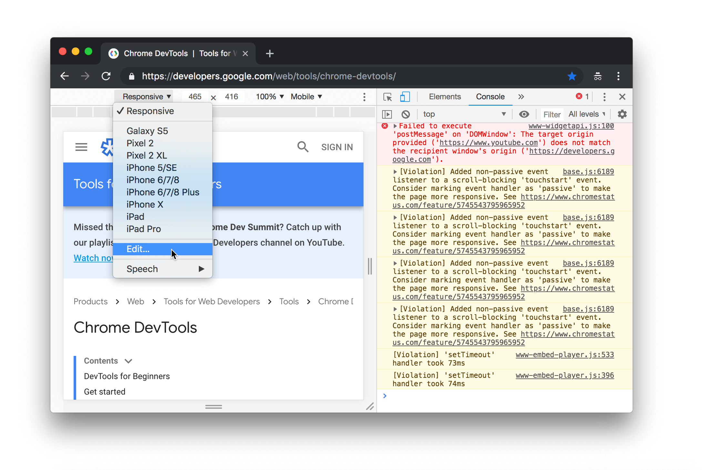
       <figcaption>
         <b>Figure 11</b>. Selecting <b>Edit</b>
       </figcaption>
     </figure>

1. Click **Add custom device**.

[dpr]: https://developer.mozilla.org/en-US/docs/Web/API/Window/devicePixelRatio
[ua]: https://developer.mozilla.org/en-US/docs/Glossary/User_agent

1. Enter a name, width, and height for the device. The
   [device pixel ratio][dpr], [user agent string][ua],
   and [device type](#type) fields are optional. The device type field is the list that
   is set to **Mobile** by default.

     <figure>
       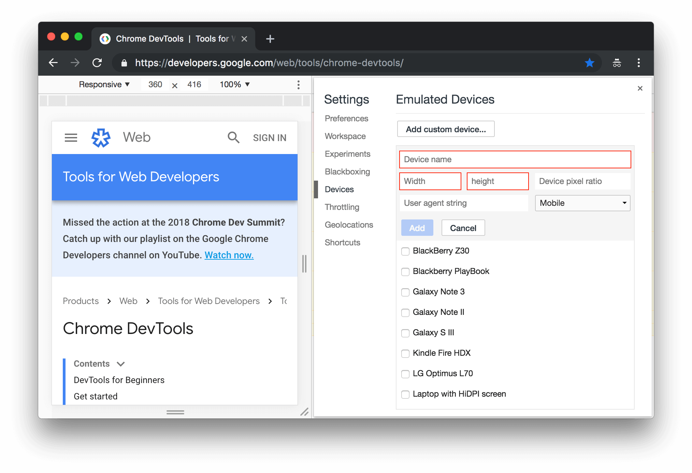
       <figcaption>
         <b>Figure 12</b>. Creating a custom device
       </figcaption>
     </figure>

### Show rulers {: #rulers }

Click **More options** and then select **Show rulers** to see rulers above and to the left
of your viewport. The sizing unit of the rulers is pixels.

<figure>
  
  <figcaption>
    <b>Figure 13</b>. Show rulers
  </figcaption>
</figure>

<figure>
  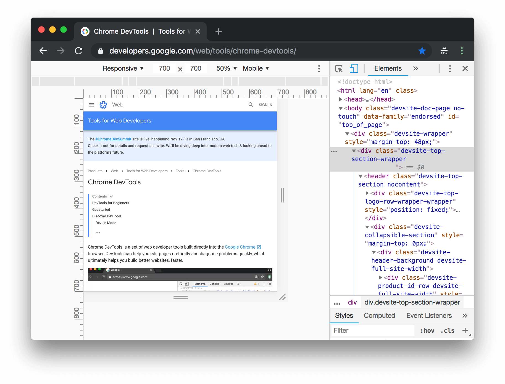
  <figcaption>
    <b>Figure 14</b>. Rulers above and to the left of the viewport
  </figcaption>
</figure>

### Zoom the viewport {: #zoom }

Use the **Zoom** list to zoom in or out.

<figure>
  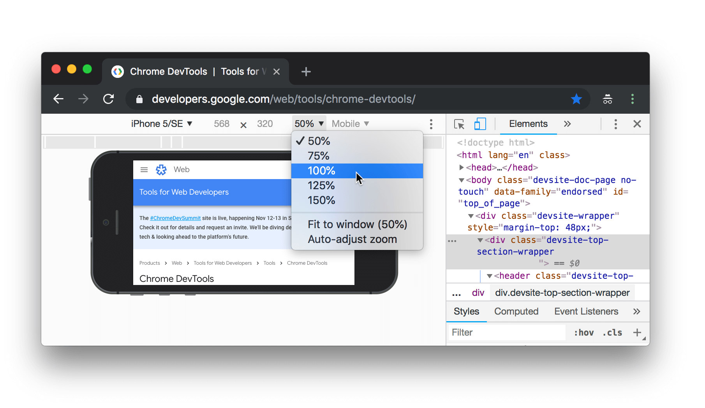
  <figcaption>
    <b>Figure 15</b>. Zoom
  </figcaption>
</figure>

## Throttle the network and CPU {: #throttle }

To throttle the network and CPU, select **Mid-tier mobile** or **Low-end mobile**
from the **Throttle** list.

<figure>
  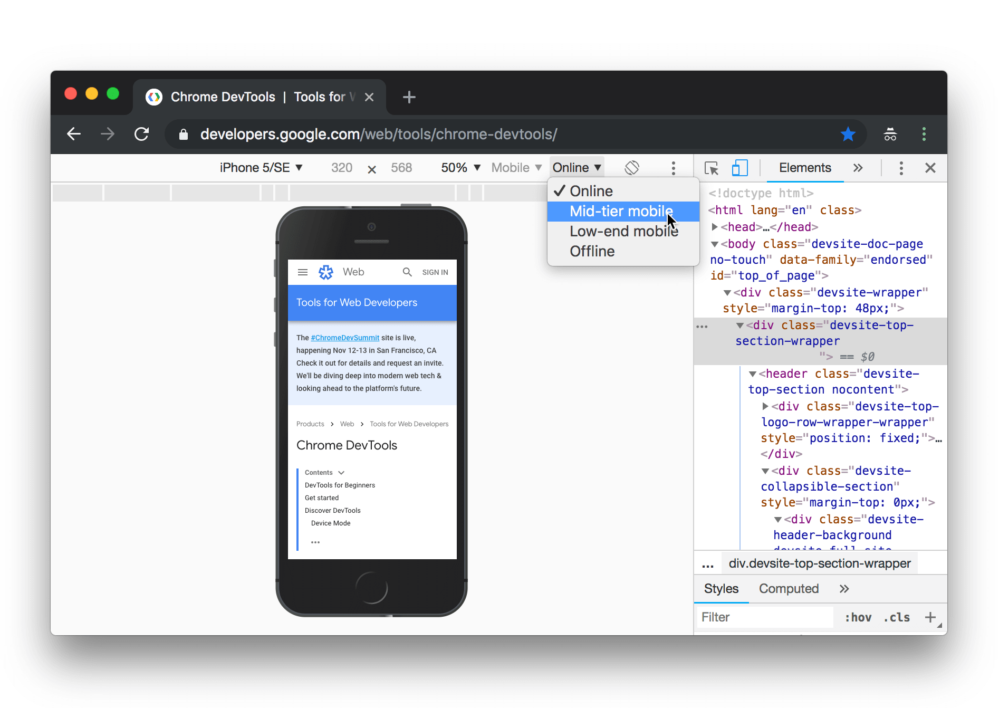
  <figcaption>
    <b>Figure 16</b>. The Throttle list
  </figcaption>
</figure>

**Mid-tier mobile** simulates fast 3G and throttles your CPU so that it is 4 times
slower than normal. **Low-end mobile** simulates slow 3G and throttles your CPU 6 times slower than normal.
Keep in mind that the throttling is relative to the normal capability of your laptop or desktop. 

Note that the **Throttle** list will be hidden if your **Device Toolbar** is narrow.

<figure>
  
  <figcaption>
    <b>Figure 17</b>. The Device Toolbar
  </figcaption>
</figure>

### Throttle the CPU only {: #cpu }

To throttle the CPU only and not the network, go to the **Performance** panel, click
**Capture Settings** ![Capture Settings][capture]{:.inline-icon}, and then select
**4x slowdown** or **6x slowdown** from the **CPU** list.

<figure>
  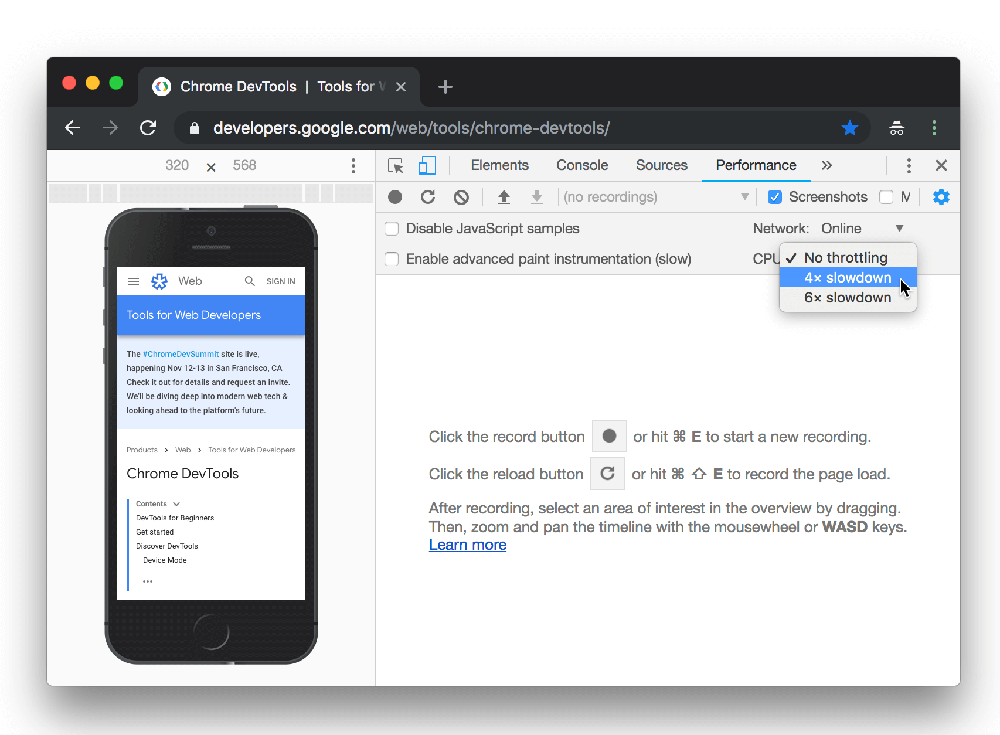
  <figcaption>
    <b>Figure 18</b>. The CPU list
  </figcaption>
</figure>

### Throttle the network only {: #network }

To throttle the network only and not the CPU, go the **Network** panel and select
**Fast 3G** or **Slow 3G** from the **Throttle** list.

<figure>
  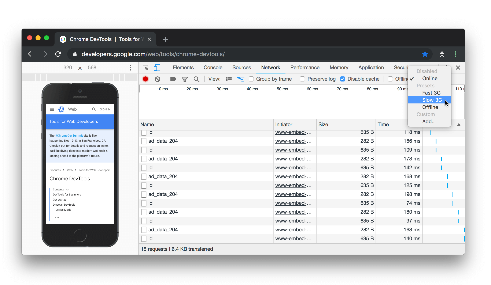
  <figcaption>
    <b>Figure 19</b>. The Throttle list
  </figcaption>
</figure>

Or press <kbd>Command</kbd>+<kbd>Shift</kbd>+<kbd>P</kbd> (Mac) or 
<kbd>Control</kbd>+<kbd>Shift</kbd>+<kbd>P</kbd> (Windows, Linux, Chrome OS) to open
the Command Menu, type `3G`, and select **Enable fast 3G throttling** or
**Enable slow 3G throttling**.

<figure>
  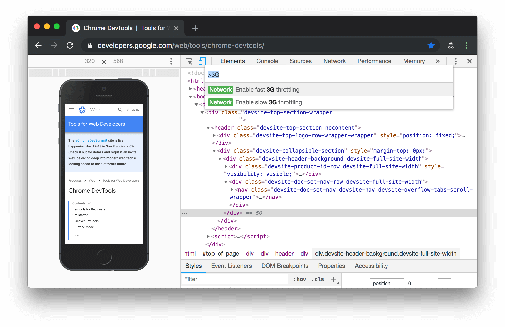
  <figcaption>
    <b>Figure 20</b>. The Command Menu
  </figcaption>
</figure>

You can also set network throttling from the **Performance** panel. Click
**Capture Settings** ![Capture Settings][capture]{: .inline-icon } and then
select **Fast 3G** or **Slow 3G** from the **Network** list.

<figure>
  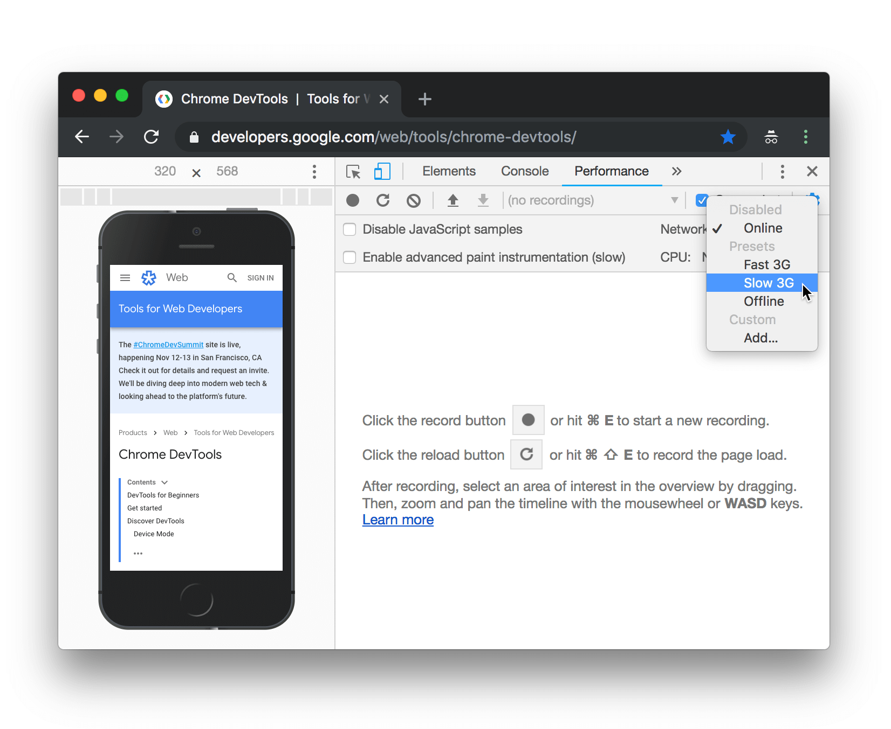
  <figcaption>
    <b>Figure 21</b>. Setting network throttling from the Performance panel
  </figcaption>
</figure>

## Override geolocation {: #geolocation }

To open the geolocation overriding UI click **Customize and control DevTools**
![Customize and control DevTools][customize]{: .inline-icon } and then select
**More tools** > **Sensors**.

<figure>
  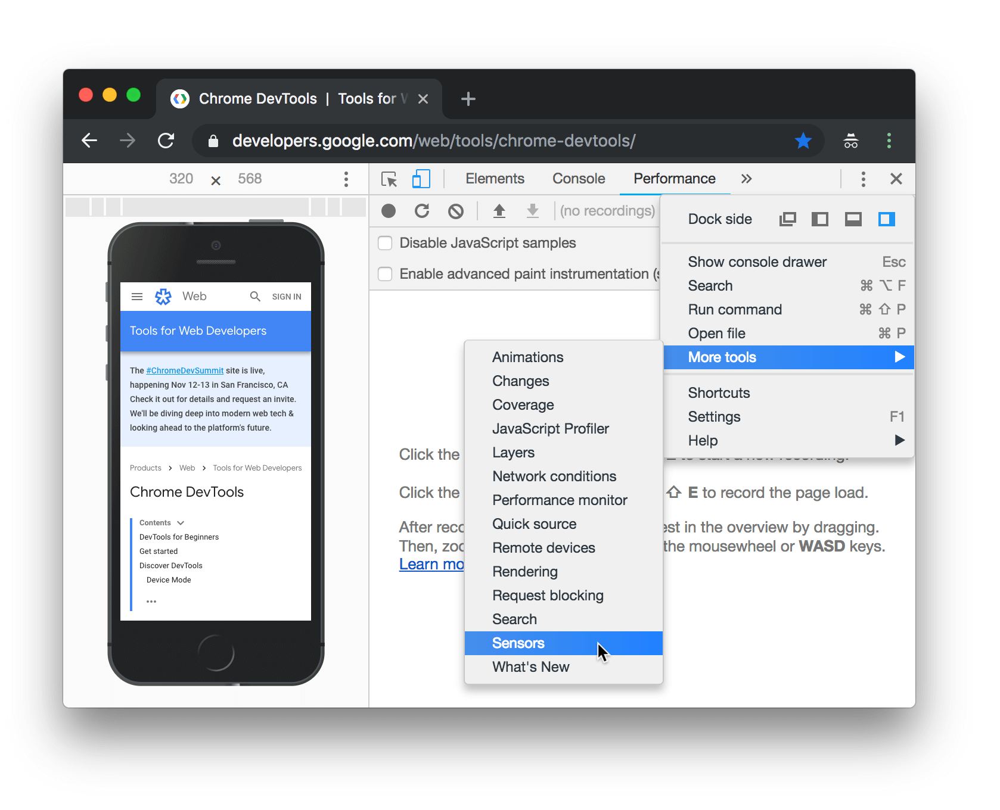
  <figcaption>
    <b>Figure 22</b>. Sensors
  </figcaption>
</figure>

Or press <kbd>Command</kbd>+<kbd>Shift</kbd>+<kbd>P</kbd> (Mac) or 
<kbd>Control</kbd>+<kbd>Shift</kbd>+<kbd>P</kbd> (Windows, Linux, Chrome OS) to open
the Command Menu, type `Sensors`, and then select **Show Sensors**.

<figure>
  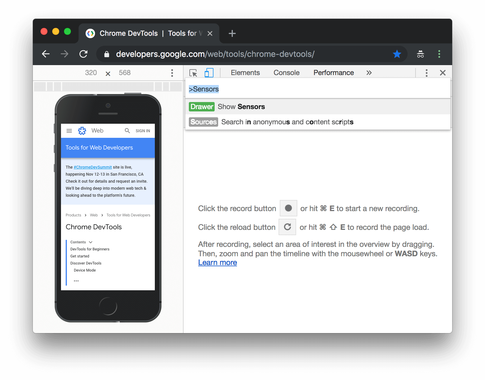
  <figcaption>
    <b>Figure 23</b>. Show Sensors
  </figcaption>
</figure>

Select one of the presets from the **Geolocation** list, or select **Custom location**
to enter your own coordinates, or select **Location unavailable** to test out how your
page behaves when geolocation is in an error state.

<figure>
  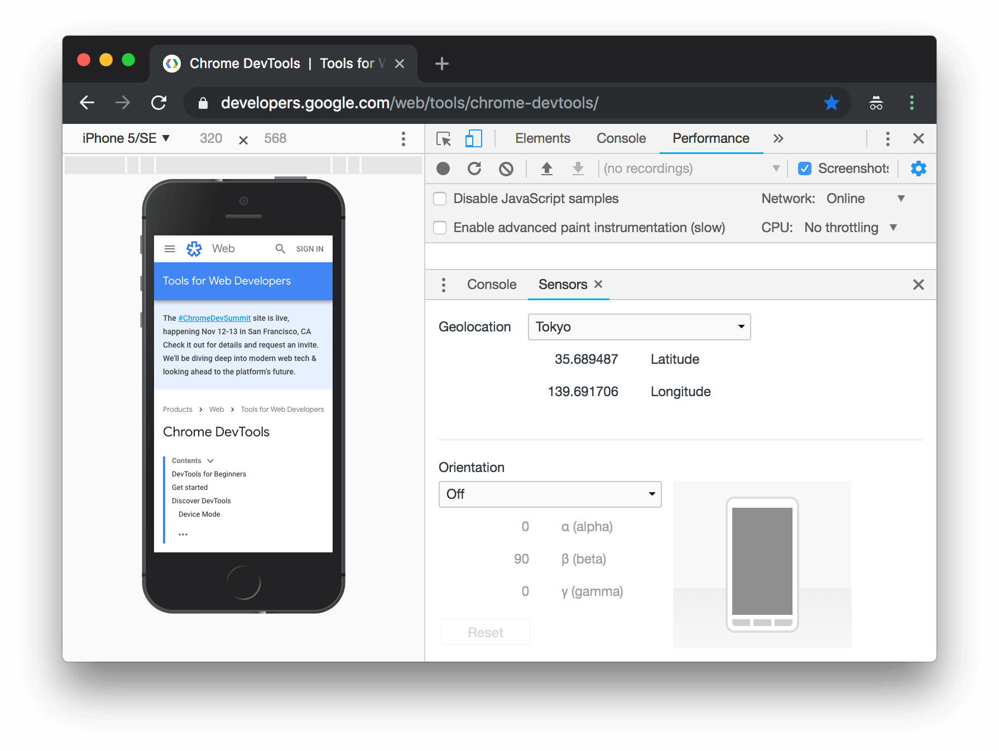
  <figcaption>
    <b>Figure 24</b>. Geolocation
  </figcaption>
</figure>

## Set orientation {: #orientation }

To open the orientation UI click **Customize and control DevTools**
![Customize and control DevTools][customize]{: .inline-icon } and then select
**More tools** > **Sensors**.

<figure>
  
  <figcaption>
    <b>Figure 25</b>. Sensors
  </figcaption>
</figure>

Or press <kbd>Command</kbd>+<kbd>Shift</kbd>+<kbd>P</kbd> (Mac) or 
<kbd>Control</kbd>+<kbd>Shift</kbd>+<kbd>P</kbd> (Windows, Linux, Chrome OS) to open
the Command Menu, type `Sensors`, and then select **Show Sensors**.

<figure>
  
  <figcaption>
    <b>Figure 26</b>. Show Sensors
  </figcaption>
</figure>

Select one of the presets from the **Orientation** list or select **Custom orientation**
to set your own alpha, beta, and gamma values.

<figure>
  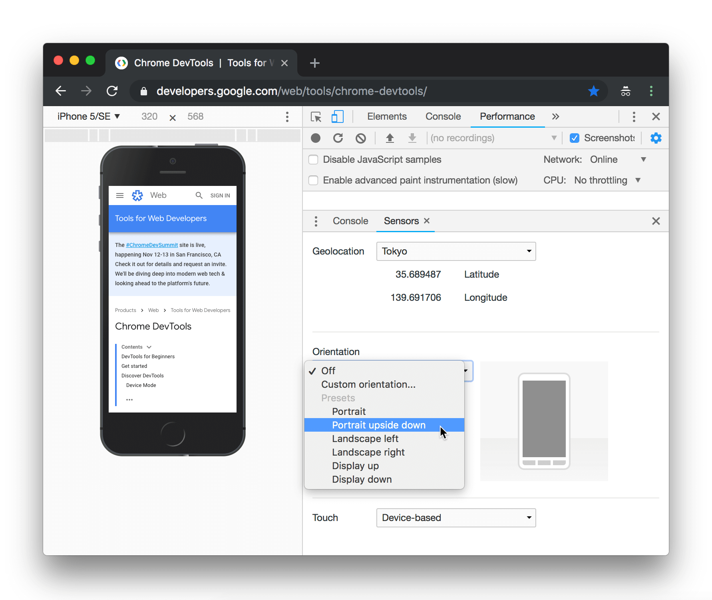
  <figcaption>
    <b>Figure 27</b>. Orientation
  </figcaption>
</figure>

## Feedback {: #feedback }



See [Join the DevTools community](/web/tools/chrome-devtools/#community) for other ways
to leave feedback.
