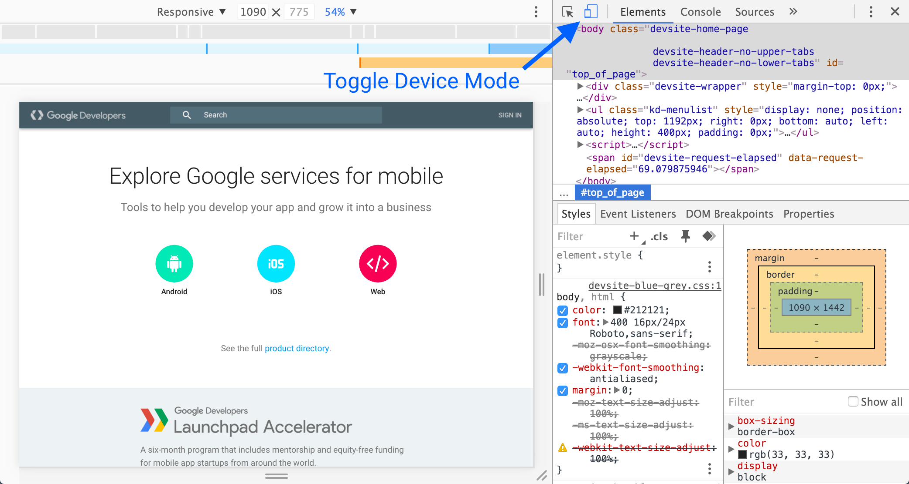

project_path: /web/tools/_project.yaml
book_path: /web/tools/_book.yaml
description: Use virtual devices in Chrome's Device Mode to build mobile-first websites.

{# wf_updated_on: 2016-03-07 #}
{# wf_published_on: 2015-04-13 #}

# Simulate Mobile Devices with Device Mode {: .page-title }



Use Chrome DevTools' Device Mode to build mobile-first, fully responsive websites. Learn how to use it to simulate a wide range of devices and their capabilities.

Warning: Device Mode gives you a close approximation as to how your site
will look on a mobile device, but to get the full picture you should always
test your site on real devices. DevTools can't emulate the performance
characteristics of mobile devices, for example.

## In a nutshell

* Emulate your site across [different screen sizes and resolutions](/web/tools/chrome-devtools/device-mode/emulate-mobile-viewports), including Retina displays.
* Responsively design by visualizing and [inspecting CSS media queries](/web/tools/chrome-devtools/iterate/device-mode/media-queries).
* Evaluate your site's load performance with the [Network Conditions drawer](emulate-mobile-viewports#network), without affecting traffic to other tabs.
* Accurately [simulate device input](/web/tools/chrome-devtools/device-mode/device-input-and-sensors) for touch events, geolocation, and device orientation

## Toggle Device Mode {: #toggle }

Toggle the **Device Mode** button to turn Device Mode on or off.

When Device Mode is on, the icon is blue
().

When it's off, the icon is grey
().

Device Mode is enabled by default. 

You can also toggle Device Mode by pressing
<kbd>Command</kbd>+<kbd>Shift</kbd>+<kbd>M</kbd> (Mac) or
<kbd>Ctrl</kbd>+<kbd>Shift</kbd>+<kbd>M</kbd> (Windows, Linux).
To use this shortcut your mouse needs to be focused on your DevTools window.
If it's focused on your viewport, you'll trigger [Chrome's switch user
shortcut](https://support.google.com/chrome/answer/157179).

