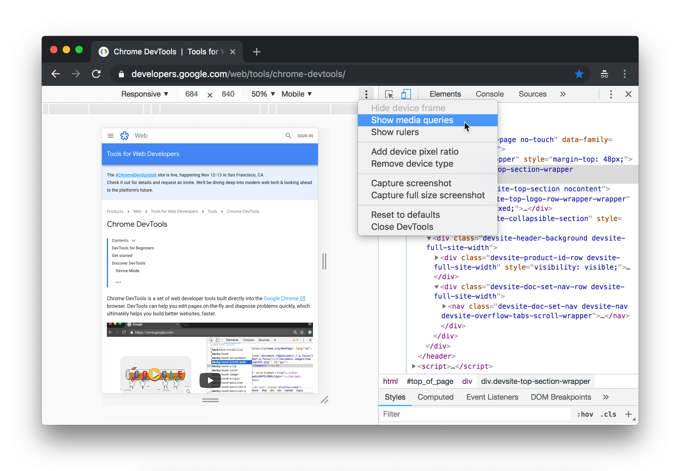
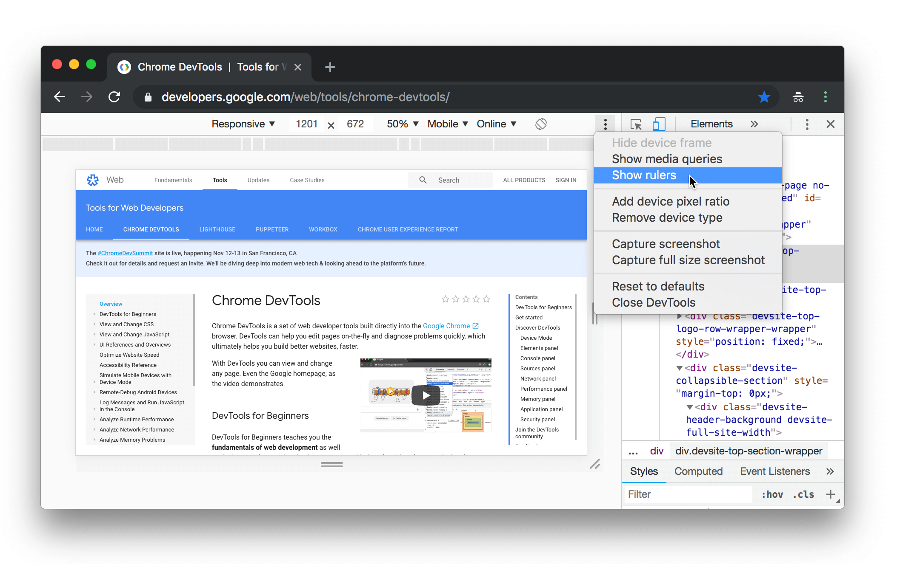

project_path: /web/tools/_project.yaml
book_path: /web/tools/_book.yaml
description: Use virtual devices in Chrome's Device Mode to build mobile-first websites.

{# wf_updated_on: 2018-09-28 #}
{# wf_published_on: 2015-04-13 #}
{# wf_blink_components: Platform>DevTools #}

# Simulate Mobile Devices with Device Mode in Chrome DevTools {: .page-title }



Use Device Mode to approximate how your page will look and perform on a mobile device.

## Definition {: #definition }

Device Mode is the name for the loose collection of features in Chrome DevTools that
are related to simulating mobile devices. This collection includes:

* [Simulating a mobile viewport](#viewport).
* [Throttling the network](#network).
* [Throttling the CPU](#cpu).
* [Simulating geolocation](#geolocation).
* [Simulating device orientation](#orientation).

## Limitations {: #limitations }

Think of Device Mode as a first-order approximation of how your page looks and feels
on a mobile device. With Device Mode you don't actually run your code on a mobile device.
You simulate the mobile user experience from your laptop or desktop.

There are some aspects of mobile devices that DevTools will never be able to simulate. For
example, the architecture of mobile CPUs is very different than the architecture of laptop
or desktop CPUs.

When in doubt, your best bet is to actually run your page on a mobile device. 
Use [Remote Debugging](/web/tools/chrome-devtools/remote-debugging/) to view, change, debug,
and profile a page's code from your laptop or desktop while it actually runs on a mobile device.

## Simulate a mobile viewport {: #viewport }

Click **Toggle Device Toolbar** ![Toggle Device Toolbar][TDB]{: .inline-icon } to open the UI that
enables you to simulate a mobile viewport.

[TDB]: /web/tools/chrome-devtools/images/shared/toggle-device-toolbar.png

<figure>
  
  <figcaption>
    <b>Figure X</b>. The Device Toolbar
  </figcaption>
</figure>

By default the Device Toolbar opens in Responsive Viewport Mode. 

### Responsive Viewport Mode {: #responsive }

Drag the handles to resize the viewport to whatever dimensions you need.

<figure>
  
  <figcaption>
    <b>Figure X</b>. The handles for changing the viewport's dimensions when in Responsive Viewport Mode
  </figcaption>
</figure>

#### Show media queries {: #queries }

To show media query breakpoints above your viewport, click **More options** and then select **Show media
queries**.

<figure>
  
  <figcaption>
    <b>Figure X</b>. Show media queries
  </figcaption>
</figure>

Click a breakpoint to change the viewport's width so that the breakpoint gets triggered.

<figure>
  
  <figcaption>
    <b>Figure X</b>. Click a breakpoint to change the viewport's width
  </figcaption>
</figure>

### Mobile Device Viewport Mode {: #device }

To simulate the dimensions of a specific mobile device, select the device from the **Device** list.

<figure>
  
  <figcaption>
    <b>Figure X</b>. The Device list
  </figcaption>
</figure>

#### Rotate the viewport to landscape orientation {: #landscape }

Click **Rotate** {: .inline-icon } to rotate the viewport to landscape orientation.

<figure>
  
  <figcaption>
    <b>Figure X</b>. Landscape orientation
  </figcaption>
</figure>

Note that the **Rotate** button disappears if your **Device Toolbar** is narrow.

<figure>
  
  <figcaption>
    <b>Figure X</b>. The Device Toolbar
  </figcaption>
</figure>

#### Show device frame {: #frame }

When simulating the dimensions of a specific mobile device like an iPhone 6, open **More options**
and then select **Show device frame** to show the physical device frame around the viewport.

Note: If you don't see a device frame for a particular device, it probably means that DevTools
just doesn't have art for that specific option.

<figure>
  
  <figcaption>
    <b>Figure X</b>. Show device frame
  </figcaption>
</figure>

<figure>
  
  <figcaption>
    <b>Figure X</b>. The device frame for the iPhone 6
  </figcaption>
</figure>

### Show rulers {: #rulers }

Click **More options** and then select **Show rulers** to see rulers above and to the left
of your viewport. The sizing unit of the rulers is pixels.

<figure>
  
  <figcaption>
    <b>Figure X</b>. Show rulers
  </figcaption>
</figure>

<figure>
  
  <figcaption>
    <b>Figure X</b>. Rulers above and to the left of the viewport
  </figcaption>
</figure>

## Throttle the network {: #network }

## Throttle the CPU {: #cpu }

## Override geolocation {: #geolocation }

## Simulate device orientation {: #orientation }

## Feedback {: #feedback }


