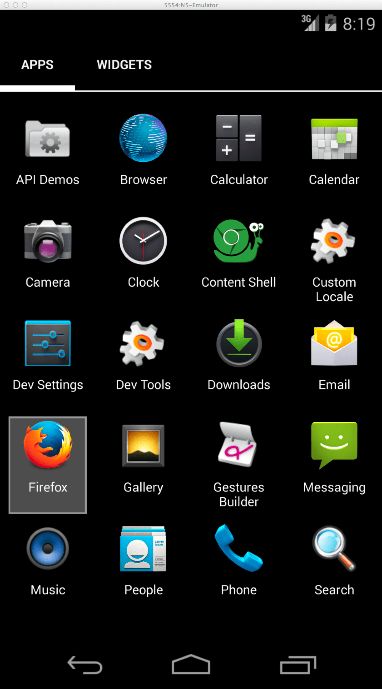

project_path: /web/tools/_project.yaml
book_path: /web/tools/_book.yaml
description: Your job doesn't end with ensuring your site runs great across Chrome and Android. Even though Device Mode can simulate a range of other devices like iPhones, we encourage you to check out other browsers solutions for emulation.

{# wf_updated_on: 2015-04-13 #}
{# wf_published_on: 2015-04-13 #}

# Emulate and Test Other Browsers {: .page-title }




Your job doesn't end with ensuring your site runs great across Chrome and Android. Even though Device Mode can simulate a range of other devices like iPhones, we encourage you to check out other browsers solutions for emulation.

### TL;DR {: .hide-from-toc }
- When you don’t have a particular device, or want to do a spot check on something, the best option is to emulate the device right inside your browser.
- Device emulators and simulators let you mimic your development site on a range of devices from your workstation.
- Cloud-based emulators let you automate unit tests for your site across different platforms.

## Browser emulators

Browser emulators are great for testing a site's responsiveness, but they don’t
emulate differences in API, CSS support, and certain behaviors that you'd see
on a mobile browser. Test your site on browsers running on real devices to be
certain everything behaves as expected.

### Firefox' Responsive Design View

Firefox has a [responsive design view](https://developer.mozilla.org/en-US/docs/Tools/Responsive_Design_View)
that encourages you to stop thinking in terms of specific devices and instead
explore how your design changes at common screen sizes or your own size by
dragging the edges.

### Edge's F12 Emulation

To emulate Windows Phones, use Microsoft Edge's [built-in emulation](https://dev.modern.ie/platform/documentation/f12-devtools-guide/emulation/).

Since Edge does not ship with legacy compatibility, use [IE 11's Emulation](https://msdn.microsoft.com/en-us/library/dn255001(v=vs.85).aspx) to simulate how your page would look in older versions of Internet Explorer.

## Device emulators and simulators

Device simulators and emulators simulate not just the browser environment but the entire device. They're useful to test things that require OS integration, for example form input with virtual keyboards.

### Android Emulator

<figure class="attempt-right">
  
  <figcaption>Stock Browser in Android Emulator</figcaption>
</figure>

At the moment, there is no way to install Chrome on an Android emulator. However, you can use the Android Browser, the Chromium Content Shell and Firefox for Android which we'll cover later in this guide. Chromium Content Shell uses the same Chrome rendering engine, but comes without any of the browser specific features.

The Android emulator comes with the Android SDK which you need to <a href="http://developer.android.com/sdk/installing/studio.html">download from
here</a>. Then follow the instructions to <a href="http://developer.android.com/tools/devices/managing-avds.html">setup a virtual device</a> and <a href="http://developer.android.com/tools/devices/emulator.html">start the emulator</a>.

Once your emulator is booted, click on the Browser icon and you'll be able to test your site on the old Stock Browser for Android.

#### Chromium Content Shell on Android

<figure class="attempt-right">
  
  <figcaption>Android Emulator Content Shell</figcaption>
</figure>

To install the Chromium Content Shell for Android, leave your emulator running
and run the following commands at a command prompt:

    git clone https://github.com/PaulKinlan/chromium-android-installer.git
    chmod u+x ./chromium-android-installer/\*.sh
    ./chromium-android-installer/install-chromeandroid.sh

Now you can test your site with the Chromium Content Shell.

#### Firefox on Android

<figure class="attempt-right">
  
  <figcaption>Firefox Icon on Android Emulator</figcaption>
</figure>

Similar to Chromium's Content Shell, you can get an APK to install Firefox onto the emulator.

Download the right .apk file from <a href="https://ftp.mozilla.org/pub/mozilla.org/mobile/releases/latest/">https://ftp.mozilla.org/pub/mozilla.org/mobile/releases/latest/</a>.

From here, you can install the file onto an open emulator or connected Android device with the following command:

    adb install &lt;path to APK&gt;/fennec-XX.X.XX.android-arm.apk

### iOS Simulator

The iOS simulator for Mac OS X comes with Xcode, which you can [install from the
App Store](https://itunes.apple.com/us/app/xcode/id497799835?ls=1&mt=12).

When you're done, learn how to work with the simulator through [Apple's documentation](https://developer.apple.com/library/prerelease/ios/documentation/IDEs/Conceptual/iOS_Simulator_Guide/Introduction/Introduction.html).

Note: To avoid having to open Xcode every time you want to use the iOS Simulator, open it, then right click the iOS Simulator icon in your dock and select `Keep in Dock`. Now just click this icon whenever you need it.

### Modern.IE

<figure class="attempt-right">
  
  <figcaption>Modern IE VM</figcaption>
</figure>

Modern.IE Virtual Machines let you access different versions of IE on your computer via VirtualBox (or VMWare). Choose a virtual machine on the <a href="https://modern.ie/en-us/virtualization-tools#downloads">download page here</a>.

## Cloud-based emulators and simulators

If you can’t use the emulators and don't have access to real devices, then cloud-based emulators are the next best thing. A big advantage of cloud-based emulators over real devices and local emulators is that you can automate unit tests for your site across different platforms.

* [BrowserStack (commercial)](https://www.browserstack.com/automate) is the easiest to use for manual testing. You select an operating system, select your browser version and device type, select a URL to browse, and it spins up a hosted virtual machine that you can interact with. You can also fire up multiple emulators in the same screen, letting you test how your app looks and feels across multiple devices at the same time.
* [SauceLabs (commercial)](https://saucelabs.com/){: .external } allows you to run unit tests inside of an emulator, which can be really useful for scripting a flow through your site and watch the video recording of this afterwards on various devices. You can also do manual testing with your site.
* [Device Anywhere (commercial)](http://www.keynote.com/solutions/testing/mobile-testing) doesn't
use emulators but real devices which you can control remotely. This is very useful in the event where you need to reproduce a problem on a specific device and can't see the bug on any of the options in the previous guides.

