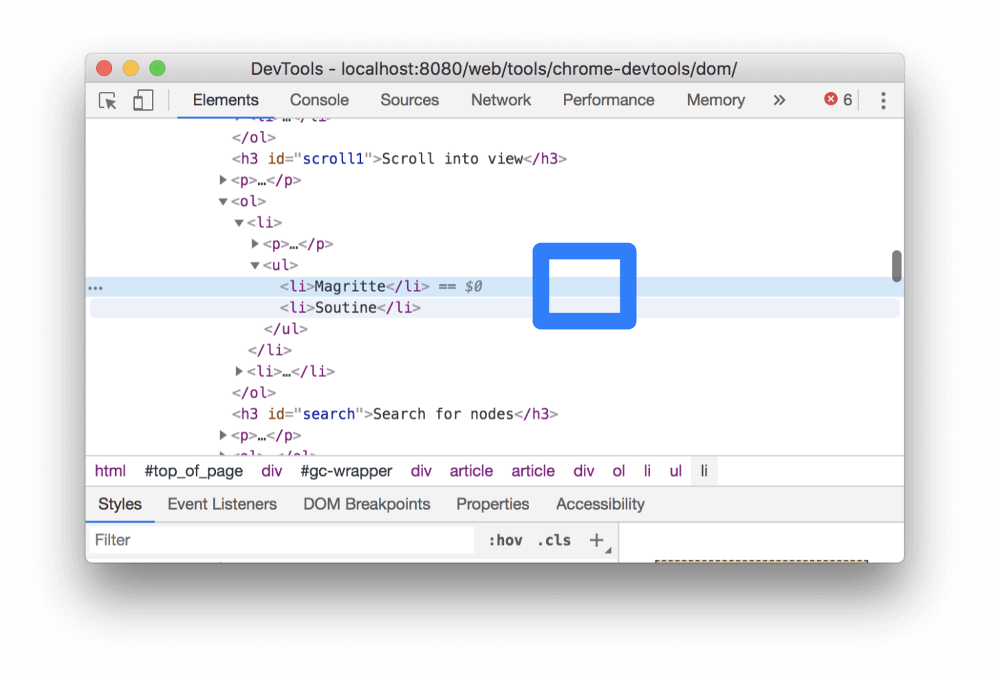

project_path: /web/tools/_project.yaml
book_path: /web/tools/_book.yaml
description: How to view nodes, search for nodes, edit nodes, reference nodes in the Console, break on node changes, and more.

{# wf_updated_on: 2019-03-01 #}
{# wf_published_on: 2019-03-01 #}
{# wf_blink_components: Platform>DevTools #}

# Get Started With Viewing And Changing The DOM {: .page-title }



Complete these interactive tutorials to learn the basics of viewing and
changing a page's DOM using Chrome DevTools.

This tutorial assumes that you know the difference between the DOM and HTML. See
[Appendix: HTML versus the DOM](#appendix) for an explanation.

## View DOM nodes {: #view }

The DOM Tree of the Elements panel is where you do all DOM-related activities in DevTools.

### Inspect a node {: #inspect }

When you're interested in a particular DOM node, **Inspect** is a fast way to open DevTools
and investigate that node.

1. Right-click **Michelangelo** below and select **Inspect**.

     * Michelangelo
     * Raphael

     <figure>
       
       <figcaption>
         <b>Figure 1</b>. Inspecting a node
       </figcaption>
     </figure>

     The **Elements** panel of DevTools opens.
     `<li>Michelangelo</li>` is highlighted in the **DOM Tree**.

     <figure>
       
       <figcaption>
         <b>Figure 2</b>. Highlighting the Michelangelo node
       </figcaption>
     </figure>

[inspect]: /web/tools/chrome-devtools/images/shared/inspect.png

1. Click the **Inspect** ![Inspect][inspect]{: .inline-icon } icon in the top-left corner of
   DevTools.

     <figure>
       
       <figcaption>
         <b>Figure 3</b>. The Inspect icon
       </figcaption>
     </figure>

1. Click the **Tokyo** text below.

     * Tokyo
     * Beirut

     Now, `<li>Tokyo</li>` is highlighted in the DOM Tree.

Inspecting a node is also the first step towards viewing and changing a node's styles.
See [Get Started With Viewing And Changing CSS](/web/tools/chrome-devtools/css/).

### Navigate the DOM Tree with a keyboard {: #keynav }

Once you've selected a node in the DOM Tree, you can navigate the DOM Tree with your
keyboard.

1. Right-click **Ringo** below and select **Inspect**. `<li>Ringo</li>` is selected in
   the DOM Tree.

     * George
     * Ringo
     * Paul
     * John

     <figure>
       
       <figcaption>
         <b>Figure 4</b>. Inspecting the Ringo node
       </figcaption>
     </figure>

1. Press the <kbd>Up</kbd> arrow key 2 times. `<ul>` is selected.

     <figure>
       
       <figcaption>
         <b>Figure 5</b>. Inspecting the ul node
       </figcaption>
     </figure>

1. Press the <kbd>Left</kbd> arrow key. The `<ul>` list collapses.
1. Press the <kbd>Left</kbd> arrow key again. The parent of the `<ul>` node
   is selected. In this case it's the `<li>` node containing the instructions for step 1.
1. Press the <kbd>Down</kbd> arrow key 2 times so that you've re-selected the `<ul>`
   list that you just collapsed. It should look like this: `<ul>...</ul>`
1. Press the <kbd>Right</kbd> arrow key. The list expands.

### Scroll into view {: #scroll1 }

When viewing the DOM Tree, sometimes you'll find yourself interested in a DOM node that's
not currently in the viewport. For example, suppose that you scrolled to the bottom of the
page, and you're interested in the `<h1>` node at the top of the page. **Scroll into view**
lets you quickly reposition the viewport so that you can see the node.

1. Right-click **Magritte** below and select **Inspect**.

     * Magritte
     * Soutine

1. Go to the [Appendix: Scroll into view](#scroll2) section at the bottom of this page.
   The instructions continue there.

After completing the instructions at the bottom of the page you should jump back up to here.

### Search for nodes {: #search }

You can search the DOM Tree by string, CSS selector, or XPath selector.

1. Focus your cursor on the **Elements** panel.
1. Press <kbd>Control</kbd>+<kbd>F</kbd> or <kbd>Command</kbd>+<kbd>F</kbd> (Mac).
   The Search bar opens at the bottom of the DOM Tree.
1. Type `The Moon is a Harsh Mistress`. The last sentence is highlighted in the DOM Tree.

     <figure>
       
       <figcaption>
         <b>Figure 6</b>. Highlighting the query in the Search bar
       </figcaption>
     </figure>

As mentioned above, the Search bar also supports CSS and XPath selectors.

## Edit the DOM {: #edit }

You can edit the DOM on the fly and see how those changes affect the page.

### Edit content {: #content }

To edit a node's content, double-click the content in the DOM Tree.

1. Right-click **Michelle** below and select **Inspect**.

     * Fry
     * Michelle

1. In the DOM Tree, double-click `Michelle`. In other words, double-click the text between
   `<li>` and `</li>`. The text is highlighted blue to indicate that it's selected.

     <figure>
       
       <figcaption>
         <b>Figure 7</b>. Editing the text
       </figcaption>
     </figure>

1. Delete `Michelle`, type `Leela`, then press <kbd>Enter</kbd> to confirm the change. The text
   above changes from **Michelle** to **Leela**.

### Edit attributes {: #attributes }

To edit attributes, double-click the attribute name or value. Follow the instructions
below to learn how to add attributes to a node.

1. Right-click **Howard** below and select **Inspect**.

     * Howard
     * Vince

1. Double-click `<li>`. The text is highlighted to indicate that the
   node is selected.

     <figure>
       
       <figcaption>
         <b>Figure 8</b>. Editing the node
       </figcaption>
     </figure>

1. Press the <kbd>Right</kbd> arrow key, add a space, type
   `style="background-color:gold"`, and then press <kbd>Enter</kbd>. The background color
   of the node changes to gold.

     <figure>
       
       <figcaption>
         <b>Figure 9</b>. Adding a style attribute to the node
       </figcaption>
     </figure>

### Edit node type {: #type }

To edit a node's type, double-click the type and then type in the new type.

1. Right-click **Hank** below and select **Inspect**.

     * Dean
     * Hank
     * Thaddeus
     * Brock

1. Double-click `<li>`. The text `li` is highlighted.
1. Delete `li`, type `button`, then press <kbd>Enter</kbd>. The `<li>` node changes to a `<button>`
   node.

     <figure>
       
       <figcaption>
         <b>Figure 10</b>. Changing the node type to button
       </figcaption>
     </figure>

### Reorder DOM nodes {: #reorder }

Drag nodes to reorder them.

1. Right-click **Elvis Presley** below and select **Inspect**. Notice that it's the last item
   in the list.

     <ul>
       <li>Stevie Wonder</li>
       <li>Tom Waits</li>
       <li>Chris Thile</li>
       <li>Elvis Presley</li>
     </ul>

1. In the DOM Tree, drag `<li>Elvis Presley</li>` to the top of the list.

     <figure>
       
       <figcaption>
         <b>Figure 11</b>. Dragging the node to the top of the list
       </figcaption>
     </figure>

### Force state {: #state }

You can force nodes to remain in states like `:active`, `:hover`, `:focus`,
`:visited`, and `:focus-within`.

1. Hover over **The Lord of the Flies** below. The background color becomes orange.

     <ul> 
       <li class="demo--hover">The Lord of the Flies</li>
       <li>Crime and Punishment</li>
       <li>Moby Dick</li>
     </ul>

1. Right-click **The Lord of the Flies** above and select **Inspect**.

[more]: /web/tools/chrome-devtools/dom/imgs/more-actions.png

1. Right-click `<li class="demo--hover">The Lord of the Flies</li>` and select **Force
   State** > **:hover**. See [Appendix: Missing options](#options) if you don't see this option.
   The background color remains orange even though you're not actually hovering over the node.

### Hide a node {: #hide }

Press <kbd>H</kbd> to hide a node.

1. Right-click **The Stars My Destination** below and select **Inspect**.

     * The Count of Monte Cristo
     * The Stars My Destination

1. Press the <kbd>H</kbd> key. The node is hidden.

     <figure>
       
       <figcaption>
         <b>Figure 12</b>. What the node looks like in the DOM Tree after it's hidden
       </figcaption>
     </figure>

1. Press the <kbd>H</kbd> key again. The node is shown again.

### Delete a node {: #delete }

Press <kbd>Delete</kbd> to delete a node.

1. Right-click **Foundation** below and select **Inspect**.

     * The Illustrated Man
     * Through the Looking-Glass
     * Foundation

1. Press the <kbd>Delete</kbd> key. The node is deleted.
1. Press <kbd>Control</kbd>+<kbd>Z</kbd> or <kbd>Command</kbd>+<kbd>Z</kbd> (Mac).
   The last action is undone and the node reappears.

## Access nodes in the Console {: #console }

DevTools provides a few shortcuts for accessing DOM nodes from the Console, or getting
JavaScript references to them.

### Reference the currently-selected node with $0 {: #current }

When you inspect a node, the `== $0` text next to the node means that you can reference this
node in the Console with the variable `$0`. 

1. Right-click **The Left Hand of Darkness** below and select **Inspect**.

     * The Left Hand of Darkness
     * Dune

1. Press the <kbd>Escape</kbd> key to open the Console Drawer.
1. Type `$0` and press the <kbd>Enter</kbd> key. The result of the expression shows that
   `$0` evaluates to `<li>The Left Hand of Darkness</li>`.

     <figure>
       
       <figcaption>
         <b>Figure 13</b>. The result of the first $0 expression in the Console
       </figcaption>
     </figure>

1. Hover over the result. The node is highlighted in the viewport.
1. Click `<li>Dune</li>` in the DOM Tree, type `$0` in the Console again, and then press
   <kbd>Enter</kbd> again. Now, `$0` evaluates to `<li>Dune</li>`.

     <figure>
       
       <figcaption>
         <b>Figure 14</b>. The result of the second $0 expression in the Console
       </figcaption>
     </figure>

### Store as global variable {: #global }

If you need to refer back to a node many times, store it as a global variable.

1. Right-click **The Big Sleep** below and select **Inspect**.

     * The Big Sleep
     * The Long Goodbye

1. Right-click `<li>The Big Sleep</li>` in the DOM Tree and select **Store as global
   variable**. See [Appendix: Missing options](#options) if you don't see this option.
1. Type `temp1` in the Console and then press <kbd>Enter</kbd>. The result of the expression
   shows that the variable evaluates to the node.

     <figure>
       
       <figcaption>
         <b>Figure 15</b>. The result of the temp1 expression
       </figcaption>
     </figure>

### Copy JS path {: #path }

Copy the JavaScript path to a node when you need to reference it in an automated test.

1. Right-click **The Brothers Karamazov** below and select **Inspect**.

     * The Brothers Karamazov
     * Crime and Punishment

1. Right-click `<li>The Brothers Karamazov</li>` in the DOM Tree and select
   **Copy** > **Copy JS Path**. A `document.querySelector()` expression that resolves to the
   node has been copied to your clipboard.
1. Press <kbd>Control</kbd>+<kbd>V</kbd> or <kbd>Command</kbd>+<kbd>V</kbd> (Mac) to
   paste the expression into the Console.
1. Press <kbd>Enter</kbd> to evaluate the expression.

     <figure>
       
       <figcaption>
         <b>Figure 16</b>. The result of the Copy JS Path expression
       </figcaption>
     </figure>

## Break on DOM changes {: #breakpoints }

DevTools allows you to pause a page's JavaScript when the JavaScript modifies the DOM.

[resume]: /web/tools/chrome-devtools/images/shared/resume-script-execution.png

### Break on attribute modifications {: #attrmod }

Use attribute modification breakpoints when you want to pause the JavaScript that causes
any attribute of a node to change.

1. Right-click **Sauerkraut** below and select **Inspect**.

     
       <ul>
         <li id="target">Sauerkraut</li>
         <li>Kimchi</li>
       </ul>
       <button>Set Background</button>
       
     

1. In the DOM Tree, right-click `<li id="target">Sauerkraut</li>` and select **Break On** >
   **Attribute Modifications**. See [Appendix: Missing options](#options) if you can't see this
   option.

     <figure>
       
       <figcaption>
         <b>Figure 17</b>. Break on attribute modifications
       </figcaption>
     </figure>

1. In the next step you're going to be instructed to click a button that pauses the page's code.
   Once the page is paused you won't be able to scroll the page. You'll need to click **Resume
   Script Execution** ![Resume Script Execution][resume]{: .inline-icon } in order to make
   the page scrollable again.

     <figure>
       
       <figcaption>
         <b>Figure 18</b>. Where to resume script execution
       </figcaption>
     </figure>

1. Click the **Set Background** button above. This sets the `style` attribute of the node to
   `background-color:thistle`. DevTools pauses the page and highlights the
   code that caused the attribute to change.

1. Click **Resume Script Execution** ![Resume Script Execution][resume]{: .inline-icon }, as mentioned earlier.

### Break on node removal {: #noderemoval }

If you want to pause when a particular node is removed, use node removal breakpoints.

1. Right-click **Neuromancer** below and select **Inspect**.

     
       <ul>
         <li id="target">Neuromancer</li>
         <li>Stranger in a Strange Land</li>
       </ul>
       <button>Delete</button>
       
     

1. In the DOM Tree, right-click `<li id="target">Neuromancer</li>` and select **Break On** >
   **Node Removal**. See [Appendix: Missing options](#options) if you can't see this option.
1. Click the **Delete** button above. DevTools pauses the page and highlights the
   code that caused the node to be removed.
1. Click **Resume Script Execution** ![Resume Script Execution][resume]{: .inline-icon }.

### Break on subtree modifications {: #subtree }

After you put a subtree modification breakpoint on a node, DevTools pauses the page
when any of the node's descendants are added or removed.

1. Right-click **A Fire Upon The Deep** below and select **Inspect**.

     
       <ul id="target">
         <li id="fire">A Fire Upon the Deep</li>
       </ul>
       <button id="child">Add Child</button>
       
     

1. In the DOM Tree, right-click `<ul id="target">`, which is the node above
   `<li>A Fire Upon the Deep</li>`, and select **Break On** > **Subtree Modifications**.
   See [Appendix: Missing options](#options) if you can't see this option.
1. Click **Add Child**. The code pauses because a `<li>` node was added to the list.
1. Click **Resume Script Execution** ![Resume Script Execution][resume]{: .inline-icon }.

## Next steps {: #next }

[shortcuts]: /web/tools/chrome-devtools/shortcuts#elements

That covers most of the DOM-related features in DevTools. You can discover the rest of them
by right-clicking nodes in the DOM Tree and experimenting with the other options that weren't
covered in this tutorial. See also [Elements panel keyboard shortcuts][shortcuts].

Check out the [Chrome DevTools homepage](/web/tools/chrome-devtools/) to discover everything
else you can do with DevTools.

See [Community](/web/tools/chrome-devtools/#community) if you want to contact the DevTools team
or get help from the DevTools community.



## Appendix: HTML versus the DOM {: #appendix }

This section quickly explains the difference between HTML and the DOM.

When you use a web browser to request a page like `https://example.com` the server
returns HTML like this:

    <!doctype html>
    <html>
      <head>
        <title>Hello, world!</title>
      </head>
      <body>
        <h1>Hello, world!</h1>
        
This is a hypertext document on the World Wide Web.

        
      </body>
    </html>

The browser parses the HTML and creates a tree of objects like this:

    html
      head
        title
      body
        h1
        p
        script

This tree of objects, or nodes, representing the page's content is called the DOM.
Right now it looks the same as the HTML, but suppose that the script referenced at the
bottom of the HTML runs this code:

    const h1 = document.querySelector('h1');
    h1.parentElement.removeChild(h1);
    const p = document.createElement('p');
    p.textContent = 'Wildcard!';
    document.body.appendChild(p);

That code removes the `h1` node and adds another `p` node to the DOM. The complete DOM now looks
like this:

    html
      head
        title
      body
        p
        script
        p

The page's HTML is now different than its DOM. In other words, HTML represents
initial page content, and the DOM represents current page content. When JavaScript
adds, removes, or edits nodes, the DOM becomes different than the HTML.

[MDN]: https://developer.mozilla.org/en-US/docs/Web/API/Document_Object_Model/Introduction

See [Introduction to the DOM][MDN]{: .external } to learn more.

## Appendix: Scroll into view {: #scroll2 }

This is a continuation of the [Scroll into view](#scroll1) section. Follow the
instructions below to complete the section.

1. The `<li>Magritte</li>` node should still be selected in your DOM Tree. If not, go back to
   [Scroll into view](#scroll1) and start over.
1. Right-click the `<li>Magritte</li>` node and select **Scroll into view**. Your viewport scrolls
   back up so that you can see the **Magritte** node.
   See [Appendix: Missing options](#options) if you can't see the **Scroll into view** option.

     <figure>
       
       <figcaption>
         <b>Figure 19</b>. Scroll into view
       </figcaption>
     </figure>

## Appendix: Missing options {: #options }

Many of the instructions in this tutorial instruct you to right-click a node in the DOM Tree
and then select an option from the context menu that pops up. If you don't see the specified
option in the context menu, try right-clicking away from the node text.

<figure>
  
  <figcaption>
    <b>Figure 20</b>. Where to click if you're not seeing all the options
  </figcaption>
</figure>
