project_path: /web/tools/_project.yaml
book_path: /web/tools/_book.yaml
description: Learn how to evaluate runtime performance in Chrome DevTools.

{# wf_updated_on: 2017-06-08 #}
{# wf_published_on: 2017-04-06 #}



# Get Started With Analyzing Runtime Performance {: .page-title }



Runtime performance is how your page performs when it is running, as opposed to
loading. This tutorial teaches you how to use the Chrome DevTools Performance
panel to analyze runtime performance. In terms of the [RAIL][RAIL] model, the
skills you learn in this tutorial are useful for analyzing the Response,
Animation, and Idle phases of your page.

[RAIL]: /web/fundamentals/performance/rail

Caution: This tutorial is based on Chrome 59. If you use another version of
Chrome, the UI and features of DevTools may be different. Check `chrome://help`
to see what version of Chrome you're running.






## Get started {: #get-started }

In this tutorial, you open DevTools on a live page and use the Performance
panel to find a performance bottleneck on the page.

1. Open Google Chrome in [Incognito Mode][incognito]. Incognito Mode
   ensures that Chrome runs in a clean state. For example, if you have a
   lot of extensions installed, those extensions might create noise in your
   performance measurements.

[incognito]: https://support.google.com/chrome/answer/95464

1. Load the following page in your Incognito window. This is the demo
   that you're going to profile. The page shows a bunch of little blue squares
   moving up and down.

     `https://googlechrome.github.io/devtools-samples/jank/`

1. Press <kbd>Command</kbd>+<kbd>Option</kbd>+<kbd>I</kbd> (Mac) or
   <kbd>Control</kbd>+<kbd>Shift</kbd>+<kbd>I</kbd> (Windows, Linux) to
   open DevTools.

     <figure>
       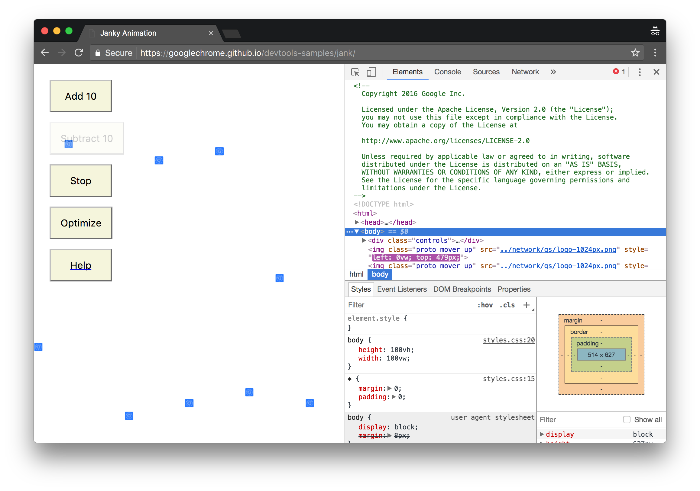
       <figcaption>
         <b>Figure 1</b>. The demo on the left, and DevTools on the right
       </figcaption>
     </figure>

     <aside class="note">
       **Note**: For the rest of the screenshots, DevTools is [undocked to a
       separate window](/web/tools/chrome-devtools/ui#placement) so that you
       can see its contents better.
     </aside>

### Simulate a mobile CPU

Mobile devices have much less CPU power than desktops and laptops. Whenever you
profile a page, use CPU Throttling to simulate how your page performs on
mobile devices.

1. In DevTools, click the **Performance** tab.

1. Make sure that the **Screenshots** checkbox is enabled.

1. Click **Capture Settings** ![Capture Settings][CS]{:.devtools-inline}.
   DevTools reveals settings related to how it captures performance
   metrics.

[CS]: imgs/capture-settings.png

1. For **CPU**, select **2x slowdown**. DevTools throttles your CPU so that it's
   2 times slower than usual.

     <figure>
       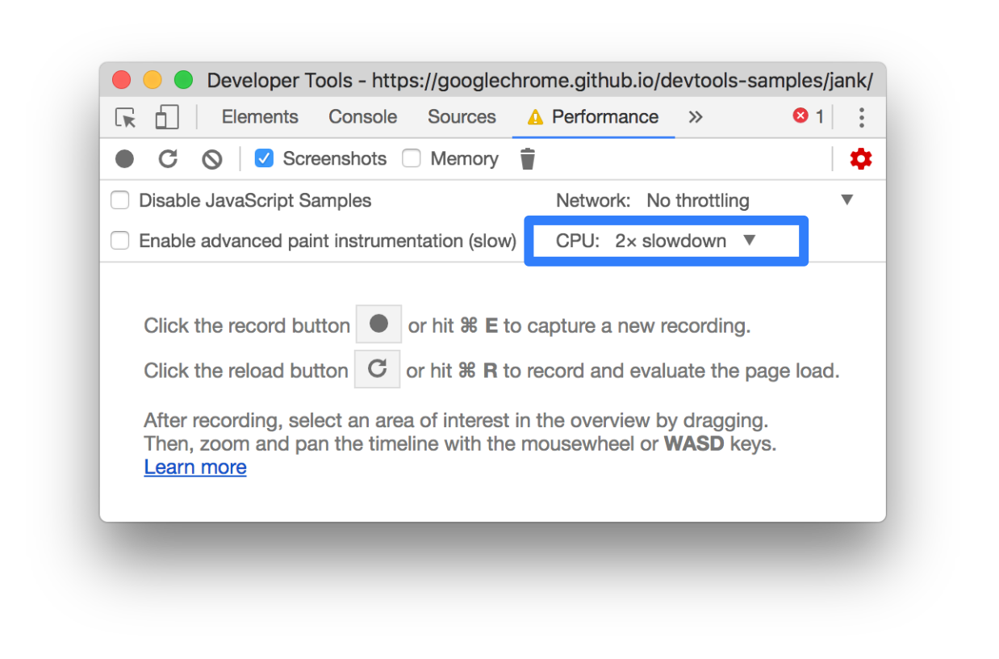
       <figcaption>
         <b>Figure 2</b>. CPU throttling, outlined in blue
       </figcaption>
     </figure>

     <aside class="note">
       **Note**: When testing other pages, if you want to ensure that they
       work well on low-end mobile devices, set CPU Throttling to **20x
       slowdown**. This demo doesn't work well with 20x slowdown, so it just
       uses 2x slowdown for instructional purposes.
     </aside>

### Set up the demo

It's hard to create a runtime performance demo that works consistently for all
readers of this website. This section lets you customize the demo to
ensure that your experience is relatively consistent with the screenshots and
descriptions you see in this tutorial, regardless of your particular
setup.

1. Keep clicking **Add 10** until the blue squares move noticeably slower than
   before. On a high-end machine, it may take about 20 clicks.

1. Click **Optimize**. The blue squares should move faster and more smoothly.

     <aside class="note">
       **Note**: If you don't see a noticeable difference between the optimized
       and un-optimized versions, try clicking **Subtract 10** a few times
       and trying again. If you add too many blue squares, you're just going
       to max out the CPU and you're not going to see a major difference in the
       results for the two versions.
     </aside>

1. Click **Un-Optimize**. The blue squares move slower and with more jank again.

### Record runtime performance {: #record }

When you ran the optimized version of the page, the blue squares move faster.
Why is that? Both versions are supposed to move each square the same amount of
space in the same amount of time. Take a recording in the Performance panel
to learn how to detect the performance bottleneck in the un-optimized version.

1. In DevTools, click **Record** ![Record][Record]{:.devtools-inline}.
   DevTools captures performance metrics as the page runs.

     <figure>
       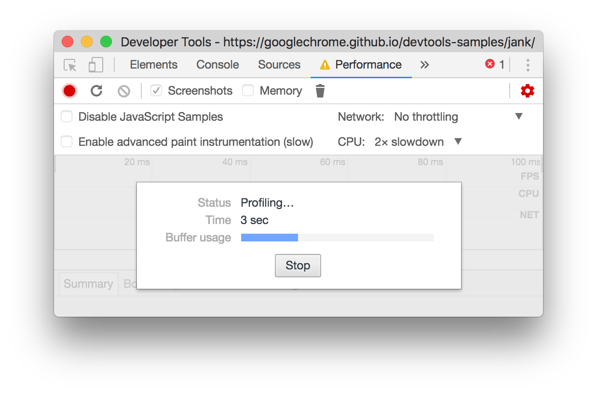
       <figcaption>
         **Figure 3**: Profiling the page
       </figcaption>
     </figure>

1. Wait a few seconds.
1. Click **Stop**. DevTools stops recording, processes the data, then
   displays the results on the Performance panel.

     <figure>
       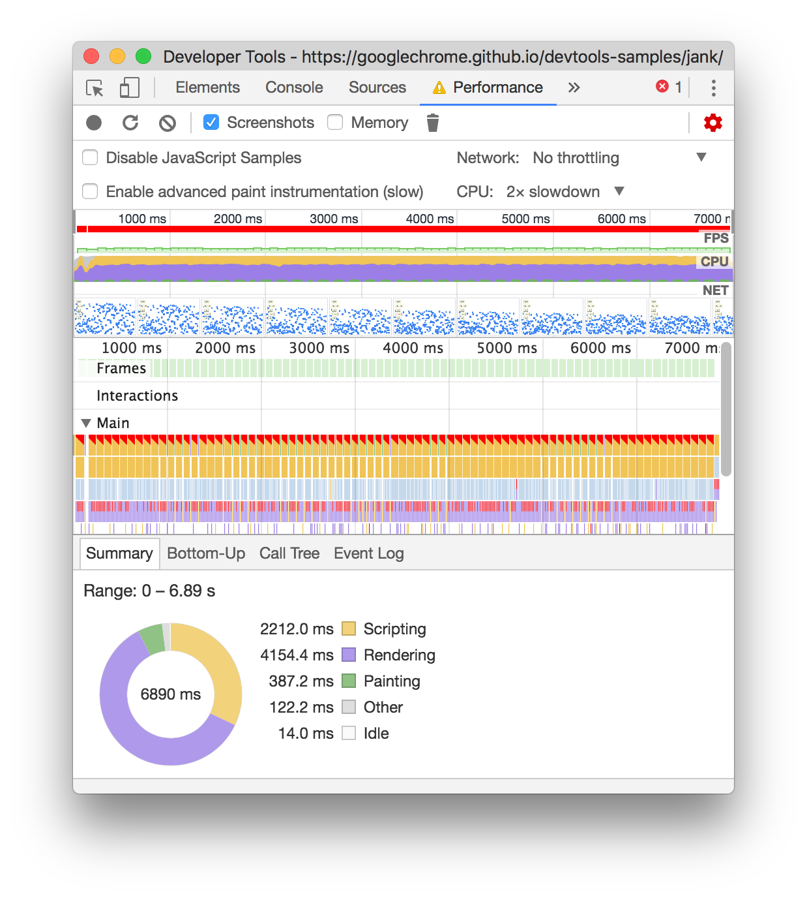
       <figcaption>
         **Figure 4**: The results of the profile
       </figcaption>
     </figure>

[Record]: imgs/record.png

Wow, that's an overwhelming amount of data. Don't worry, it'll all make
more sense shortly.

## Analyze the results {: #analyze }

Once you've got a recording of the page's performance, you can measure
how poor the page's performance is, and find the cause(s).

### Analyze frames per second

The main metric for measuring the performance of any animation is frames
per second (FPS). Users are happy when animations run at 60 FPS.

1. Look at the **FPS** chart. Whenever you see a red bar above
   **FPS**, it means that the framerate dropped so low that it's probably
   harming the user experience. In general, the higher the green bar, the
   higher the FPS.

     <figure>
       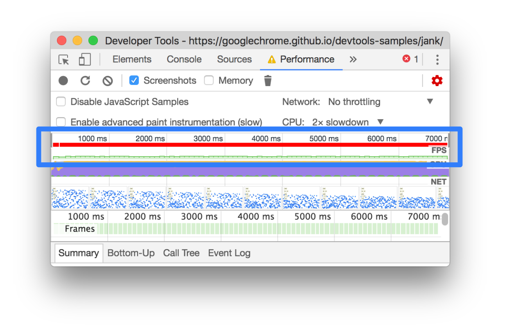
       <figcaption>
         **Figure 5**: The FPS chart, outlined in blue
       </figcaption>
     </figure>

1. Below the **FPS** chart you see the **CPU** chart. The colors in the
   **CPU** chart correspond to the colors in the **Summary** tab, at the
   bottom of the Performance panel. The fact that the **CPU** chart is full
   of color means that the CPU was maxed out during the recording. Whenever
   you see the CPU maxed out for long periods, it's a cue to find ways to
   do less work.

     <figure>
       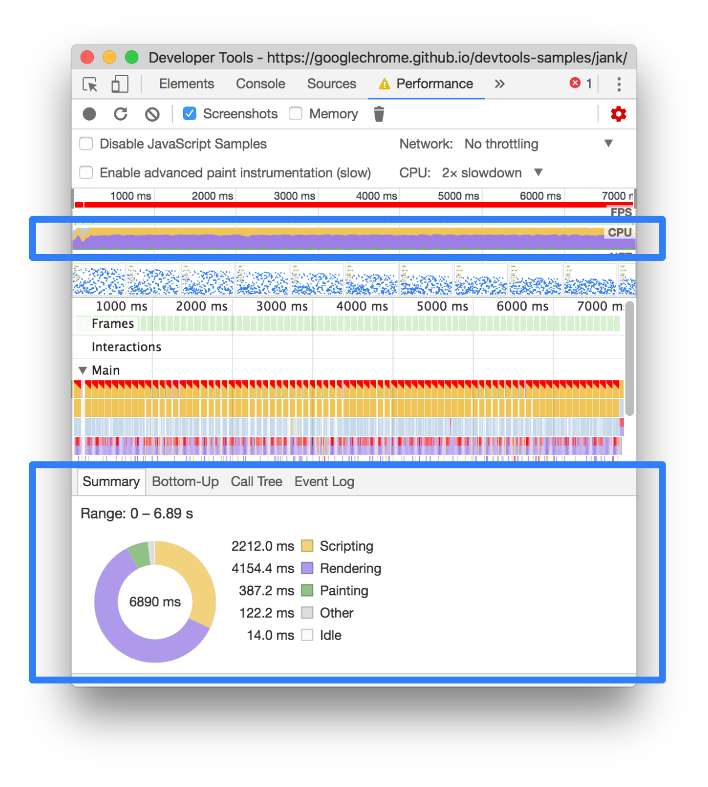
       <figcaption>
         **Figure 6**: The CPU chart and Summary tab, outlined in blue
       </figcaption>
     </figure>

1. Hover your mouse over the **FPS**, **CPU**, or **NET** charts. DevTools
   shows a screenshot of the
   page at that point in time. Move your mouse left and right to replay the
   recording. This is called scrubbing, and it's useful for manually
   analyzing the progression of animations.

     <figure>
       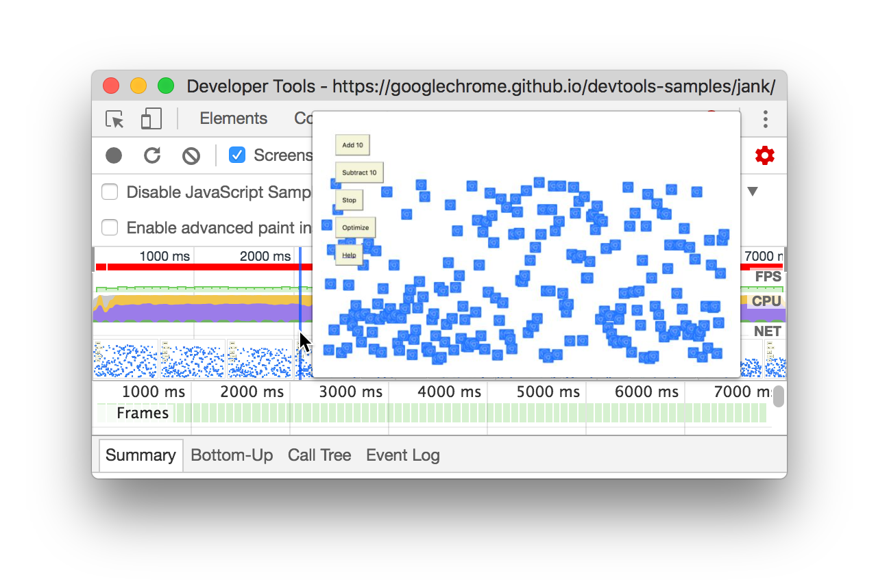
       <figcaption>
         **Figure 7**: Viewing a screenshot of the page around the 2000ms mark
         of the recording
       </figcaption>
     </figure>

1. In the **Frames** section, hover your mouse over one of the green
   squares. DevTools shows you the FPS for that particular frame. Each
   frame is probably well below the target of 60 FPS.

     <figure>
       
       <figcaption>
         **Figure 8**: Hovering over a frame
       </figcaption>
     </figure>

Of course, with this demo, it's pretty obvious that the page is not
performing well. But in real scenarios, it may not be so clear, so having
all of these tools to make measurements comes in handy.

#### Bonus: Open the FPS meter

Another handy tool is the FPS meter, which provides real-time estimates for
FPS as the page runs.

1. Press <kbd>Command</kbd>+<kbd>Shift</kbd>+<kbd>P</kbd> (Mac) or
   <kbd>Control</kbd>+<kbd>Shift</kbd>+<kbd>P</kbd> (Windows, Linux) to open
   the Command Menu.
1. Start typing `Rendering` in the Command Menu and select **Show Rendering**.
1. In the **Rendering** tab, enable **FPS Meter**. A new overlay appears in
   the top-right of your viewport.

     <figure>
       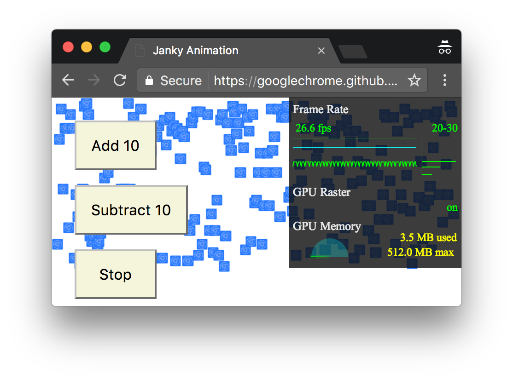
       <figcaption>
         **Figure 9**: The FPS meter
       </figcaption>
     </figure>

1. Disable the **FPS Meter** and press <kbd>Escape</kbd> to close the
   **Rendering** tab. You won't be using it in this tutorial.

### Find the bottleneck

Now that you've measured and verified that the animation is not performing
well, the next question to answer is: why?

1. Note the summary tab. When no events are selected, this tab shows you
   a breakdown of activity. The page spent most of its time rendering.
   Since performance is the art of doing less work, your goal is to reduce
   the amount of time spent doing rendering work.

     <figure>
       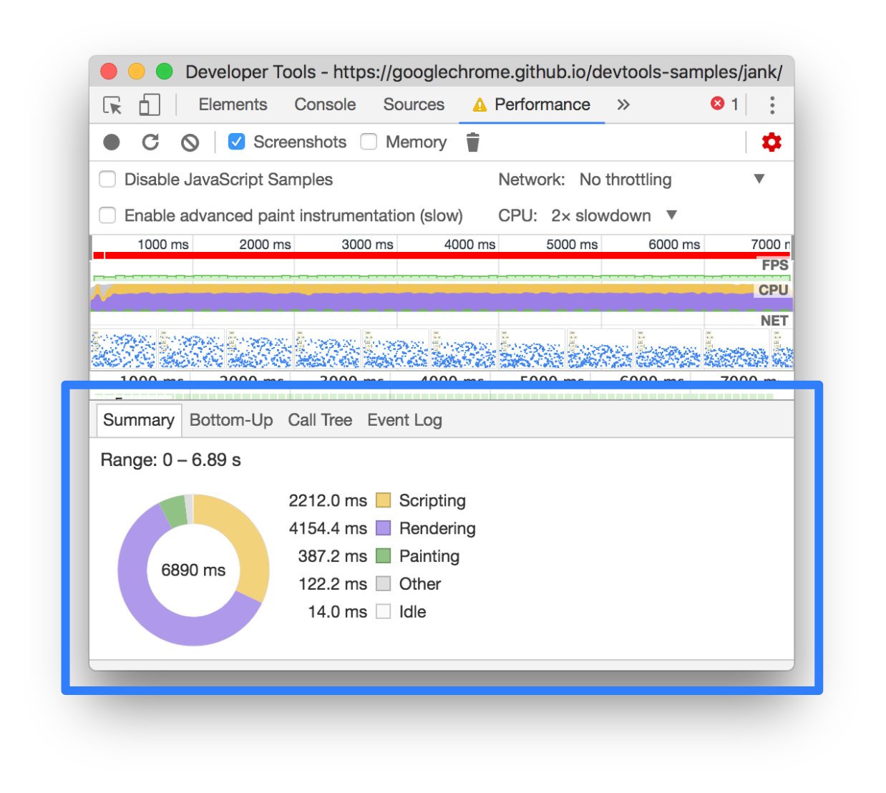
       <figcaption>
         **Figure 10**: The Summary tab, outlined in blue
       </figcaption>
     </figure>

1. Expand the **Main** section. DevTools shows you a flame chart of activity
   on the main thread, over time.
   The x-axis represents the recording, over time. Each bar represents an
   event. A wider bar means that event took longer. The y-axis represents
   the call stack. When you see events stacked on top of each other, it means
   the upper events caused the lower events.

     <figure>
       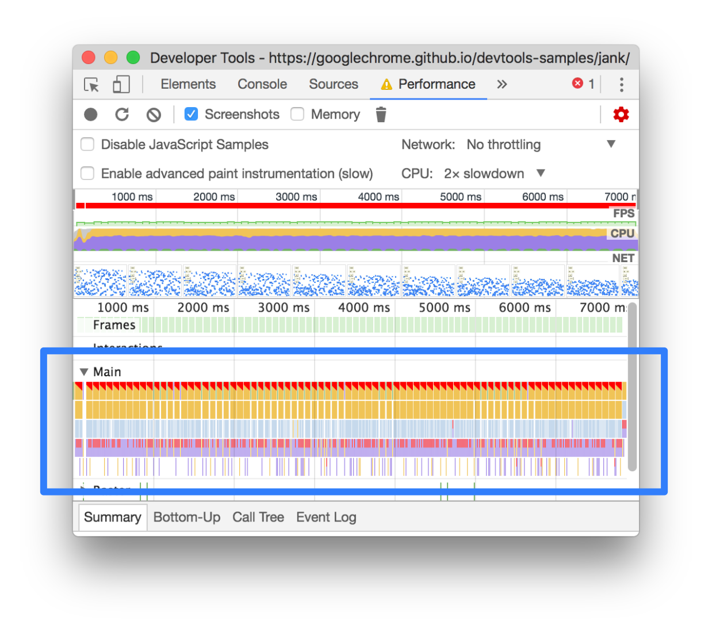
       <figcaption>
         **Figure 11**: The Main section, outlined in blue
       </figcaption>
     </figure>

1. There's a lot of data in the recording. Zoom in on a single **Animation
   Frame Fired** event by clicking, holding, and dragging
   your mouse over the **Overview**, which is the section that includes the
   **FPS**, **CPU**, and **NET** charts. The **Main** section and **Summary**
   tab only display information for the selected portion of the recording.

     <figure>
       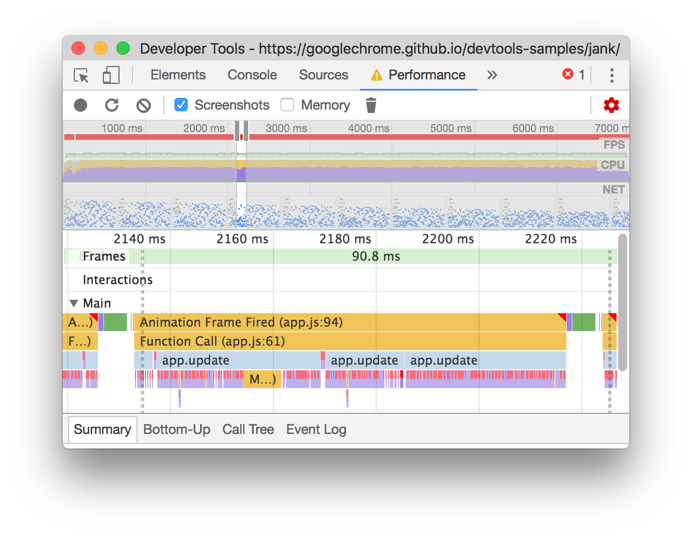
       <figcaption>
         **Figure 12**: Zoomed in on a single Animation Frame Fired event
       </figcaption>
     </figure>

     <aside class="note">
       **Note**: Another way to zoom is to focus the **Main** section by
       clicking its background or selecting an event, and then press the
       <kbd>W</kbd>, <kbd>A</kbd>, <kbd>S</kbd>, and <kbd>D</kbd> keys.
     </aside>

1. Note the red triangle in the top-right of the **Animation Frame Fired**
   event. Whenever you see a red triangle, it's a warning that there may be
   an issue related to this event.

     <aside class="note">
       **Note**: The **Animation Frame Fired** event occurs whenever a
       [`requestAnimationFrame()`][raf] callback is executed. 
     </aside>

[raf]: https://developer.mozilla.org/en-US/docs/Web/API/window/requestAnimationFrame

1. Click the **Animation Frame Fired** event. The **Summary** tab
   now shows you information about that event. Note the **reveal** link.
   Clicking that causes DevTools to highlight the event that initiated the
   **Animation Frame Fired** event. Also note the **app.js:94** link. Clicking
   that jumps you to the relevant line in the source code.

     <figure>
       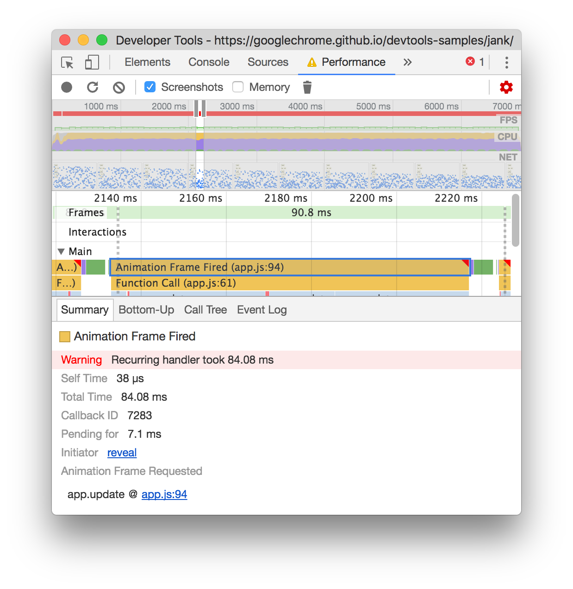
       <figcaption>
         **Figure 13**: More information about the Animation Frame Fired event
       </figcaption>
     </figure>

     <aside class="note">
       **Note**: After selecting an event, use the arrow keys to select
       the events next to it.
     </aside>

1. Under the **app.update** event, there's a bunch of purple events. If
   they were wider, it looks as though each one might have a red triangle on
   it. Click one of the purple **Layout** events now. DevTools provides
   more information about the event in the **Summary** tab. Indeed, there's
   a warning about forced reflows (another word for layout).

1. In the **Summary** tab, click the **app.js:70** link under **Layout
   Forced**. DevTools takes you to the line of code that forced the layout.

     <figure>
       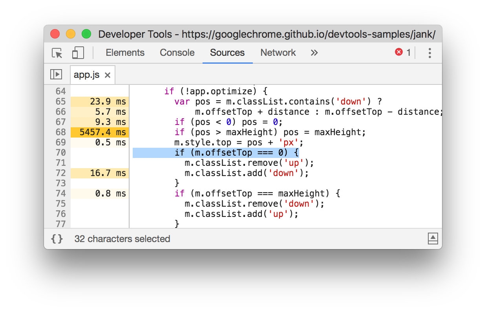
       <figcaption>
         **Figure 13**: The line of code that caused the forced layout
       </figcaption>
     </figure>

     <aside class="note">
       **Note**: The problem with this code is that, in each animation frame,
       it changes the style for each square, and then queries the position
       of each square on the page. Because the styles changed, the browser
       doesn't know if each square's position changed, so it has to re-layout
       the square in order to compute its position. See [Avoid forced
       synchronous layouts][avoid] to learn more.
     </aside>

[avoid]: /web/fundamentals/performance/rendering/avoid-large-complex-layouts-and-layout-thrashing#avoid_forced_synchronous_layouts

Phew! That was a lot to take in, but you now have a solid foundation in
the basic workflow for analyzing runtime performance. Good job.

### Bonus: Analyze the optimized version

Using the workflows and tools that you just learned, click **Optimize** on
the demo to enable the optimized code, take another performance recording,
and then analyze the results. From the improved framerate to the reduction
in events in the **Main** section's flame chart, you can see that the
optimized version of the app does much less work, resulting in better
performance.

Note: Even this "optimized" version isn't that great, because it still
manipulates the `top` property of each square. A better approach is to
stick to properties that only affect compositing. See [Use transform and
opacity changes for animations][compositor] for more information.

[compositor]: /web/fundamentals/performance/rendering/stick-to-compositor-only-properties-and-manage-layer-count#use_transform_and_opacity_changes_for_animations

## Next steps

The foundation for understanding performance is the RAIL model. This model
teaches you the performance metrics that are most important to your users.
See [Measure Performance With The RAIL Model][RAIL] to learn more.

To get more comfortable with the Performance panel, practice makes perfect.
Try profiling your own pages and analyzing the results.
If you have any questions about your results,
[open a Stack Overflow question tagged with `google-chrome-devtools`][SO].
Include screenshots or links to reproducible pages, if possible.

[SO]: http://stackoverflow.com/questions/ask?tags=google-chrome-devtools

To really master runtime performance, you've got learn how
the browser translates HTML, CSS, and JS into pixels on a screen. The best
place to start is the [Rendering Performance Overview][RP]. [The Anatomy Of A
Frame][Anatomy] dives into even more detail.

Last, there are many ways to improve runtime performance. This tutorial
focused on one particular animation bottleneck to give you a focused tour
through the Performance panel, but it's only one of many bottlenecks you may
encounter. The rest of the Rendering Performance series has a lot of good
tips for improving various aspects of runtime performance, such as:

* [Optimizing JS Execution][ojs]
* [Reduce The Scope And Complexity Of Style Calculations][Scope]
* [Avoid Large, Complex Layouts And Layout Thrashing][Thrashing]
* [Simplify Paint Complexity And Reduce Paint Areas][Paint]
* [Stick To Compositor-Only Properties And Manage Layer Count][Layer]
* [Debounce Your Input Handlers][Debounce]

[RP]: /web/fundamentals/performance/rendering/
[Anatomy]: https://aerotwist.com/blog/the-anatomy-of-a-frame/
[ojs]: /web/fundamentals/performance/rendering/optimize-javascript-execution
[Scope]: /web/fundamentals/performance/rendering/reduce-the-scope-and-complexity-of-style-calculations
[Thrashing]: /web/fundamentals/performance/rendering/avoid-large-complex-layouts-and-layout-thrashing
[Paint]: /web/fundamentals/performance/rendering/simplify-paint-complexity-and-reduce-paint-areas
[Layer]: /web/fundamentals/performance/rendering/stick-to-compositor-only-properties-and-manage-layer-count
[Debounce]: /web/fundamentals/performance/rendering/debounce-your-input-handlers
