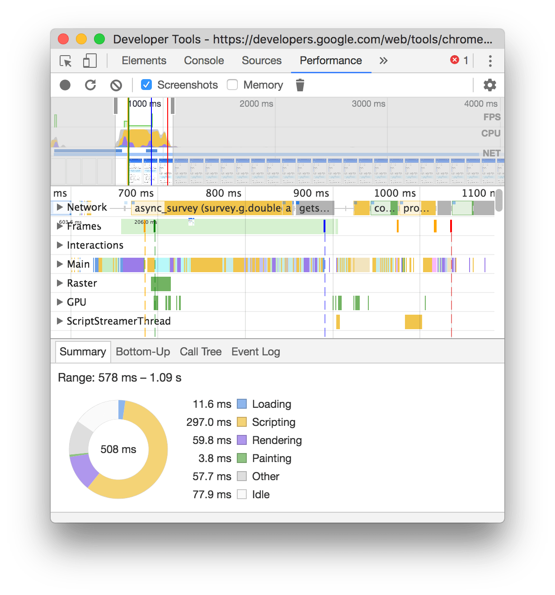

project_path: /web/_project.yaml
book_path: /web/tools/_book.yaml
description: Learn how to use the Chrome DevTools Performance panel to analyze page load performance.

{# wf_updated_on: 2017-03-29 #}
{# wf_published_on: 2017-03-29 #}



# Get Started With Analyzing Load Performance {: .page-title }



Learn how to analyze page load performance in the Chrome DevTools Performance
panel in this step-by-step, interactive tutorial.
Your mission is to analyze the load performance of a page you're about to
ship to make sure that it loads well on mobile devices.

Note: [Get Started With Analyzing Network Performance][net] also teaches
you how to analyze load performance, but from the Network panel. In general,
the workflow explained in this tutorial should be your starting point because
it provides better detail about all the potential causes of slow load time.
Use the Network panel workflow when you've isolated your issues to the
network.

[net]: /web/tools/chrome-devtools/network-performance/



## Measure load performance {: #measure }

Now, you're going to record the page load using the Performance
panel, and then analyze the results.

1. On the **Performance** panel, click **Reload Page**
   ![Reload Page][reload]{:.devtools-inline}. DevTools captures performance
   metrics while the page reloads.

     <figure>
       
         <b>Figure 3</b>: The page load performance metrics
       </figcaption>
     </figure>

1. Note the **CPU** chart. This tells you how hard the
   CPU was working while the page loaded. *If* you were to see **CPU** maxed
   out for multiple seconds, it would mean that a script was doing a lot of
   work on the main thread, which delays the load time, because the script
   must finish before the browser can continue. However, in this case,
   CPU usage looks OK, so there's nothing to do here.

     <figure>
       
         <b>Figure 4</b>: The CPU chart, outlined in blue
       </figcaption>
     </figure>

     <aside class="key-point">
       **Key Point**: If you see a lot of CPU work going on while the page
       loads, expand the **Main** section to examine the JS flame chart and
       find calls that can be sped up or deferred to idle time.
     </aside>

1. Above the **CPU** chart you see the **FPS** chart. And below **CPU** you
   see **NET**. This whole section of the UI is called the **Overview**. Hover
   your mouse anywhere in the **Overview**, and you see a screenshot of the
   page at that point in time. Scrub your mouse left and right, and you can
   watch how the page load progressed.

     <figure>
       
         <b>Figure 5</b>: Scrubbing across the <b>Overview</b> to see how the
         page load progressed
       </figcaption>
     </figure>

1. Note how there's a flash of grey when the page initially paints content
   to the screen. If you run the page without any network or CPU throttling,
   you probably won't see this. Situations like this are why it's important
   to simulate mobile user experiences!

     <aside class="note">
       <b>Note</b>: If you do try loading the page now without CPU or
       network throttling, remember to turn them back on when you're done.
     </aside>

1. Using the screenshots as your guides, note the approximate time at which
   the page first paints content to the screen. In Figure 6, you can see
   that the first paint occurs after the 1000ms mark. The [RAIL][RAIL]
   performance model recommends that pages load content in 1000ms maximum.
   The page doesn't need to be *complete* in that time frame, but *some*
   content should be displayed so that the user knows the page is working.

     <figure>
       
         <b>Figure 6</b>: The approximate time of the first paint
       </figcaption>
     </figure>

     <aside class="key-point">
       **Key Point**: Use screenshots to approximate when the page first
       painted content to the screen. If the page painted some content before
       1000ms, then you're good.
     </aside>

[RAIL]: /web/fundamentals/performance/rail#load

1. To find network bottlenecks, expand the **Network** section. Note how
   the page requests three CSS stylesheets: `header.css`, `nav.css`, and
   `content.css`. The little blue squares at the top-left of each request
   mean that these are high priority requests. The browser must load all
   high-priority requests before it can paint content to the page. In
   Figure 7, these requests delay the load time by about 400ms.

     <figure>
       
         <b>Figure 7</b>: The network requests that the page made
       </figcaption>
     </figure>

     <aside class="key-point">
       **Key Point**: Use the **Network** section to find network bottlenecks.
     </aside>

The Performance panel obviously provides much more information, but what
you've learned so far is a decent introduction to analyzing load performance.
Through measuring and analyzing this page, you learned:

* CPU usage was low, meaning that the page didn't execute an
  excessive amount of JavaScript. If CPU usage was high, you could speed up
  page load time by deferring non-critical JS.
* There appears to be a bug when the page first paints content. The grey
  menu flashes on the screen and then disappears. You probably wouldn't have
  noticed this if you only tested on a laptop with Wi-Fi.
* The page makes multiple requests for CSS stylesheets, each of which blocks
  the page load time. If you can inline these stylesheets into the main
  document, you can speed up load time.

[reload]: imgs/reload-page.png

## Measure the optimized page {: #measure-again }

Armed with the knowledge from your analysis, you make some updates to
the page. Specifically, you inline the CSS requests, and you rewrite the
menu logic to prevent the menu from flashing when the page first loads.

It's always good practice to measure your page load performance
after making any optimizations, to make sure that the changes actually
work, and to make sure you haven't introduced any other problems.

1. Load the updated page in your Incognito window.

     `https://googlechrome.github.io/devtools-samples/perf/v2`

1. Record the update page's load performance, using the workflow you
   learned in the last section.

     <figure>
       
         <b>Figure 8</b>: A recording of the optimized page's load performance
       </figcaption>
     </figure>

1. In the **Network** section, note how the page only makes one request:
   the main document.

1. Using the screenshots as your guide, note how the page does not flash
   the grey menu on first paint anymore.

1. Again using the screenshots, note how the page now paints content to the
   screen in under 1000ms.

Everything looks good. Ship it!

## Next steps {: #next-steps }

* If you really want to dive into the theory of how to optimize page load
  speed, the [Critical Rendering Path][CRP] series is a must-read. The
  [Optimizing Content Efficiency][OCE] series also teaches you some strategies
  on shipping as few bytes as possible.
* You can also analyze page load speed from the Network panel. The Network
  panel workflow is useful if you've isolated your load problems to the
  network, and you want to analyze each network request in more depth.
  See [Get Started With Analyzing Network Performance][NETGS] to learn the
  basics.
* If you want to study the differences between the two versions of the page,
  here's the source for [version 1][v1] and [version 2][v2].
* This tutorial used a lot of approximations to measure load speed. 
  [Lighthouse][LH] provides an automated way to get exact load
  performance measurements.

[CRP]: /web/fundamentals/performance/critical-rendering-path/
[NETGS]: /web/tools/chrome-devtools/network-performance/
[OCE]: /web/fundamentals/performance/optimizing-content-efficiency/
[v1]: https://github.com/GoogleChrome/devtools-samples/tree/master/perf/v1
[v2]: https://github.com/GoogleChrome/devtools-samples/tree/master/perf/v2
[LH]: /web/tools/lighthouse
