project_path: /web/tools/_project.yaml
book_path: /web/tools/_book.yaml
description: A reference on all the ways to record and analyze performance in Chrome DevTools.

{# wf_updated_on: 2017-05-17 #}
{# wf_published_on: 2017-05-08 #}



# Performance Analysis Reference {: .page-title }



This page is a comprehensive reference of Chrome DevTools features related
to analyzing performance.

See [Get Started With Analyzing Runtime Performance][GS] for a guided tutorial
on how to analyze a page's performance using Chrome DevTools.

[GS]: /web/tools/chrome-devtools/evaluate-performance/

## Record performance {: #record }

### Record runtime performance {: #record-runtime }

Record runtime performance when you want to analyze the performance of a page
as it's running, as opposed to loading.

1. Go to the page that you want to analyze.
1. Click the **Performance** tab in DevTools.
1. Click **Record** ![Record][R]{:.cdt-inl}.

     <figure>
       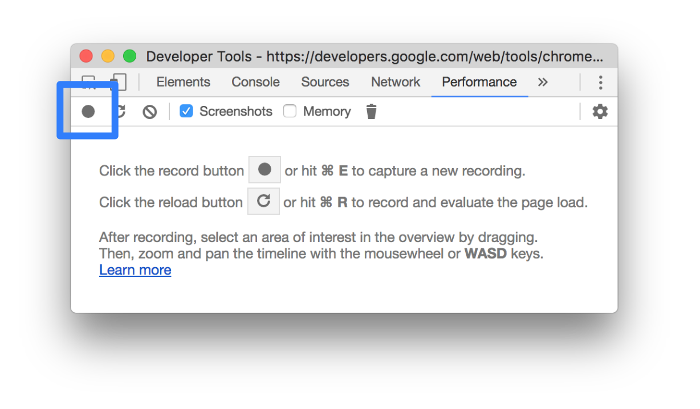
       <figcaption>
         <b>Figure 1</b>. <b>Record</b>, outlined in blue
       </figcaption>
     </figure>

[R]: imgs/record.png

1. Interact with the page. DevTools records all page activity that occurs
   as a result of your interactions.
1. Click **Record** again or click **Stop** to stop recording.

### Record load performance {: #record-load }

Record load performance when you want to analyze the performance of a page
as it's loading, as opposed to running.

1. Go to the page that you want to analyze.
1. Open the **Performance** panel of DevTools.
1. Click **Reload page** ![Reload Page][RP]{:.cdt-inl}. DevTools records
   performance metrics while the page reloads and then automatically stops
   the recording a couple seconds after the load finishes.

     <figure>
       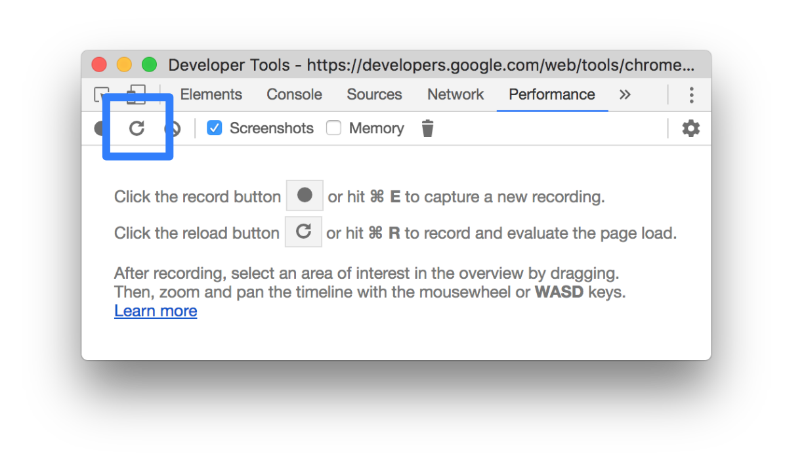
       <figcaption>
         <b>Figure 2</b>. <b>Reload page</b>, outlined in blue
       </figcaption>
     </figure>

DevTools automatically zooms in on the portion of the recording where most
of the activity occurred.

[RP]: imgs/reload-page.png

<figure>
  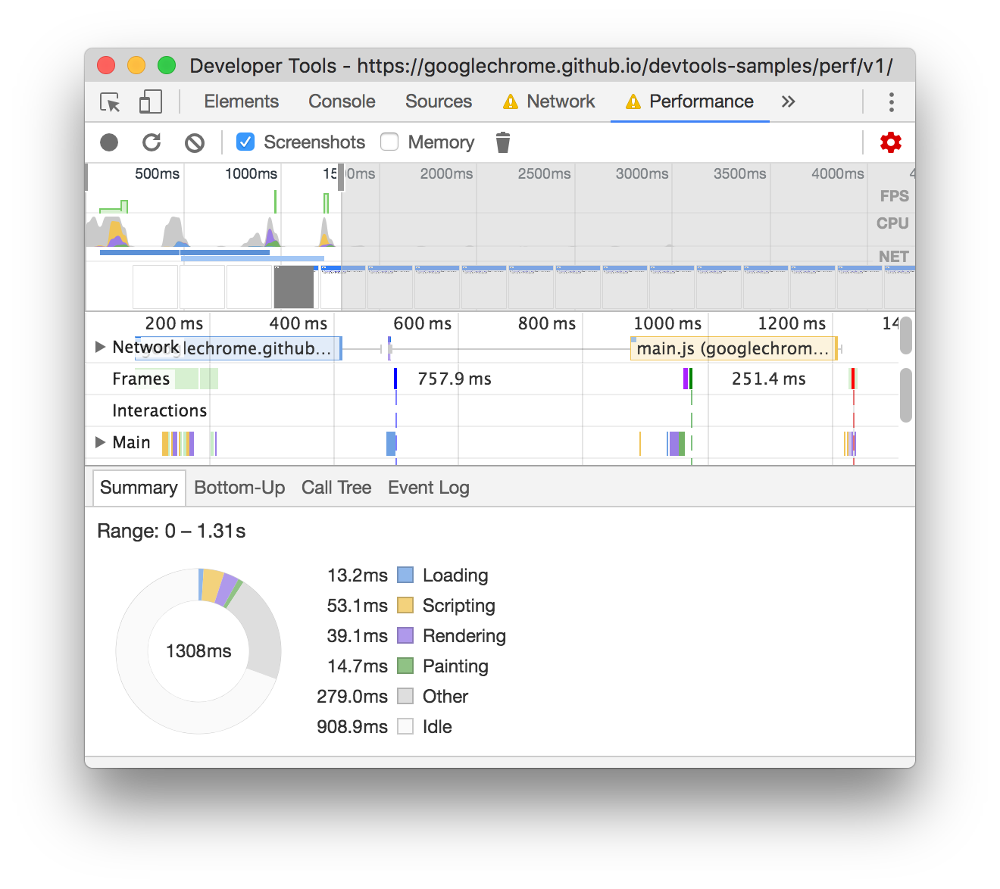
  <figcaption>
    <b>Figure 3</b>. A page-load recording
  </figcaption>
</figure>

### Capture screenshots while recording {: #screenshots }

Enable the **Screenshots** checkbox to capture a screenshot of every frame
while recording.

<figure>
  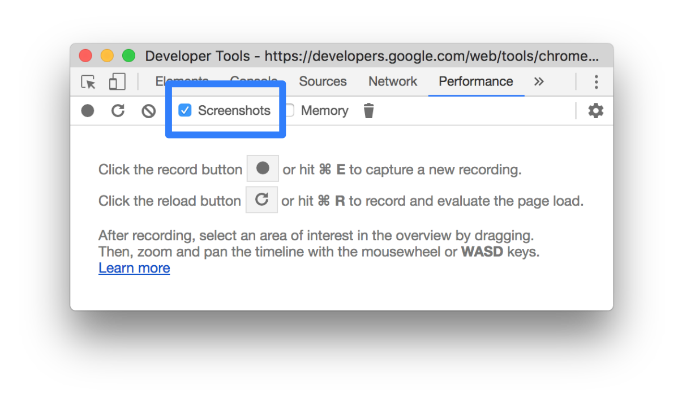
  <figcaption>
    <b>Figure 4</b>. The <b>Screenshots</b> checkbox
  </figcaption>
</figure>

See [View a screenshot](#view-screenshot) to learn how to interact with
screenshots.

### Force garbage collection while recording {: #garbage }

While you are recording a page, click **Collect garbage**
![Collect garbage][CG]{:.cdt-inl} to force garbage collection.

<figure>
  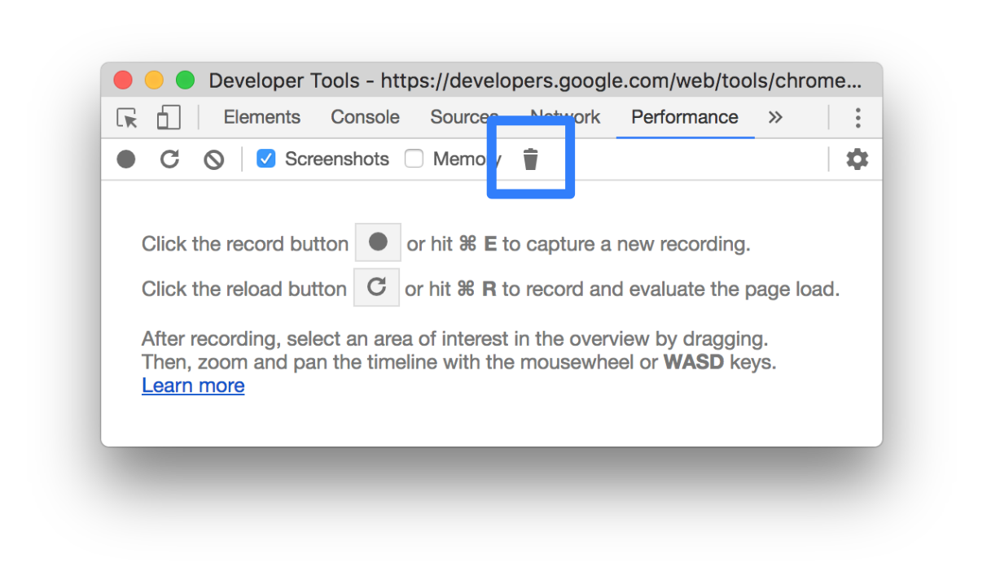
  <figcaption>
    <b>Figure 5</b>. Collect garbage, outlined in blue
  </figcaption>
</figure>

[CG]: imgs/collect-garbage.png

### Show recording settings {: #settings }

Click **Capture settings** ![Capture settings][CS]{:.cdt-inl} to expose
more settings related to how DevTools captures performance recordings.

[CS]: imgs/capture-settings.png

<figure>
  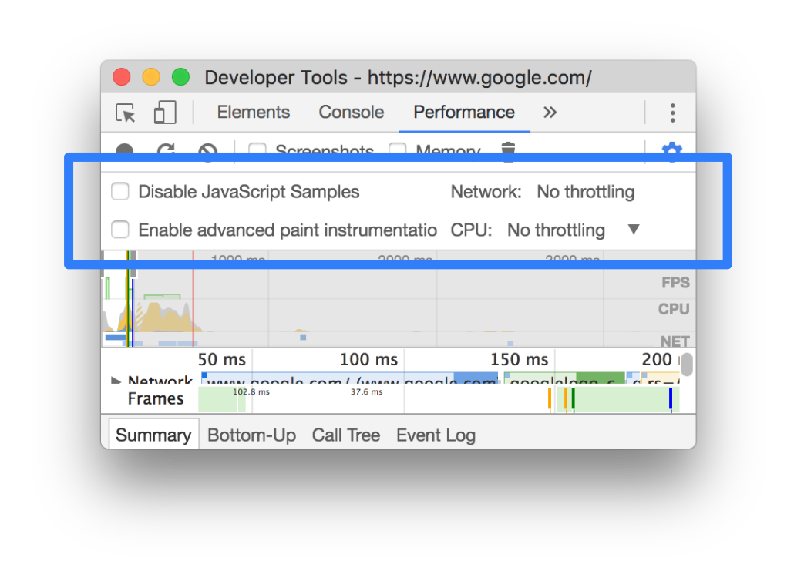
  <figcaption>
    <b>Figure 6</b>. The <b>Capture settings</b> section, outlined in blue
  </figcaption>
</figure>

### Disable JavaScript samples {: #disable-js-samples }

By default, the **Main** section of a recording displays detailed call
stacks of JavaScript functions that were called during the recording. To
disable these call stacks:

1. Open the **Capture settings** menu. See [Show recording settings](#settings).
1. Enable the **Disable JavaScript Samples** checkbox.
1. Take a recording of the page.

Figure 7 and Figure 8 show the difference between disabling and enabling
JavaScript samples. The **Main** section of the recording is much shorter
when sampling is disabled, because it omits all of the JavaScript call stacks.

<figure>
  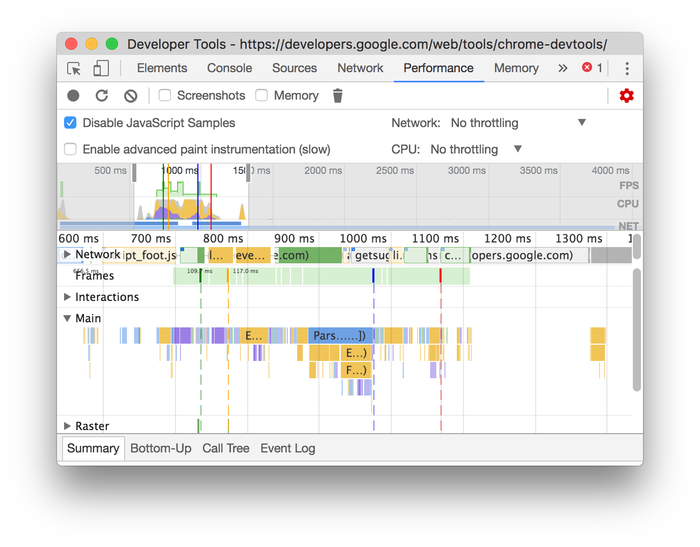
  <figcaption>
    <b>Figure 7</b>. An example of a recording when JS samples are disabled
  </figcaption>
</figure>

<figure>
  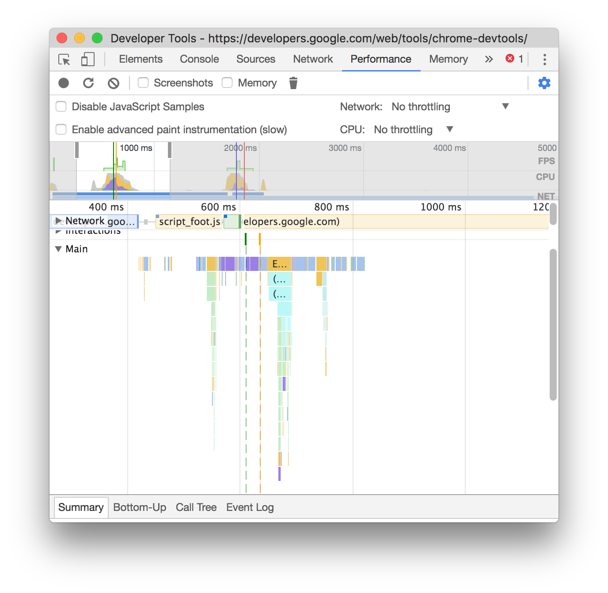
  <figcaption>
    <b>Figure 8</b>. An example of a recording when JS samples are enabled
  </figcaption>
</figure>

### Throttle the network while recording {: #network-throttle }

To throttle the network while recording:

1. Open the **Capture settings** menu. See [Show recording settings](#settings).
1. Set **Network** to the desired level of throttling.

### Throttle the CPU while recording {: #cpu-throttle }

To throttle the CPU while recording:

1. Open the **Capture settings** menu. See [Show recording settings](#settings).
1. Set **CPU** to the desired level of throttling.

Throttling is relative to your computer's capabilities. For example, the
**2x slowdown** option makes your CPU operate 2 times slower than its usual
ability. DevTools can't truly simulate the CPUs of mobile devices, because
the architecture of mobile devices is very different from that of desktops
and laptops.

### Enable advanced paint instrumentation {: #paint }

To view detailed paint instrumentation:

1. Open the **Capture settings** menu. See [Show recording settings](#settings).
1. Check the **Enable advanced paint instrumentation** checkbox.

To learn how to interact with the paint information, see [View layers](#layers)
and [View paint profiler](#paint-profiler).

## Save a recording {: #save }

To save a recording, right-click and select **Save Profile**.

<figure>
  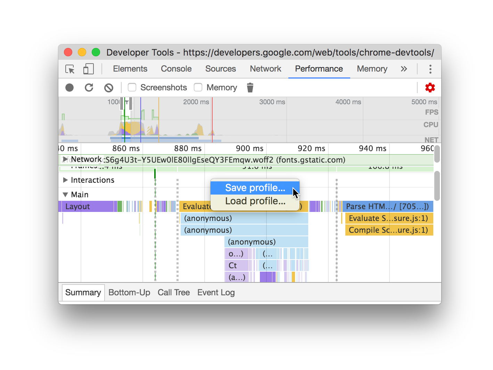
  <figcaption>
    <b>Figure 9</b>. <b>Save Profile</b>
  </figcaption>
</figure>

## Load a recording {: #load }

To load a recording, right-click and select **Load Profile**.

<figure>
  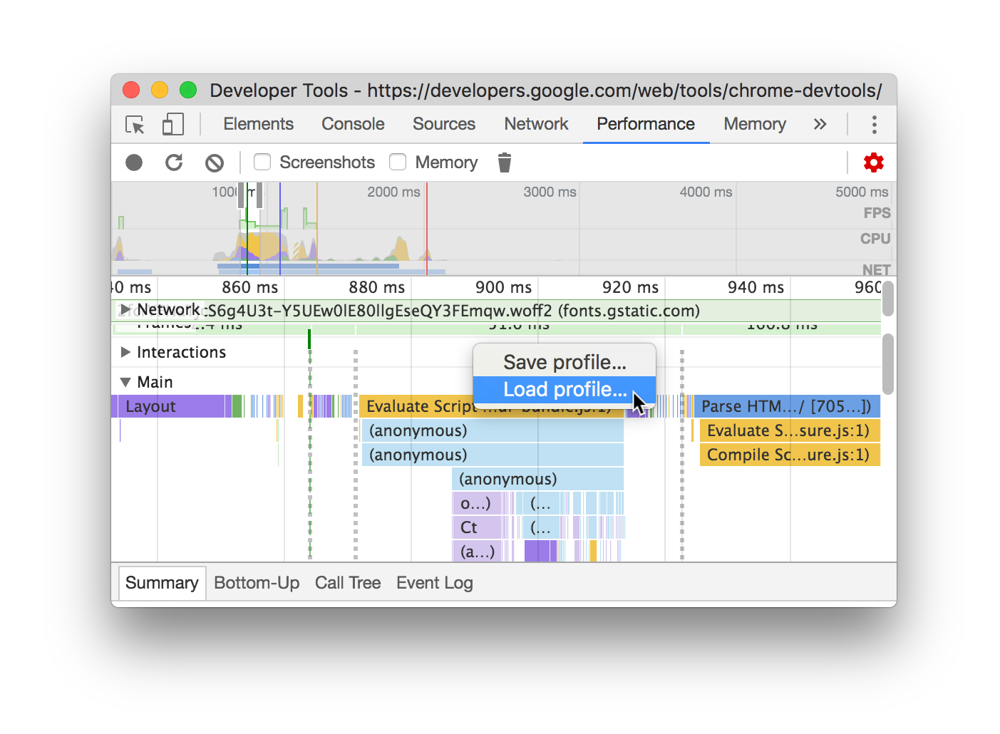
  <figcaption>
    <b>Figure 10</b>. <b>Load Profile</b>
  </figcaption>
</figure>

## Clear the previous recording {: #clear }

After making a recording, press **Clear recording** ![Clear
recording][CR]{:.cdt-inl} to clear that recording from the **Performance**
panel.

[CR]: imgs/clear-recording.png

<figure>
  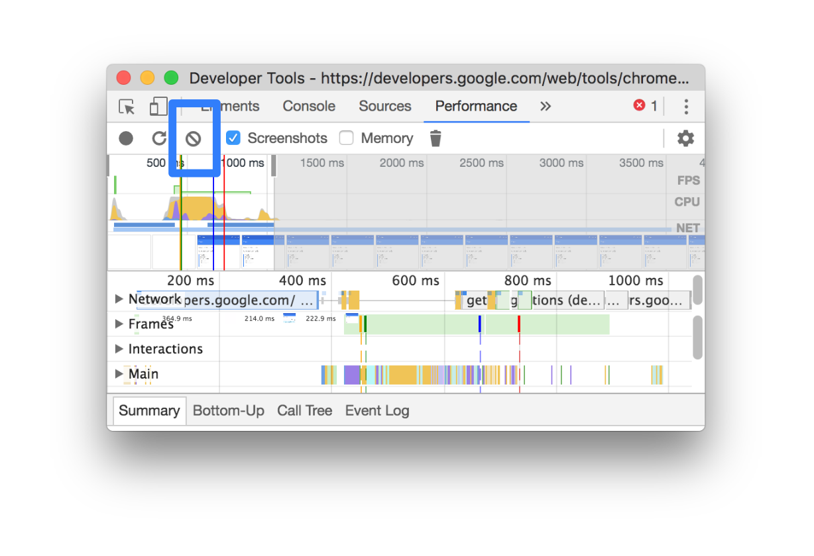
  <figcaption>
    <b>Figure 11</b>. Clear recording, outlined in blue
  </figcaption>
</figure>

## Analyze a performance recording {: #analyze }

After you [record runtime performance](#record-runtime) or [record load
performance](#record-load), the **Performance** panel provides a lot of data
for analyzing the performance of what just happened.

### Select a portion of a recording {: #select }

Drag your mouse left or right across the **Overview** to select a portion
of a recording. The **Overview** is the section that contains the **FPS**,
**CPU**, and **NET** charts.

<figure>
  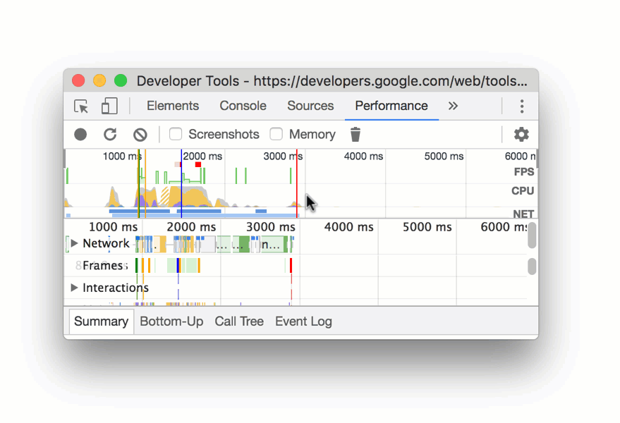
  <figcaption>
    <b>Figure 12</b>. Dragging the mouse across the Overview to zoom
  </figcaption>
</figure>

To select a portion using the keyboard:

1. Click on the background of the **Main** section, or any of the sections
   next to it, such as **Interactions**, **Network**, or **GPU**. This
   keyboard workflow only works when one of these sections is in focus.
1. Use the <kbd>W</kbd>, <kbd>A</kbd>, <kbd>S</kbd>, <kbd>D</kbd> keys
   to zoom in, move left, zoom out, and move right, respectively.

To select a portion using a trackpad:

1. Hover your mouse over the **Overview** section or the **Details** section.
   The **Overview** section is the area containing the **FPS**, **CPU**, and
   **NET** charts. The **Details** section is the area containing the **Main**
   section, the **Interactions** section, and so on.
1. Using two fingers, swipe up to zoom out, swipe left to move left, swipe
   down to zoom in, and swipe right to move right.

To scroll a long flame chart in the **Main** section or any of its neighbors,
click and hold while dragging up and down. Drag left and right to move what
portion of the recording is selected.

### Search activities {: #search }

Press <kbd>Command</kbd>+<kbd>F</kbd> (Mac) or
<kbd>Control</kbd>+<kbd>F</kbd> (Windows, Linux) to open the search box
at the bottom of the **Performance** panel.

<figure>
  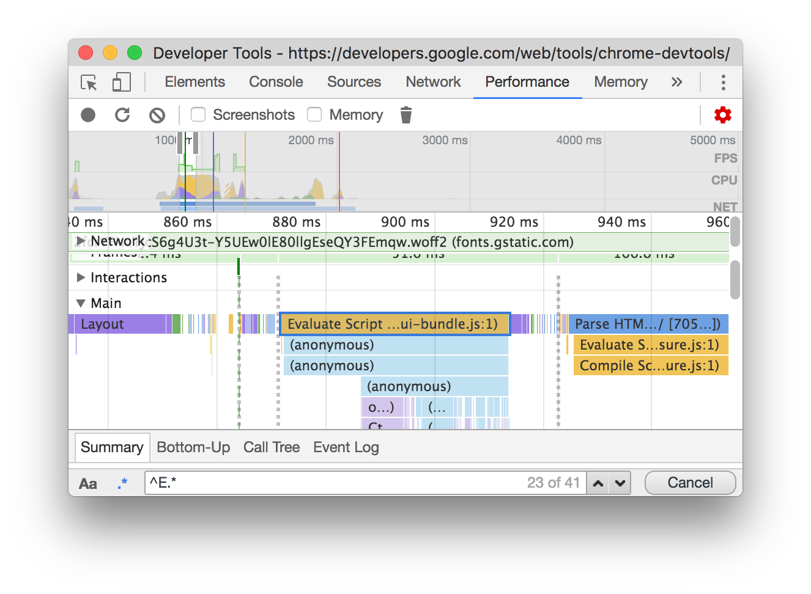
  <figcaption>
    <b>Figure 13</b>. Using regex in the search box at the bottom of the
    window to find any activity that begins with `E`
  </figcaption>
</figure>

To navigate activities that match your query:

* Use the **Previous** 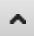{:.cdt-inl} and **Next**
  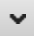{:.cdt-inl} buttons.
* Press <kbd>Shift</kbd>+<kbd>Enter</kbd> to select the previous or
  <kbd>Enter</kbd> to select the next.

To modify query settings:

* Press **Case sensitive** {:.cdt-inl}
  to make the query case sensitive.
* Press **Regex** {:.cdt-inl} to use a regular
  expression in your query.

To hide the search box, press **Cancel**.

### View main thread activity {: #main }

Use the **Main** section to view activity that occurred on the page's main
thread.

<figure>
  
  <figcaption>
    <b>Figure 14</b>. The <b>Main</b> section, outlined in blue
  </figcaption>
</figure>

Click on an event to view more information about it in the **Summary** tab.
DevTools outlines the selected event in blue.

<figure>
  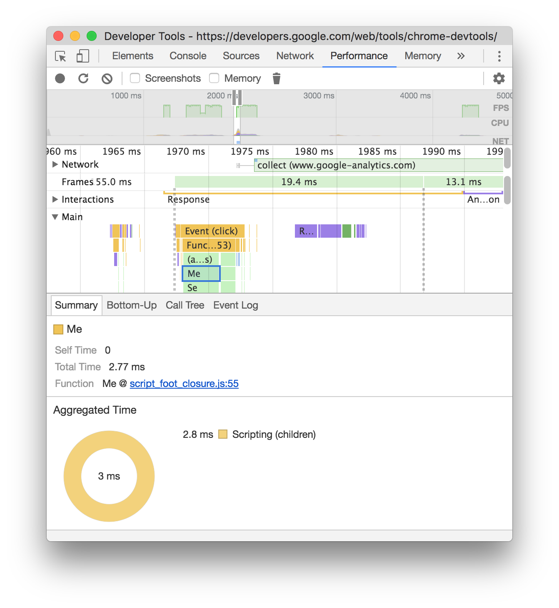
  <figcaption>
    <b>Figure 15</b>. More information about the <code>Me</code> function
    call event in the <b>Summary</b> tab
  </figcaption>
</figure>

DevTools represents main thread activity with a flame chart. The x-axis
represents the recording over time. The y-axis represents the call stack.
The events on top cause the events below it.

<figure>
  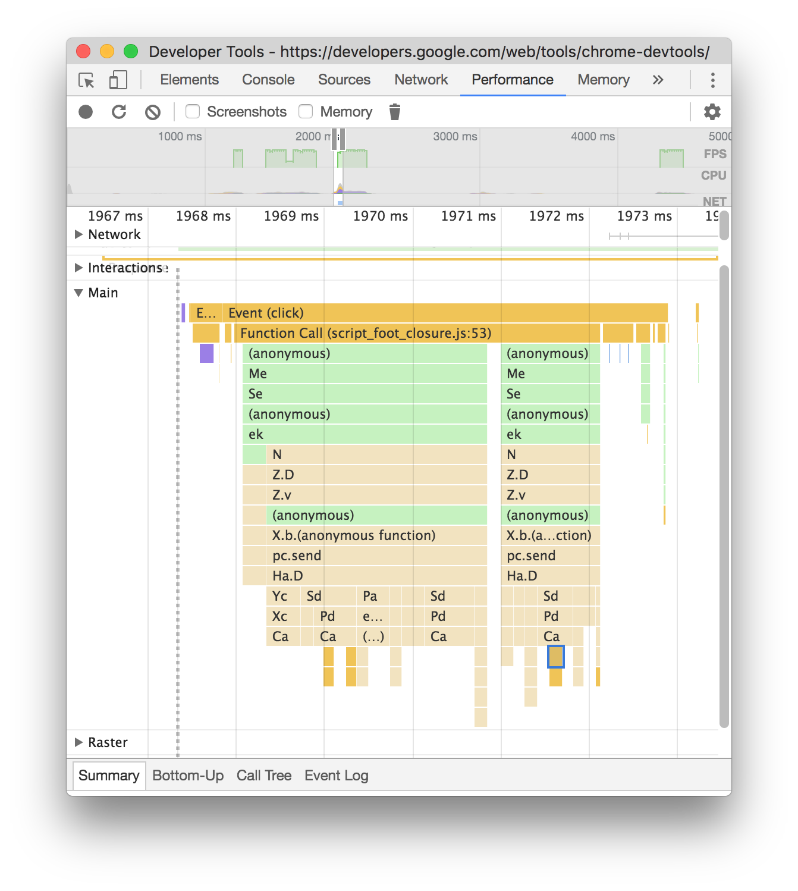
  <figcaption>
    <b>Figure 16</b>. A flame chart in the <b>Main</b> section
  </figcaption>
</figure>

In Figure 16, a `click` event caused a function call in `script_foot_closure.js`
on line 53. Below `Function Call` you see that an anonymous function was
called. That anonymous function then called `Me()`, which then called `Se()`,
and so on.

DevTools assigns scripts random colors. In Figure 16, function calls from
one script are colored light green. Calls from another script are colored
beige. The darker yellow represents scripting activity, and the purple
event represents rendering activity. These darker yellow and purple events
are consistent across all recordings.

See [Disable JavaScript samples](#disable-js-samples) if you want to hide the
detailed flame chart of JavaScript calls. When JS samples are disabled,
you only see high-level events such as `Event (click)` and `Function
Call (script_foot_closure.js:53)` from Figure 16.

### View activities in a table {: #activities }

After recording a page, you don't need to rely solely on the **Main** section
to analyze activities. DevTools also provides three tabular views for
analyzing activities. Each view gives you a different perspective on the
activities:

* When you want to view the root activities that cause the most work, use [the
  **Call Tree** tab](#call-tree).
* When you want to view the activities where the most time was directly spent,
  use [the **Bottom-Up** tab](#bottom-up).
* When you want to view the activities in the order in which they occurred
  during the recording, use [the **Event Log** tab](#event-log).

Note: The next three sections all refer to the same demo. You can run the
demo yourself at [Activity Tabs Demo][ATD] and see the source at
[GoogleChrome/devtools-samples/perf/activitytabs.html][ATS].

[ATD]: https://googlechrome.github.io/devtools-samples/perf/activitytabs
[ATS]: https://github.com/GoogleChrome/devtools-samples/blob/master/perf/activitytabs.html

#### Root activities {: #root-activities }

Here's an explanation of the *root activities* concept that's mentioned
in the **Call Tree** tab, **Bottom-Up** tab, and **Event Log** sections.

Root activities are those which cause the browser to do some work. For example,
when you click a page, the browser fires an `Event` activity
as the root activity. That `Event` might cause a handler to execute, and so on.

In the **Main** section's flame chart, root activities are at the top of the
chart. In the **Call Tree** and **Event Log** tabs, root activities are the
top-level items.

See [The Call Tree tab](#call-tree) for an example of root activities.

#### The Call Tree tab {: #call-tree }

{# source: https://goo.gl/lv3p8O #}

Use the **Call Tree** tab to view which [root activities](#root-activities)
cause the most work.

The **Call Tree** tab only displays activities during the selected portion
of the recording. See [Select a portion of a recording](#select) to learn
how to select portions.

<figure>
  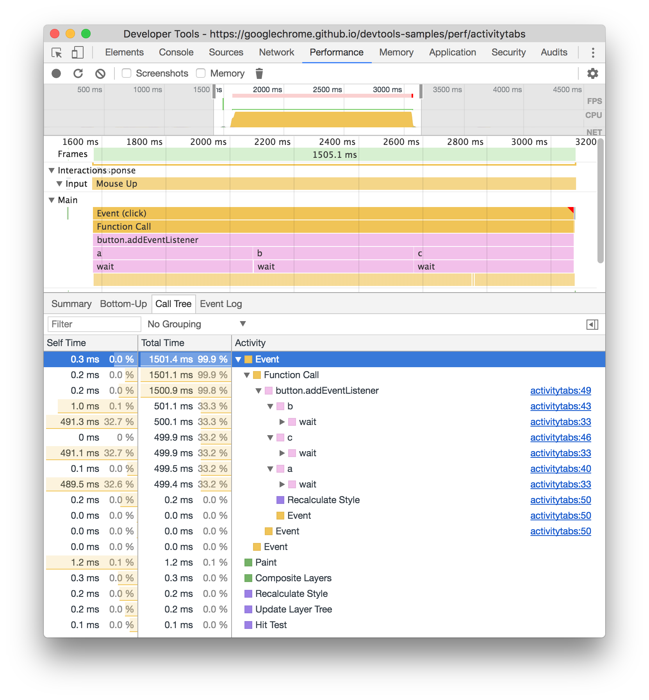
  <figcaption>
    <b>Figure 17</b>. The <b>Call Tree</b> tab
  </figcaption>
</figure>

In Figure 17, the top-level of items in the **Activity** column, such as
`Event`, `Paint`, and `Composite Layers` are root activities. The nesting
represents the call stack. For example, in Figure 17, `Event` caused
`Function Call`, which caused `button.addEventListener`, which caused `b`,
and so on.

**Self Time** represents the time directly spent in that activity.
**Total Time** represents the time spent in that activity or any of its
children.

Click **Self Time**, **Total Time**, or **Activity** to sort the table by
that column.

Use the **Filter** text box to filter events by activity name.

By default the **Grouping** menu is set to **No Grouping**. Use the
**Grouping** menu to sort the activity table based on various criteria.

Click **Show Heaviest Stack** ![Show Heaviest Stack][SHS]{:.cdt-inl} to reveal
another table to the right of the **Activity** table. Click on an activity to
populate the **Heaviest Stack** table. The **Heaviest Stack** table shows
you which children of the selected activity took the longest time to
execute.

[SHS]: imgs/show-heaviest-stack.png

#### The Bottom-Up tab {: #bottom-up }

Use the **Bottom-Up** tab to view which activities directly took up the most
time in aggregate.

The **Bottom-Up** tab only displays activities during the selected portion
of the recording. See [Select a portion of a recording](#select) to learn
how to select portions.

<figure>
  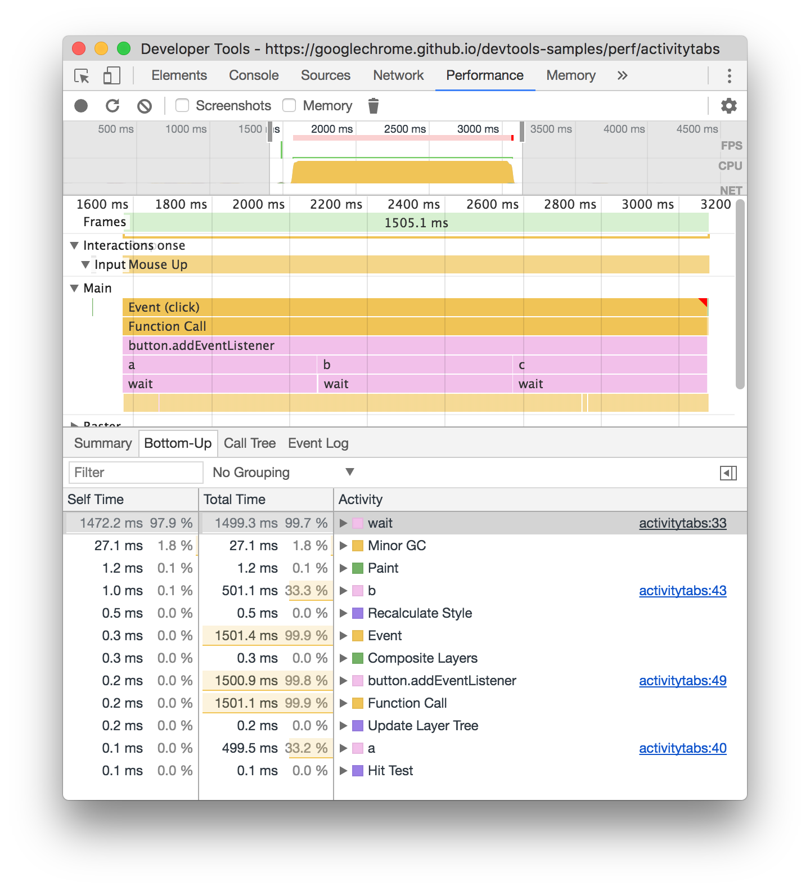
  <figcaption>
    <b>Figure 18</b>. The <b>Bottom-Up</b> tab
  </figcaption>
</figure>

In the **Main** section flame chart of Figure 18, you can see that almost
practically all of the time was spent executing the three calls to `wait()`.
Accordingly, the top activity in the **Bottom-Up** tab of Figure 18 is
`wait`. In the flame chart of Figure 18, the yellow below the calls to `wait`
are actually thousands of `Minor GC` calls. Accordingly, you can see that
in the **Bottom-Up** tab, the next most expensive activity is `Minor GC`.

The **Self Time** column represents the aggregated time spent directly in
that activity, across all of its occurrences.

The **Total Time** column represents aggregated time spent in that activity
or any of its children.

#### The Event Log tab {: #event-log }

Use the **Event Log** tab to view activities in the order in which they
occurred during the recording.

The **Event Log** tab only displays activities during the selected portion
of the recording. See [Select a portion of a recording](#select) to learn
how to select portions.

<figure>
  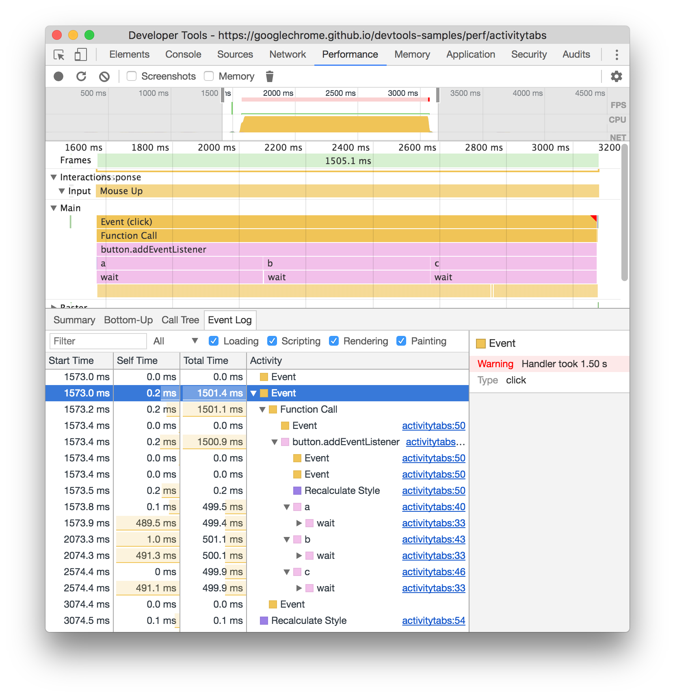
  <figcaption>
    <b>Figure 19</b>. The <b>Event Log</b> tab
  </figcaption>
</figure>

The **Start Time** column represents the point at which that activity started,
relative to the start of the recording. For example, the start time of
`1573.0 ms` for the selected item in Figure 19 means that activity started
1573 ms after the recording started.

The **Self Time** column represents the time spent directly in that activity.

The **Total Time** columns represents time spent directly in that activity or
in any of its children.

Click **Start Time**, **Self Time**, or **Total Time** to sort the table by
that column.

Use the **Filter** text box to filter activities by name.

Use the **Duration** menu to filter out any activities that took less than
1 ms or 15 ms. By default the **Duration** menu is set to **All**, meaning
all activities are shown.

Disable the **Loading**, **Scripting**, **Rendering**, or **Painting**
checkboxes to filter out all activities from those categories.

### View GPU activity {: #gpu }

View GPU activity in the **GPU** section.

<figure>
  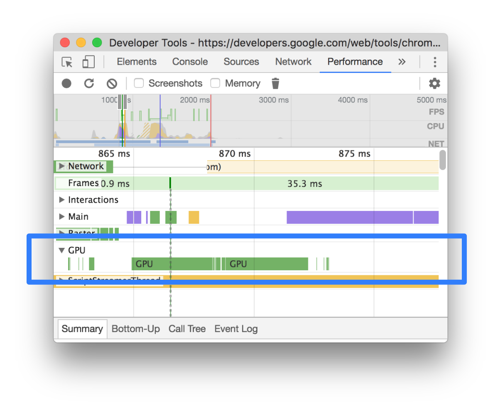
  <figcaption>
    <b>Figure 20</b>. The <b>GPU</b> section, outlined in blue
  </figcaption>
</figure>

### View raster activity {: #raster }

View raster activity in the **Raster** section.

<figure>
  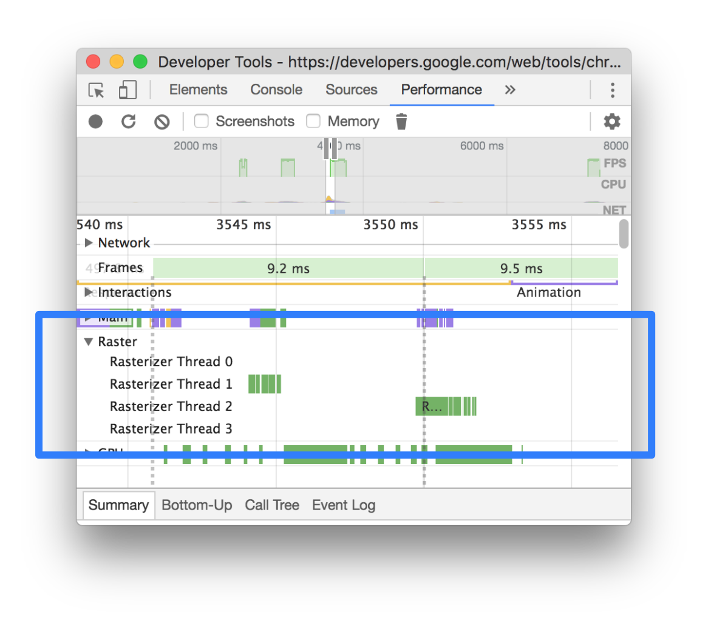
  <figcaption>
    <b>Figure 21</b>. The <b>Raster</b> section, outlined in blue
  </figcaption>
</figure>

### View interactions {: #interactions }

Use the **Interactions** section to find and analyze user interactions
that happened during the recording.

<figure>
  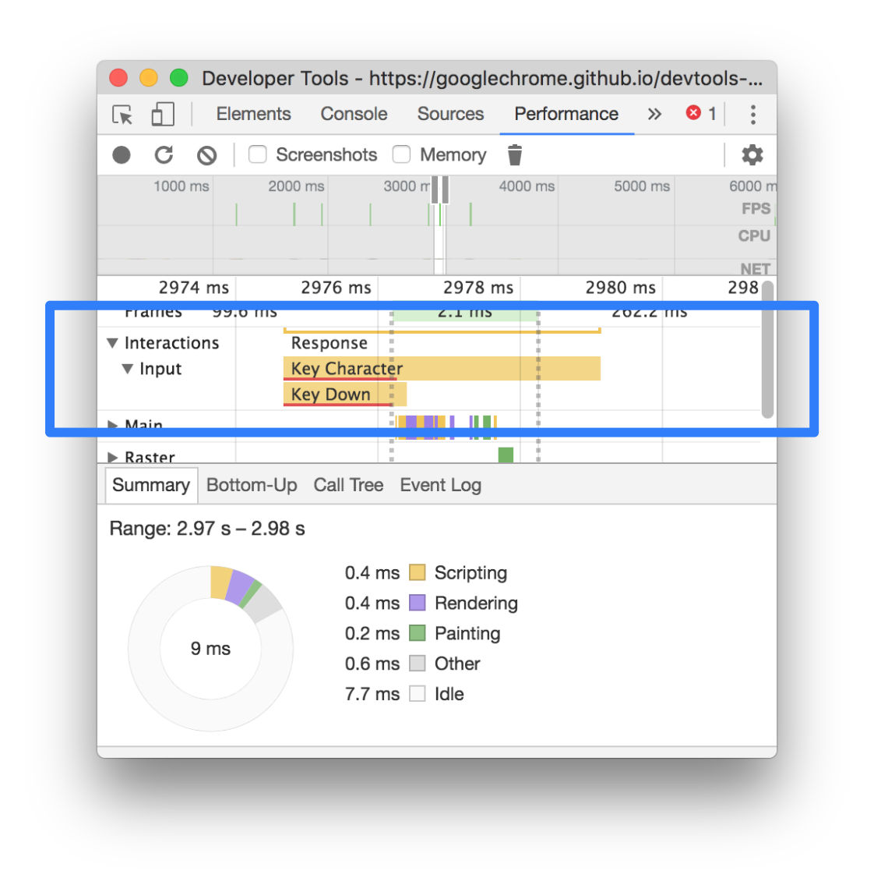
  <figcaption>
    <b>Figure 22</b>. The <b>Interactions</b> section, outlined in blue
  </figcaption>
</figure>

A red line at the bottom of an interaction represents time spent waiting
for the main thread.

Click an interaction to view more information about it in the **Summary**
tab.

### Analyze frames per second (FPS) {: #fps }

DevTools provides numerous ways to analyze frames per second:

* Use [the **FPS** chart](#fps-chart) to get an overview of FPS over
  the duration of the recording.
* Use [the **Frames** section](#frames) to view how long a particular frame
  took.
* Use the **FPS meter** for a realtime estimate of FPS as the page runs. See
  [View frames per second in realtime with the FPS meter](#fps-meter).

#### The FPS chart {: #fps-chart }

The **FPS** chart provides an overview of the frame rate across the duration
of a recording. In general, the higher the green bar, the better the frame
rate.

A red bar above the **FPS** chart is a warning that the frame rate dropped
so low that it probably harmed the user's experience.
<figure>
  
  <figcaption>
    <b>Figure 20</b>. The FPS chart, outlined in blue
  </figcaption>
</figure>

#### The Frames section {: #frames }

The **Frames** section tells you exactly how long a particular frame took.

Hover over a frame to view a tooltip with more information about it.

<figure>
  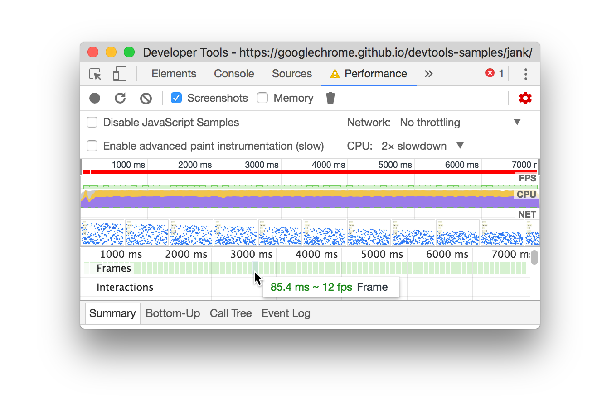
  <figcaption>
    <b>Figure 21</b>. Hovering over a frame
  </figcaption>
</figure>

Click on a frame to view even more information about the frame in the
**Summary** tab. DevTools outlines the selected frame in blue.

<figure>
  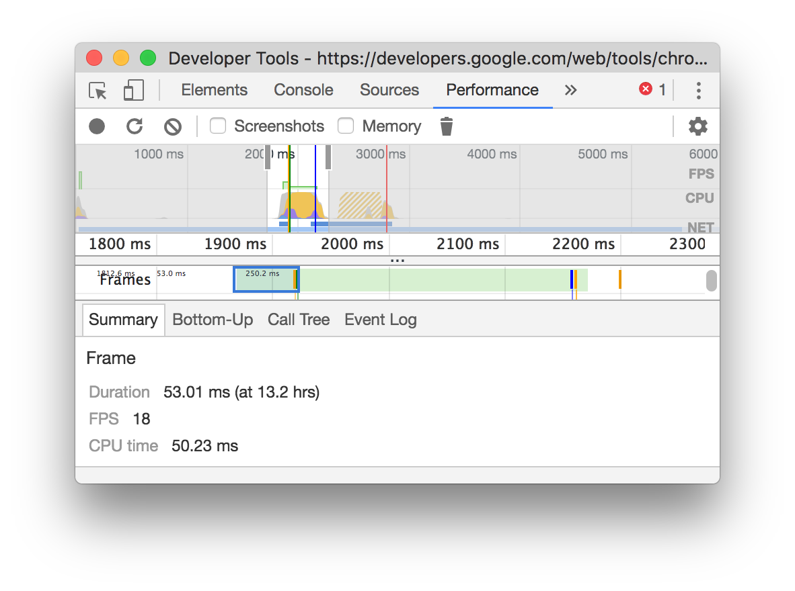
  <figcaption>
    <b>Figure 22</b>. Viewing a frame in the <b>Summary</b> tab
  </figcaption>
</figure>

### View network requests {: #network }

Expand the **Network** section to view a waterfall of network requests
that occurred during the recording.

<figure>
  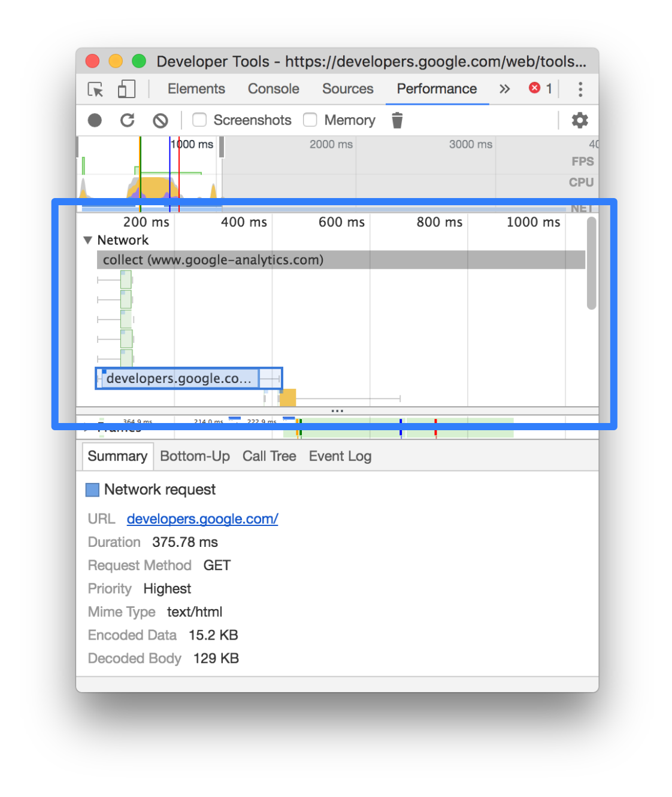
  <figcaption>
    <b>Figure 23</b>. The <b>Network</b> section, outlined in blue
  </figcaption>
</figure>

Requests are color-coded as follows:

* HTML: Blue
* CSS: Purple
* JS: Yellow
* Images: Green

Click on a request to view more information about it in the **Summary** tab.
For example, in Figure 23 the **Summary** tab is displaying more information
about the blue request that's selected in the **Network** section.

A darker-blue square in the top-left of a request means it's a higher-priority
request. A lighter-blue square means lower-priority. For example, in Figure
23 the blue, selected request is higher-priority, and the green one above it
is lower-priority.

In Figure 24, the request for `www.google.com` is represented by a line on
the left, a bar in the middle with a dark portion and a light portion, and
a line on the right. Figure 25 shows the corresponding representation of the
same request in the **Timing** tab of the **Network** panel. Here's how
these two representations map to each other:

* The left line is everything up to the `Connection Start` group of events,
  inclusive. In other words, it's everything before `Request Sent`, exclusive.
* The light portion of the bar is `Request Sent` and `Waiting (TTFB)`.
* The dark portion of the bar is `Content Download`.
* The right line is essentially time spent waiting for the
  main thread. This is not represented in the **Timing** tab.

<figure>
  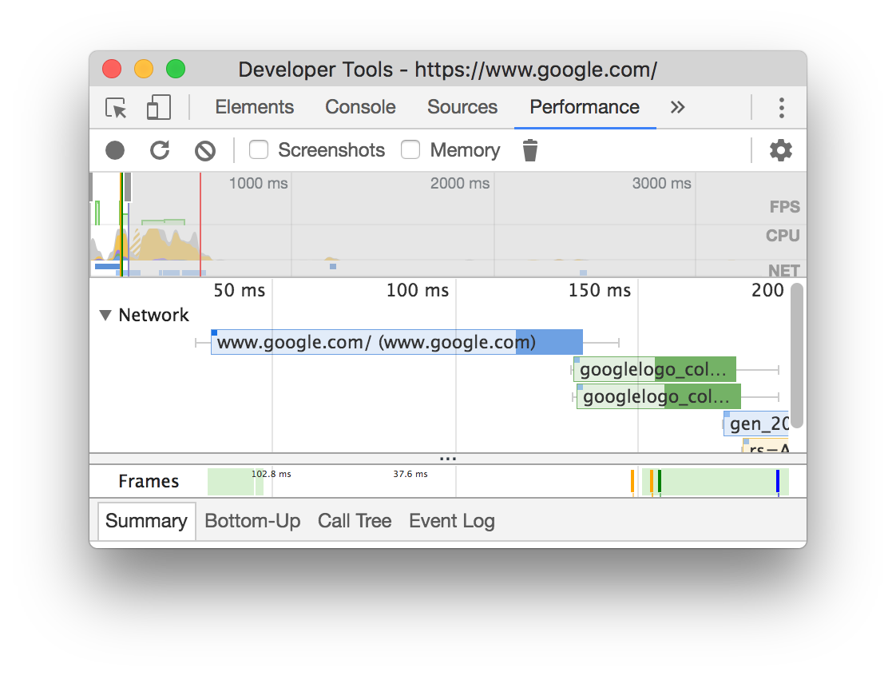
  <figcaption>
    <b>Figure 24</b>. The line-bar representation of the
    <code>www.google.com</code> request
  </figcaption>
</figure>

<figure>
  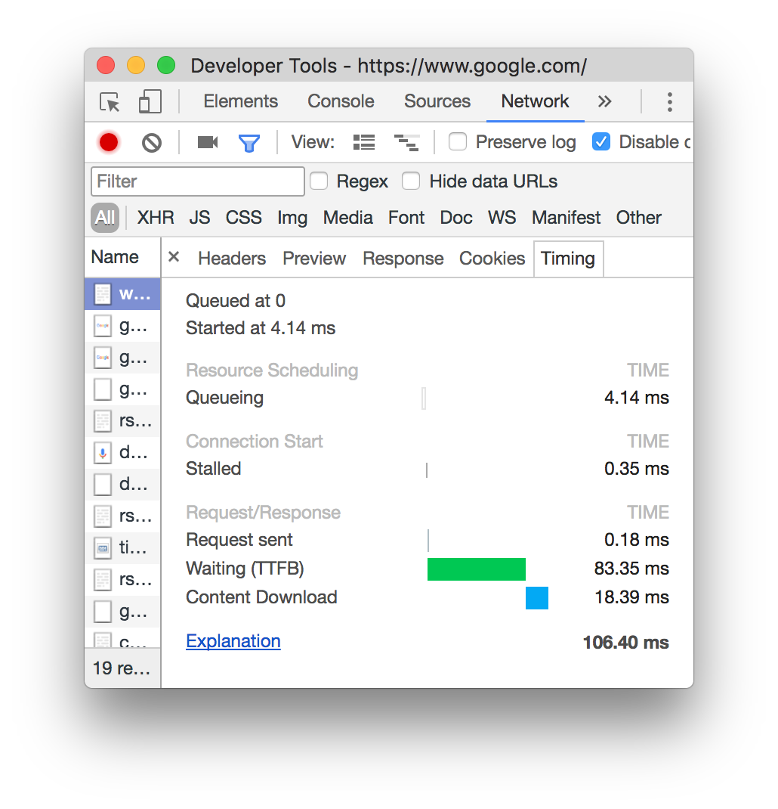
  <figcaption>
    <b>Figure 25</b>. The <b>Timing</b> tab representation of the
    <code>www.google.com</code> request
  </figcaption>
</figure>

### View memory metrics {: #memory }

Enable the **Memory** checkbox to view memory metrics from the last recording.

<figure>
  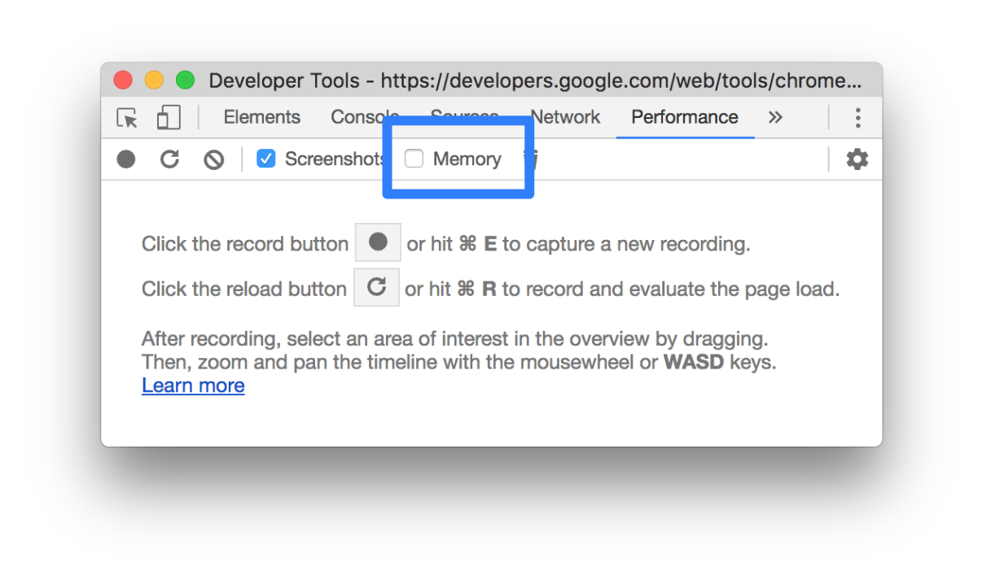
  <figcaption>
    <b>Figure 26</b>. The <b>Memory</b> checkbox, outlined in blue
  </figcaption>
</figure>

DevTools displays a new **Memory** chart, above the **Summary** tab. There's
also a new chart below the **NET** chart, called **HEAP**. The **HEAP** chart
provides the same information as the **JS Heap** line in the **Memory** chart.

<figure>
  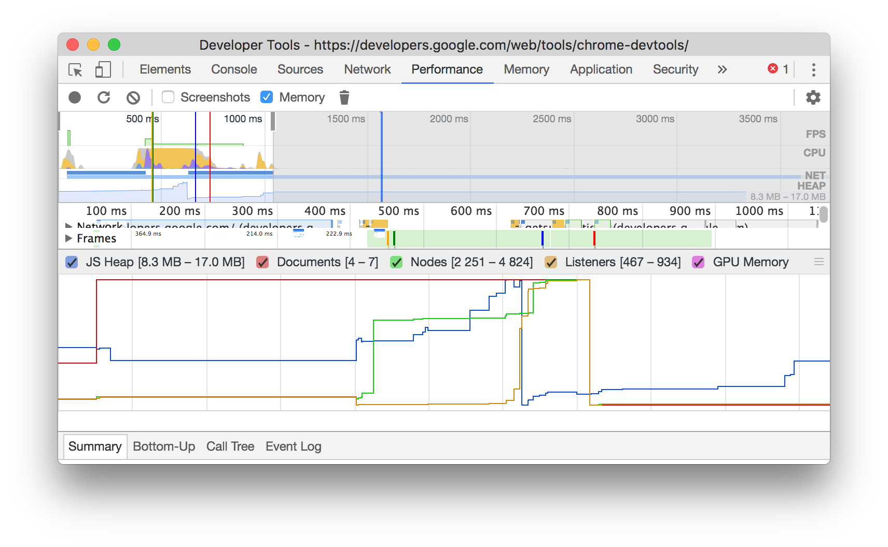
  <figcaption>
    <b>Figure 27</b>. Memory metrics, above the <b>Summary</b> tab
  </figcaption>
</figure>

The colored lines on the chart map to the colored checkboxes above the chart.
Disable a checkbox to hide that category from the chart.

The chart only displays the region of the recording that is currently
selected. For example, in Figure 27, the **Memory** chart is only showing
memory usage for the start of the recording, up to around the 1000ms mark.

### View the duration of a portion of a recording {: #duration }

When analyzing a section like **Network** or **Main**, sometimes you need a
more precise estimate of how long certain events took. Hold <kbd>Shift</kbd>,
click and hold, and drag left or right to select a portion of the recording.
At the bottom of your selection, DevTools shows how long that portion took.

<figure>
  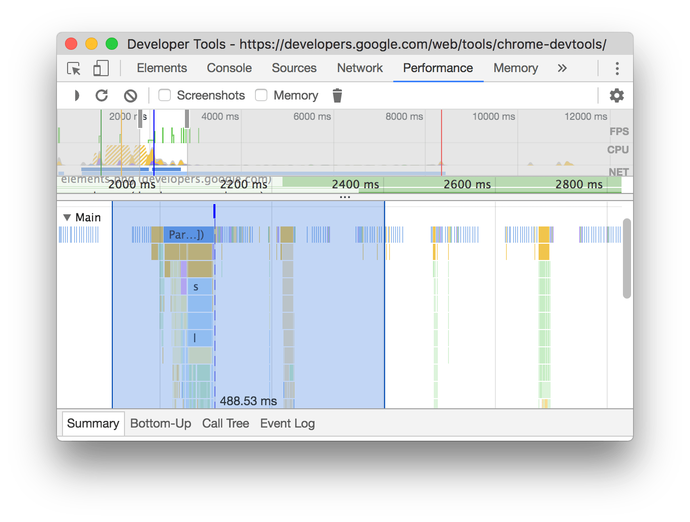
  <figcaption>
    <b>Figure 28</b>. The <code>488.53ms</code> timestamp at the bottom
    of the selected portion indicates how long that portion took
  </figcaption>
</figure>

### View a screenshot {: #view-screenshot }

See [Capture screenshots while recording](#screenshots) to learn how to
enable screenshots.

Hover over the **Overview** to view a screenshot of how the page looked
during that moment of the recording. The **Overview** is the section that
contains the **CPU**, **FPS**, and **NET** charts.

<figure>
  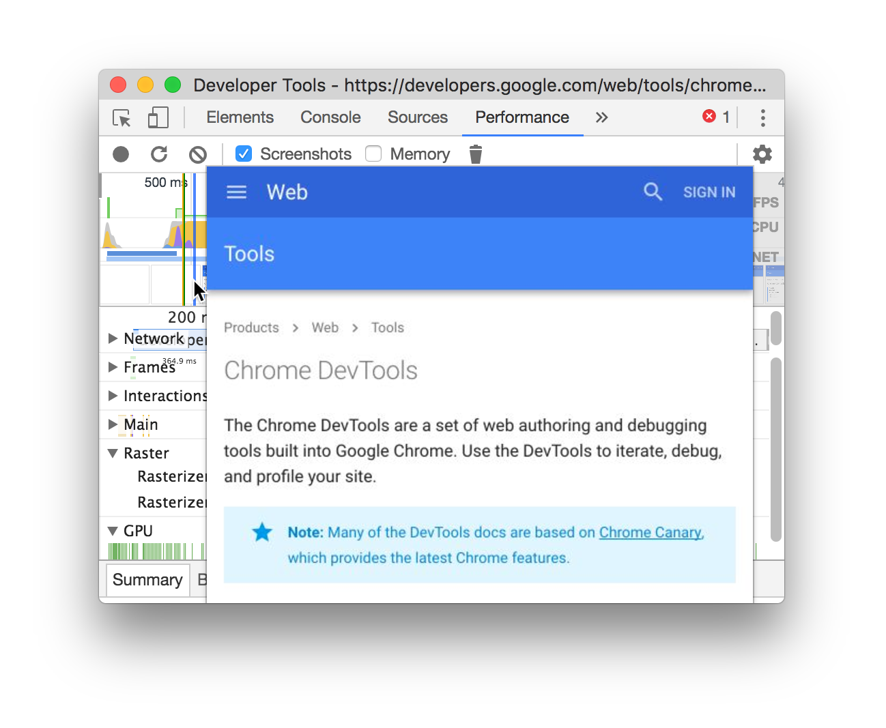
  <figcaption>
    <b>Figure 29</b>. Viewing a screenshot
  </figcaption>
</figure>

You can also view screenshots by clicking a frame in the **Frames**
section. DevTools displays a small version of the screenshot in the **Summary**
tab.

<figure>
  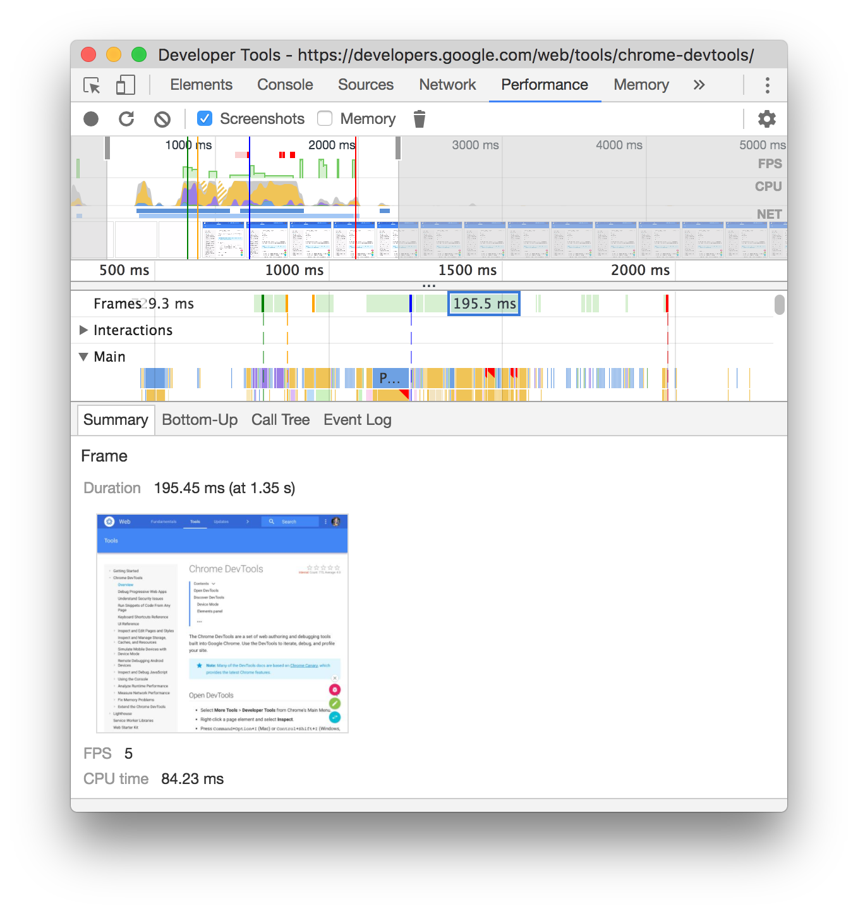
  <figcaption>
    <b>Figure 30</b>. After clicking the <code>195.5ms</code> frame in the
    <b>Frames</b> section, the screenshot for that frame is displayed in the
    <b>Summary</b> tab
  </figcaption>
</figure>

Click the thumbnail in the **Summary** tab to zoom in on the screenshot.

<figure>
  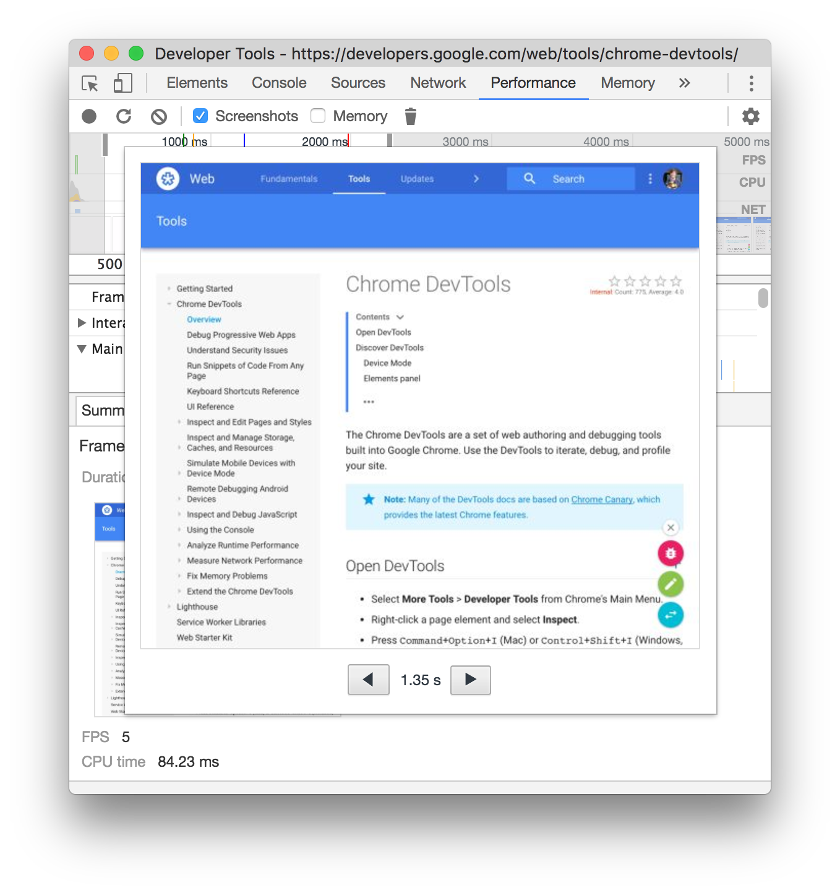
  <figcaption>
    <b>Figure 31</b>. After clicking the thumbnail in the <b>Summary</b> tab,
    DevTools zooms in on the screenshot
  </figcaption>
</figure>

### View layers information {: #layers }

To view advanced layers information about a frame:

1. [Enable advanced paint instrumentation](#paint).
1. Select a frame in the **Frames** section. DevTools displays information
   about its layers in the new **Layers** tab, next to the **Event Log**
   tab.

<figure>
  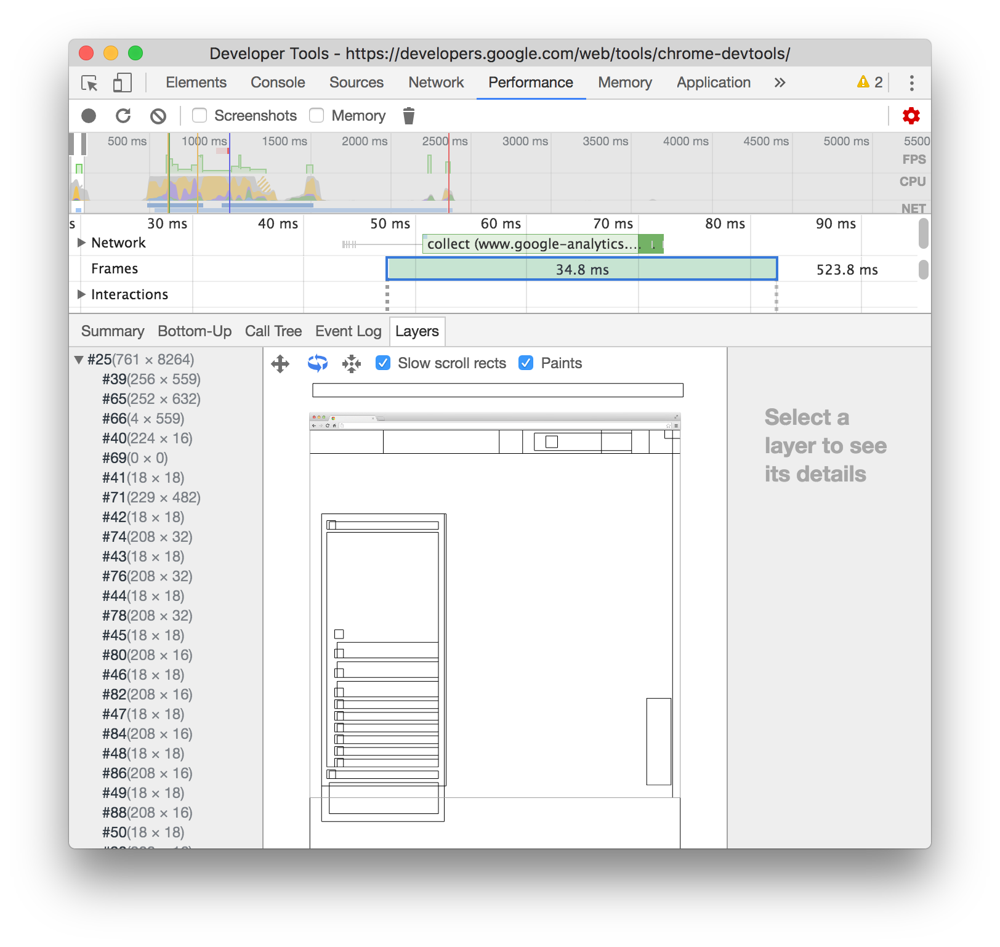
  <figcaption>
    <b>Figure 32</b>. The <b>Layers</b> tab
  </figcaption>
</figure>

Hover over a layer to highlight it in the diagram.

<figure>
  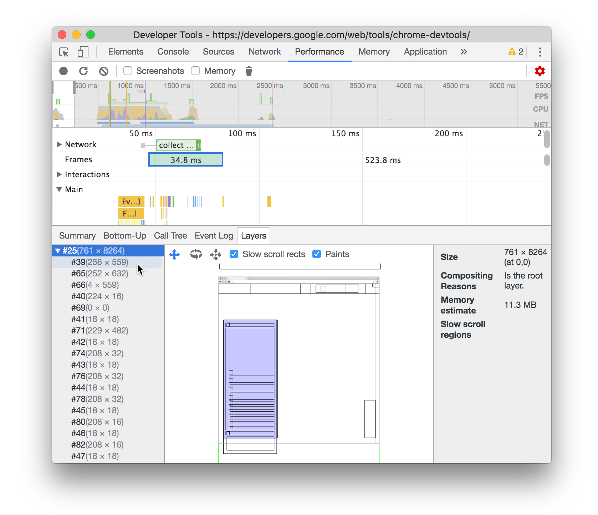
  <figcaption>
    <b>Figure 33</b>. Highlighting layer <b>#39</b>
  </figcaption>
</figure>

To move the diagram:

* Click **Pan Mode** {:.cdt-inl} to move along
  the X and Y axes.
* Click **Rotate Mode** {:.cdt-inl} to
  rotate along the Z axis.
* Click **Reset Transform** {:.cdt-inl} to reset the diagram to its
  original position.

### View paint profiler {: #paint-profiler }

To view advanced information about a paint event:

1. [Enable advanced paint instrumentation](#paint).
1. Select a **Paint** event in the **Main** section.

<figure>
  
  <figcaption>
    <b>Figure 34</b>. The <b>Paint Profiler</b> tab
  </figcaption>
</figure>

## Analyze rendering performance with the Rendering tab {: #rendering }

Use the **Rendering** tab's features to help visualize your page's rendering
performance.

To open the **Rendering** tab:

1. Open the [Command Menu](/web/tools/chrome-devtools/ui#command-menu).
1. Start typing `Rendering` and select `Show Rendering`. DevTools displays
   the **Rendering** tab at the bottom of your DevTools window.

<figure>
  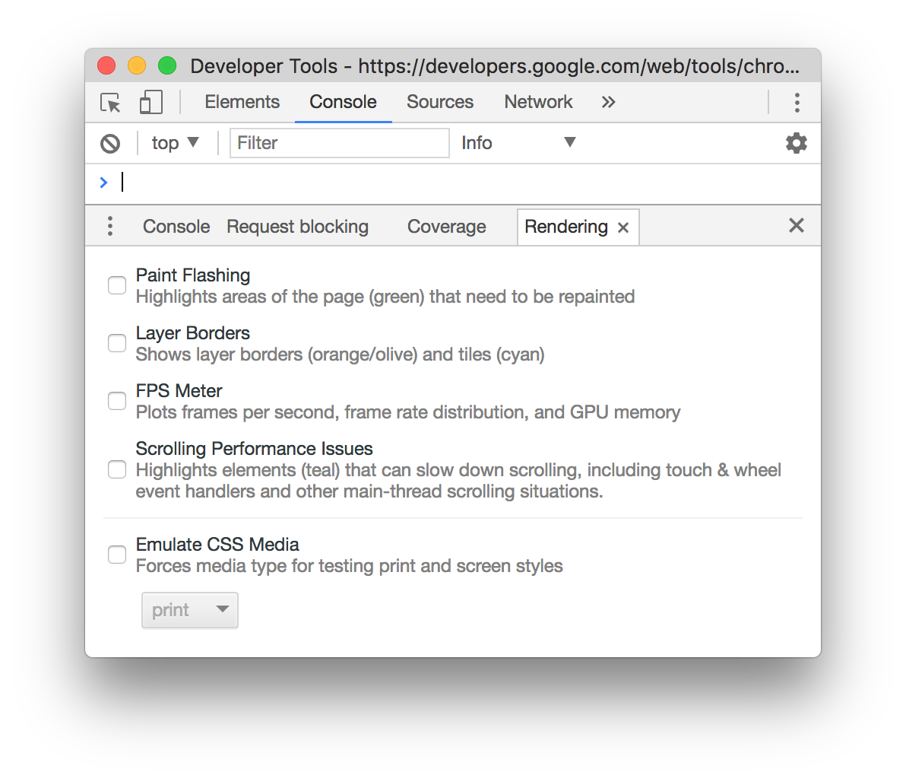
  <figcaption>
    <b>Figure 35</b>. The <b>Rendering</b> tab
  </figcaption>
</figure>

### View frames per second in realtime with the FPS meter {: #fps-meter }

The **FPS meter** is an overlay that appears in the top-right corner of your
viewport. It provides a realtime estimate of FPS as the page runs. To open
the **FPS meter**:

1. Open the **Rendering** tab. See [Analyze rendering performance with the
   Rendering tab](#rendering).
1. Enable the **FPS Meter** checkbox.

<figure>
  
  <figcaption>
    <b>Figure 36</b>. The FPS meter
  </figcaption>
</figure>

### View painting events in realtime with Paint Flashing {: #paint-flashing }

Use Paint Flashing to get a realtime view of all paint events on the page.
Whenever a part of the page gets re-painted, DevTools outlines that section
in green.

To enable Paint Flashing:

1. Open the **Rendering** tab. See [Analyze rendering performance with the
   Rendering tab](#rendering).
1. Enable the **Paint Flashing** checkbox.

<figure>
  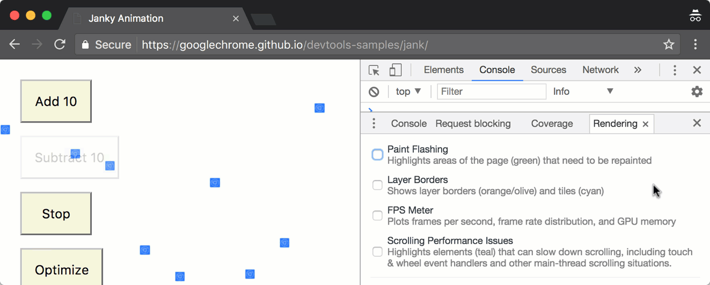
  <figcaption>
    <b>Figure 37</b>. <b>Paint Flashing</b>
  </figcaption>
</figure>

### View an overlay of layers with Layer Borders {: #layer-borders }

Use **Layer Borders** to view an overlay of layer borders and tiles on top
of the page.

To enable Layer Borders:

1. Open the **Rendering** tab. See [Analyze rendering performance with the
   Rendering tab](#rendering).
1. Enable the **Layer Borders** checkbox.

<figure>
  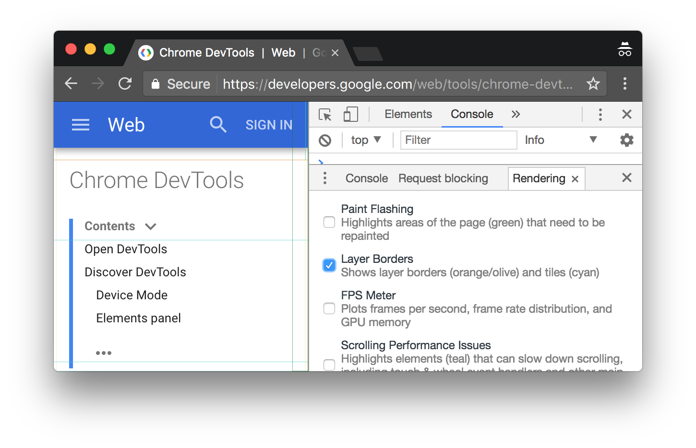
  <figcaption>
    <b>Figure 38</b>. <b>Layer Borders</b>
  </figcaption>
</figure>

### Find scroll performance issues in realtime {: #scrolling-performance-issues }

Use Scrolling Performance Issues to identify elements of the page that have
event listeners related to scrolling that may harm the performance of the page.
DevTools outlines the potentially-problematic elements in teal.

To view scroll performance issues:

1. Open the **Rendering** tab. See [Analyze rendering performance with the
   Rendering tab](#rendering).
1. Enable the **Scrolling Performance Issues** checkbox.

<figure>
  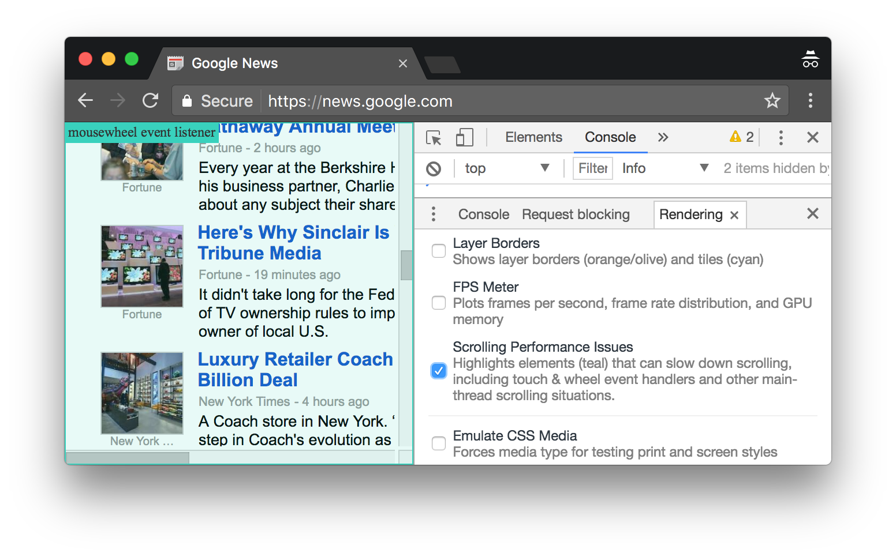
  <figcaption>
    <b>Figure 39</b>. <b>Scrolling Performance Issues</b> is indicating that
    there's a <code>mousewheel</code> event listener encompassing the entire
    viewport that may harm scroll performance
  </figcaption>
</figure>
