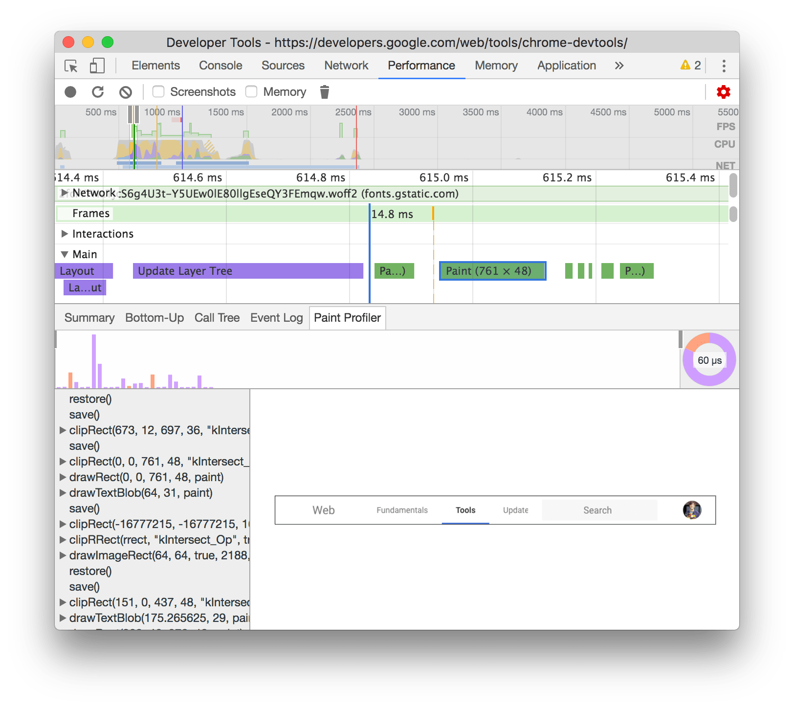
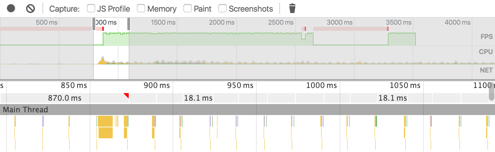

project_path: /web/tools/_project.yaml
book_path: /web/tools/_book.yaml
description: Use the Chrome DevTools Timeline panel to record and analyze  all the activity in your application as it runs. It's the best place to start  investigating perceived performance issues in your application.

{# wf_updated_on: 2017-05-08 #}
{# wf_published_on: 2015-06-08 #}

# How to Use the Timeline Tool {: .page-title }



Warning: This page is deprecated. See [Performance Analysis
Reference](reference) for up-to-date information.

Use the Chrome DevTools <em>Timeline</em> panel to record 
and analyze all the activity in your application as it runs. It's the best 
place to start investigating perceived performance issues in your 
application.

### TL;DR {: .hide-from-toc }
- Make a Timeline recording to analyze every event that occurred  after a page load or a user interaction.
- View FPS, CPU, and network requests in the Overview pane.
- Click on an event within the Flame Chart to view details about it.
- Zoom in on a section of a recording to make analysis easier.

## Timeline panel overview {:#timeline-overview}

<aside class="warning">
  <b>Warning:</b> This page is deprecated. See the following sections for
  up-to-date information:
  <ul>
    <li><a href="reference#record">Record performance</a></li>
    <li><a href="reference#fps-chart">The FPS chart</a></li>
    <li><a href="reference#main">View main thread activity</a></li>
  </ul>
</aside>

The Timeline panel consists of four panes:

1. **Controls**. Start a recording, stop a recording, and 
   configure what information is captured during the recording.
2. **Overview**. A high-level summary of page performance. More on this 
   below.
3. **Flame Chart**. A visualization of the CPU stack trace. 

   You may see one to three dotted, vertical lines on your **Flame Chart**. The 
   blue line represents the `DOMContentLoaded` event. The green line represents 
   time to first paint. The red line represents the `load` event.

4. **Details**. When an event is selected, this pane shows more information 
   about that event. When no event is selected, this pane shows information 
   about the selected time frame. 

### Overview pane

The **Overview** pane consists of three graphs:

1. **FPS**. Frames Per Second. The higher the green bar, the higher the 
   FPS. The red blocks above the FPS graph indicate long frames, which are 
   likely candidates for [jank][jank].
2. **CPU**. CPU resources. This [area chart][ac] indicates what type of events 
   consumed CPU resources. 
3. **NET**. Each colored bar represents a resource. The longer the bar, the
   longer it took to retrieve the resource. The lighter portion of each bar 
   represents waiting time (the time between when the resource was requested
   up until the time that the first byte was downloaded). The darker portion
   represents transfer time (the time between when the first and last bytes
   were downloaded).

   Bars are color coded as follows:
   <!-- source: https://goo.gl/eANVFf -->
   
   * HTML files are **blue**.
   * Scripts are **yellow**.
   * Stylesheets are **purple**.
   * Media files are **green**.
   * Miscellaneous resources are 
     **grey**.

[ac]: https://en.wikipedia.org/wiki/Area_chart 
[jank]: /web/fundamentals/performance/rendering/

## Make a recording

Warning: This page is deprecated. See [Record performance](reference#record)
for up-to-date information.

To make a recording of a *page load*, open the **Timeline** panel, open the 
page that you want to record, and then reload the page. The **Timeline** 
panel automatically records the page reload.

To make a recording of a *page interaction*, open the **Timeline** panel, then
start the recording by pressing the **Record** button 
({:.inline}) or by typing the keyboard 
shortcut <kbd>Cmd</kbd>+<kbd>E</kbd> (Mac) or <kbd>Ctrl</kbd>+<kbd>E</kbd> 
(Windows / Linux). The **Record** button turns red during a recording. Perform 
your page interactions, and then press the **Record** button or type the 
keyboard shortcut again to stop the recording.

When the recording is finished, DevTools guesses what portion of the recording
is most relevant to you, and automatically zooms to that portion.

### Recording tips

* **Keep recordings as short as possible**. Shorter recordings generally make 
  analysis easier.
* **Avoid unnecessary actions**. Avoid actions (mouse clicks, network loads, 
  etc.) that are extraneous to the activity you want to record and analyze. 
  For example, if you want to record events that occur after you click a Login 
  button, don’t also scroll the page, load an image, and so on.
* **Disable the browser cache**. When recording network operations, it’s a 
  good idea to disable the browser’s cache from the DevTools Settings panel or
  the [**Network conditions**][nc] drawer.
* **Disable extensions**. Chrome extensions can add unrelated noise to 
  Timeline recordings of your application. Open a Chrome window in 
  [incognito mode][incognito], or create a new 
  [Chrome user profile][new chrome profile] to ensure that your environment
  has no extensions.

[nc]: /web/tools/chrome-devtools/network-performance/reference#network-conditions
[incognito]: https://support.google.com/chrome/answer/95464
[new chrome profile]: https://support.google.com/chrome/answer/142059

## View recording details

Warning: This page is deprecated. See [View main thread
](reference#main) for up-to-date information.

When you select an event in the **Flame Chart**, the **Details** pane displays 
additional information about the event.

Some tabs, like **Summary**, are present for all event types. Other tabs are
only available to certain event types. See the [Timeline event 
reference][event reference] for details on each record type.

[event reference]: /web/tools/chrome-devtools/profile/evaluate-performance/performance-reference

## Capture screenshots during recording {:#filmstrip}

Warning: This page is deprecated. See [Capture screenshots while
recording](reference#screenshots) for up-to-date information.

The **Timeline** panel can capture screenshots during a page load. This feature
is known as the **Filmstrip**.

Enable the **Screenshots** checkbox in the **Controls** pane before you make
a recording to capture screenshots of the recording. The screenshots are
displayed below the **Overview** pane.

Hover your mouse over the **Screenshots** or **Overview** pane to view a 
zoomed screenshot of that point in the recording. Move your mouse left and
right to simulate an animation of the recording.

<video src="animations/hover.mp4" autoplay muted loop controls></video>

## Profile JavaScript {:#profile-js}

<aside class="warning">
  <b>Warning:</b> This page is deprecated. See the following sections for
  up-to-date information:
  <ul>
    <li><a href="reference#disable-js-samples">Disable JavaScript
      samples</a></li>
    <li><a href="reference#main">View main thread activity</a></li>
    <li><a href="reference#activities">View activities</a></li>
  </ul>
</aside>

Enable the **JS Profile** checkbox before you take a recording to capture 
JavaScript stacks in your timeline recording. When the JS profiler is 
enabled, your flame chart shows every JavaScript function that was called. 

## Profile painting {:#profile-painting}

Warning: This page is deprecated. See [View paint
profiler](reference#paint-profiler) for up-to-date information.

Enable the **Paint** checkbox before you take a recording to gain more insight
into **Paint** events. When paint profiling is enabled and you click
on a **Paint** event, a new **Paint Profiler** tab is displayed in the 
**Details** pane that shows much more granular information about the event.

### Rendering settings {:#rendering-settings}

Warning: This page is deprecated. See [Analyze rendering performance with the
Rendering tab](reference#rendering) for up-to-date information.

Open the main DevTools menu and select **More tools** > **Rendering settings**
to access rendering settings that may be helpful when debugging paint issues.
The rendering settings opens up as a tab next to the **Console** drawer (press
<kbd>esc</kbd> to show the drawer, if it's hiding).

## Search records

Warning: This page is deprecated. See [Search activities](reference#search)
for up-to-date information.

While looking at events you may want to focus on one type of events. For
example, perhaps you need to view the details of every `Parse HTML` event. 

Press <kbd>Cmd</kbd>+<kbd>F</kbd> (Mac) or <kbd>Ctrl</kbd>+<kbd>F</kbd> 
(Windows / Linux) while the **Timeline** is in focus to open a Find toolbar. 
Type in the name of the event type that you wish to inspect, such as `Event`.

The toolbar only applies to the currently selected timeframe. Any events 
outside of the selected timeframe are not included in the results. 

The up and down arrows move you chronologically through the results. So, the
first result represents the earliest event in the selected timeframe, and
the last result represents the last event. Every time that you press the up
or down arrow, a new event is selected, so you can view its details in the
**Details** pane. Pressing the up and down arrows is equivalent to clicking 
on an event in the **Flame Chart**.

## Zoom in on a Timeline section {:#zoom}

Warning: This page is deprecated. See [Select a portion of a
recording](reference#select) for up-to-date information.

You can zoom in on a section of a recording to make analysis easier. You use
the **Overview** pane to zoom in on a section of the recording. After zooming,
the **Flame Chart** is automatically zoomed to match the same section.

To zoom in on a Timeline section:

* In the **Overview** pane, drag out a Timeline selection with your mouse.
* Adjust the gray sliders in the ruler area.

Once you have a section selected, you can use the <kbd>W</kbd>,<kbd>A</kbd>,
<kbd>S</kbd>, and <kbd>D</kbd> keys to adjust your selection. <kbd>W</kbd> 
and <kbd>S</kbd> zoom in and zoom out, respectively. <kbd>A</kbd> and 
<kbd>D</kbd> move left and right, respectively.

## Save and load recordings

<aside class="warning">
  <b>Warning:</b> This page is deprecated. See the following sections for
  up-to-date information:
  <ul>
    <li><a href="reference#save">Save a recording</a></li>
    <li><a href="reference#load">Load a recording pane</a></li>
  </ul>
</aside>

You can save and open recordings by right-clicking inside the 
**Overview** or **Flame Chart** panes and selecting the relevant option.

You can also share saved recordings using [timeline-viewer](https://chromedevtools.github.io/timeline-viewer/).
