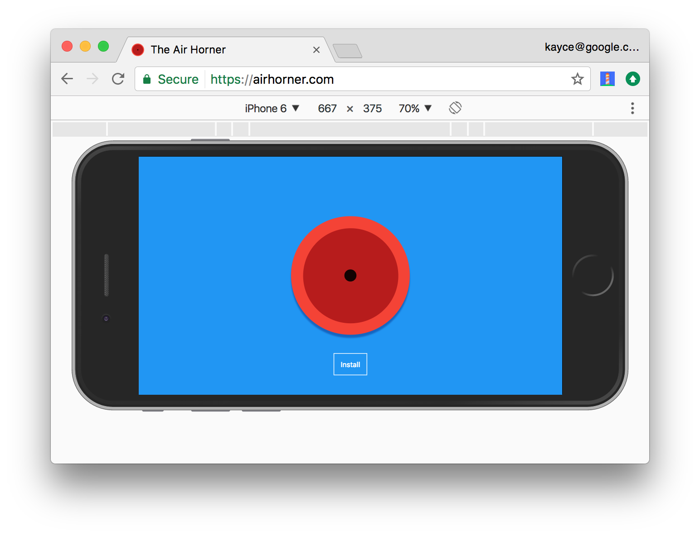
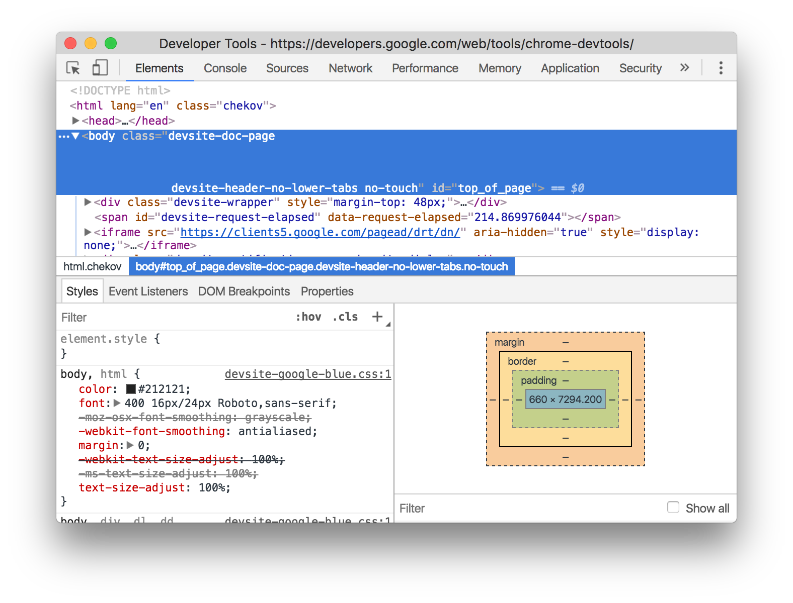
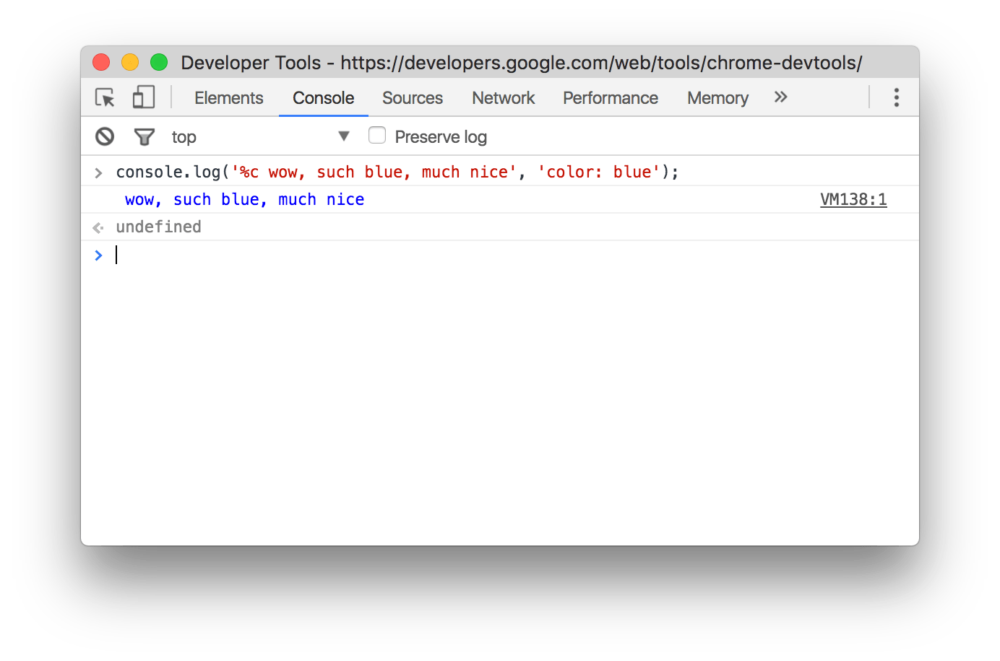
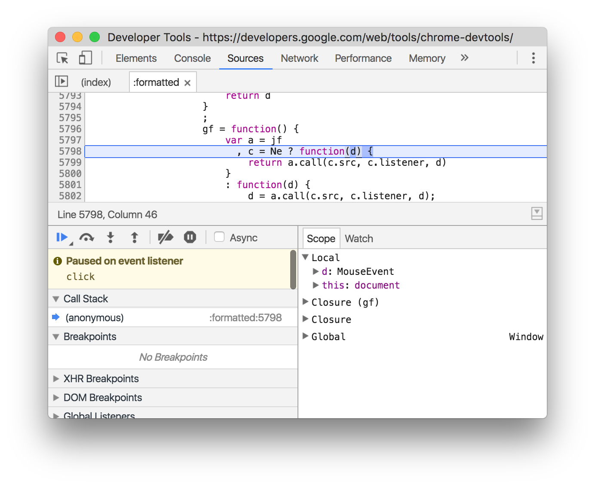
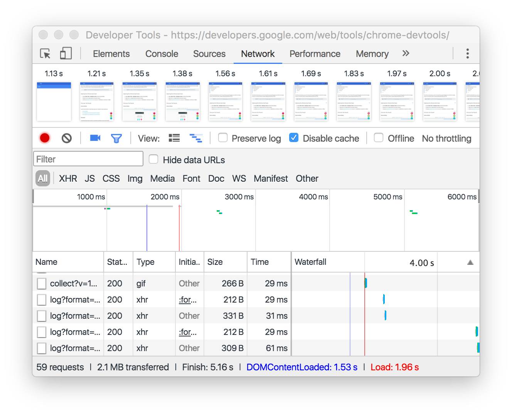
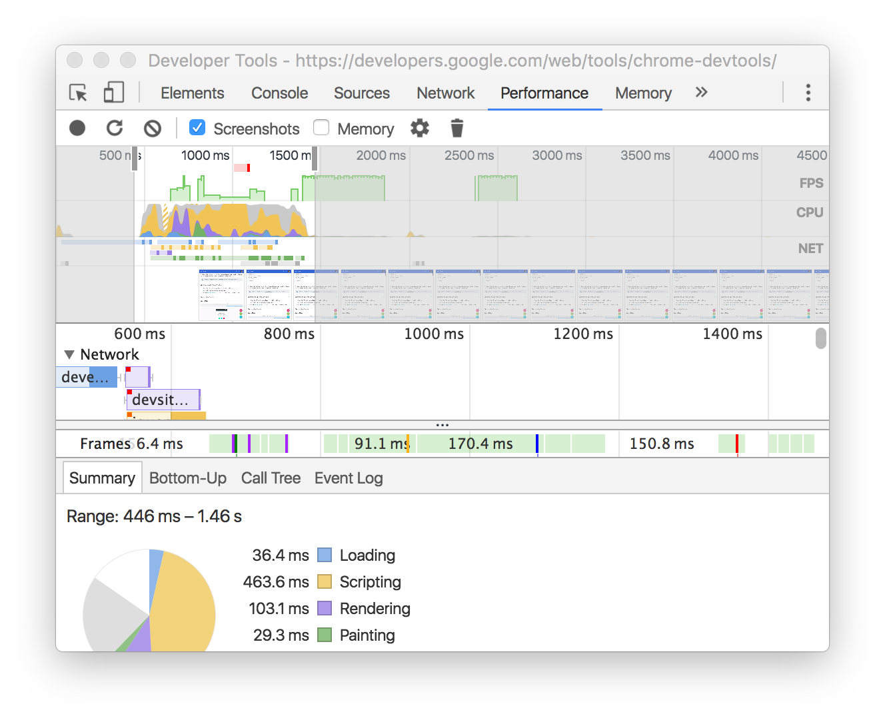
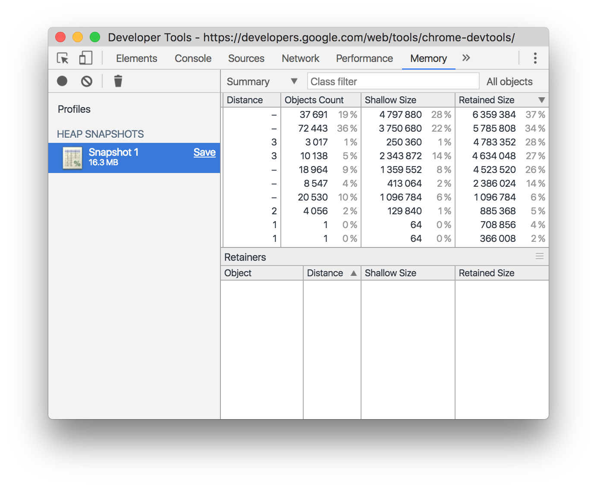
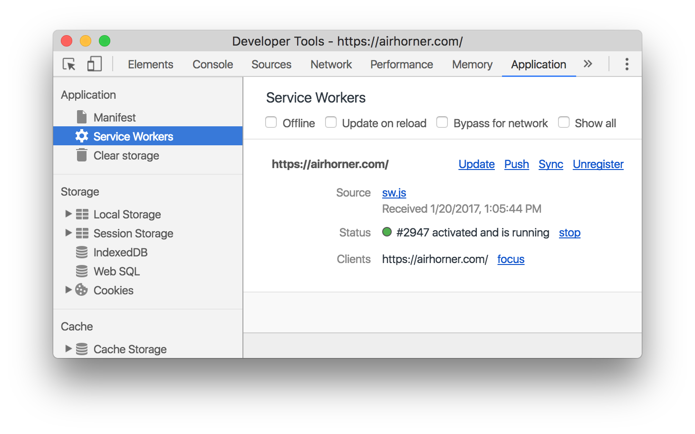
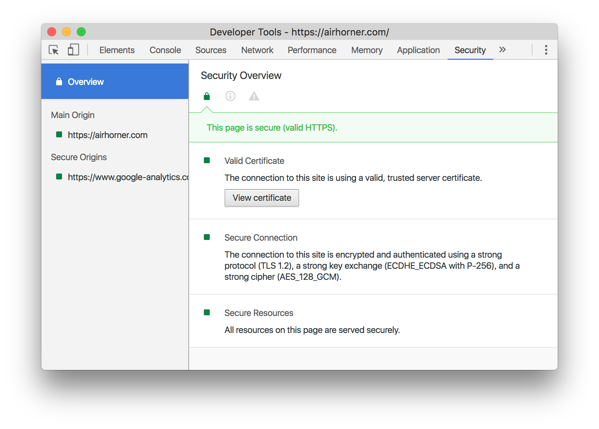

project_path: /web/tools/_project.yaml
book_path: /web/tools/_book.yaml
description: Get started with Google Chrome's built-in web developer tools.

{# wf_updated_on: 2017-06-16 #}
{# wf_published_on: 2016-03-28 #}

# Chrome DevTools {: .page-title }

Chrome DevTools is a set of authoring, debugging, and profiling tools built
into Google Chrome.

Note: Many of the DevTools docs are based on [Chrome Canary][canary], which
provides the latest Chrome features.

[canary]: https://www.google.com/intl/en/chrome/browser/canary.html

## Open DevTools {: #open }

* Select **More Tools** > **Developer Tools** from Chrome's Main Menu.
* Right-click a page element and select **Inspect**.
* Press <kbd>Command</kbd>+<kbd>Option</kbd>+<kbd>I</kbd> (Mac) or
  <kbd>Control</kbd>+<kbd>Shift</kbd>+<kbd>I</kbd> (Windows, Linux).

## Discover DevTools {: #discover-devtools }

### Device Mode {: #device-mode }

Build fully responsive, mobile-first web experiences.

* [Device Mode](/web/tools/chrome-devtools/device-mode/)
* [Test Responsive and Device-specific Viewports](/web/tools/chrome-devtools/device-mode/emulate-mobile-viewports)
* [Emulate Sensors: Geolocation &amp; Accelerometer](/web/tools/chrome-devtools/device-mode/device-input-and-sensors)

### Elements panel {: #elements }

Iterate on the layout and design of your site by freely manipulating the DOM and CSS.

* [Get Started With Viewing And Changing CSS](/web/tools/chrome-devtools/css/)
* [Inspect and Tweak Your Pages](/web/tools/chrome-devtools/inspect-styles/)
* [Edit Styles](/web/tools/chrome-devtools/inspect-styles/edit-styles)
* [Edit the DOM](/web/tools/chrome-devtools/inspect-styles/edit-dom)
* [Inspect Animations](/web/tools/chrome-devtools/inspect-styles/animations)

### Console panel {: #console }

Log diagnostic information during development or interact with the JavaScript on the page.

* [Using the Console](/web/tools/chrome-devtools/console/)
* [Interact from Command Line](/web/tools/chrome-devtools/console/command-line-reference)

### Sources panel {: #sources }

Debug your JavaScript using breakpoints or connect your local files via Workspaces to use
DevTools as a code editor.

* [Get Started With Debugging JavaScript](/web/tools/chrome-devtools/javascript)
* [Pause Your Code With Breakpoints](/web/tools/chrome-devtools/javascript/breakpoints)
* [Set Up Persistence with DevTools Workspaces](/web/tools/setup/setup-workflow)
* [Run Snippets Of Code From Any Page](/web/tools/chrome-devtools/snippets)
* [JavaScript Debugging Reference](/web/tools/chrome-devtools/javascript/reference)

### Network panel {: #network }

Optimize page load performance and debug request issues.

* [Get Started](/web/tools/chrome-devtools/network-performance/)
* [Network Issues Guide](/web/tools/chrome-devtools/network-performance/issues)
* [Network Panel Reference](/web/tools/chrome-devtools/network-performance/reference)

### Performance panel (previously Timeline panel) {: #performance }

Note: In Chrome 58 the Timeline panel was renamed to the Performance panel.

Improve the runtime performance of your page by recording and exploring the
various events that happen during the lifecycle of a site.

* [Get Started With Analyzing Runtime Performance][runtimegs]
* [Performance Analysis Reference](/web/tools/chrome-devtools/evaluate-performance/reference)
* [Analyze runtime performance](/web/tools/chrome-devtools/rendering-tools/)
* [Diagnose Forced Synchronous Layouts](/web/tools/chrome-devtools/rendering-tools/forced-synchronous-layouts)

[runtimegs]: /web/tools/chrome-devtools/evaluate-performance/

### Memory panel (previously Profiles panel) {: #memory }

Note: In Chrome 58 the Profiles panel was renamed to the Memory panel.

Profile memory usage and track down leaks.

* [Fix Memory Problems](/web/tools/chrome-devtools/memory-problems/)
* [JavaScript CPU Profiler](/web/tools/chrome-devtools/rendering-tools/js-execution)

### Application panel {: #application }

Inspect all resources that are loaded, including IndexedDB or Web SQL databases, local and
session storage, cookies, Application Cache, images, fonts, and stylesheets.

* [Debug Progressive Web Apps](/web/tools/chrome-devtools/progressive-web-apps)
* [Inspect and Manage Storage, Databases, and Caches](/web/tools/chrome-devtools/manage-data/local-storage)
* [Inspect and Delete Cookies](/web/tools/chrome-devtools/manage-data/cookies)
* [Inspect Resources](/web/tools/chrome-devtools/manage-data/page-resources)

### Security panel {: #security }

Debug mixed content issues, certificate problems, and more.

* [Understand Security Issues](/web/tools/chrome-devtools/security)

## Get Involved (Bugs and Feature Requests) {: #community }

The best place to file feature requests for Chrome DevTools is the mailing list.
The team needs to understand use cases, gauge community interest, and discuss
feasibility before implementing any new features.

<a class="button button-primary gc-analytics-event cdt-but"
   href="https://groups.google.com/forum/#!forum/google-chrome-developer-tools"
   data-category="DevTools" data-label="Home / Mailing List">Mailing List</a>

File bug reports in Crbug, which is the engineering team's bug tracker.

<a class="button button-primary gc-analytics-event" href="https://crbug.com"
   data-category="DevTools" data-label="Home / Crbug">Crbug</a>

If you want to alert us to a bug or feature request but don't have much time,
you're welcome to send a tweet to @ChromeDevTools. We reply and send
announcements from the account regularly.

<a class="button button-primary gc-analytics-event"
   data-category="DevTools" data-label="Home / Twitter"
   href="https://twitter.com/ChromeDevTools">Twitter</a>

For help with using DevTools, Stack Overflow is the best channel.

<a class="button button-primary gc-analytics-event cdt-but"
   href="https://stackoverflow.com/questions/ask?tags=google-chrome-devtools"
   data-category="DevTools" data-label="Home / Stack Overflow">
  Stack Overflow
</a>

To file bugs or feature requests on the DevTools docs, open a GitHub issue
on the Web Fundamentals repository.

<a class="button button-primary gc-analytics-event"
   href="https://github.com/google/webfundamentals/issues/new"
   data-category="DevTools" data-label="Home / GitHub">Docs Issues</a>

DevTools also has a Slack channel, but the team doesn't monitor it
consistently.

<a class="button button-primary gc-analytics-event"
   href="https://chromiumdev.slack.com/messages/devtools/"
   data-category="DevTools" data-label="Home / Slack">Slack</a>
