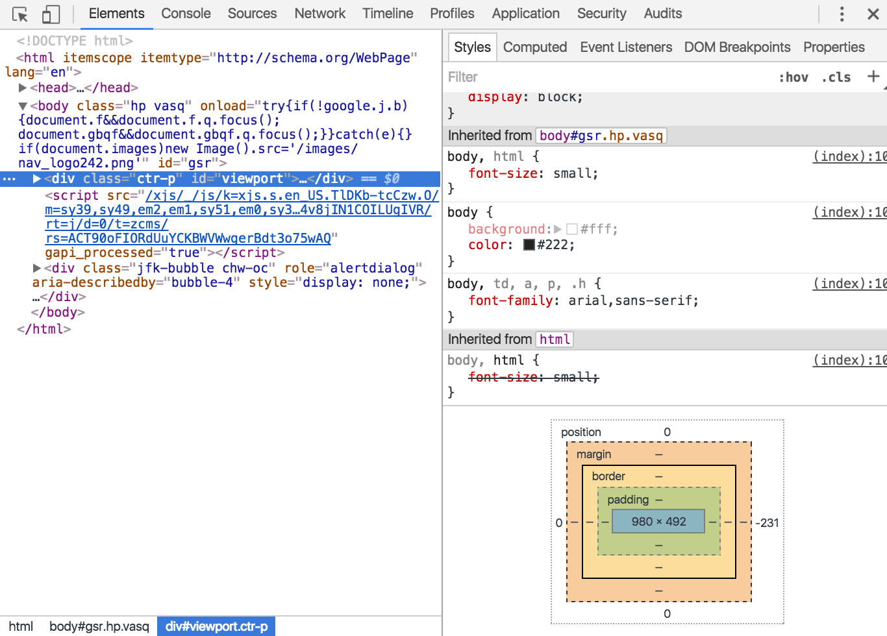
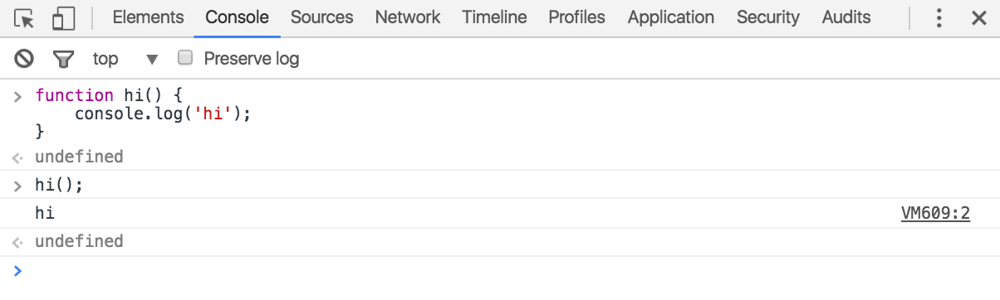
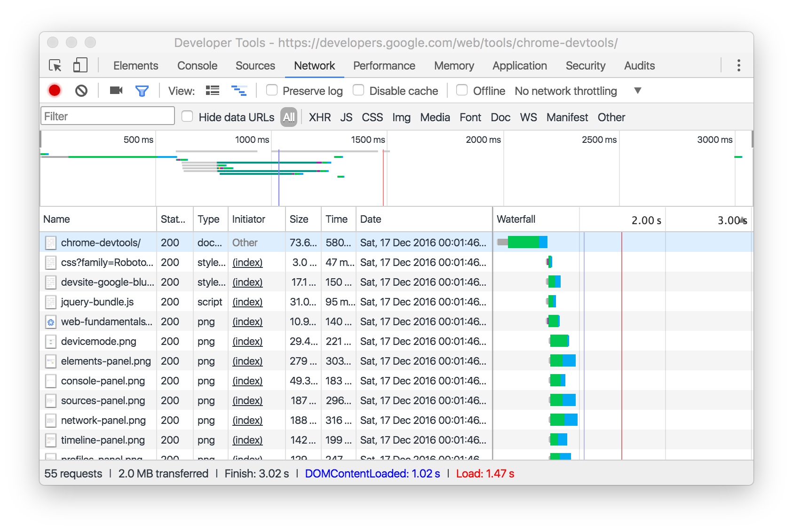
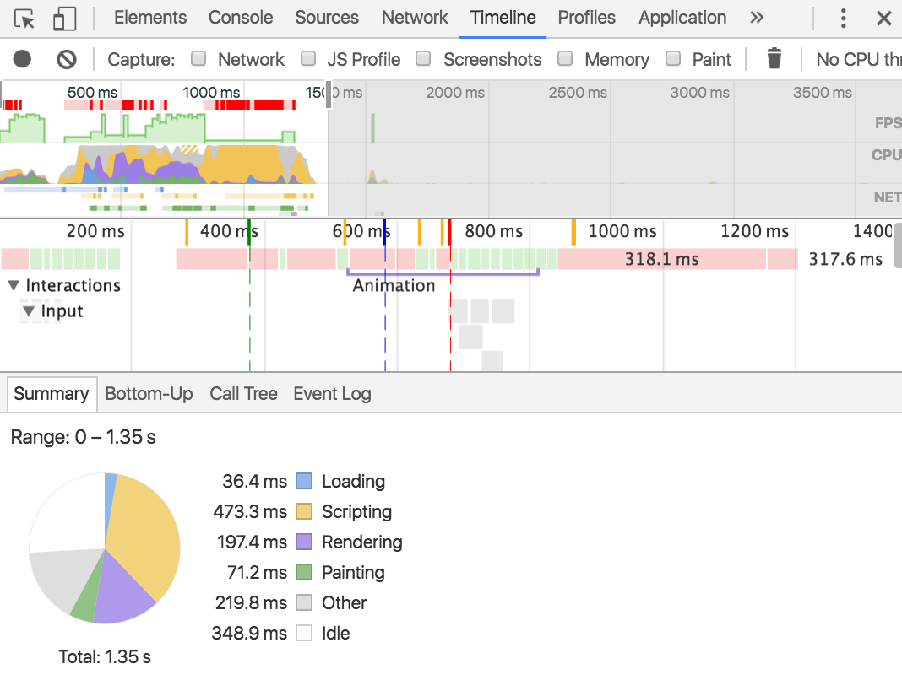
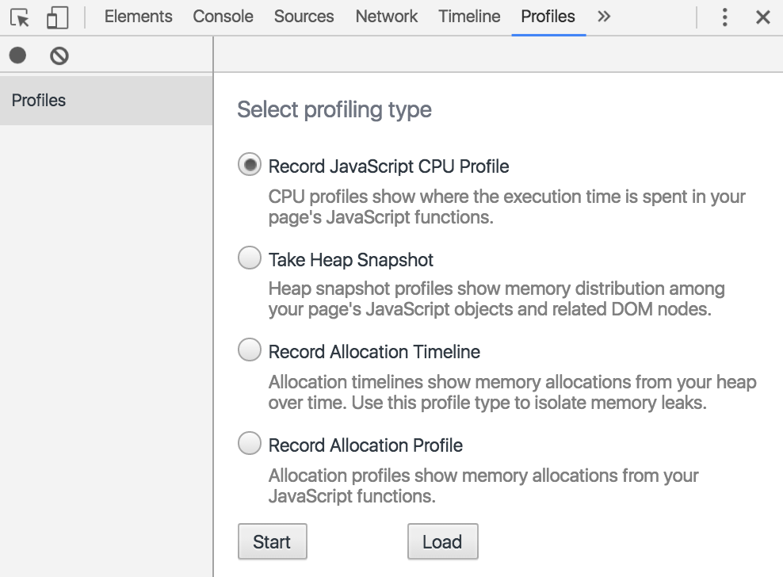
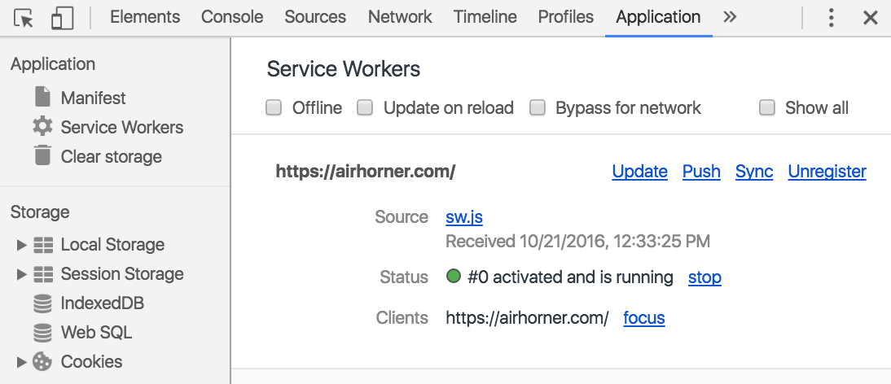
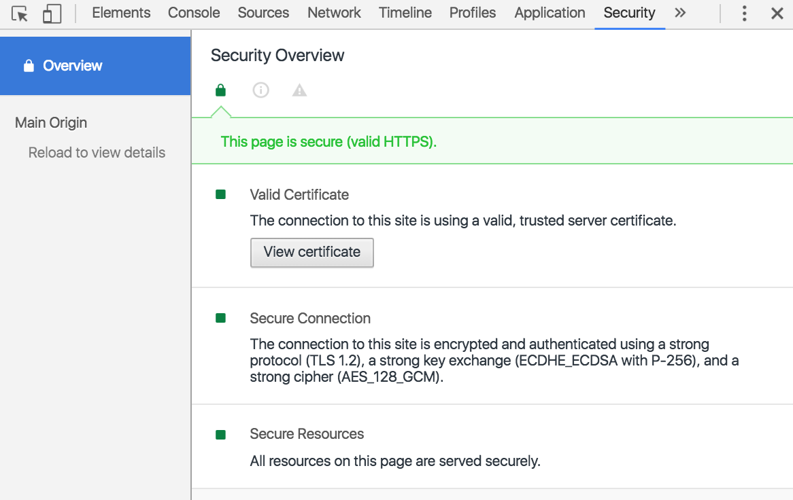

project_path: /web/_project.yaml
book_path: /web/tools/_book.yaml
description: Option 1

{# wf_updated_on: 2016-07-26 #}
{# wf_published_on: 2016-03-28 #}

# Chrome DevTools {: .page-title }

The Chrome DevTools are a set of web authoring and debugging tools built
into Google Chrome. Use the DevTools to iterate, debug and profile your site.

Dogfood: Looking for the latest, [Chrome Canary](https://www.google.com/intl/en/chrome/browser/canary.html) always has the latest DevTools.

## Opening the Chrome DevTools {: #open }

* Select **More Tools** > **Developer Tools** from the Chrome Menu.
* Right-click on a page element and select Inspect
* Use the [keyboard shortcuts](/web/tools/chrome-devtools/inspect-styles/shortcuts)
<kbd>Ctrl</kbd>+<kbd>Shift</kbd>+<kbd>I</kbd> (Windows) or <kbd>Cmd</kbd>+<kbd>Opt</kbd>+<kbd>I</kbd> (Mac)

## Discover the Panels

### Device Mode

Use the Device Mode to build fully responsive, mobile-first web experiences.

* [Device Mode](/web/tools/chrome-devtools/device-mode/)
* [Test Responsive and Device-specific Viewports](/web/tools/chrome-devtools/device-mode/emulate-mobile-viewports)
* [Emulate Sensors: Geolocation &amp; Accelerometer](/web/tools/chrome-devtools/device-mode/device-input-and-sensors)

### Elements

Use the Elements panel to iterate on the layout and design of your site by freely manipulating the DOM and CSS.

* [Inspect and Tweak Your Pages](/web/tools/chrome-devtools/inspect-styles/)
* [Edit Styles](/web/tools/chrome-devtools/inspect-styles/edit-styles)
* [Edit the DOM](/web/tools/chrome-devtools/inspect-styles/edit-dom)

### Console

Use the Console to log diagnostic information during development or use it as a shell to interact with the JavaScript on the page.

* [Using the Console](/web/tools/chrome-devtools/console/)
* [Interact from Command Line](/web/tools/chrome-devtools/console/command-line-reference)

### Sources

Debug your JavaScript using breakpoints in the Sources Panel or connect your local files via Workspaces to use DevTools live editor.

* [Debugging with Breakpoints](/web/tools/chrome-devtools/javascript/add-breakpoints)
* [Debug Obfuscated Code](/web/tools/chrome-devtools/javascript/add-breakpoints)
* [Set Up Persistence with DevTools Workspaces](/web/tools/setup/setup-workflow)

### Network

Use the Network panel to get insights into requested and downloaded resources and optimize your page load performance.

* [Network Panel Basics](/web/tools/chrome-devtools/network-performance/resource-loading)
* [Understanding Resource Timing](/web/tools/chrome-devtools/network-performance/understanding-resource-timing)
* [Network Throttling](/web/tools/chrome-devtools/network-performance/network-conditions)

### Timeline

Use the Timeline to improve the run time performance of your page by recording and exploring the various events that happen during the lifecycle of a site.

* [How to look at performance](/web/tools/chrome-devtools/evaluate-performance/timeline-tool)
* [Analyze runtime performance](/web/tools/chrome-devtools/rendering-tools/)
* [Diagnose Forced Synchronous Layouts](/web/tools/chrome-devtools/rendering-tools/forced-synchronous-layouts)

### Profiles

Use the Profiles panel if you need more information than the Timeline provide, for instance to track down memory leaks.

* [JavaScript CPU Profiler](/web/tools/chrome-devtools/rendering-tools/js-execution)
* [Heap Profiler](/web/tools/chrome-devtools/memory-problems/)

### Application

Use the Resources panel to inspect all resources that are loaded, including IndexedDB or Web SQL databases, local and session storage, cookies, Application Cache, images, fonts, and stylesheets.

* [Manage data](/web/tools/chrome-devtools/manage-data/local-storage)

### Security

Use the Security Panel to debug mixed content issues, problems with your certificate and more.

* [Security](/web/tools/chrome-devtools/security)

## Get Involved

[Twitter](https://twitter.com/ChromeDevTools){: .button .button-white}
[Stack Overflow](https://stackoverflow.com/questions/tagged/google-chrome-devtools){: .button .button-white}
[Slack](https://chromiumdev.slack.com/messages/devtools/){: .button .button-white}
