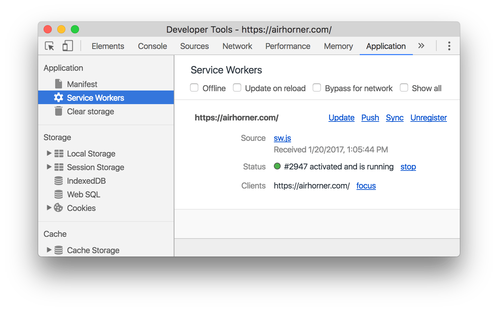

project_path: /web/_project.yaml
book_path: /web/tools/_book.yaml
description: Get started with Google Chrome's built-in authoring, debugging, and profiling development tools.

{# wf_updated_on: 2017-04-07 #}
{# wf_published_on: 2016-03-28 #}

# Chrome DevTools {: .page-title }

The Chrome DevTools are a set of web authoring and debugging tools built
into Google Chrome. Use the DevTools to iterate, debug, and profile your site.

Note: Many of the DevTools docs are based on [Chrome Canary][canary], which
provides the latest Chrome features.

[canary]: https://www.google.com/intl/en/chrome/browser/canary.html

## Open DevTools {: #open }

* Select **More Tools** > **Developer Tools** from Chrome's Main Menu.
* Right-click a page element and select **Inspect**.
* Press <kbd>Command</kbd>+<kbd>Option</kbd>+<kbd>I</kbd> (Mac) or
  <kbd>Control</kbd>+<kbd>Shift</kbd>+<kbd>I</kbd> (Windows, Linux).

## Discover DevTools

### Device Mode

Build fully responsive, mobile-first web experiences.

* [Device Mode](/web/tools/chrome-devtools/device-mode/)
* [Test Responsive and Device-specific Viewports](/web/tools/chrome-devtools/device-mode/emulate-mobile-viewports)
* [Emulate Sensors: Geolocation &amp; Accelerometer](/web/tools/chrome-devtools/device-mode/device-input-and-sensors)

### Elements panel

Iterate on the layout and design of your site by freely manipulating the DOM and CSS.

* [Inspect and Tweak Your Pages](/web/tools/chrome-devtools/inspect-styles/)
* [Edit Styles](/web/tools/chrome-devtools/inspect-styles/edit-styles)
* [Edit the DOM](/web/tools/chrome-devtools/inspect-styles/edit-dom)
* [Inspect Animations](/web/tools/chrome-devtools/inspect-styles/animations)

### Console panel

Log diagnostic information during development or interact with the JavaScript on the page.

* [Using the Console](/web/tools/chrome-devtools/console/)
* [Interact from Command Line](/web/tools/chrome-devtools/console/command-line-reference)

### Sources panel

Debug your JavaScript using breakpoints or connect your local files via Workspaces to use
DevTools as a code editor.

* [Get Started With Debugging JavaScript](/web/tools/chrome-devtools/javascript)
* [Pause Your Code With Breakpoints](/web/tools/chrome-devtools/javascript/breakpoints)
* [Set Up Persistence with DevTools Workspaces](/web/tools/setup/setup-workflow)
* [Run Snippets Of Code From Any Page](/web/tools/chrome-devtools/snippets)
* [JavaScript Debugging Reference](/web/tools/chrome-devtools/javascript/reference)

### Network panel

Optimize page load performance and debug request issues.

* [Get Started](/web/tools/chrome-devtools/network-performance/)
* [Network Issues Guide](/web/tools/chrome-devtools/network-performance/issues)
* [Network Panel Reference](/web/tools/chrome-devtools/network-performance/reference)

### Performance panel (previously Timeline panel)

Note: In Chrome 58 the Timeline panel was renamed to the Performance panel.

Improve the runtime performance of your page by recording and exploring the various events
that happen during the lifecycle of a site.

* [How to look at performance](/web/tools/chrome-devtools/evaluate-performance/timeline-tool)
* [Analyze runtime performance](/web/tools/chrome-devtools/rendering-tools/)
* [Diagnose Forced Synchronous Layouts](/web/tools/chrome-devtools/rendering-tools/forced-synchronous-layouts)

### Memory panel (previously Profiles panel)

Note: In Chrome 58 the Profiles panel was renamed to the Memory panel.

Profile memory usage and track down leaks.

* [Fix Memory Problems](/web/tools/chrome-devtools/memory-problems/)
* [JavaScript CPU Profiler](/web/tools/chrome-devtools/rendering-tools/js-execution)

### Application panel (previously Resources panel)

Note: In Chrome 52 the Resources panel was renamed to the Application panel.

Inspect all resources that are loaded, including IndexedDB or Web SQL databases, local and
session storage, cookies, Application Cache, images, fonts, and stylesheets.

* [Debug Progressive Web Apps](/web/tools/chrome-devtools/progressive-web-apps)
* [Inspect and Manage Storage, Databases, and Caches](/web/tools/chrome-devtools/manage-data/local-storage)
* [Inspect and Delete Cookies](/web/tools/chrome-devtools/manage-data/cookies)
* [Inspect Resources](/web/tools/chrome-devtools/manage-data/page-resources)

### Security panel

Debug mixed content issues, certificate problems, and more.

* [Understand Security Issues](/web/tools/chrome-devtools/security)

## Get Involved

Ask questions or give feedback about DevTools (or these docs) in any of the
channels below.

<a class="button button-white gc-analytics-event"
   data-category="DevTools" data-label="Home / Twitter"
   href="https://twitter.com/ChromeDevTools">Twitter</a>

<a class="button button-white gc-analytics-event"
   href="https://groups.google.com/forum/#!topic/google-chrome-developer-tools"
   data-category="DevTools" data-label="Home / Mailing List">Mailing List</a>

<a class="button button-white gc-analytics-event"
   href="https://stackoverflow.com/questions/tagged/google-chrome-devtools"
   data-category="DevTools" data-label="Home / Stack Overflow">
  Stack Overflow
</a>

<a class="button button-white gc-analytics-event"
   href="https://chromiumdev.slack.com/messages/devtools/"
   data-category="DevTools" data-label="Home / Slack">Slack</a>

<a class="button button-white gc-analytics-event"
   href="https://github.com/google/webfundamentals/issues/new"
   data-category="DevTools" data-label="Home / GitHub">GitHub</a>
