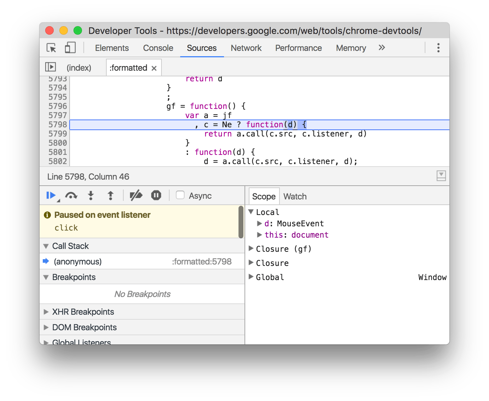

project_path: /web/tools/_project.yaml
book_path: /web/tools/_book.yaml
description: Get started with Google Chrome's built-in web developer tools.

{# wf_updated_on: 2019-09-04 #}
{# wf_published_on: 2016-03-28 #}
{# wf_blink_components: Platform>DevTools #}

# Chrome DevTools {: .page-title }

Chrome DevTools is a set of web developer tools built directly into the [Google
Chrome](https://www.google.com/chrome/){: .external } browser. DevTools can help you edit
pages on-the-fly and diagnose problems quickly, which ultimately helps you build better
websites, faster.

  <iframe class="devsite-embedded-youtube-video" data-video-id="VYyQv0CSZOE"
          data-autohide="1" data-showinfo="0" frameborder="0" allowfullscreen>
  </iframe>

Check out the video for live demonstrations of core DevTools workflows, including debugging CSS,
prototyping CSS, debugging JavaScript, and analyzing load performance.

## Open DevTools {: #open }

There are many ways to open DevTools, because different users want quick access to different
parts of the DevTools UI.

* When you want to work with the DOM or CSS, right-click an element on the page and select **Inspect**
  to jump into the **Elements** panel. Or press <kbd>Command</kbd>+<kbd>Option</kbd>+<kbd>C</kbd> (Mac) or
  <kbd>Control</kbd>+<kbd>Shift</kbd>+<kbd>C</kbd> (Windows, Linux, Chrome OS).
* When you want to see logged messages or run JavaScript, press <kbd>Command</kbd>+<kbd>Option</kbd>+<kbd>J</kbd>
  (Mac) or <kbd>Control</kbd>+<kbd>Shift</kbd>+<kbd>J</kbd> (Windows, Linux, Chrome OS) to
  jump straight into the **Console** panel.

See [Open Chrome DevTools](/web/tools/chrome-devtools/open) for more details and workflows.

## Get started {: #start }

If you're a more experienced web developer, here are the recommended starting points for learning how
DevTools can improve your productivity:

* [View and Change the DOM](/web/tools/chrome-devtools/dom/)
* [View and Change a Page's Styles (CSS)](/web/tools/chrome-devtools/css/)
* [Debug JavaScript](/web/tools/chrome-devtools/javascript/)
* [View Messages and Run JavaScript in the Console](console/get-started)
* [Optimize Website Speed](/web/tools/chrome-devtools/speed/get-started)
* [Inspect Network Activity](/web/tools/chrome-devtools/network/)

## Discover DevTools {: #discover }

The DevTools UI can be a little overwhelming... there are so many tabs! But, if you take some
time to get familiar with each tab to understand what's possible, you may discover that DevTools
can seriously boost your productivity.

Note: In the DevTools docs, the top-level tabs are called panels.

### Device Mode {: #device-mode }

Simulate mobile devices.

* [Device Mode](/web/tools/chrome-devtools/device-mode/)
* [Test Responsive and Device-specific Viewports](/web/tools/chrome-devtools/device-mode/emulate-mobile-viewports)
* [Emulate Sensors: Geolocation &amp; Accelerometer](/web/tools/chrome-devtools/device-mode/device-input-and-sensors)

### Elements panel {: #elements }

View and change the DOM and CSS.

* [Get Started With Viewing And Changing The DOM](/web/tools/chrome-devtools/dom/)
* [Get Started With Viewing And Changing CSS](/web/tools/chrome-devtools/css/)
* [Inspect and Tweak Your Pages](/web/tools/chrome-devtools/inspect-styles/)
* [Edit Styles](/web/tools/chrome-devtools/inspect-styles/edit-styles)
* [Edit the DOM](/web/tools/chrome-devtools/inspect-styles/edit-dom)
* [Inspect Animations](/web/tools/chrome-devtools/inspect-styles/animations)
* [Find Unused CSS](/web/tools/chrome-devtools/coverage/)

### Console panel {: #console }

View messages and run JavaScript from the Console.

* [Get Started With The Console](/web/tools/chrome-devtools/console/get-started)
* [Using the Console](/web/tools/chrome-devtools/console/)
* [Interact from Command Line](/web/tools/chrome-devtools/console/command-line-reference)
* [Console API Reference](/web/tools/chrome-devtools/console/console-reference)

### Sources panel {: #sources }

Debug JavaScript, persist changes made in DevTools across page reloads,
save and run snippets of JavaScript, and save changes that you make in DevTools to disk.

* [Get Started With Debugging JavaScript](/web/tools/chrome-devtools/javascript)
* [Pause Your Code With Breakpoints](/web/tools/chrome-devtools/javascript/breakpoints)
* [Save Changes to Disk with Workspaces](/web/tools/setup/setup-workflow)
* [Run Snippets Of Code From Any Page](/web/tools/chrome-devtools/snippets)
* [JavaScript Debugging Reference](/web/tools/chrome-devtools/javascript/reference)
* [Persist Changes Across Page Reloads with Local Overrides](/web/updates/2018/01/devtools#overrides)
* [Find Unused JavaScript](/web/tools/chrome-devtools/coverage/)

### Network panel {: #network }

View and debug network activity.

* [Get Started](/web/tools/chrome-devtools/network-performance/)
* [Network Issues Guide](/web/tools/chrome-devtools/network-performance/issues)
* [Network Panel Reference](/web/tools/chrome-devtools/network-performance/reference)

### Performance panel {: #performance }

Note: In Chrome 58 the Timeline panel was renamed to the Performance panel.

Find ways to improve load and runtime performance.

* [Optimize Website Speed](/web/tools/chrome-devtools/speed/get-started)
* [Get Started With Analyzing Runtime Performance][runtimegs]
* [Performance Analysis Reference](/web/tools/chrome-devtools/evaluate-performance/reference)
* [Analyze runtime performance](/web/tools/chrome-devtools/rendering-tools/)
* [Diagnose Forced Synchronous Layouts](/web/tools/chrome-devtools/rendering-tools/forced-synchronous-layouts)

[runtimegs]: /web/tools/chrome-devtools/evaluate-performance/

### Memory panel {: #memory }

Note: In Chrome 58 the Profiles panel was renamed to the Memory panel.

Profile memory usage and track down leaks.

* [Fix Memory Problems](/web/tools/chrome-devtools/memory-problems/)
* [JavaScript CPU Profiler](/web/tools/chrome-devtools/rendering-tools/js-execution)

### Application panel {: #application }

Inspect all resources that are loaded, including IndexedDB or Web SQL databases, local and
session storage, cookies, Application Cache, images, fonts, and stylesheets.

* [Debug Progressive Web Apps](/web/tools/chrome-devtools/progressive-web-apps)
* [Inspect and Manage Storage, Databases, and Caches](/web/tools/chrome-devtools/manage-data/local-storage)
* [Inspect and Delete Cookies](/web/tools/chrome-devtools/manage-data/cookies)
* [Inspect Resources](/web/tools/chrome-devtools/manage-data/page-resources)

### Security panel {: #security }

Debug mixed content issues, certificate problems, and more.

* [Understand Security Issues](/web/tools/chrome-devtools/security)

## Community {: #community }

The best place to file feature requests for Chrome DevTools is the mailing list.
The team needs to understand use cases, gauge community interest, and discuss
feasibility before implementing any new features.

<a class="button button-primary gc-analytics-event cdt-but"
   href="https://groups.google.com/forum/#!forum/google-chrome-developer-tools"
   data-category="DevTools" data-label="Home / Mailing List">Mailing List</a>

File bug reports in Crbug, which is the engineering team's bug tracker.

<a class="button button-primary gc-analytics-event" href="https://crbug.com"
   data-category="DevTools" data-label="Home / Crbug">Crbug</a>

If you want to alert us to a bug or feature request but don't have much time,
you're welcome to send a tweet to @ChromeDevTools. We reply and send
announcements from the account regularly.

<a class="button button-primary gc-analytics-event"
   data-category="DevTools" data-label="Home / Twitter"
   href="https://twitter.com/ChromeDevTools">Twitter</a>

For help with using DevTools, Stack Overflow is the best channel.

<a class="button button-primary gc-analytics-event cdt-but"
   href="https://stackoverflow.com/questions/ask?tags=google-chrome-devtools"
   data-category="DevTools" data-label="Home / Stack Overflow">
  Stack Overflow
</a>

To file bugs or feature requests on the DevTools docs, open a GitHub issue
on the Web Fundamentals repository.

<a class="button button-primary gc-analytics-event"
   href="https://github.com/google/webfundamentals/issues/new"
   data-category="DevTools" data-label="Home / GitHub">Docs Issues</a>

DevTools also has a Slack channel, but the team doesn't monitor it
consistently.

<a class="button button-primary gc-analytics-event"
   href="https://chromiumdev.slack.com/messages/devtools/"
   data-category="DevTools" data-label="Home / Slack">Slack</a>

## Feedback {: #feedback }


