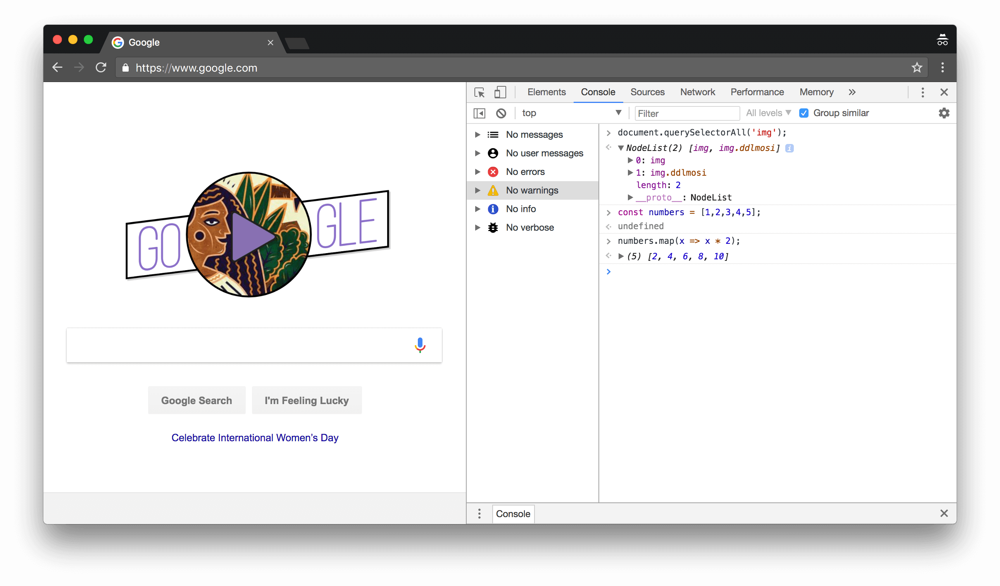
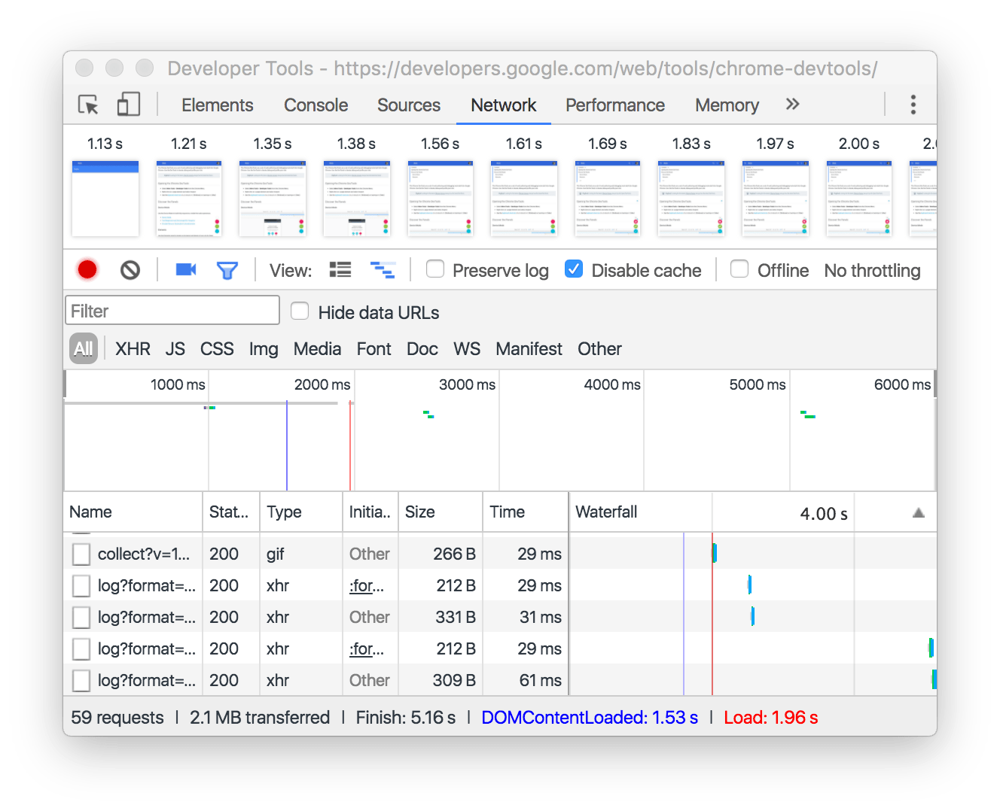

project_path: /web/tools/_project.yaml
book_path: /web/tools/_book.yaml
description: Get started with Google Chrome's built-in web developer tools.

{# wf_updated_on: 2018-03-08 #}
{# wf_published_on: 2016-03-28 #}
{# wf_blink_components: Platform>DevTools #}

# Chrome DevTools {: .page-title }

Chrome DevTools is a set of web developer tools built directly into the Google Chrome browser.
DevTools can help you diagnose problems quickly, which ultimately helps you build better
websites, faster.

  <iframe class="devsite-embedded-youtube-video" data-video-id="G_P6rpRSr4g"
          data-autohide="1" data-showinfo="0" frameborder="0" allowfullscreen>
  </iframe>

With DevTools you can view and change any page, even the Google homepage, as the video
demonstrates.

## Get started {: #get-started }

Here are the recommended starting points for some of the most common ways that DevTools
can help you build websites faster:

* [Viewing and changing a page's styles](/web/tools/chrome-devtools/css/). Every developer goes
  through this experience: you code some CSS, and then you view your page and... the styles
  aren't being applied. Or, they look way different than you expect. This tutorial shows you how
  to use DevTools to see how the browser is actually applying styles to HTML elements. It also
  shows you how to change styles from DevTools, which applies the changes immediately without
  needing to reload the page.
* [Debugging JavaScript](/web/tools/chrome-devtools/javascript/). The first way that most
  developers learn how to debug is to sprinkle `console.log()` commands throughout their code,
  in order to infer where the code is going wrong. This tutorial shows you how to set breakpoints
  in DevTools, which lets you pause in the middle of a page's execution and step through the
  code one line at a time. While you're paused, you can inspect (and even change) the current
  values of variables at that point in time. You may find that this workflow helps you
  debug issues much faster than the `console.log()` method.
* [Viewing messages and running JavaScript in the **Console**](console/get-started). The
  **Console** provides a chronological log of messages that give you more information about
  whether a page is running correctly. These messages come from the developers who built the
  page, or from the browser. You can also run JavaScript from the **Console** in order to
  inspect how a page is built, or experiment with changing how the page runs.
* [Analyzing runtime performance](/web/tools/chrome-devtools/evaluate-performance/). If your
  page is slow or janky, you can use DevTools to record everything that happens on the page,
  and then analyze the results to learn how to optimize the page's performance.

Browse the DevTools docs to learn about all the other things that DevTools can do for you.
The docs are organized by common tasks.

See [Join the DevTools community](#community) to learn about all the ways that you can
get help with how to use DevTools, or help others. If you ever have ideas on how to improve these
docs or the DevTools product itself, the DevTools team would love to hear your feedback!

## Discover DevTools {: #discover-devtools }

The DevTools UI can be a little overwhelming... there's so many tabs! But, if you take some
time to get familiar with each tab to understand what's possible, you may discover that DevTools
can seriously boost your productivity.

Note: In the DevTools docs, the top-level tabs are called panels.

### Device Mode {: #device-mode }

Build fully responsive, mobile-first web experiences.

* [Device Mode](/web/tools/chrome-devtools/device-mode/)
* [Test Responsive and Device-specific Viewports](/web/tools/chrome-devtools/device-mode/emulate-mobile-viewports)
* [Emulate Sensors: Geolocation &amp; Accelerometer](/web/tools/chrome-devtools/device-mode/device-input-and-sensors)

### Elements panel {: #elements }

Iterate on the layout and design of your site by freely manipulating the DOM and CSS.

* [Get Started With Viewing And Changing CSS](/web/tools/chrome-devtools/css/)
* [Inspect and Tweak Your Pages](/web/tools/chrome-devtools/inspect-styles/)
* [Edit Styles](/web/tools/chrome-devtools/inspect-styles/edit-styles)
* [Edit the DOM](/web/tools/chrome-devtools/inspect-styles/edit-dom)
* [Inspect Animations](/web/tools/chrome-devtools/inspect-styles/animations)

### Console panel {: #console }

Log diagnostic information during development or interact with the JavaScript on the page.

* [Get Started With The Console](/web/tools/chrome-devtools/console/get-started)
* [Using the Console](/web/tools/chrome-devtools/console/)
* [Interact from Command Line](/web/tools/chrome-devtools/console/command-line-reference)
* [Console API Reference](/web/tools/chrome-devtools/console/console-reference)

### Sources panel {: #sources }

Debug your JavaScript using breakpoints or connect your local files via Workspaces to use
DevTools as a code editor.

* [Get Started With Debugging JavaScript](/web/tools/chrome-devtools/javascript)
* [Pause Your Code With Breakpoints](/web/tools/chrome-devtools/javascript/breakpoints)
* [Set Up Persistence with DevTools Workspaces](/web/tools/setup/setup-workflow)
* [Run Snippets Of Code From Any Page](/web/tools/chrome-devtools/snippets)
* [JavaScript Debugging Reference](/web/tools/chrome-devtools/javascript/reference)

### Network panel {: #network }

Optimize page load performance and debug request issues.

* [Get Started](/web/tools/chrome-devtools/network-performance/)
* [Network Issues Guide](/web/tools/chrome-devtools/network-performance/issues)
* [Network Panel Reference](/web/tools/chrome-devtools/network-performance/reference)

### Performance panel {: #performance }

Note: In Chrome 58 the Timeline panel was renamed to the Performance panel.

Improve the runtime performance of your page by recording and exploring the
various events that happen during the lifecycle of a site.

* [Get Started With Analyzing Runtime Performance][runtimegs]
* [Performance Analysis Reference](/web/tools/chrome-devtools/evaluate-performance/reference)
* [Analyze runtime performance](/web/tools/chrome-devtools/rendering-tools/)
* [Diagnose Forced Synchronous Layouts](/web/tools/chrome-devtools/rendering-tools/forced-synchronous-layouts)

[runtimegs]: /web/tools/chrome-devtools/evaluate-performance/

### Memory panel {: #memory }

Note: In Chrome 58 the Profiles panel was renamed to the Memory panel.

Profile memory usage and track down leaks.

* [Fix Memory Problems](/web/tools/chrome-devtools/memory-problems/)
* [JavaScript CPU Profiler](/web/tools/chrome-devtools/rendering-tools/js-execution)

### Application panel {: #application }

Inspect all resources that are loaded, including IndexedDB or Web SQL databases, local and
session storage, cookies, Application Cache, images, fonts, and stylesheets.

* [Debug Progressive Web Apps](/web/tools/chrome-devtools/progressive-web-apps)
* [Inspect and Manage Storage, Databases, and Caches](/web/tools/chrome-devtools/manage-data/local-storage)
* [Inspect and Delete Cookies](/web/tools/chrome-devtools/manage-data/cookies)
* [Inspect Resources](/web/tools/chrome-devtools/manage-data/page-resources)

### Security panel {: #security }

Debug mixed content issues, certificate problems, and more.

* [Understand Security Issues](/web/tools/chrome-devtools/security)

## Join the DevTools community {: #community }

The best place to file feature requests for Chrome DevTools is the mailing list.
The team needs to understand use cases, gauge community interest, and discuss
feasibility before implementing any new features.

<a class="button button-primary gc-analytics-event cdt-but"
   href="https://groups.google.com/forum/#!forum/google-chrome-developer-tools"
   data-category="DevTools" data-label="Home / Mailing List">Mailing List</a>

File bug reports in Crbug, which is the engineering team's bug tracker.

<a class="button button-primary gc-analytics-event" href="https://crbug.com"
   data-category="DevTools" data-label="Home / Crbug">Crbug</a>

If you want to alert us to a bug or feature request but don't have much time,
you're welcome to send a tweet to @ChromeDevTools. We reply and send
announcements from the account regularly.

<a class="button button-primary gc-analytics-event"
   data-category="DevTools" data-label="Home / Twitter"
   href="https://twitter.com/ChromeDevTools">Twitter</a>

For help with using DevTools, Stack Overflow is the best channel.

<a class="button button-primary gc-analytics-event cdt-but"
   href="https://stackoverflow.com/questions/ask?tags=google-chrome-devtools"
   data-category="DevTools" data-label="Home / Stack Overflow">
  Stack Overflow
</a>

To file bugs or feature requests on the DevTools docs, open a GitHub issue
on the Web Fundamentals repository.

<a class="button button-primary gc-analytics-event"
   href="https://github.com/google/webfundamentals/issues/new"
   data-category="DevTools" data-label="Home / GitHub">Docs Issues</a>

DevTools also has a Slack channel, but the team doesn't monitor it
consistently.

<a class="button button-primary gc-analytics-event"
   href="https://chromiumdev.slack.com/messages/devtools/"
   data-category="DevTools" data-label="Home / Slack">Slack</a>
