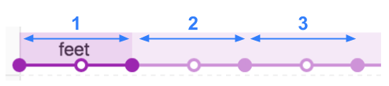
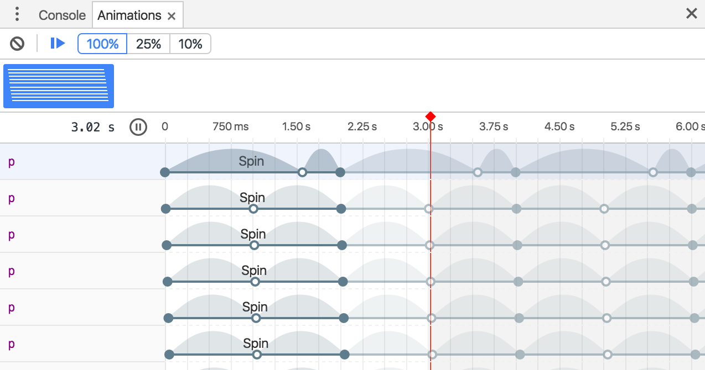

project_path: /web/tools/_project.yaml
book_path: /web/tools/_book.yaml
description: Inspect and modify animations with the Chrome DevTools  Animation Inspector.

{# wf_updated_on: 2017-07-24 #}
{# wf_published_on: 2016-05-02 #}

# Inspect animations {: .page-title }



Inspect and modify animations with the Chrome DevTools
Animation Inspector.

### TL;DR {: .hide-from-toc }
- Capture animations by opening the Animation Inspector. It automatically detects animations and sorts them into groups.
- Inspect animations by slowing them down, replaying them, or viewing their source code.
- Modify animations by changing their timing, delay, duration, or keyframe offsets.

## Overview {:#overview}

The Chrome DevTools Animation Inspector has two main purposes. 

* Inspecting animations. You want to slow down, replay, or inspect the 
  source code for an animation group. 
* Modifying animations. You want to modify the timing, delay, duration, 
  or keyframe offsets of an animation group. Bezier editing and keyframe 
  editing are currently not supported. 

The Animation Inspector supports CSS animations,
CSS transitions, and web animations. `requestAnimationFrame` animations 
are currently not supported.

### What's an animation group?

An animation group is a group of animations that 
*appear* to be related to each other. Currently, the web has no real concept
of a group animation, so motion designers and developers have to compose 
and time individual animations so that they appear to be one coherent visual 
effect. The Animation Inspector predicts which animations are related based 
on start time (excluding delays, and so on) and groups them all side-by-side. 
In other words, a set of animations all triggered in the same script block 
are grouped together, but if they're asynchronous then they're grouped 
separately. 

## Get started

There are two ways to open the Animation Inspector:

* Go to the **Styles** pane (on the **Elements** panel) and press the 
  **Animations** button ({:.inline}). 
* Open the Command Menu and type `Drawer: Show Animations`. 

The Animation Inspector opens up as a tab next to the Console Drawer. Since
it's a Drawer tab, you can use it from any DevTools panel. 

The Animation Inspector is grouped into four main sections (or panes). This
guide refers to each pane as follows:

1. **Controls**. From here you can clear all currently captured Animation 
   Groups, or change the speed of the currently selected Animation Group. 
2. **Overview**. Select an Animation Group here to inspect 
   and modify it in the **Details** pane.
3. **Timeline**. Pause and start an animation from here, or jump to a specific 
   point in the animation.
4. **Details**. Inspect and modify the currently selected
   Animation Group. 

To capture an animation, just perform the interaction that triggers the
animation while the Animation Inspector is open. If an animation is triggered 
on page load, you can help the Animation Inspector detect the animation by 
reloading the page. 

<video src="animations/capture-animations.mp4"
       autoplay loop muted controls></video>

## Inspect animations {:#inspect}

Once you've captured an animation, there are a few ways to replay it:

* Hover over its thumbnail in the **Overview** pane to view a preview of it.
* Select the Animation Group from the **Overview** pane (so that it's displayed
  in the **Details** pane) and press the **replay** button
  ({:.inline}). The animation is
  replayed in the viewport. 
  Click on the **animation speed** buttons ({:.inline}) to change the preview 
  speed of the currently selected Animation Group. You can use the red 
  vertical bar to change your current position. 
* Click and drag the red vertical bar to scrub the viewport animation. 

### View animation details

Once you've captured an Animation Group, click on it from the **Overview** pane 
to view its details. In the **Details** pane each individual animation gets
its own row. 

Hover over an animation to highlight it in the viewport. Click on the animation
to select it in the **Elements** panel. 

The leftmost, darker section of an animation is its definition. The right,
more faded section represents iterations. For example, in the 
screenshot below, sections two and three represent iterations of section one. 

If two elements have the same animation applied to them, the Animation 
Inspector assigns them the same color. The color itself is random and has 
no significance.
For example, in the screenshot below the two elements `div.eye.left::after` 
and `div.eye.right::after` have the same animation (`eyes`) applied to them, 
as do the `div.feet::before` and `div.feet::after` elements. 

## Modify animations {:#modify}

There are three ways you can modify an animation with the Animation Inspector:

* Animation duration.
* Keyframe timings.
* Start time delay.

For this section suppose that the screenshot below represents the original
animation:

To change the duration of an animation, click and drag the first or last 
circle.

If the animation defines any keyframe rules, then these are represented as
white inner circles. Click and drag one of these to change the timing of the 
keyframe.

To add a delay to an animation, click and drag it anywhere except the 
circles. 

