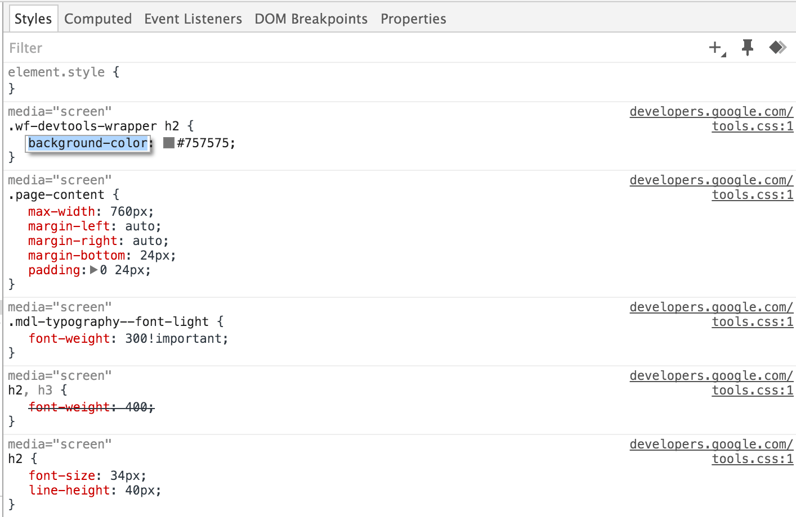

project_path: /web/tools/_project.yaml
book_path: /web/tools/_book.yaml
description: Inspect and edit the HTML and CSS of your pages.

{# wf_updated_on: 2016-01-28 #}
{# wf_published_on: 2015-04-13 #}

# Inspect and Edit Pages and Styles {: .page-title }




Inspect and live-edit the HTML and CSS of a page using 
the Chrome DevTools Elements panel.

### TL;DR {: .hide-from-toc }
- Inspect and edit on the fly any element in the DOM tree in the  Elements panel.
- View and change the CSS rules applied to any selected element in  the Styles pane.
- View and edit a selected element's box model in the Computed pane.
- View any changes made to your page locally in the Sources panel.

## Live-edit a DOM node

To live-edit a DOM node, simply double-click a 
[selected element](#inspect-an-element) and make changes:

<video src="animations/edit-element-name.mp4" style="max-width:100%;"
       loop muted autoplay controls></video>

The DOM tree view shows the current state of the tree; it may not match 
the HTML that was originally loaded for different reasons. For example, 
you can modify the DOM tree using JavaScript; the browser engine can try 
to correct invalid author markup and produce an unexpected DOM.

## Live-edit a style

Live-edit style property names and values in the **Styles** pane. All
styles are editable, except the ones that are greyed out (as is the case
with user agent stylesheets).

To edit a name or value, click on it, make your changes, and press
<kbd class="kbd">Tab</kbd> or <kbd class="kbd">Enter</kbd> to save the change.

By default, your CSS modifications are not permanent, changes are lost 
when you reload the page. Set up [persistent 
authoring](/web/tools/setup/setup-workflow) if you want to persist your 
changes between page loads. 

## Examine and edit box model parameters

Examine and edit the current element's box model parameters using the 
**Computed pane**. All values in the box model are editable, just click 
on them.

The concentric rectangles contain the **top**, **bottom**, **left**, **right**
values for the current element's **padding**, **border**, and **margin**
properties. 

For non-statically positioned elements, a **position** rectangle 
is also displayed, containing the values of the **top**, 
**right**, **bottom**, and **left** properties.

For `position: fixed` and `position: absolute` elements, the central 
field contains the actual **offsetWidth × offsetHeight** pixel dimensions 
of the selected element. All values can be modified by double-clicking 
them, like property values in the Styles pane. The changes are not, however, 
guaranteed to take effect, as this is subject to the concrete element 
positioning specifics.

## View local changes

<video src="animations/revisions.mp4" style="max-width:100%;"
       autoplay loop muted controls></video>

To view a history of live-edits made to your page:

1. In the **Styles** pane, click on the file that you modified. DevTools
   takes you to the **Sources** panel.
1. Right-click on the file. 
1. Select **Local modifications**.

To explore the changes made:

* Expand top-level file names to view the time 
  {:.inline} 
  a modification occurred.
* Expand second-level items to view a 
  [diff](https://en.wikipedia.org/wiki/Diff) (before and after) 
  corresponding to the modification. A line with a pink background signifies 
  a removal while a line with a green background signifies an addition.

## Undo changes

If you haven't [set up persistent authoring](/web/tools/setup/setup-workflow), 
any time you reload the page, all live-edits are lost.

Assuming you've set up persistent authoring, to undo changes:

* Use <kbd class="kbd">Ctrl</kbd>+<kbd class="kbd">Z</kbd> (Windows) or 
  <kbd class="kbd">Cmd</kbd>+<kbd class="kbd">Z</kbd> (Mac) to quickly 
  undo minor changes to the DOM or styles via the Elements panel.

* To undo all local modifications made to a file, open the **Sources** 
  panel and select **revert** next to the filename.

[inspect]: /web/tools/chrome-devtools/debug/command-line/command-line-reference#inspect
