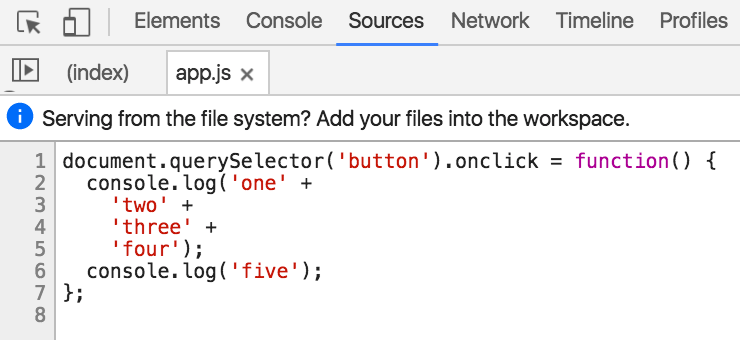

project_path: /web/_project.yaml
book_path: /web/tools/_book.yaml
description: Use breakpoints to pause your JavaScript code and investigate the values of variables and the call stack at that particular moment in time.

{# wf_updated_on: 2016-07-17 #}
{# wf_published_on: 2015-04-13 #}

# How to set breakpoints {: .page-title }



Use breakpoints to pause your JavaScript code and investigate
the values of variables and the call stack at that particular moment in
time.

Once you've got your breakpoints set up, learn how to step through your code
and investigate your variables and call stacks in [How to step through your
code](step-code).

### TL;DR {: .hide-from-toc }
- The most basic way to set a breakpoint is to manually add one on a specific line of code. You can configure these breakpoints to only get triggered when a certain condition is met.
- You can also set breakpoints that are triggered when general conditions are met, such as an event, a DOM change, or an uncaught exception.

## Set a breakpoint on a particular line of code {:#line-number}

Setting a breakpoint on a particular line of code is useful when you know
what statement you want to investigate. For example, if your
login workflow is not working as expected, and you only have one function in
your code that handles the login, then it's safe to assume that the bug
is probably in that function. It makes sense in this scenario to add a
breakpoint at the first line of that function.

When you set a breakpoint on a line of code, the code always pauses on that
line of code until you delete the breakpoint, disable it, or make it
conditional.

To set a breakpoint on a particular line of code, first open the **Sources**
panel, and select the script from the **File Navigator** pane on the lefthand
side. If you can't see the **File Navigator**, press the **Toggle file
navigator** button
(![hide / show file navigator button][fn]{:.devtools-inline})
.

**Tip**: If you're working with minified code, press the **pretty print**
button 
(![pretty print button][pp]{:.devtools-inline})
to make it readable. 

Along the left side of your source code you can see line numbers. This region
is called the **line number gutter**. Click within the line number gutter to
add a breakpoint on that line of code.

![line number breakpoint][lnb]

If an expression is spaced across multiple lines, and you put a line
breakpoint in the middle of the expression, DevTools sets the breakpoint
on the next expression. For example, if you try to set a breakpoint on line
4 in the screenshot below, DevTools puts the breakpoint on line 6.

[pp]: imgs/pretty-print.png
[fn]: imgs/file-navigator.png
[lnb]: imgs/line-number-breakpoint.png

### Make a line number breakpoint conditional

A conditional breakpoint is only triggered when the condition that you specify
is true.

Right-click on a line number that does not already have a breakpoint and
press **Add conditional breakpoint** to create a conditional breakpoint. 
If you've already added a breakpoint on a line of code and you want to make
that breakpoint conditional, right-click and press **Edit breakpoint**.

Enter your condition in the textfield and press <kbd>Enter</kbd>.

![adding condition][ac]

Conditional breakpoints are colored gold. 

![conditional breakpoint][cb]

[ac]: imgs/adding-condition.png
[cb]: imgs/conditional-breakpoint.png

### Delete or disable a line number breakpoint

If you want to temporarily ignore a breakpoint, then disable it. 
Right-click within the **line number gutter** and select **Disable
breakpoint**.

![disable breakpoint][db]

If you no longer need a breakpoint, then delete it. Right-click within the 
**line number gutter** and select **Remove breakpoint**.

You can also manage all of your line number breakpoints across all of your
scripts from a single location. This location is the **Breakpoints** pane
on the **Sources** panel.

To delete a breakpoint from the **Breakpoints** pane UI, right-click on it
and select **Remove breakpoint**.

![breakpoints pane][bp]

To disable a breakpoint from this pane, disable its checkbox.

To disable all breakpoints, right-click from this pane and select **Deactivate
breakpoints**. This produces the same effect as the **Disable All
Breakpoints** option.

You can also disable all breakpoints by pressing the **deactivate
breakpoints** button
(![deactivate breakpoints button][dbb]{:.devtools-inline}), also on the 
**Sources** panel.

[db]: imgs/disable-breakpoint.png
[bp]: imgs/breakpoints-pane.png
[dbb]: imgs/deactivate-breakpoints-button.png

## Set a breakpoint on DOM change {:#dom}

Use a DOM change breakpoint when there's a bug in your code that's incorrectly
changing, deleting, or adding a DOM node.

Rather than manually searching around for the code that's causing the change,
DevTools enables you to set a breakpoint on the node. Whenever the node, or
in some cases one of its children, is added, deleted, or changed,
DevTools pauses the page and takes you to the exact line of code that's
causing it.

Below is a live demo for learning how to set DOM change breakpoints.
Clicking on **Increment** increments **Count** by one. Try it now.

Your goal in this interactive tutorial is to set a DOM change breakpoint
that is triggered when **Count** increases, so that you can inspect the
code that is modifying **Count**.



<b>DOM Change Breakpoints Demo</b>

<button>Increment</button>

Count: 0



To **add the DOM change breakpoint**:

1. Right-click on **Count** and select **Inspect**. DevTools highlights
   the node blue. It should be a `
` node. You can verify that you're on
   the right node by double-clicking it, which expands the node so that you
   can see its contents.

1. Right-click on the highlighted node and select **Break on** >
   **Subtree Modifications**. The blue icon ![DOM breakpoint 
   icon][icon]{:.devtools-inline} to the left of the node indicates that a DOM
   breakpoint is set on the node. It's a little hard to see the icon while
   the node is highlighted, since it's a blue icon against a blue
   background.

1. Back on the demo, click **Increment**. DevTools pauses the page, goes
   to **Sources**, and highlights the line of code in the script that is
   causing the change.

1. Press **Resume script execution** ![resume script execution
   button][resume]{:.devtools-inline} twice to resume
   script execution. You need to press it twice because the breakpoint is
   triggered once when the count text is deleted, and then again when the
   text is updated with the new count.

[resume]: /web/tools/chrome-devtools/images/resume-script-execution.png

To break when an attribute of the selected node is changed, or when the 
selected node is deleted, just select **Attributes modifications** or
**Node Removal** instead of **Subtree Modifications** in step 2 above.

Tip: These breakpoints are not exclusive. You can have two or all three of these breakpoints enabled on a single node at the same time.

To **temporarily turn off the breakpoint**:

1. In DevTools go back to **Elements**.
1. Click **DOM Breakpoints**. If your DevTools window is small, **DOM
   Breakpoints** may be hidden behind the overflow menu ![overflow
   menu][overflow]{:.devtools-inline}. You should see a checkbox with the text `p`
   next to it, and **Subtree Modified** below the `p`.
1. Disable the checkbox next to **Subtree Modified**.
1. Try clicking **Increment** again. The counter increments and DevTools no
   longer pauses the page.

Tip: Hover over `p` to highlight the node in the viewport. Click on `p` to
select the node in **Elements**.

To **delete the breakpoint**:

1. Go to **DOM Breakpoints**.
1. Right-click on the breakpoint that you want to delete and select
   **Remove breakpoint**.

[icon]: imgs/dom-breakpoint-icon.png
[overflow]: imgs/overflow.png

### More on DOM change breakpoint types

Here's more detailed information about exactly when and how each type of DOM
change breakpoint is triggered:

* **Subtree modifications**. Triggered when a child of the currently-selected
  node is removed, added, or the contents of a child are changed. Not
  triggered on child node attribute changes, or on any changes to the
  currently-selected node.

* **Attributes modifications**: Triggered when an attribute is added or removed
  on the currently selected node, or when an attribute value changes.

* **Node Removal**: Triggered when the currently-selected node is removed.

## Break on XHR

There are two ways you can trigger breakpoints on XHRs: when *any* XHR reaches
a certain stage of the XHR lifecycle (`readystatechange`, `load`, etc.), or
when the URL of an XHR matches a certain string. 

If you want to break on a certain stage of the XHR lifecycle, check out the
**XHR** category in the [event listener breakpoints pane](#events).

To break when the URL of an XHR matches a certain string, use the **XHR
Breakpoints** pane on the **Sources** panel. 

![XHR breakpoints pane][xbp]

[xbp]: imgs/xhr-breakpoints-pane.png

Click the plus sign button to add a new breakpoint pattern. Enter your string
in the textfield and press <kbd>Enter</kbd> to save it.

**Tip**: Click the plus sign and then immediately press <kbd>Enter</kbd> to
trigger a breakpoint before any XHR is sent.

## Break when an event is fired {:#events}

Use the **Event Listener Breakpoints** pane on the **Sources** panel to
break when a certain event (e.g. `click`) or category of events (e.g. any
`mouse` event) is fired.

![event listener breakpoints pane][elbp]

The top-level represents categories of events. Enable one of these checkboxes
to pause whenever any of the events from that category is triggered. Expand
the top-level category to see what events it encompasses.

If you want to monitor a specific event, find the top-level category that the
event belongs to, and then enable the checkbox next to your target event.

![expanded event listener breakpoints pane][eelbp]

[elbp]: imgs/event-listener-breakpoints-pane.png

[eelbp]: imgs/expanded-event-listener-breakpoints-pane.png

## Exception breakpoints {:#exceptions}

Use exception breakpoints to pause a script when an
exception is thrown, and then jump to the line of code that's throwing
the exception.

The demo below has a bug in it. Follow along with the instructions below
to learn how to fix the bug using an exception breakpoint.


<button>Print Random Number</button>

Random Number: 



1. Click **Print Random Number**. The **Random Number** label below the
   button is supposed to print a random number, but that's not happening.
   This is the bug that you're going to fix.
1. Press <kbd>Command</kbd>+<kbd>Option</kbd>+<kbd>I</kbd> (Mac) or
   <kbd>Control</kbd>+<kbd>Shift</kbd>+<kbd>I</kbd> (Windows, Linux) to
   open DevTools.
1. Click the **Sources** tab.
1. Click **Pause on exceptions** ![Pause on
   exceptions][pause on exception]{:.devtools-inline}.
1. Click **Print Random Number** again to trigger the breakpoint.
   DevTools should be paused on the line of code containing
   `nodes.number.textContent = Math.random();`. You now know everything
   you need to use exception breakpoints. The rest of the instructions
   explain how to solve this particular bug.
1. On the line of code that DevTools is currently paused on, hover over `nodes`
   to make sure that the object is being referenced properly. You should see
   that it contains three properties: `button`, `num`, and `__proto__`.
   Everything looks OK here; this is not the source of the bug.
1. Hover over `number`. You should see that it is evaluating to `undefined`.
   This is the cause of the bug. The name of the property should be
   `num`, not `number`.
1. In DevTools, change `nodes.number.textContent` to `nodes.num.textContent`.
1. Press <kbd>Command</kbd>+<kbd>S</kbd> (Mac) or
   <kbd>Control</kbd>+<kbd>S</kbd> (Windows, Linux) to save your change.
   DevTools automatically resumes script execution upon a save.
1. Press **Print Random Number** again to make sure that your fix solved
   the bug. DevTools should no longer pause after clicking the button, which
   means that the script is no longer throwing an exception.

[pause on exception]: /web/tools/chrome-devtools/images/pause-on-exception.png
