project_path: /web/tools/_project.yaml
book_path: /web/tools/_book.yaml
description: How to debug Background Fetch, Background Sync, Notifications, and Push Messages with Chrome DevTools.

{# wf_updated_on: 2019-09-15 #}
{# wf_published_on: 2019-09-15 #}
{# wf_blink_components: Platform>DevTools #}

[serviceworker]: https://web.dev/service-workers-cache-storage/
[push]: https://developer.mozilla.org/en-US/docs/Web/API/Push_API
[notifications]: https://developer.mozilla.org/en-US/docs/Web/API/Notifications_API

# Debug Background Services With Chrome DevTools {: .page-title }



The **Background Services** section of Chrome DevTools is a collection of tools for the JavaScript APIs 
that enables your website to send and receive updates even when a user does not have your website open. 
A background service is functionally similar to a [background process](https://en.wikipedia.org/wiki/Background_process).
Chrome DevTools considers each of the following APIs to be a background service: 

* [Background Fetch](#fetch)
* [Background Sync](#sync)
* [Notifications](#notifications)
* [Push Messages](#push)

Chrome DevTools can log background service events for 3 days, even when DevTools is not open.
This can help you make sure that events are being sent and received as expected. You can also
inspect the details of each event.

<figure>
  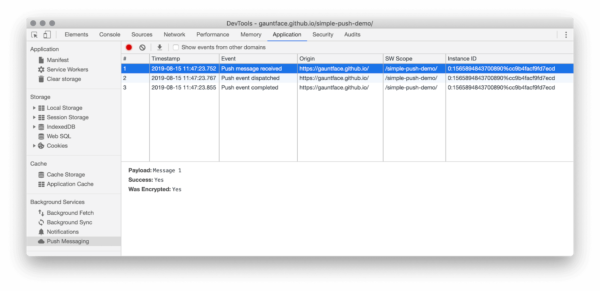
  <figcaption>
    Figure 1. Viewing the details of an event in the Push Messaging pane.
  </figcaption>
</figure>

## Background Fetch {: #fetch }

The [Background Fetch](/web/updates/2018/12/background-fetch) API enables a [service worker][serviceworker] to 
reliably download large resources, like movies or podcasts, as a background service. To log Background Fetch
event for 3 days, even when DevTools is not open:

1. [Open DevTools](/web/tools/chrome-devtools/open).
1. Open the **Application** panel.
1. Open the **Background Fetch** pane.

     <figure>
       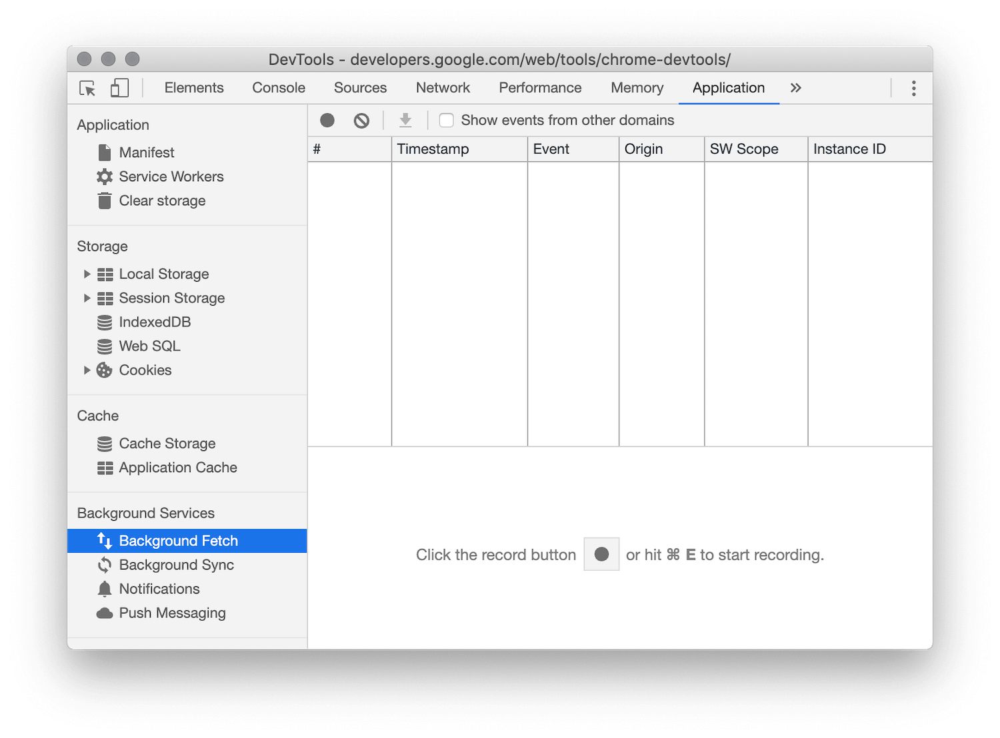
       <figcaption>
         Figure 2. The Background Fetch pane.
       </figcaption>
     </figure>

1. Click **Record** {: .inline-icon }.
   After triggering some Background Fetch activity, DevTools logs the events to the table.

     <figure>
       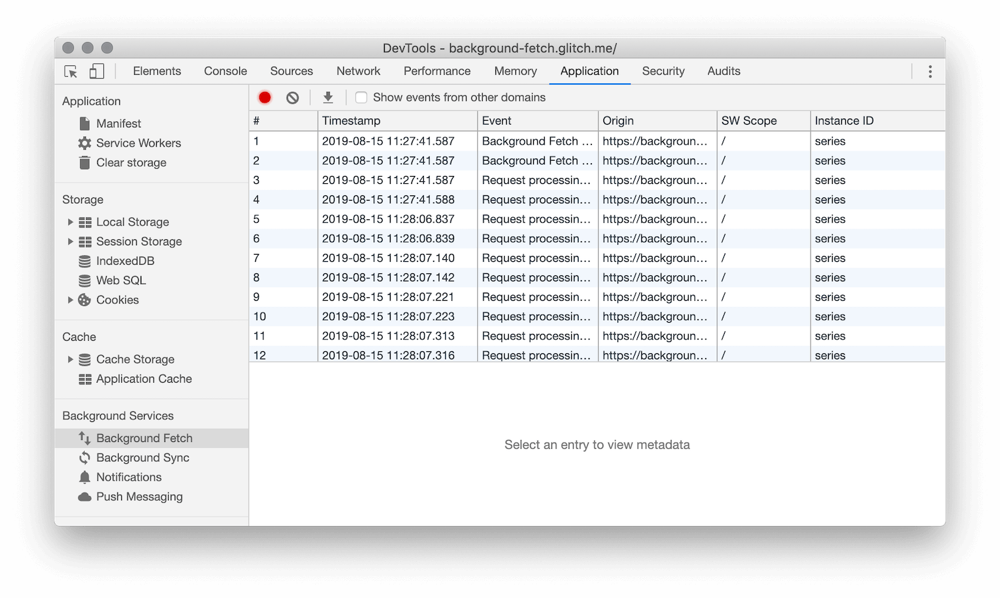
       <figcaption>
         Figure 3. A log of events in the Background Fetch pane.
       </figcaption>
     </figure>

1. Click an event to view its details in the space below the table.

     <figure>
       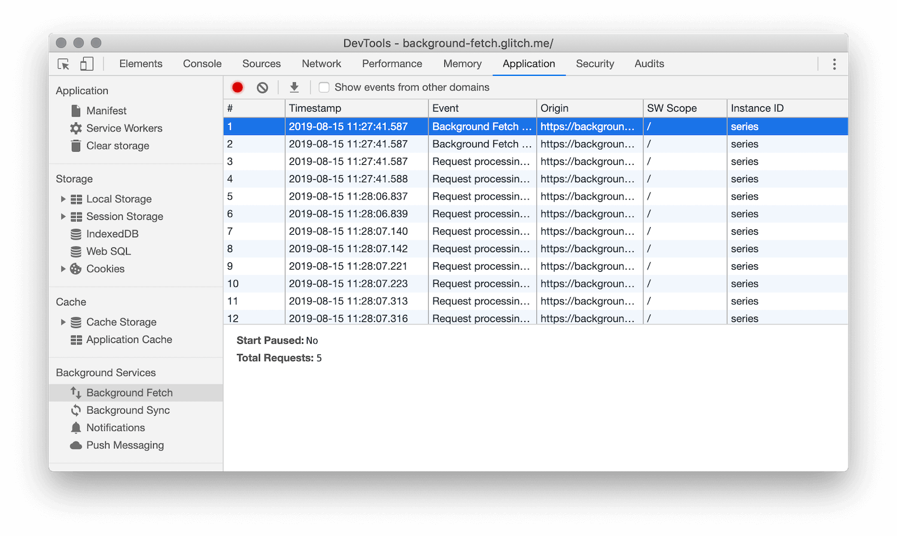
       <figcaption>
         Figure 4. Viewing the details of an event in the Background Fetch pane.
       </figcaption>
     </figure>

## Background Sync {: #sync }

The [Background Sync](/web/updates/2015/12/background-sync) API enables an offline [service worker][serviceworker] 
to send data to a server once it has re-established a reliable internet connection. To log Background Sync events for 3 days, even
when DevTools is not open:

1. [Open DevTools](/web/tools/chrome-devtools/open).
1. Open the **Application** panel.
1. Open the **Background Sync** pane.

     <figure>
       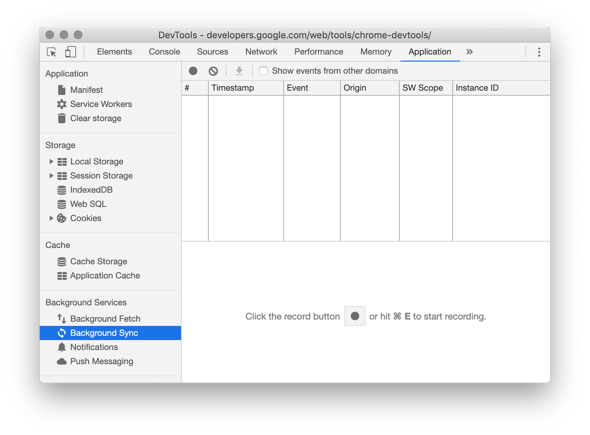
       <figcaption>
         Figure 5. The Background Sync pane.
       </figcaption>
     </figure>

1. Click **Record** {: .inline-icon }.
   After triggering some Background Sync activity, DevTools logs the events to the table.

     <figure>
       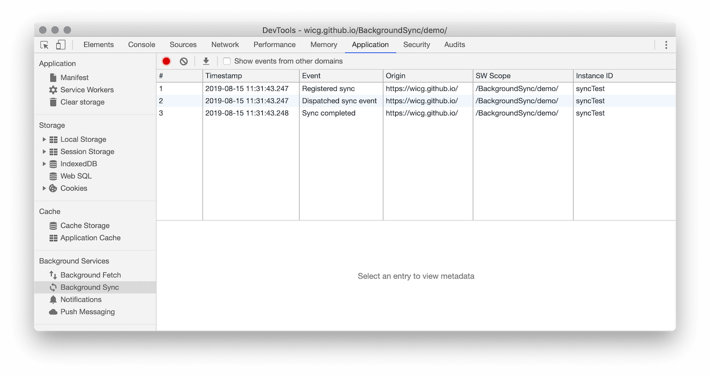
       <figcaption>
         Figure 6. A log of events in the Background Sync pane.
       </figcaption>
     </figure>

1. Click an event to view its details in the space below the table.

     <figure>
       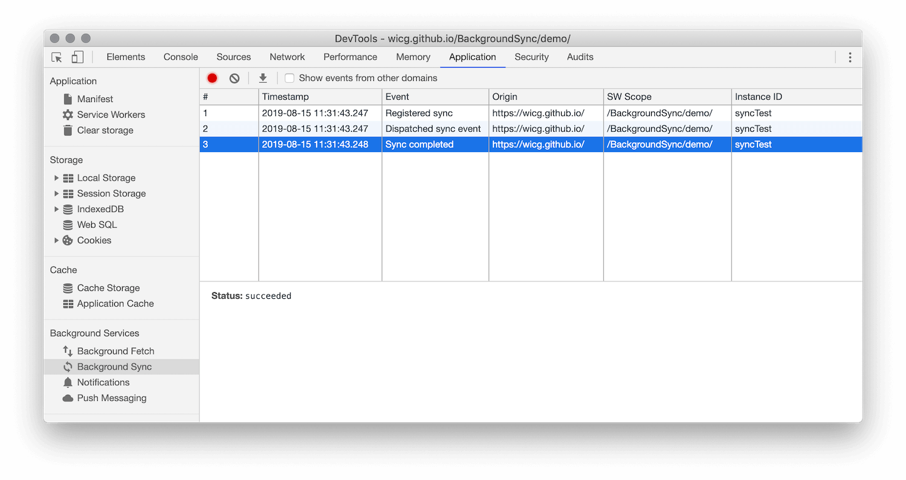
       <figcaption>
         Figure 7. Viewing the details of an event in the Background Sync pane.
       </figcaption>
     </figure>

## Notifications {: #notifications }

After a [service worker][serviceworker] has received a [Push Message][push] from a server, the service worker
uses the [Notifications][notifications] API to display the data to a user. To log Notifications for 3 days, even 
when DevTools is not open:

1. [Open DevTools](/web/tools/chrome-devtools/open).
1. Open the **Application** panel.
1. Open the **Notifications** pane.

     <figure>
       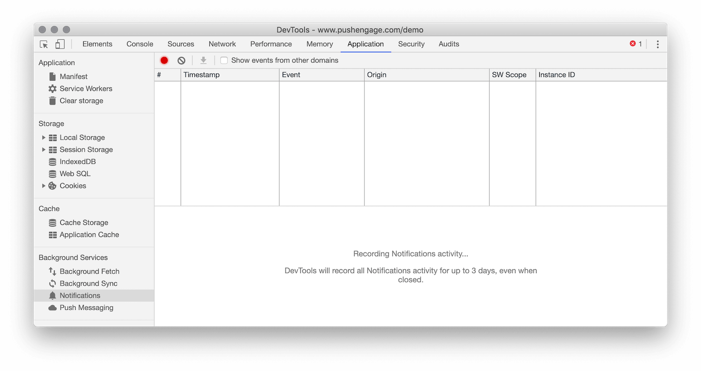
       <figcaption>
         Figure 8. The Notifications pane.
       </figcaption>
     </figure>

1. Click **Record** {: .inline-icon }.
   After triggering some Notifications activity, DevTools logs the events to the table.

     <figure>
       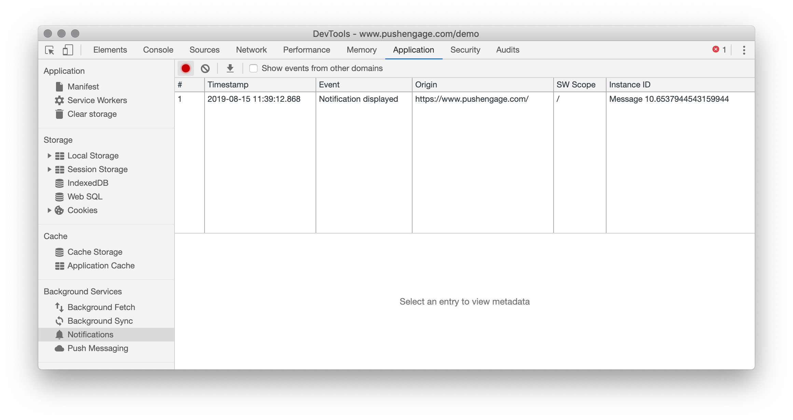
       <figcaption>
         Figure 9. A log of events in the Notifications pane.
       </figcaption>
     </figure>

1. Click an event to view its details in the space below the table.

     <figure>
       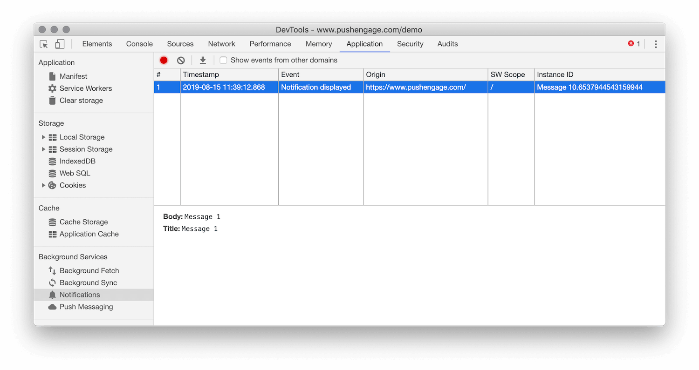
       <figcaption>
         Figure 10. Viewing the details of an event in the Notifications pane.
       </figcaption>
     </figure>

## Push Messages {: #push }

To display a push notification to a user, a [service worker][serviceworker] must first use the
[Push Message][push] API to receive data from a server. When the service worker is ready to display
the notification, it uses the [Notifications][notifications] API. To log Push Messages for 3 days, even 
when DevTools is not open:

1. [Open DevTools](/web/tools/chrome-devtools/open).
1. Open the **Application** panel.
1. Open the **Push Messaging** pane.

     <figure>
       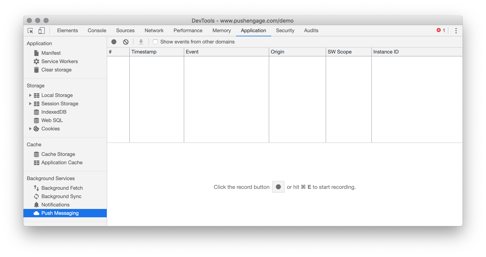
       <figcaption>
         Figure 11. The Push Messaging pane.
       </figcaption>
     </figure>

1. Click **Record** {: .inline-icon }.
   After triggering some Push Message activity, DevTools logs the events to the table.

     <figure>
       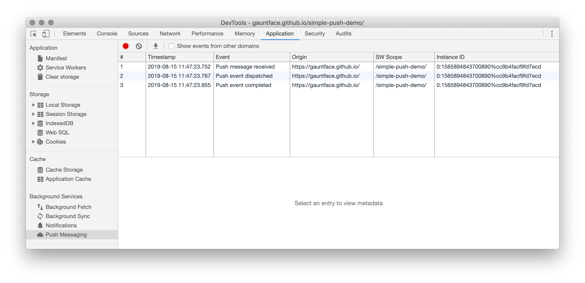
       <figcaption>
         Figure 12. A log of events in the Push Messaging pane.
       </figcaption>
     </figure>

1. Click an event to view its details in the space below the table.

     <figure>
       
       <figcaption>
         Figure 13. Viewing the details of an event in the Push Messaging pane.
       </figcaption>
     </figure>

## Feedback {: #feedback }


