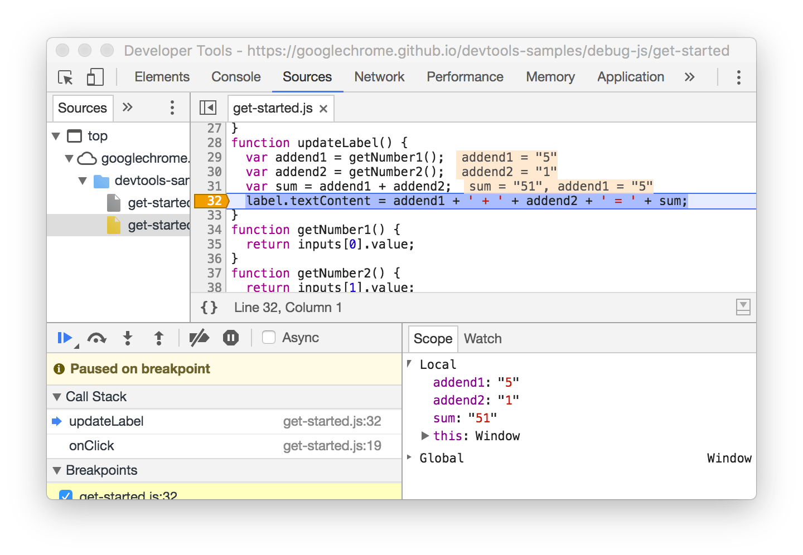
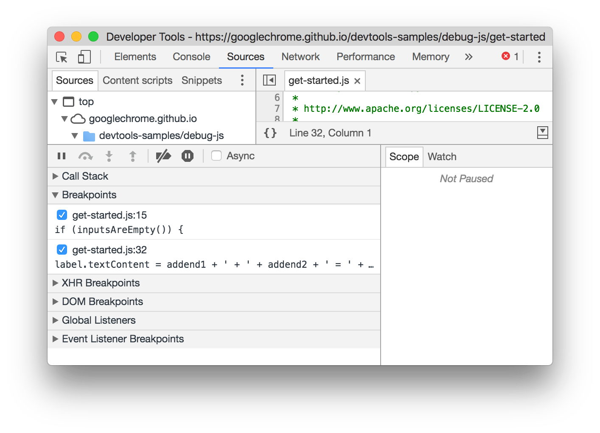
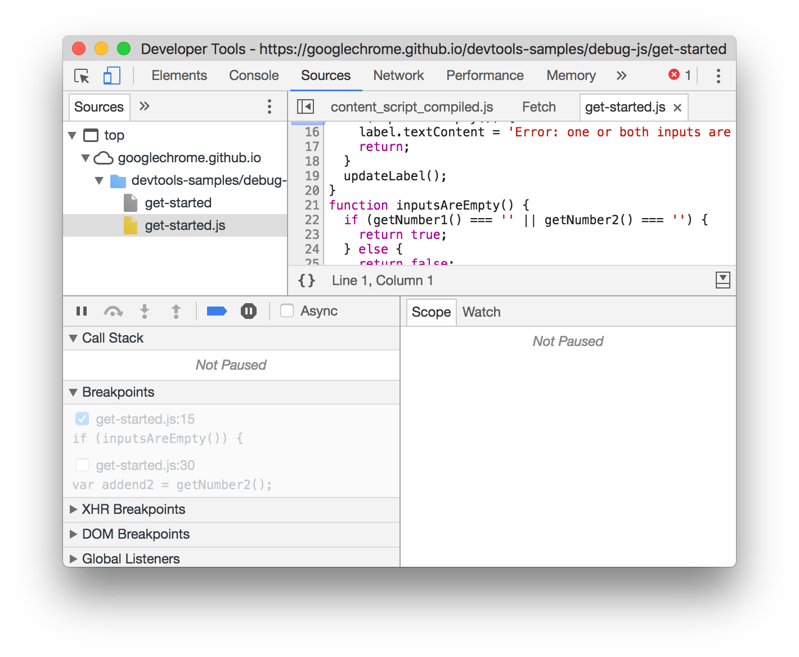
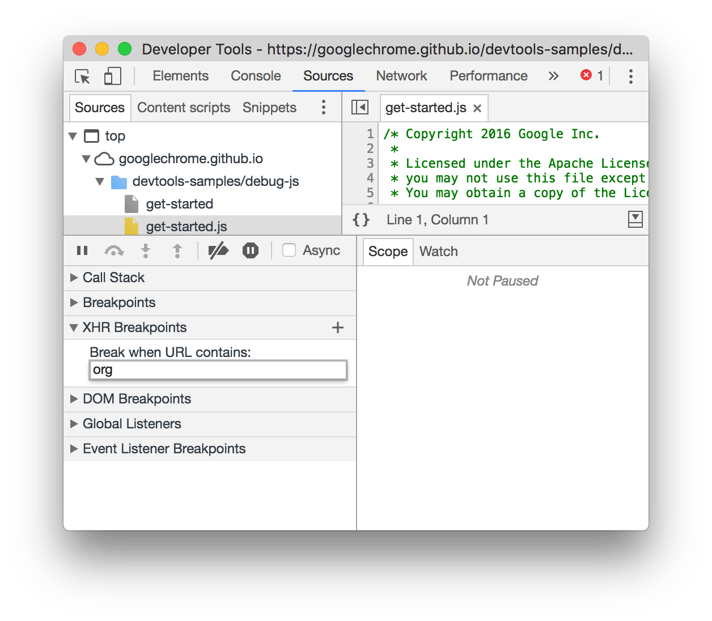
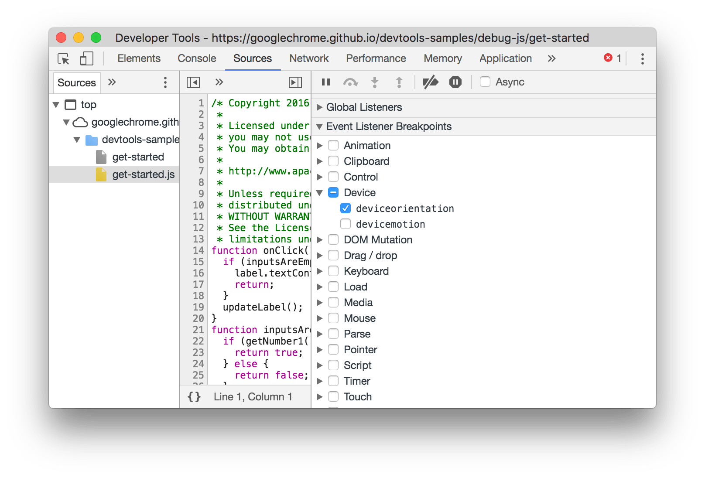
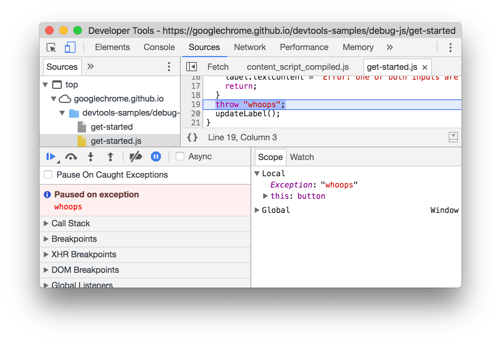

project_path: /web/tools/_project.yaml
book_path: /web/tools/_book.yaml
description: Learn about all the ways you can pause your code in Chrome DevTools.

{# wf_updated_on: 2017-06-22 #}
{# wf_published_on: 2017-02-03 #}



# Pause Your Code With Breakpoints {: .page-title }



Use breakpoints to pause your JavaScript code. This guide explains each type
of breakpoint that's available in DevTools, as well as when to use and how to
set each type. For a hands-on tutorial of the debugging process, see [Get
Started with Debugging JavaScript in Chrome
DevTools](/web/tools/chrome-devtools/javascript/).

## Overview of when to use each breakpoint type {: #overview }

The most well-known type of breakpoint is line-of-code. But line-of-code
breakpoints can be inefficient to set, especially if you don't know exactly
where to look, or if you are working with a large codebase. You can save
yourself time when debugging by knowing how and when to use the other types
of breakpoints.

<table>
  <tr><th>Breakpoint Type</th><th>Use This When You Want To Pause...</th></tr>
  <tr>
    <td><a href="#loc">Line-of-code</a></td>
    <td>
      On an exact region of code.
    </td>
  </tr>
  <tr>
    <td><a href="#conditional-loc">Conditional line-of-code</a></td>
    <td>
      On an exact region of code, but only when some other condition is true.
    </td>
  </tr>
  <tr>
    <td><a href="#dom">DOM</a></td>
    <td>
      On the code that changes or removes a specific DOM
      node, or its children.
    </td>
  </tr>
  <tr>
    <td><a href="#xhr">XHR</a></td>
    <td>
      When an XHR URL contains a string pattern.
    </td>
  </tr>
  <tr>
    <td><a href="#event-listeners">Event listener</a></td>
    <td>
      On the code that runs after an event, such as
      <code>click</code>, is fired.
    </td>
  </tr>
  <tr>
    <td><a href="#exceptions">Exception</a></td>
    <td>
      On the line of code that is throwing a caught or
      uncaught exception.
    </td>
  </tr>
  <tr>
    <td><a href="#function">Function</a></td>
    <td>
      Whenever a specific function is called.
    </td>
  </tr>
</table>

## Line-of-code breakpoints {: #loc }

Use a line-of-code breakpoint when you know the exact region of code that you
need to investigate. DevTools *always* pauses before this line of code is
executed.

To set a line-of-code breakpoint in DevTools:

1. Click the **Sources** tab.
1. Open the file containing the line of code you want to break on.
1. Go the line of code.
1. To the left of the line of code is the line number column. Click on it. A
   blue icon appears on top of the line number column.

<figure>
  
    <b>Figure 1</b>: A line-of-code breakpoint set on line <b>29</b>
  </figcaption>
</figure>

### Line-of-code breakpoints in your code {: #debugger }

Call `debugger` from your code to pause on that line. This is equivalent to
a [line-of-code breakpoint](#loc), except that the breakpoint is set in your
code, not in the DevTools UI.

    console.log('a');
    console.log('b');
    debugger;
    console.log('c');

### Conditional line-of-code breakpoints {: #conditional-loc }

Use a conditional line-of-code breakpoint when you know the exact region of
code that you need to investigate, but you want to pause only when some
other condition is true.

To set a conditional line-of-code breakpoint:

1. Click the **Sources** tab.
1. Open the file containing the line of code you want to break on.
1. Go the line of code.
1. To the left of the line of code is the line number column. Right-click it.
1. Select **Add conditional breakpoint**. A dialog displays underneath the
   line of code.
1. Enter your condition in the dialog.
1. Press <kbd>Enter</kbd> to activate the breakpoint. An orange icon appears
   on top of the line number column.

<figure>
  
    <b>Figure 2</b>: A conditional line-of-code breakpoint set on line
    <b>32</b>
  </figcaption>
</figure>

### Manage line-of-code breakpoints {: #manage-loc }

Use the **Breakpoints** pane to disable or remove line-of-code breakpoints from
a single location.

<figure>
  
    <b>Figure 3</b>: The <b>Breakpoints</b> pane showing two line-of-code
    breakpoints: one on line 15 of <code>get-started.js</code>, another on
    line 32
  </figcaption>
</figure>

* Check the checkbox next to an entry to disable that breakpoint.
* Right-click an entry to remove that breakpoint.
* Right-click anywhere in the **Breakpoints** pane to deactivate all
  breakpoints, disable all breakpoints, or remove all breakpoints. Disabling
  all breakpoints is equivalent to unchecking each one. Deactivating all
  breakpoints instructs DevTools to ignore all line-of-code breakpoints, but to
  also maintain preserve their enabled state so that they are in the same
  state as before when you reactivate them.

<figure>
  
    <b>Figure 4</b>: Deactivated breakpoints in the <b>Breakpoints</b> pane
    are disabled and transparent
  </figcaption>
</figure>

## DOM change breakpoints {: #dom }

Use a DOM change breakpoint when you want to pause on the code that changes
a DOM node or its children.

To set a DOM change breakpoint:

1. Click the **Elements** tab.
1. Go the element that you want to set the breakpoint on.
1. Right-click the element.
1. Hover over **Break on** then select **Subtree modifications**, **Attribute
  modifications**, or **Node removal**.

<figure>
  
    <b>Figure 5</b>: The context menu for creating a DOM change breakpoint
  </figcaption>
</figure>

### Types of DOM change breakpoints {: #dom-types }

* **Subtree modifications**. Triggered when a child of the currently-selected
  node is removed or added, or the contents of a child are changed. Not
  triggered on child node attribute changes, or on any changes to the
  currently-selected node.

* **Attributes modifications**: Triggered when an attribute is added or removed
  on the currently-selected node, or when an attribute value changes.

* **Node Removal**: Triggered when the currently-selected node is removed.

## XHR breakpoints {: #xhr }

Use an XHR breakpoint when you want to break when the request URL of an XHR
contains a specified string. DevTools pauses on the line of code where the
XHR calls `send()`.

Note: This feature also works with [Fetch][Fetch] requests.

To set an XHR breakpoint:

1. Click the **Sources** tab.
1. Expand the **XHR Breakpoints** pane.
1. Click **Add breakpoint**.
1. Enter the string which you want to break on. DevTools pauses when this
   string is present anywhere in an XHR's request URL.
1. Press <kbd>Enter</kbd> to confirm.

<figure>
  
    <b>Figure 6</b>: Creating an XHR breakpoint in the <b>XHR Breakpoints</b>
    for any request that contains <code>org</code> in the URL
  </figcaption>
</figure>

[Fetch]: https://developer.mozilla.org/en-US/docs/Web/API/Fetch_API

## Event listener breakpoints {: #event-listeners }

Use event listener breakpoints when you want to pause on the event listener
code that runs after an event is fired. You can select specific events, such
as `click`, or categories of events, such as all mouse events.

1. Click the **Sources** tab.
1. Expand the **Event Listener Breakpoints** pane. DevTools shows a list
   of event categories, such as **Animation**.
1. Check one of these categories to pause whenever any event from that category
   is fired, or expand the category and check a specific event.

<figure>
  
    <b>Figure 7</b>: Creating an event listener breakpoint for
    <code>deviceorientation</code>
  </figcaption>
</figure>

## Exception breakpoints {: #exceptions }

Use exception breakpoints when you want to pause on the line of code that's
throwing a caught or uncaught exception.

1. Click the **Sources** tab.
1. Click **Pause on exceptions** {:.devtools-inline}. It turns blue
   when enabled.
1. (Optional) Check the **Pause On Caught Exceptions** checkbox if you also
   want to pause on caught exceptions, in addition to uncaught ones.

<figure>
  
    <b>Figure 7</b>: Paused on an uncaught exception
  </figcaption>
</figure>

## Function breakpoints {: #function }

Call `debug(functionName)`, where `functionName` is the function you want to
debug, when you want to pause whenever a specific function is called. You can
insert `debug()` into your code (like a `console.log()` statement) or call it
from the DevTools Console. `debug()` is equivalent to setting a
[line-of-code breakpoint](#loc) on the first line of the function.

    function sum(a, b) {
      let result = a + b; // DevTools pauses on this line.
      return result;
    }
    debug(sum); // Pass the function object, not a string.
    sum();

### Make sure the target function is in scope {: #scope }

DevTools throws a `ReferenceError` if the function you want to debug is not
in scope.

    (function () {
      function hey() {
        console.log('hey');
      }
      function yo() {
        console.log('yo');
      }
      debug(yo); // This works.
      yo();
    })();
    debug(hey); // This doesn't work. hey() is out of scope.

Ensuring the target function is in scope can be tricky if you're
calling `debug()` from the DevTools Console. Here's one strategy:

1. Set a [line-of-code breakpoint](#loc) somewhere where the function is
   scope.
1. Trigger the breakpoint.
1. Call `debug()` in the DevTools Console while the code is still paused
   on your line-of-code breakpoint.
