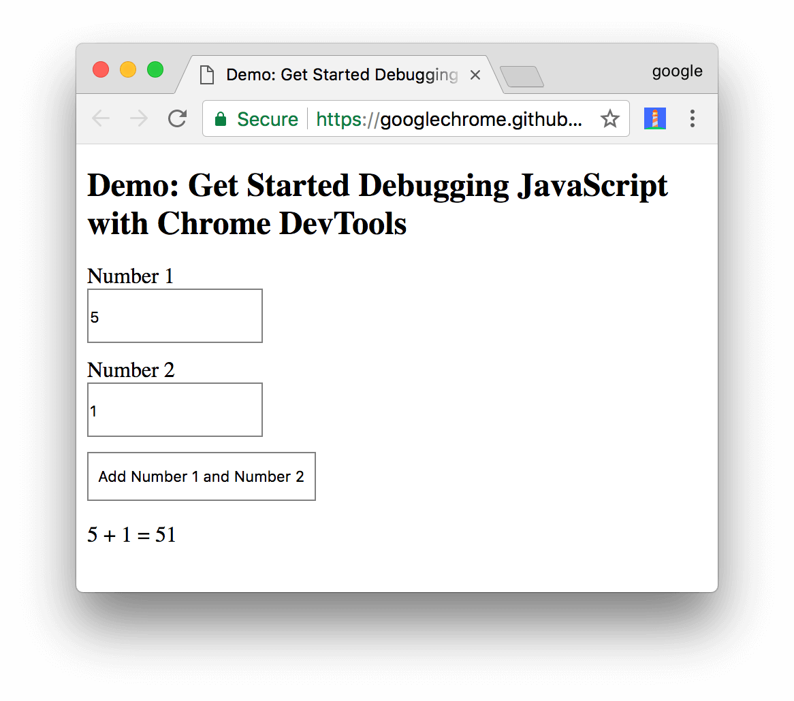
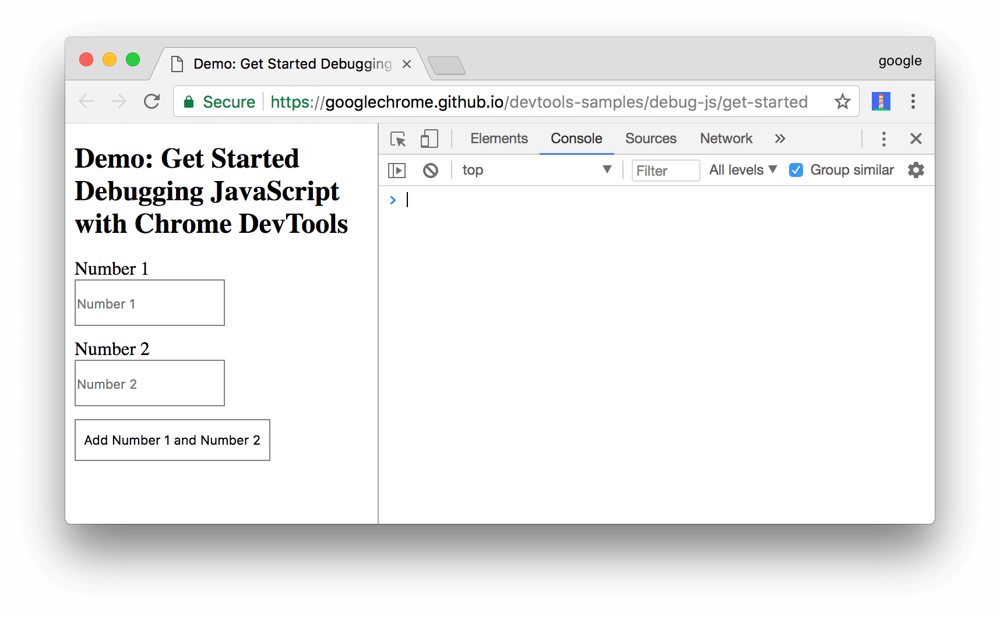
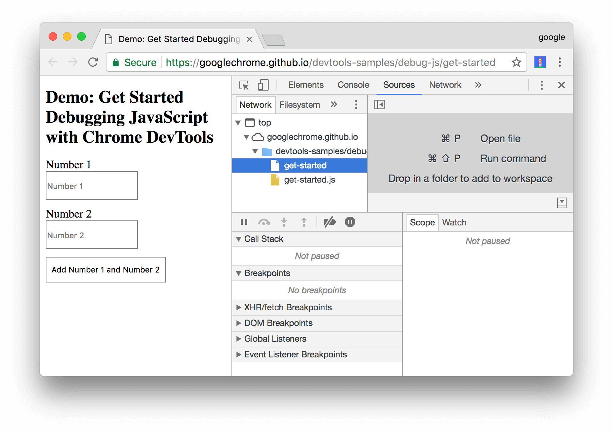
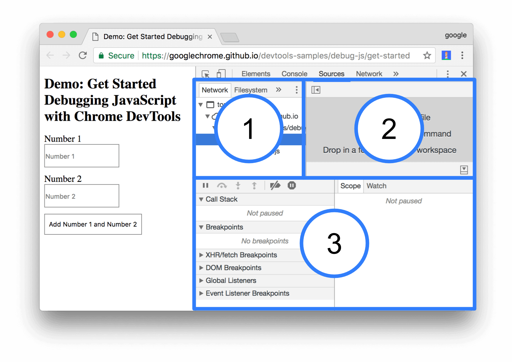
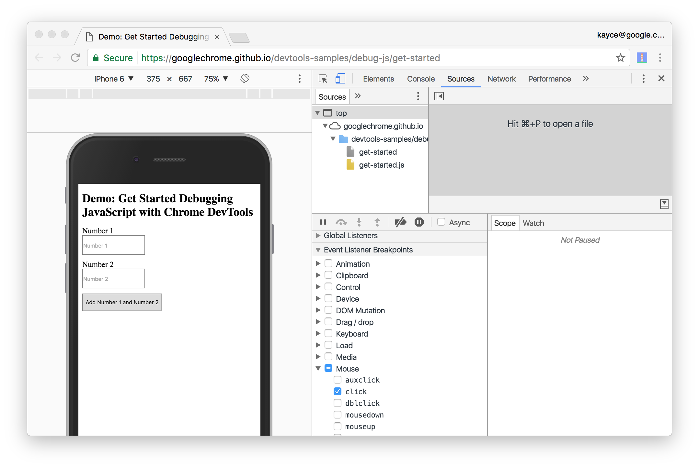
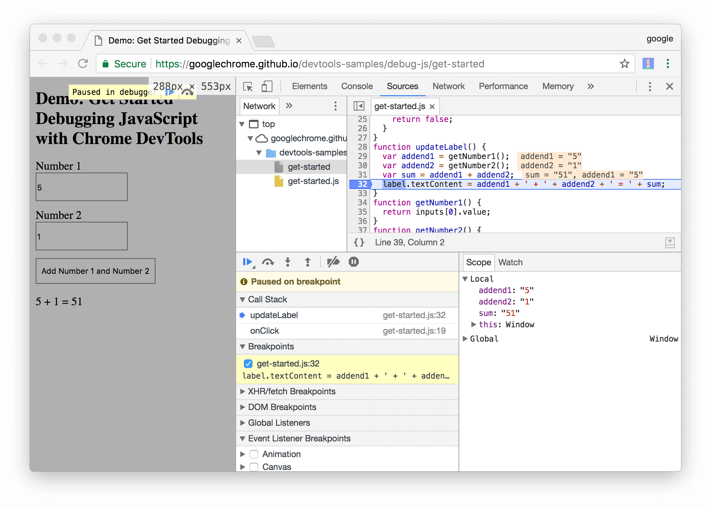
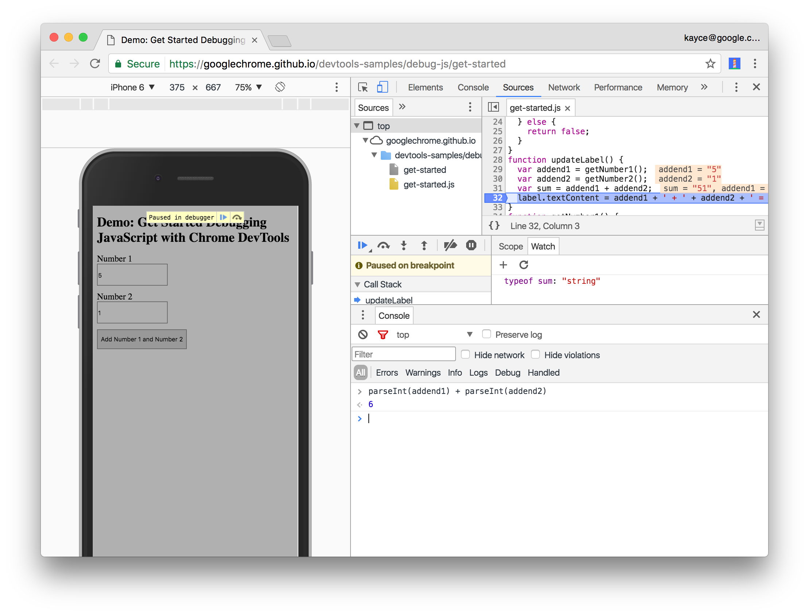

project_path: /web/tools/_project.yaml
book_path: /web/tools/_book.yaml
description: Learn how to use Chrome DevTools to find and fix JavaScript bugs.

{# wf_blink_components: Platform>DevTools #}
{# wf_updated_on: 2017-12-06 #}
{# wf_published_on: 2017-01-04 #}



# Get Started with Debugging JavaScript in Chrome DevTools {: .page-title }



This tutorial teaches you the basic workflow for debugging any JavaScript issue in DevTools.

## Step 1: Reproduce the bug {: #reproduce }

Finding a series of actions that consistently reproduces a bug is always the first step
to debugging.

1. Click **Open Demo**. The demo opens in a new tab.

     <a href="https://googlechrome.github.io/devtools-samples/debug-js/get-started"
       target="devtools"
       rel="noopener noreferrer">
       <button>Open Demo</button>
     </a>

1. Enter `5` in the **Number 1** text box.
1. Enter `1` in the **Number 2** text box.
1. Click **Add Number 1 and Number 2**. The label below the button says `5 + 1 = 51`. The result
   should be `6`. This is the bug you're going to fix.

     <figure>
       
       <figcaption>
         <b>Figure 1</b>. The result of 5 + 1 is 51. It should be 6.
       </figcaption>
     </figure>

## Step 2: Get familiar with the Sources panel UI {: #sources-ui }

DevTools provides a lot of different tools for different tasks, such as changing CSS, profiling
page load performance, and monitoring network requests. The **Sources** panel is where you debug
JavaScript.

1. Open DevTools by pressing <kbd>Command</kbd>+<kbd>Option</kbd>+<kbd>I</kbd> (Mac)
   or <kbd>Control</kbd>+<kbd>Shift</kbd>+<kbd>I</kbd> (Windows, Linux). This shortcut opens
   the **Console** panel.

     <figure>
       
       <figcaption>
         <b>Figure 2</b>. The <b>Console</b> panel
       </figcaption>
     </figure>

1. Click the **Sources** tab.

     <figure>
       
       <figcaption>
         <b>Figure 3</b>. The <b>Sources</b> panel
       </figcaption>
     </figure>

The **Sources** panel UI has 3 parts:

<figure>
  
  <figcaption>
    <b>Figure 4</b>. The 3 parts of the <b>Sources</b> panel UI
  </figcaption>
</figure>

1. The **File Navigator** pane. Every file that the page requests is listed here.
2. The **Code Editor** pane. After selecting a file in the **File Navigator** pane, the contents
   of that file are displayed here.
3. The **JavaScript Debugging** pane. Various tools for inspecting the page's JavaScript. If
   your DevTools window is wide, this pane is displayed to the right of the **Code Editor** pane.

## Step 3: Pause the code with a breakpoint {: #event-breakpoint }

A common method for debugging a problem like this is to insert a lot of `console.log()`
statements into the code, in order to inspect values as the script executes. For example:

<pre class="prettyprint">function updateLabel() {
  var addend1 = getNumber1();
  <strong>console.log('addend1:', addend1);</strong>
  var addend2 = getNumber2();
  <strong>console.log('addend2:', addend2);</strong>
  var sum = addend1 + addend2;
  <strong>console.log('sum:', sum);</strong>
  label.textContent = addend1 + ' + ' + addend2 + ' = ' + sum;
}</pre>

The `console.log()` method may get the job done, but **breakpoints** can get it done faster.
A breakpoint lets you pause your code in the middle of its execution, and examine all values
at that moment in time. Breakpoints have a few advantages over the `console.log()` method:

* With `console.log()`, you need to manually open the source code, find the relevant code,
  insert the `console.log()` statements, and then reload the page in order to see the messages
  in the Console. With breakpoints, you can pause on the relevant code without even knowing how
  the code is structured.
* In your `console.log()` statements you need to explicitly specify each value that you want
  to inspect. With breakpoints, DevTools shows you the values of all variables at that moment
  in time. Sometimes there are variables affecting your code that you're not even aware of.

In short, breakpoints can help you find and fix bugs faster than the `console.log()` method.

If you take a step back and think about how the app works, you can make an educated guess
that the incorrect sum (`5 + 1 = 51`) gets computed in the `click` event listener that's
associated to the **Add Number 1 and Number 2** button. Therefore, you probably want to pause
the code around the time that the `click` listener executes. **Event Listener Breakpoints**
let you do exactly that:

1. In the **JavaScript Debugging** pane, click **Event Listener Breakpoints** to expand the
   section. DevTools reveals a list of expandable event categories, such as **Animation** and
   **Clipboard**.
1. Next to the **Mouse** event category, click **Expand** {: .devtools-inline}.
   DevTools reveals a list of mouse events, such as **click** and **mousedown**. Each event has
   a checkbox next to it.
1. Check the **click** checkbox. DevTools is now set up to automatically pause when *any*
   `click` event listener executes.

     <figure>
       
       <figcaption>
         <b>Figure 5</b>. The <b>click</b> checkbox is enabled
       </figcaption>
     </figure>

   
1. Back on the demo, click **Add Number 1 and Number 2** again. DevTools
   pauses the demo and highlights a line of code in the **Sources** panel.
   DevTools should be paused on this line of code:

     <pre class="prettyprint">function onClick() {</pre>

     If you're paused on a different line of code, press **Resume Script Execution** ![Resume
     Script Execution][resume]{:.cdt-inl} until you're paused on the correct line.

     <aside class="note">
       **Note**: If you paused on a different line, you have a browser extension that
       registers a `click` event listener on every page that you visit. You were paused in the
       extension's `click` listener. If you use Incognito Mode to [browse in
       private][incognito], which disables all extensions, you can see that you pause on the
       correct line of code every time.
     </aside>

[incognito]: https://support.google.com/chrome/answer/95464

**Event Listener Breakpoints** are just one of many types of breakpoints available in DevTools.
It's worth memorizing all the different types, because each type ultimately helps you debug
different scenarios as quickly as possible. See [Pause Your Code With Breakpoints][breakpoints]
to learn when and how to use each type.

[resume]: /web/tools/chrome-devtools/images/resume-script-execution.png
[breakpoints]: /web/tools/chrome-devtools/javascript/breakpoints

## Step 4: Step through the code {: #code-stepping }

One common cause of bugs is when a script executes in the
wrong order. Stepping through your code enables you to walk through your
code's execution, one line at a time, and figure out exactly where it's
executing in a different order than you expected. Try it now:

1. On the **Sources** panel of DevTools, click **Step into next function
   call** ![Step into next function call][into]{:.devtools-inline} to step
   through the execution of the `onClick()` function, one line at a time.
   DevTools highlights the following line of code:

     <pre class="prettyprint">if (inputsAreEmpty()) {</pre>

1. Click **Step over next function call** ![Step over next function
   call][over]{:.devtools-inline}. DevTools executes `inputsAreEmpty()`
   without stepping into it. Notice how DevTools skips a few lines of code.
   This is because `inputsAreEmpty()` evaluated to false, so the `if`
   statement's block of code didn't execute.

That's the basic idea of stepping through code. If you look at the code in
`get-started.js`, you can see that the bug is probably somewhere in the
`updateLabel()` function. Rather than stepping through every line of code,
you can use another type of breakpoint to pause the code closer to the
probable location of the bug.

[into]: /web/tools/chrome-devtools/images/step-into.png
[over]: /web/tools/chrome-devtools/images/step-over.png

## Step 5: Set a line-of-code breakpoint {: #line-breakpoint }

Line-of-code breakpoints are the most common type of breakpoint. When
you've got a specific line of code that you want to pause on, use a
line-of-code breakpoint:

1. Look at the last line of code in `updateLabel()`:

     <pre class="prettyprint">label.textContent = addend1 + ' + ' + addend2 + ' = ' + sum;</pre>

1. To the left of the code you can see the line number of this particular
   line of code, which is **32**. Click on **32**. DevTools puts a blue icon on top
   of **32**. This means that there is a line-of-code breakpoint on this line.
   DevTools now always pauses before this line of code is executed.
1. Click **Resume script execution** ![Resume script
   execution][resume]{:.devtools-inline}. The script continues executing
   until it reaches line 32. On lines 29, 30, and 31, DevTools prints out the values of
   `addend1`, `addend2`, and `sum` to the right of each line's semi-colon.

     <figure>
       
       <figcaption>
         <b>Figure 6</b>. DevTools pauses on the line-of-code breakpoint on line 32
       </figcaption>
     </figure>

## Step 6: Check variable values {: #check-values }

The values of `addend1`, `addend2`, and `sum` look suspicious. They're wrapped in quotes, which
means that they're strings. This is a good hypothesis for the explaining the cause of the bug.
Now it's time to gather more information. DevTools provides a lot of tools for examining variable
values.

### Method 1: The Scope pane {: #scope }

When you're paused on a line of code, the **Scope** pane shows you what local and global variables
are currently defined, along with the value of each variable. It also shows closure variables,
when applicable. Double-click a variable value to edit it. When you're not paused on a line of
code, the **Scope** pane is empty.

<figure>
  
  <figcaption>
    <b>Figure 7</b>. The <b>Scope</b> pane
  </figcaption>
</figure>

### Method 2: Watch Expressions {: #watch-expressions }

The **Watch Expressions** tab lets you monitor the values of variables over time.
As the name implies, Watch Expressions aren't just limited to variables. You
can store any valid JavaScript expression in a Watch Expression. Try it now:

1. Click the **Watch** tab.
1. Click **Add Expression** ![Add Expression][add]{:.devtools-inline}.
1. Type `typeof sum`.
1. Press <kbd>Enter</kbd>. DevTools shows `typeof sum: "string"`. The value
   to the right of the colon is the result of your Watch Expression.

     <figure>
       
       <figcaption>
         <b>Figure 8</b>. The Watch Expression pane (bottom-right), after
         creating the <code>typeof sum</code> Watch Expression.
         If your DevTools window is large, the Watch Expression pane is on
         the right, above the <b>Event Listener Breakpoints</b> pane.
       </figcaption>
     </figure>

As suspected, `sum` is being evaluated as a string, when it should be a
number. You've now confirmed that this is the cause of the bug.

### Method 3: The Console {: #console }

In addition to viewing `console.log()` messages, you can also use the Console to evaluate
arbitrary JavaScript statements. In terms of debugging, you can use the Console to test out
potential fixes for bugs. Try it now:

1. If you don't have the Console drawer open, press <kbd>Escape</kbd> to open
   it. It opens at the bottom of your DevTools window.
1. In the Console, type `parseInt(addend1) + parseInt(addend2)`. This statement works because you
   are paused on a line of code where `addend1` and `addend2` are in scope.
1. Press <kbd>Enter</kbd>. DevTools evaluates the statement and prints out
   `6`, which is the result you expect the demo to produce.

     <figure>
       
       <figcaption>
         <b>Figure 9</b>. The Console drawer, after evaluating
         <code>parseInt(addend1) + parseInt(addend2)</code>.
       </figcaption>
     </figure>

[add]: /web/tools/chrome-devtools/javascript/imgs/add-expression.png

## Step 7: Apply a fix {: #apply-fix }

You've found a fix for the bug. All that's left is to try out
your fix by editing the code and re-running the demo. You don't
need to leave DevTools to apply the fix. You can edit JavaScript code directly
within the DevTools UI. Try it now:

1. Click **Resume script execution** ![Resume script
   execution][resume]{:.devtools-inline}.
1. In the **Code Editor**, replace line 31, `var sum = addend1 + addend2`, with
   `var sum = parseInt(addend1) + parseInt(addend2)`.
1. Press <kbd>Command</kbd>+<kbd>S</kbd> (Mac) or
   <kbd>Control</kbd>+<kbd>S</kbd> (Windows, Linux) to save your change.
1. Click **Deactivate breakpoints** ![Deactivate
   breakpoints][deactivate]{:.devtools-inline}. It changes blue to indicate
   that it's active. While this is set, DevTools ignores any breakpoints
   you've set.
1. Try out the demo with different values. The demo now calculates correctly.

Caution: This workflow only applies a fix to the code that is running in your browser.
It won't fix the code for all users that visit your page. To do that, you need to fix the
code that's on your servers.

[deactivate]: /web/tools/chrome-devtools/images/deactivate-breakpoints-button.png

## Next steps {: #next-steps }

Congratulations! You now know how to make the most of Chrome DevTools when debugging
JavaScript. The tools and methods you learned in this tutorial can save you countless hours.

This tutorial only showed you two ways to set breakpoints. DevTools offers many
other ways, including:

* Conditional breakpoints that are only triggered when the condition that you
  provide is true.
* Breakpoints on caught or uncaught exceptions.
* XHR breakpoints that are triggered when the requested URL matches a
  substring that you provide.

See [Pause Your Code With Breakpoints](/web/tools/chrome-devtools/javascript/breakpoints) to
learn when and how to use each type.

There's a couple of code stepping controls that weren't explained in this tutorial. See [Step
over line of code](/web/tools/chrome-devtools/javascript/reference#stepping) to learn more.
