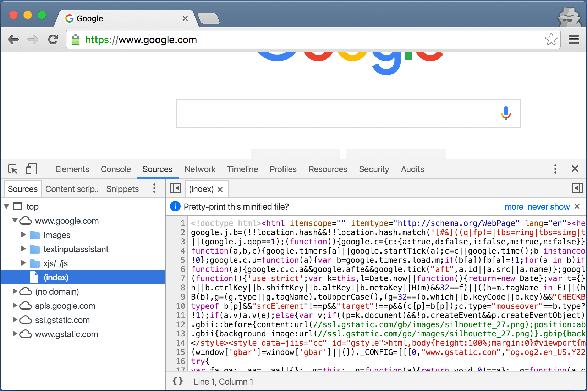
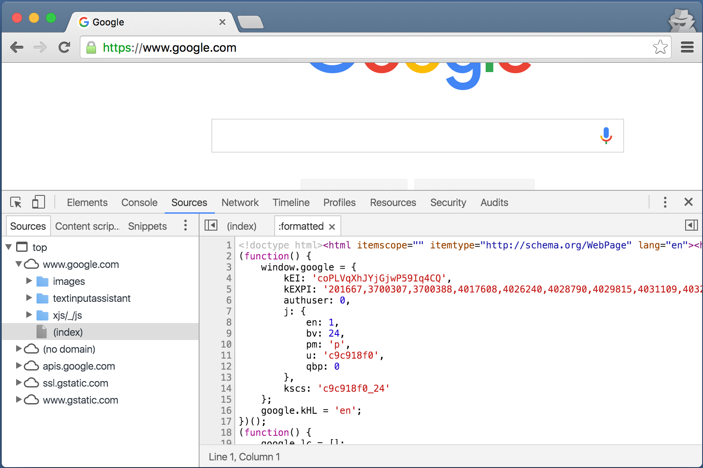

project_path: /web/tools/_project.yaml
book_path: /web/tools/_book.yaml
description: Transform your JavaScript into a more readable form by clicking  the Pretty-Print icon in Chrome DevTools.

{# wf_updated_on: 2016-02-21 #}
{# wf_published_on: 2015-04-13 #}

# Make JavaScript Look Pretty {: .page-title }




Warning: This page is deprecated. See [Make a minified file
readable](reference#format) for up-to-date information.

When viewing a script in the **Sources** panel, click the **Pretty-Print**
{:.inline}
icon to transform a minified script into a more human-readable form.

Here is how a minified script might look in the **Sources** panel:

Here is how the same script looks after clicking the **Pretty-Print** icon:

