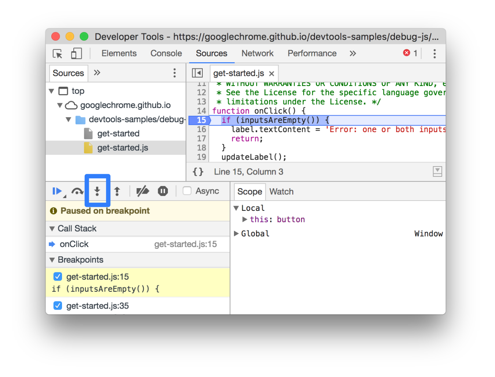
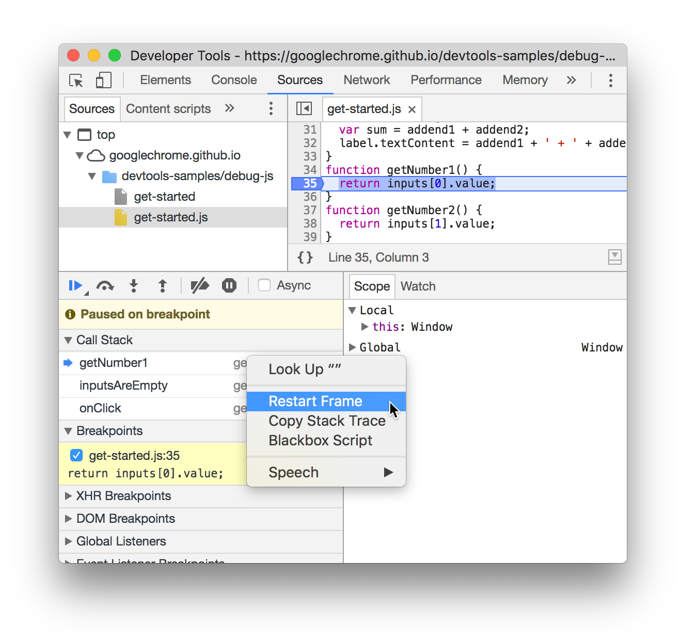
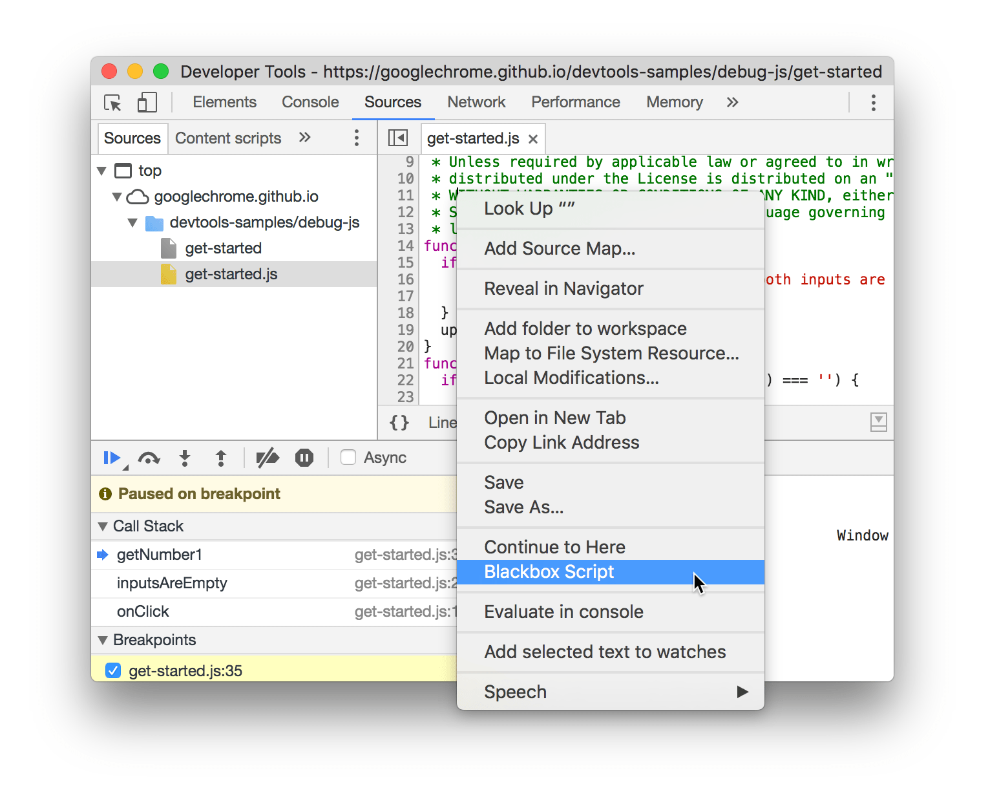
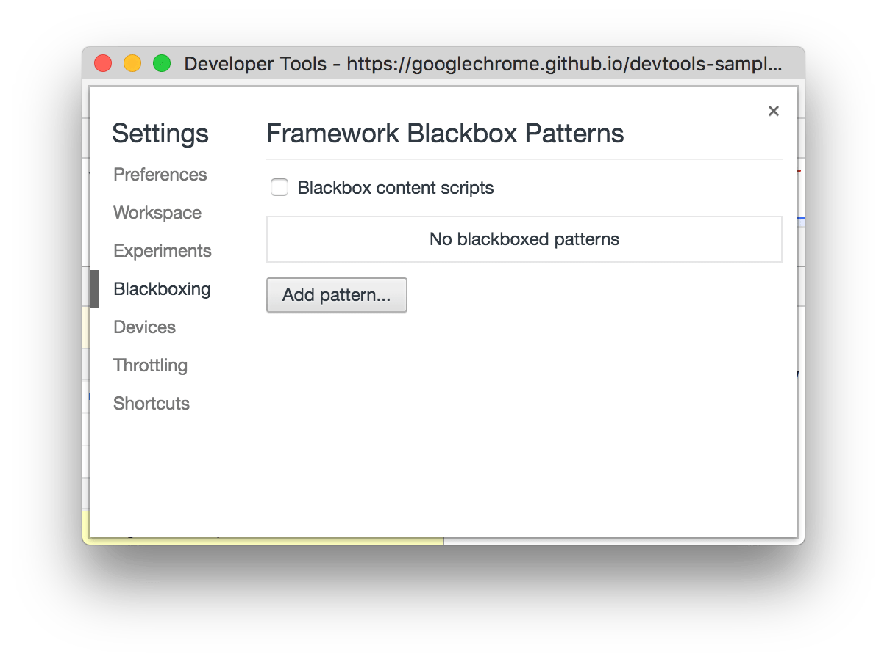

project_path: /web/tools/_project.yaml
book_path: /web/tools/_book.yaml
description: Discover new debugging workflows in this comprehensive reference of Chrome DevTools debugging features.

{# wf_updated_on: 2017-01-23 #}
{# wf_published_on: 2017-01-04 #}



# JavaScript Debugging Reference {: .page-title }



Discover new debugging workflows with this comprehensive reference of Chrome
DevTools debugging features.

See [Get Started With Debugging JavaScript In Chrome
DevTools](/web/tools/chrome-devtools/javascript) to learn the basics of
debugging.

## Pause code with breakpoints {: #breakpoints }

Set a breakpoint so that you can pause your code in the middle of its
execution.

See [Pause Your Code With Breakpoints](breakpoints) to learn how to set
breakpoints.

## Step through code {: #stepping }

Once your code is paused, step through it, one line at a time, investigating
control flow and property values along the way.

### Step over line of code {: #step-over }

When paused on a line of code containing a function that's not relevant to
the problem you're debugging, click **Step over** {:.devtools-inline} to
execute the function without stepping into it.

<figure>
  
  <figcaption>
    <b>Figure 1</b>. <b>Step over</b>, outlined in blue
  </figcaption>
</figure>

For example, suppose you're debugging the following code:

    function updateHeader() {
      var day = new Date().getDay();
      var name = getName(); // A
      updateName(name); // D
    }
    function getName() {
      var name = app.first + ' ' + app.last; // B
      return name; // C
    }

You're paused on `A`. By pressing **Step over**, DevTools executes all
the code in the function that you're stepping over, which is `B` and `C`.
DevTools then pauses on `D`.

### Step into line of code {: #step-into }

When paused on a line of code containing a function call that is related to
the problem you're debugging, click **Step into** {:.devtools-inline} to
investigate that function further.

<figure>
  
  <figcaption>
    <b>Figure 2</b>. <b>Step into</b>, outlined in blue
  </figcaption>
</figure>

For example, suppose you're debugging the following code:

    function updateHeader() {
      var day = new Date().getDay();
      var name = getName(); // A
      updateName(name);
    }
    function getName() {
      var name = app.first + ' ' + app.last; // B
      return name;
    }

You're paused on `A`. By pressing **Step into**, DevTools executes
this line of code, then pauses on `B`.

### Step out of line of code {: #step-out }

When paused inside of a function that is not related to the problem you're
debugging, click **Step out** {:.devtools-inline}
to execute the rest of the function's code.

<figure>
  
  <figcaption>
    <b>Figure 3</b>. <b>Step out</b>, outlined in blue
  </figcaption>
</figure>

For example, suppose you're debugging the following code:

    function updateHeader() {
      var day = new Date().getDay();
      var name = getName();
      updateName(name); // C
    }
    function getName() {
      var name = app.first + ' ' + app.last; // A
      return name; // B
    }

You're paused on `A`. By pressing **Step out**, DevTools executes
the rest of the code in `getName()`, which is just `B` in this example, and
then pauses on `C`.

### Run all code up to a certain line {: #continue-to-here }

When debugging a long function, there may be a lot of code that is not related
to the problem you're debugging.

You *could* step through all the lines, but that can be tedious. You *could*
set a line-of-code breakpoint on the line you're interested in and then
press **Resume Script Execution** ![Resume Script
Execution][resume]{:.devtools-inline}, but there's
a faster way.

Right-click the line of code that you're interested in, and select
**Continue to here**. DevTools runs all of the code up to that point, and
then pauses on that line.

<figure>
  
  <figcaption>
    <b>Figure 4</b>. Selecting <b>Continue to here</b>
  </figcaption>
</figure>

[resume]: /web/tools/chrome-devtools/images/resume-script-execution.png

### Restart the top function of the call stack {: #restart-frame }

While paused on a line of code, right-click anywhere in the Call Stack pane
and select **Restart Frame** to pause on the first line of the top function
in your call stack. The top function is the last function that was called.

For example, suppose you're stepping through the following code:

    function factorial(n) {
      var product = 0; // B
      for (var i = 1; i <= n; i++) {
        product += i;
      }
      return product; // A
    }

You're paused on `A`. After clicking **Restart Frame**, you'd be paused
on `B`, without ever setting a breakpoint or pressing
**Resume script execution**.

<figure>
  
  <figcaption>
    <b>Figure 5</b>. Selecting <b>Restart Frame</b>
  </figcaption>
</figure>

### Resume script execution {: #resume }

To continue your script's execution after a pause, click **Resume Script
Execution** ![Resume Script Execution][resume]{:.devtools-inline}.
DevTools executes the script up until the next breakpoint, if any.

<figure>
  
  <figcaption>
    <b>Figure 6</b>. <b>Resume script execution</b>, outlined in blue
  </figcaption>
</figure>

#### Force script execution {: #force-resume }

To ignore all breakpoints and force your script to resume execution, click and
hold **Resume Script Execution** ![Resume Script
Execution][resume]{:.devtools-inline} and then select **Force script
execution** {:.devtools-inline}.

<figure>
  
  <figcaption>
    <b>Figure 7</b>. Selecting <b>Force script execution</b>
  </figcaption>
</figure>

### Change thread context {: #threads }

When working with web workers or service workers, click on a context listed
in the Threads pane to switch to that context. The blue arrow icon represents
which context is currently selected.

<figure>
  
  <figcaption>
    <b>Figure 8</b>. The Threads pane, outlined in blue
  </figcaption>
</figure>

For example, suppose that you're paused on a breakpoint in both your main
script and your service worker script. You want to view the local and global
properties for the service worker context, but the Sources panel is showing
the main script context. By clicking on the service worker entry in the Threads
pane, you'd be able to switch to that context.

## View and edit local, closure, and global properties {: #scope }

While paused on a line of code, use the Scope pane to view and edit the
values of properties and variables in the local, closure, and global scopes.

* Double-click a property value to change it.
* Non-enumerable properties are greyed out.

<figure>
  
  <figcaption>
    <b>Figure 9</b>. The Scope pane, outlined in blue
  </figcaption>
</figure>

## View the current call stack {: #call-stack }

While paused on a line of code, use the Call Stack pane to view the
call stack that got you to this point.

If you're working with async code, check the **Async** checkbox to enable
async call stacks.

Click on an entry to jump to the line of code where that function
was called. The blue arrow icon represents which function DevTools is
currently highlighting.

<figure>
  
  <figcaption>
    <b>Figure 10</b>. The Call Stack pane, outlined in blue
  </figcaption>
</figure>

Note: When not paused on a line of code, the Call Stack pane is empty.

### Copy stack trace {: #copy-stack-trace }


This should be moved to an "Export debug data" H2 section when there's enough
content for that, but there's not right now, so it's here.


Right-click anywhere in the Call Stack pane and select **Copy stack trace**
to copy the current call stack to the clipboard.

<figure>
  
  <figcaption>
    <b>Figure 11</b>. Selecting <b>Copy Stack Trace</b>
  </figcaption>
</figure>

Below is an example of the output:

    getNumber1 (get-started.js:35)
    inputsAreEmpty (get-started.js:22)
    onClick (get-started.js:15)

## Ignore a script or pattern of scripts {: #blackbox }

Blackbox a script when you want to ignore that script while debugging. When
blackboxed, a script is obscured in the Call Stack pane, and you
never step into the script's functions when you step through your code.

For example, suppose you're stepping through this code:

    function animate() {
      prepare();
      lib.doFancyStuff(); // A
      render();
    }

`A` is a third-party library that you trust. If you're confident that the
problem you're debugging is not related to the third-party library, then
it makes sense to blackbox the script.

### Blackbox a script from the Editor pane {: #editor-blackbox }

To blackbox a script from the Editor pane:

1. Open the file.
1. Right-click anywhere.
1. Select **Blackbox script**.

<figure>
  
  <figcaption>
    <b>Figure 12</b>. Blackboxing a script from the Editor pane
  </figcaption>
</figure>

### Blackbox a script from the Call Stack pane {: #call-stack-blackbox }

To blackbox a script from the Call Stack pane:

1. Right-click on a function from the script.
1. Select **Blackbox script**.

<figure>
  
  <figcaption>
    <b>Figure 13</b>. Blackboxing a script from the Call Stack pane
  </figcaption>
</figure>

### Blackbox a script from Settings {: #settings-blackbox }

To blackbox a single script or pattern of scripts from Settings:

1. Open [Settings](/web/tools/chrome-devtools/ui#settings).
1. Go to the **Blackboxing** tab.
1. Click **Add pattern**.
1. Enter the script name or a regex pattern of script names to blackbox.
1. Click **Add**.

<figure>
  
  <figcaption>
    <b>Figure 14</b>. Blackboxing a script from Settings
  </figcaption>
</figure>

## Run snippets of debug code from any page {: #snippets }

If you find yourself running the same debug code in the Console over and over,
consider Snippets. Snippets are executable scripts that you author, store, and
run within DevTools.

See [Run Snippets of Code From Any
Page](/web/tools/chrome-devtools/snippets) to learn more.

## Watch the values of custom JavaScript expressions {: #watch }

Use the Watch pane to watch the values of custom expressions.
You can watch any valid JavaScript expression.

<figure>
  
  <figcaption><b>Figure 15</b>. The Watch pane, outlined in blue</figcaption>
</figure>

* Click **Add Expression** {:.devtools-inline} to create a
  new watch expression.
* Click **Refresh** {:.devtools-inline}
  to refresh the values of all existing expressions. Values automatically
  refresh while stepping through code.
* Hover over an expression and click **Delete Expression** {:.devtools-inline} to
  delete it.

## Make a minified file readable {: #format }

Click **Format** {:.devtools-inline} to make a
minified file human-readable.

<figure>
  
  <figcaption><b>Figure 16</b>. <b>Format</b>, outlined in blue</figcaption>
</figure>

## Edit a script {: #edit }

When fixing a bug, you often want to test out some changes to your JavaScript
code. You don't need to make the changes in an external browser and then reload
the page. You can edit your script in DevTools.

To edit a script:

1. Open the file in the Editor pane of the Sources panel.
1. Make your changes in the Editor pane.
1. Press <kbd>Command</kbd>+<kbd>S</kbd> (Mac) or
   <kbd>Ctrl</kbd>+<kbd>S</kbd> (Windows, Linux) to save. DevTools patches
   the entire JS file into Chrome's JavaScript engine.

 <figure>
   
   <figcaption><b>Figure 17</b>. The Editor pane, outlined in blue</figcaption>
 </figure>
