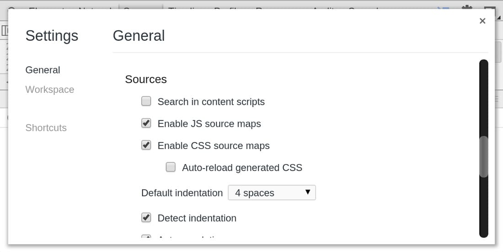
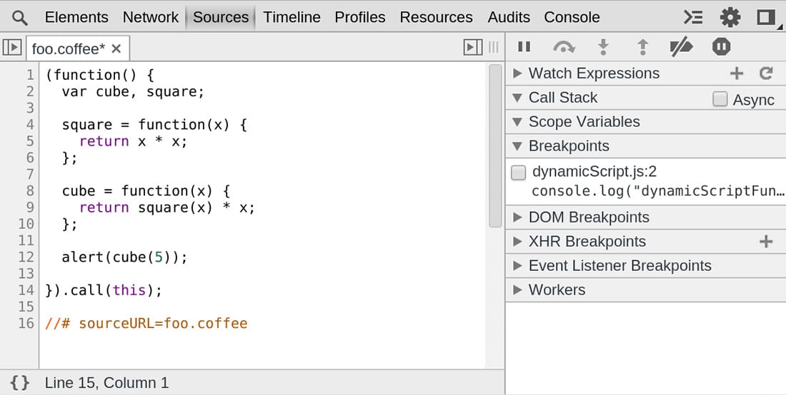

project_path: /web/tools/_project.yaml
book_path: /web/tools/_book.yaml
description: Keep your client-side code readable and debuggable even after you've combined, minified or compiled it.

{# wf_updated_on: 2015-04-21 #}
{# wf_published_on: 2015-04-13 #}

# Map Preprocessed Code to Source Code {: .page-title }




Keep your client-side code readable and debuggable even after you've combined, minified or compiled it. Use source maps to map your source code to your compiled code.

### TL;DR {: .hide-from-toc }
- Use Source Maps to map minified code to source code. You can then read and debug compiled code in its original source.
- Only use <a href=''/web/tools/setup/setup-preprocessors?#supported-preprocessors''>preprocessors capable of producing Source Maps</a>.
- Verify that your web server can serve Source Maps.

## Get started with preprocessors

This article explains how to interact with JavaScript Source Maps in the DevTools Sources Panel. For a first overview of what preprocessors are, how they can help and how Source Maps work, head over to [Set Up CSS & JS Preprocessors](/web/tools/setup/setup-preprocessors?#debugging-and-editing-preprocessed-content).

## Use a supported preprocessor

You need to use a minifier that's capable of creating source maps. For the most popular options, [see our preprocessor support section](/web/tools/setup/setup-preprocessors?#supported-preprocessors). For an extended view, see the [Source maps: languages, tools and other info](https://github.com/ryanseddon/source-map/wiki/Source-maps:-languages,-tools-and-other-info) wiki page.

The following types of preprocessors are commonly used in combination with Source Maps:

* Transpilers ([Babel](https://babeljs.io/){: .external }, [Traceur](https://github.com/google/traceur-compiler/wiki/Getting-Started))
* Compilers ([Closure Compiler](https://github.com/google/closure-compiler), [TypeScript](http://www.typescriptlang.org/){: .external }, [CoffeeScript](http://coffeescript.org), [Dart](https://www.dartlang.org))
* Minifiers ([UglifyJS](https://github.com/mishoo/UglifyJS))

## Source Maps in DevTools Sources panel

Source Maps from preprocessors cause DevTools to load your original files in addition to your minified ones. You then use the originals to set breakpoints and step through code. Meanwhile, Chrome is actually running your minified code. This gives you the illusion of running a development site in production.

When running Source Maps in DevTools, you'll notice that the JavaScript isn't compiled and you can see all the individual JavaScript files it references. This is using source mapping, but behind the scenes actually runs the compiled code. Any errors, logs and breakpoints will map to the dev code for awesome debugging! So in effect it gives you the illusion that you're running a dev site in production.

### Enable Source Maps in settings

Source Maps are enabled by default (as of Chrome 39), but if you'd like to double-check or enable them, first open DevTools and click the settings cog {:.inline}. Under **Sources**, check **Enable JavaScript Source Maps**. You might also check **Enable CSS Source Maps**.

### Debugging with Source Maps

When [debugging your code](/web/tools/chrome-devtools/debug/breakpoints/step-code) and Source Maps enabled, Source Maps will show in two places:

1. In the console (the link to source should be the original file, not the generated one)
2. When stepping through code (the links in the call stack should open the original source file)

## @sourceURL and displayName

While not part of the Source Map spec, the `@sourceURL` allows you to make development much easier when working with evals. This helper looks very similar to the `//# sourceMappingURL` property and is actually mentioned in the Source Map V3 specifications.

By including the following special comment in your code, which will be evaled, you can name evals and inline scripts and styles so they appear as more logical names in your DevTools.

`//# sourceURL=source.coffee`

Navigate to this
**[demo](http://www.thecssninja.com/demo/source_mapping/compile.html)**, then:

* Open the DevTools and go to the **Sources** panel.
* Enter in a filename into the _Name your code:_ input field.
* Click on the **compile** button.
* An alert will appear with the evaluated sum from the CoffeeScript source.

If you expand the _Sources_ sub-panel you will now see a new file with the custom filename you entered earlier. If you double-click to view this file it will contain the compiled JavaScript for our original source. On the last line, however, will be a `// @sourceURL` comment indicating what the original source file was. This can greatly help with debugging when working with language abstractions.

