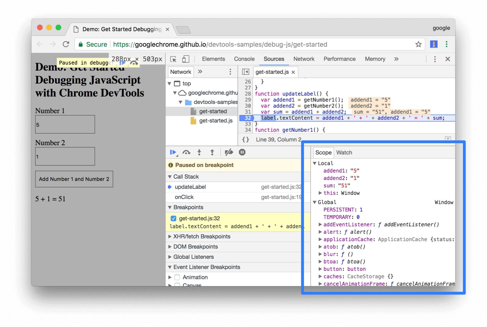
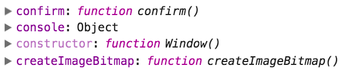
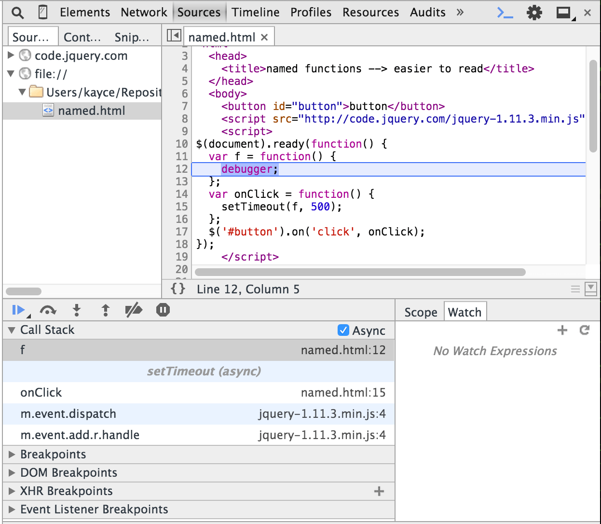
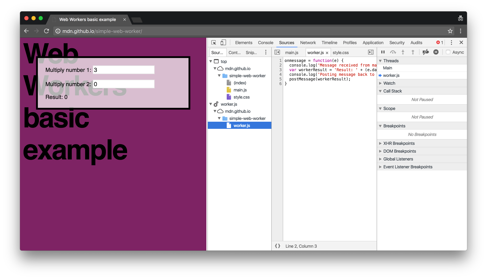
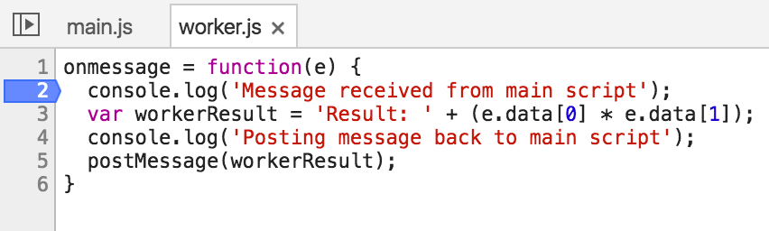
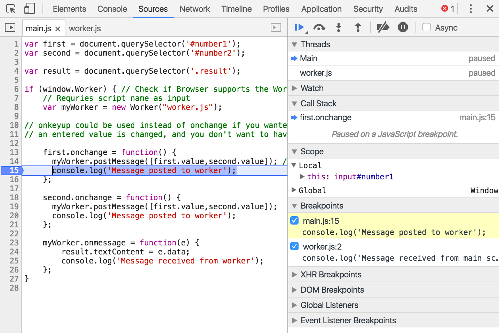

project_path: /web/tools/_project.yaml
book_path: /web/tools/_book.yaml
description: By executing code one line or one function at a time, you can observe changes in the data and in the page to understand exactly what is happening.

{# wf_updated_on: 2017-07-24 #}
{# wf_published_on: 2015-04-13 #}

# How to step through your code {: .page-title }





Warning: This page is deprecated. At the top of each section, there's a
link to an up-to-date page where you can find similar information.

By executing code one line or one function at a time, you can observe changes in the data and in the page to understand exactly what is happening. You can also modify data values used by the script, and you can even modify the script itself.

*Why is this variable value 20 instead of 30? Why doesn't that line of code seem to have any effect? Why is this flag true when it should be false?* Every developer faces these questions, and steps through code to find out.

After [setting breakpoints](breakpoints), return to the page and use it normally until a breakpoint is reached. This pauses all JavaScript on the page, focus shifts to the DevTools Sources panel, and the breakpoint is highlighted. You can now selectively execute code and examine its data, step by step.

### TL;DR {: .hide-from-toc }
- Step through code to observe issues before or while they happen and test out changes through live editing.
- Prefer stepping over console logging, as logged data is already stale the moment it arrives in the console.
- Enable the 'Async call stack' feature to gain greater visibility into the call stack of asynchronous functions.
- Blackbox scripts to hide third-party code from your call stacks.
- Use named functions rather than anonymous ones to improve call stack readability.

## Stepping in action

Warning: This page is deprecated. See [Step through code](reference#stepping)
for up-to-date information.

All step options are represented through clickable icons {:.inline} in the sidebar, but can also be triggered via shortcut. Here's the rundown:

<table>
  <thead>
    <tr>
      <th data-th="Icon/Button">Icon/Button</th>
      <th data-th="Action">Action</th>
      <th data-th="Description">Description</th>
    </tr>
  </thead>
  <tbody>
    <tr>
      <td data-th="Icon/Button"></td>
      <td data-th="Action">Resume</td>
      <td data-th="Description">Resumes execution up to the next breakpoint. If no breakpoint is encountered, normal execution is resumed.</td>
    </tr>
    <tr>
      <td data-th="Icon/Button"></td>
      <td data-th="Action">Long Resume</td>
      <td data-th="Description">Resumes execution with breakpoints disabled for 500ms. Convenient for momentarily skipping breakpoints that would otherwise continually pause the code, e.g., a breakpoint inside a loop. 
<b>Click and hold <i>Resume</i> until expands to show the action.</b>
</td>
    </tr>
    <tr>
      <td data-th="Icon/Button"></td>
      <td data-th="Action">Step Over</td>
      <td data-th="Description">Executes whatever happens on the next line and jumps to the next line.</td>
    </tr>
    <tr>
      <td data-th="Icon/Button"></td>
      <td data-th="Action">Step Into</td>
      <td data-th="Description">If the next line contains a function call, <i>Step Into</i> will jump to and pause that function at its first line.</td>
    </tr>
    <tr>
      <td data-th="Icon/Button"></td>
      <td data-th="Action">Step Out</td>
      <td data-th="Description">Executes the remainder of the current function and then pauses at the next statement after the function call.</td>
    </tr>
    <tr>
      <td data-th="Icon/Button"></td>
      <td data-th="Action">Deactivate breakpoints</td>
      <td data-th="Description">Temporarily disables all breakpoints. Use to resume full execution without actually removing your breakpoints. Click it again to reactivate the breakpoints.</td>
    </tr>
    <tr>
      <td data-th="Icon/Button"></td>
      <td data-th="Action">Pause on exceptions</td>
      <td data-th="Description">Automatically pauses the code when an exception occurs.</td>
    </tr>
  </tbody>
</table>

Use **step into** as your typical "one line at a time" action, as it ensures that only one statement gets executed, no matter what functions you step in and out of.

Use [Pause on exceptions](breakpoints#exceptions) when you suspect an uncaught exception is causing a problem, but you don't know where it is. When this option is enabled, you can refine it by clicking the **Pause On Caught Exceptions** checkbox; in this case, execution is paused only when a specifically-handled exception occurs.

## View properties by scope {: #scope }

Warning: This page is deprecated. See [View and edit local, closure, and
global properties](reference#scope) for up-to-date information.

When you pause a script, the **Scope** pane shows you all of the
currently-defined properties at that moment in time.

The pane is highlighted in blue in the screenshot below.

The Scope pane is only populated when a script is paused.
While your page is running, the Scope pane is empty.

The Scope pane shows you properties defined at the local, closure, and
global levels.

If a property has a carat icon next to it, it means that it's an object. Click
on the carat icon to expand the object and view its properties.

Sometimes properties are dimmed down. For example, the property `constructor`
is dimmer than the `confirm` property in the screenshot below.

The darker properties are enumerable. The lighter, dimmed down properties are
not. See the following Stack Overflow thread for more information:
[What do the colors mean in Chrome Developer Tools Scope
panel?](http://stackoverflow.com/a/36545767/1669860)

## The call stack

Warning: This page is deprecated. See [View the current call
stack](reference#call-stack) for up-to-date information.

Near the top of the sidebar is the **Call Stack** section. When the code is paused at a breakpoint, the call stack shows the execution path, in reverse chronological order, that brought the code to that breakpoint. This is helpful in understanding not just where the execution is *now*, but how it got there, an important factor in debugging.

### Example

An initial onclick event at line 50 in the `index.html` file called the
`setone()` function at line 18 in the `dgjs.js` JavaScript file, which then
called the `setall()` function at line 4 in the same file, where execution is
paused at the current breakpoint.

### Enable the async call stack

Enable the async call stack feature to gain more visibility into the execution
of your asynchronous function calls.

1. Open the **Sources** panel of DevTools.
2. On the **Call Stack** pane, enable the **Async** checkbox.

The video below contains a simple script to demonstrate the async call
stack feature. In the script, a third-party library is used to select a
DOM element. A function called `onClick` is registered as the
`onclick` event handler for the element. Whenever `onClick` is called,
it in turn calls a function named `f`, which just forces the script to
pause via the `debugger` keyword.

<video src="animations/async-call-stack-demo.mp4"
       autoplay muted loop controls></video>

In the video, a breakpoint is triggered, and the call stack is expanded.
There is only one call in the stack: `f`. The async call stack feature is then
enabled, the script resumes, the breakpoint is triggered again, and then the
call stack is expanded a second time. This time, the call stack contains
all of the calls leading up to `f`, including third-party library calls, and
the call to `onClick`. The first time that the script was called, there
was only one call in the call stack. The second time, there were four. In
short, the async call stack feature provides increased visibility into
the full call stack of asynchronous functions.

### Tip: name functions to improve call stack readability

Anonymous functions make the call stack difficult to read. Name your functions
to improve readability.

The code snippets in the two screenshots below are functionally equivalent. The
exact functioning of the code is not important, what is important is
that the code in the first screenshot uses anonymous functions, while
the second uses named functions.

In the call stack in the first screenshot, the top two functions are both
just titled `(anonymous function)`. In the second screenshot, the top two
functions are named, which makes it easier to understand the program flow at
a glance. When you are working with numerous script files, including
third-party libraries and frameworks, and your call stack is five or ten
calls deep, it is much easier to understand the call stack flow when
functions are named.

Call stack with anonymous functions:

Call stack with named functions:

<!-- blackbox OR disable third-party code??? -->

### Blackbox third-party code

Warning: This page is deprecated. See [Ignore a script or pattern of
scripts](reference#blackbox) for up-to-date information.

Blackbox script files to omit third-party files from your call stacks.

Before blackbox:

After blackbox:

To blackbox a file:

1. Open DevTools Settings.

   

2. In the navigation menu on the left, click **Blackboxing**.

   

3. Click **Add pattern**.

4. In the **Pattern** textfield enter the filename pattern that you wish to
   exclude from your call stack. DevTools excludes any scripts that match the
   pattern.

   

5. In the dropdown menu to the right of the textfield, select **Blackbox** to
   execute the script files but exclude the calls from the call stack, or select
   **Disabled** to prevent the files from executing.

6. Click **Add** to save.

The next time that you run the page and a breakpoint is triggered, DevTools
hides any function calls from the blackboxed scripts from the call stack.

## Data manipulation

When code execution is paused, you can observe and modify the data it is processing. This is crucial when trying to track down a variable that seems to have the wrong value or a passed parameter that isn't received as expected.

Show the Console drawer by clicking **Show/Hide drawer** {: .inline} or press <kbd class="kbd">ESC</kbd>. With the console open while stepping, you can now:

* Type the name of a variable to see its current value in the scope of the current function
* Type a JavaScript assignment statement to change the value

Try modifying values, then continue execution to see how it changes the outcome of your code and whether it behaves as you expect.

#### Example

We reveal that the value of the parameter `dow` is currently 2, but manually
change it to 3 before resuming execution.

## Live editing

Warning: This page is deprecated. See [Edit a script](reference#edit) for
up-to-date information.

Observing and pausing the executing code helps you locate errors, and live editing allows you to quickly preview changes without the need to reload.

To live edit a script, simply click into the editor part of the Sources panel while stepping. Make your changes as you would do in your editor, then commit the change with <kbd class="kbd">Ctrl</kbd> + <kbd class="kbd">S</kbd> (or <kbd class="kbd">Cmd</kbd> + <kbd class="kbd">S</kbd> on Mac). At this point, the entire JS file will be patched into the VM and all function definitions will be updated.

Now, you can resume execution; your modified script will execute in place of the original, and you can observe the effects of your changes.

#### Example

We suspect that the parameter `dow` is, in every case, off by +1 when it is
passed to the function `setone()` – that is, the value of `dow<`, as
received, is 1 when it should be 0, 2 when it should be 1, etc. To quickly
test whether decrementing the passed value confirms that this is the problem,
we add line 17 at the beginning of the function, commit with
<kbd class="kbd">Ctrl</kbd> + <kbd class="kbd">S</kbd>  and resume.

## Managing thread execution {: #threads }

Warning: This page is deprecated. See [Change thread context](reference#threads)
for up-to-date information.

Use the **Threads** pane on the Sources panel to pause, step into, and
inspect other threads, such as service worker or web worker threads.

To demonstrate the Threads pane, this section uses the following demo:
[Web Workers basic example](http://mdn.github.io/simple-web-worker/).

If you open DevTools on the app, you can see that the main script is located
in `main.js`:

And the web worker script is located in `worker.js`:

The main script listens to changes to the **Multiply number 1** or
**Multiply number 2** input fields. Upon change the main script sends a
message to the web worker with the values of the two numbers to multiply. The
web worker does the multiplication and then passes the result back to the
main script.

Suppose that you set a breakpoint in `main.js` that's triggered when
the first number is changed:

And you also set a breakpoint in `worker.js` when the worker receives a
message:

Modifying the first number on the app's UI triggers both of the breakpoints.

In the Threads pane the blue arrow indicates which thread is currently
selected. For example, in the screenshot above the **Main** thread is selected.

All of the
DevTools controls for stepping through code (resume or pause script execution,
step over next function call, step into next function call, etc.) pertain
to that thread. In other words, if you pressed the **Resume script execution**
button while your DevTools looked like the screenshot above, the Main
thread would resume executing, but the web worker thread
would still be paused. The **Call Stack** and **Scope** sections are only
displaying information for the Main thread, too.

When you want to step through the code for the web worker thread, or see its
scope and call stack information, just click on its label in the Threads pane,
so that the blue arrow is next to it. The screenshot below shows how the
call stack and scope information changes after selecting the worker thread.
Again, if you were to press any of the stepping through code buttons (resume
script execution, step over next function call, etc.), that action would only
pertain to the worker thread. The Main thread is not affected.

