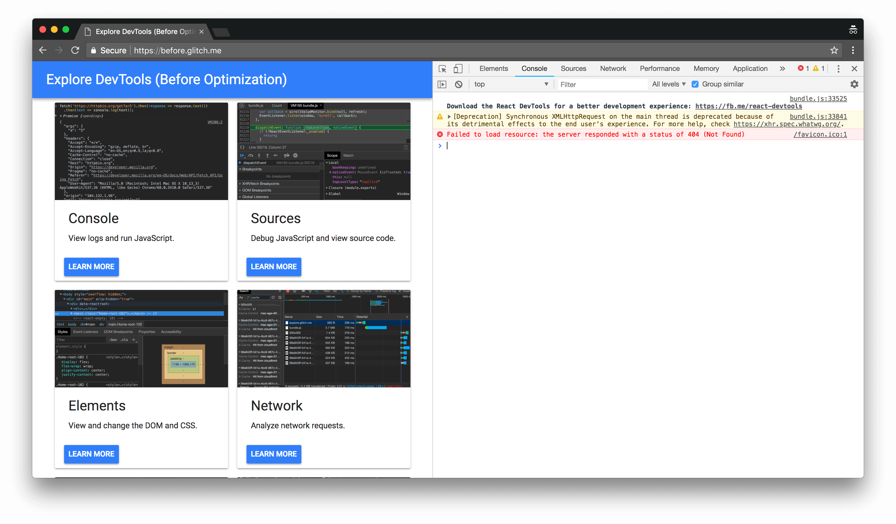
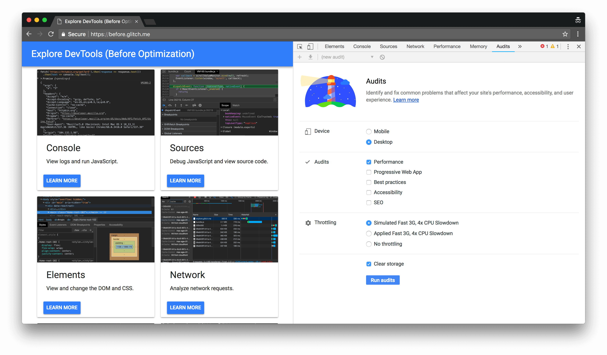
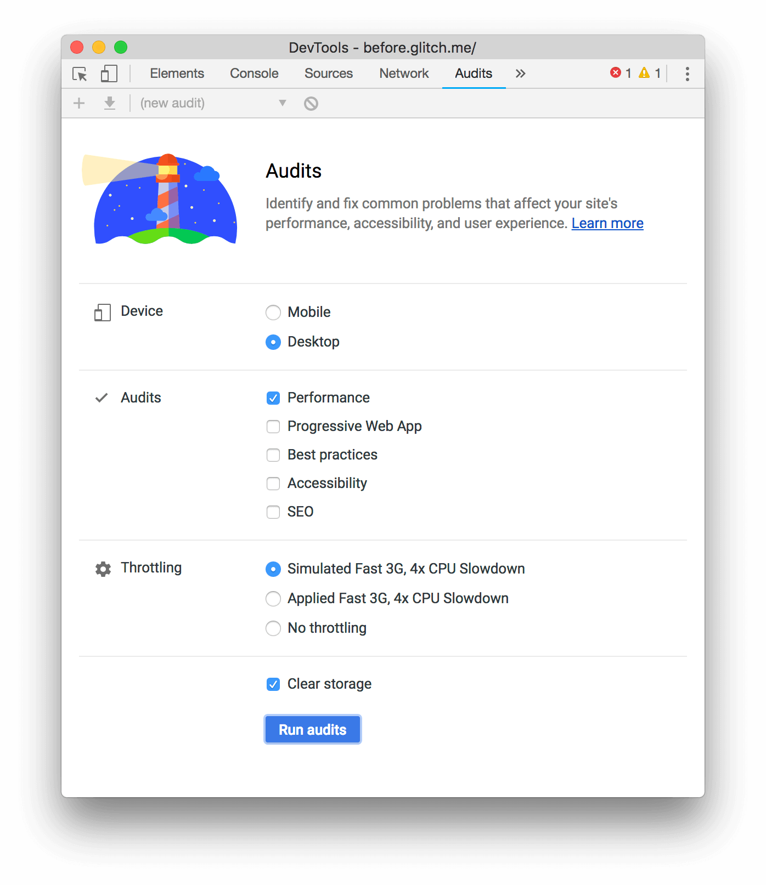

project_path: /web/tools/_project.yaml
book_path: /web/tools/_book.yaml
description: TODO

{# wf_updated_on: 2018-06-05 #}
{# wf_published_on: 2018-06-01 #}
{# wf_blink_components: Platform>DevTools #}

# Get Started With Improving Load Performance {: .page-title }



## Goal of tutorial

This tutorial teaches you how to use Chrome DevTools to find ways to make your web pages
load faster.

At the end of this tutorial, you still may not understand all of the theories behind load
performance optimization, *and that is totally OK*. It's a complicated field, and it takes time
to learn.

You will, however, leave this tutorial with an easy-to-understand, yet detailed and
quantitative, workflow for measuring load performance. And you will know how to
*prove* that any changes you make to your code actually do improve load performance.

## Prerequisites

You should have basic web development experience, similar to the level of experience
outlined in this [Introduction to Web Development][intro] syllabus. You don't need to
know anything about load performance.

[intro]: https://www.coursera.org/learn/web-development

## Introduction {: #intro }

This is Tony.

<figure>
  
  <figcaption>
    <b>Figure X</b>. Tony the cat
  </figcaption>
</figure>

Tony has built a website to help his other cat friends understand all the things that you can
do with DevTools. His friends love it, but Tony has heard many of them complain that it
loads very slowly. Tony has asked you to help him make the site load faster.

## Step 1: Audit the page {: #audit }

Whenever you begin to improve a page's load performance **always start with an audit**.
The audit has 2 important functions:

* It creates a baseline for you to measure subsequent changes against. Rather than just making a change
  and assuming that it'll make the page load faster, the before and after audits give you quantitative proof
  that the change is working as intended.
* It gives you actionable tips on what changes will have the most impact.

### Set up {: #setup }

1. Go to `chrome://version` to check what version of Chrome you're using. This tutorial was
   created with Chrome 68. If you're using an earlier or later version, the DevTools UI may look
   different, or some features may not be available. You should still be able to get through most
   of the tutorial. Please [send feedback](#feedback) if you can't and we'll update this tutorial.
1. <a class="gc-analytics-event" href="https://before.glitch.me" target="_blank" rel="noopener"
   data-category="CTA" data-label="">Open the site</a>.
1. Click **tony**. A menu appears.
1. Click **Remix This**.
1. Press <kbd>Command</kbd>+<kbd>Option</kbd>+<kbd>J</kbd> (Mac)
   <kbd>Control</kbd>+<kbd>Shift</kbd>+<kbd>J</kbd> to open Chrome DevTools.

<figure>
  
  <figcaption>
    <b>Figure X</b>. DevTools
  </figcaption>
</figure>

Tip: You can dock DevTools to the left, right, of bottom of your page. You can also undock it
into a separate window. See [Change DevTools placement](/web/tools/chrome-devtools/ui#placement).

### Establish a baseline {: #baseline }

1. Click the **Audits** tab. It may be hidden behind the **More Panels**
   {:.inline-icon} button. There's a Lighthouse on this
   page because the project that powers the Audits panel is called Lighthouse.

     <figure>
       
       <figcaption>
         <b>Figure X</b>. The Audits panel
       </figcaption>
     </figure>

1. In the **Audits** section, keep the **Performance** checkbox enabled, but disable all the
   other ones. Leave the settings in the other sections as is.

     <figure>
       
       <figcaption>
         <b>Figure X</b>. Audit settings
       </figcaption>
     </figure>

1. Click **Run audits**.

### Master the report UI {: #report }

TODO mention how each page will highlight different areas of improvement, because each page is coded diffferently.

The report gives you a lot of information. Here's how to make sense of it all.

1. The number within the circle represents your overall performance score.

1. **Metrics** represent different measurements of what your users experience when they load
   your page. There is no single metric that encompasses the whole experience.
1. Hover over the **First Contentful Paint** metric. DevTools gives you more information about
   what the metric measures. Click **Learn more**. Chrome opens up a new tab containing
   documentation about that metric.

     TODO hovering over metric screenshot

1. Below **Metrics** is a timeline of screenshots representing how the page looks during the
   course of the load.
1. **Opportunies** provides specific tips on how to improve the page. Working on these tips
   should improve the **Metrics** scores.
1. **Diagnostics** 

## Step 2: Experiment {: #experiment }

Now that you've got a baseline and a list of tips on how to improve the site's load performance,
it's time to experiment.

When you attempt to optimize your code, it's best to make a single change at a time, and then run
an audit after each change, so that you can be sure that your change is actually speeding up the page.

### Resize images

// TODO build a little image resizer on tony.glitch.me, and then use that API to serve resized images...
// this might work https://www.npmjs.com/package/resize-img

For this particular app, there didn't seem to be a straightforward way to automate the process of
resizing images. But nonetheless, it's good to see the potential savings, so 

1. Open `src/model.js'.
1. Replace each instance of `../imgs/` with `../imgs/small/`.

<aside class="note">
  <b>Note from Kayce</b>: Obviously, in a real app, this approach wouldn't cut it. If you're working
  with thousands of images, you'd need an automated solution.
  For this particular app, there didn't seem to be a straightforward
  way to automate the process of resizing images. But it's really worth looking into, because
  it can save your users a huge amount of network data.
</aside>

### Compress text {: #compress }

    app.use(compression());

## Summary {: #summary}

1. Run an audit to measure your baseline performance.
1. 

## Next steps {: #next-steps }

### Convince your company to invest in load performance

### Get help from the DevTools community

## Feedback {: #feedback }

TODO
