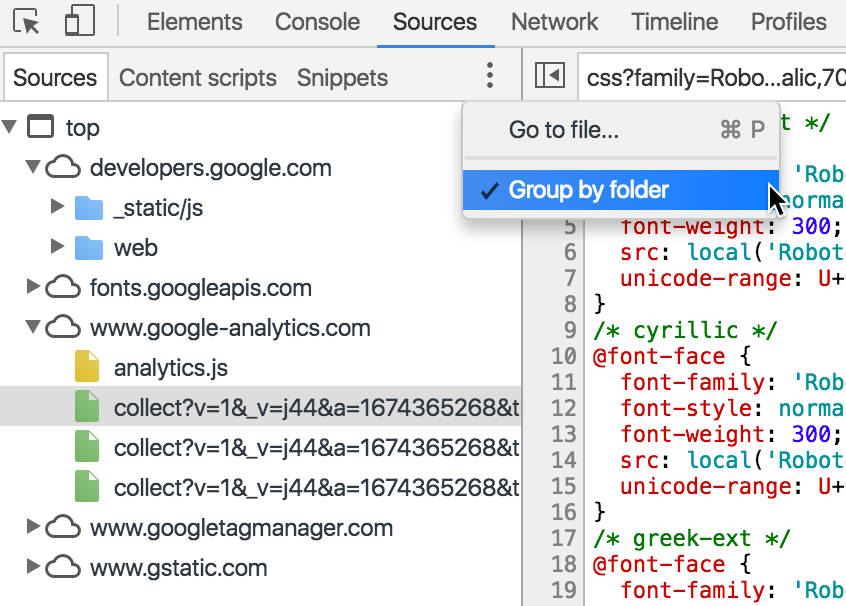
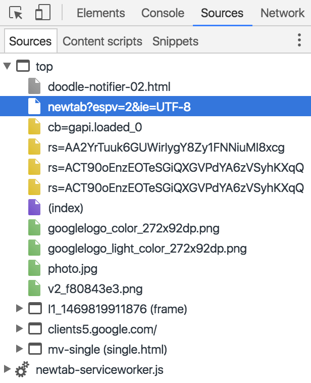
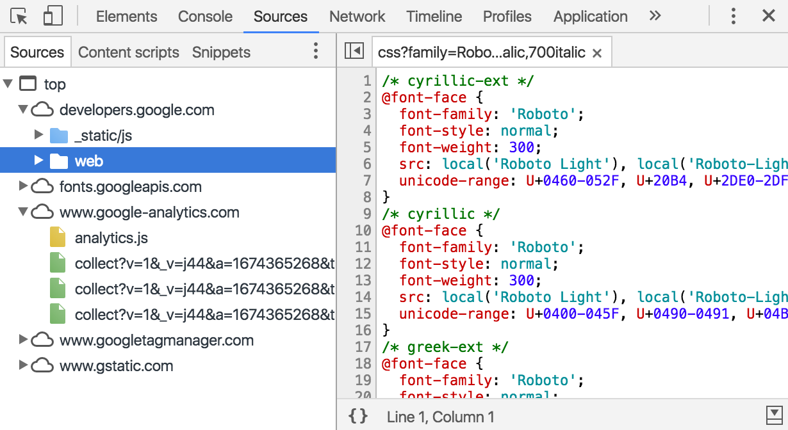

project_path: /web/tools/_project.yaml
book_path: /web/tools/_book.yaml
description: Organize resources by frame, domain, type, or other criteria.

{# wf_updated_on: 2016-07-28 #}
{# wf_published_on: 2015-04-13 #}

# Inspect Resources {: .page-title }



Organize resources by frame, domain, type, or other
criteria.

### TL;DR {: .hide-from-toc }
- Use the <strong>Frames</strong> pane of the <strong>Application</strong> panel to organize resources by frame.
- You can also view resources by frame from the <strong>Sources</strong> panel by disabling the <strong>group by folder</strong> option.
- To view resources by domain and folder, use the <strong>Sources</strong> panel.
- Filter resources by name or other criteria in the <strong>Network</strong> panel.

## Organize resources by frame {:#frames}

Use the **Frames** pane on the **Application** panel for a frame-organized
representation of your page's resources.

![frames detail][frames]

* The top-level (`top` in the screenshot above) is the main document.
* Below that (e.g. `widget2` in the screenshot above) are subframes of the
  main document. Expand one of these subframes to view the resources
  originating from that frame.
* Below the subframes are the images, scripts, and other resources of the
  main document.
* Last is the main document itself.

Click on a resource to view a preview of it.

Right-click on a resource to view it in the **Network** panel, open it in a
new tab, copy its URL, or save it.

![view resource][resource]

You can also view resources by frame in the **Sources** panel, by clicking
on the overflow menu in the navigator and disabling the **Group by folder**
option to stop grouping resources by folder.

The resources will be listed by frame only.

[frames-pane]: /web/tools/chrome-devtools/manage-data/imgs/frames-pane.png
[frames]: /web/tools/chrome-devtools/manage-data/imgs/frames.png
[resource]: /web/tools/chrome-devtools/manage-data/imgs/resource.png

## Organize resources by domain and folder {:#sources}

To view resources organized by domain and directory, use the **Sources**
panel.

## Filter resources by name, type, or other criteria {:#filter}

Use the **Network** panel to filter resources by name, type, and a whole range
of other criteria. Check out the guide below to learn more.

{# include shared/related_guides.liquid inline=true list=page.related-guides.filter #}
